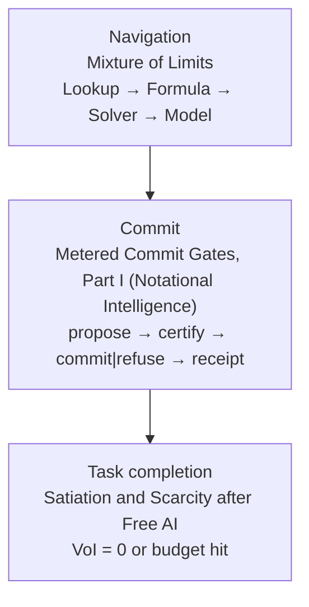

<div id="notational-intelligence-as-commit-law" class="anchor-alias" aria-hidden="true"></div>

# Metered Commit Gates: Energy-to-Correct-Completion for Agentic Systems

## 0. Overview

This paper joins two earlier studies into one systems paper. Part I is the commit gate. A proposal may not authorize itself. An irreversible act runs only behind a certificate, and every decision is written to a receipt. Part II is the cascade. The cheapest sufficient gear runs first: Lookup, then Formula, then Solver, then Model. The cascade stops when the task completion predicate $C(z)$ holds, and it refuses with a receipt when the next gear would break the budget. Both parts meter one quantity: the joules needed to reach a correct completion.

One board measurement anchors the gate fabric. On an AMD Kria KV260, the onboard INA260 read board-level A/B/A differences of 11,428 pJ per gate cycle (standard error 129 pJ, N = 4) for the WCA gate fabric, and 98.0 pJ per seed cycle (standard error 30.8 pJ, N = 4) for the seed fabric. These are board level, not core rail (Section I.3.7).

### 0.1 Contributions

1. A commit envelope: proposal, then certificate, then commit or refuse, then receipt. The certificate is conjunctive: look-up allow AND an energy predicate, optionally AND a control barrier function. Refusal reasons are typed. A Rust software reference implementation, Wise Computer Automation (WCA), runs it (Part I).
2. A typed provenance invariant. Output labeled `ModelGenerated` can never be promoted to `Deterministic` (Parts I and II).
3. A cascade with named refusals, and the exact condition under which cheapest first is optimal in expected joules (Part II, and Proposition 9 of the [companion physics paper](/papers/agency/#proposition-9-when-cheapest-first-is-optimal)).
4. Energy to correct completion as the ranking, defined in Section 0.2.
5. Receipts as an instrument. Each receipt holds the prediction hash and its timestamp before the act, the outcome, the match, the joules by tier (measured, reported, estimated, never summed) and the refusal reason.

### 0.2 Energy to correct completion

Let $C(z)$ be the task completion predicate, with any deadline written into it. For a system $S$ with policies $\pi$ and an allowed failure rate $\delta$,

$$
J^*(S) = \min_{\pi} \; \mathbb{E}[J_\pi] \quad \text{subject to} \quad \Pr[C(z) = 1] \ge 1 - \delta .
$$

Correctness and deadlines are constraints. Among systems that pass the gate, joules alone order them. Proposition 8 of the [companion physics paper](/papers/agency/#proposition-8-the-gated-ranking) proves that this order is a total preorder and that it survives bounded meter error. MLPerf Power gates every power result behind an accuracy target. $J^*$ has the same form.

### 0.3 Reading the two parts

Each part keeps its full original text. Sections are numbered I.n and II.n. Each part keeps its own reference list and its own reference numbers. A bracketed number in Part II refers to the Part II reference list.

<div id="part-i" class="anchor-alias" aria-hidden="true"></div>

## Part I. The commit gate (Notational Intelligence)


<div id="abstract" class="anchor-alias" aria-hidden="true"></div>

## I. Abstract

Agents propose actions. Irreversible work begins only when an action is allowed to run. This paper treats that permission step as a formal object. Linus Lee's notational intelligence is the observation that a change in symbols can make some thoughts cheap and others expressible. The claim here is narrower. For machines that can move matter or call an irreversible tool, the useful notation is a runtime law: a proposal may not authorize itself. The software reference, Wise Computer Automation (WCA), records the law as four objects under schema `wca.commit.v1`: a proposal, a certificate, a typed refuse reason, and a commit decision. The certificate used in the reference is conjunctive. A look-up table (LUT) allow bit must hold, and an energy predicate must hold. An optional control barrier function (CBF) may be added. Read-only calls may bypass the gate. Irreversible calls may not.

Energy numbers in this paper are products of operation counts and analytical energy constants (an OpCounter model). They are not board power. Field-programmable gate array (FPGA) behavior has three classes here. Icarus Verilog simulation checks the emitted register-transfer logic. An Alchitry Pt V2 runs the closed-loop gate and agrees with the software on every decision. It has no meter, so its energy is unmetered. An AMD Kria KV260 runs the gate fabric under its onboard INA260 power monitor. Halting and running the same bitstream, interleaved A/B/A, gives a board-level metered difference of 11,428 pJ per gate cycle (standard error 129 pJ, N = 4) for eight parallel evaluations of LUT allow, energy predicate and barrier at 25 MHz. The smaller seed fabric gives 98.0 pJ per seed cycle (standard error 30.8 pJ, N = 4). These are `measured_j` at board level. They are not core-rail readings and not a closed-loop plant joule cost (Section 3.7). Stage B is available as a browser instrument at https://research.openie.dev/living/fpga-sim/. It compiles the same Rust gate to WebAssembly (WASM) and shows LUT state and commit traces through the WebGPU API. That instrument is an emulation. It is not a device-under-test (DUT) measurement and it is not Alchitry board power.

The measured software results are bounded. On a 16-step pendulum episode with seed 1, the reference commits 1 step and refuses 15. The analytical episode energy is 8.6795e-10 joule. On the reported Safe fixed-point port-Hamiltonian check, false allows against a continuous energy oracle are 0 on the stated grids. A Model Context Protocol (MCP) demo refuses an irreversible tool call without invoking the executor. A toy comparison with an energy-set barrier and a discrete shield shows disagreement across safety definitions. None of these results is a claim of silicon energy leadership, of industrial control performance, or of a completed board measurement.

<div id="notation" class="anchor-alias" aria-hidden="true"></div>

## I. Notation

Terms are defined at first scientific use below and collected here so later sections can use the short form.

| Term | Definition in this paper |
|------|--------------------------|
| Open Interface Engineering (OpenIE) | The organization that maintains the software reference and this study. |
| Notational intelligence | Lee's claim that better notations can raise what a person or system can reliably do, beyond adding tools alone. |
| Commit gate | A runtime rule that either applies a proposed action or holds. The proposer does not get a second, informal channel. |
| Wise Computer Automation (WCA) | The software reference that implements commit gate at the boundary between a proposal and an irreversible effect. |
| Energy-First Architecture (EFA) | The design choice to put an energy predicate inside the permission record, not only in a later report. |
| Proposal | A candidate action `u`, state, and optional analytical energy hints. It cannot commit. |
| Certificate | The gate record: LUT allow, energy predicate, optional CBF predicate, reasons, and metrics. |
| Refuse reason | A typed code such as `lut_veto`, `energy_veto`, `cbf_veto`, `budget_exceeded`, or `policy`. |
| Commit decision | The envelope that sets plant action to `u` or to zero. |
| Look-up table (LUT) | A discrete map from a compact code to allow or refuse. |
| Ternary look-up matrix multiplier (TLMM) | The reference's cheap ternary table-lookup proposal path. |
| Control barrier function (CBF) | A certificate of set invariance when its inequality holds (Ames et al., 2019). |
| Model Context Protocol (MCP) | A tool-call transport. In this paper it is an adapter under test, not a plant certificate. |
| System One | Typed decision procedures (Laya / Jev class) that choose among known options in software. They are proposers. |
| Port-Hamiltonian | A structured energy model used here for a passivity-style check on toy plants. |
| Runtime verification (RV) | Checking a property on an executing trace. Related, not identical, to the commit record. |
| Device under test (DUT) | Hardware measured under a stated workload with a stated meter. No DUT result is reported. |
| Field-programmable gate array (FPGA) | Reconfigurable logic. This paper reports simulation of Verilog, not a board. |
| WebAssembly (WASM) | A portable compilation target for the browser. The Stage B WASM FPGA emulator is shipped at https://research.openie.dev/living/fpga-sim/. |
| WebGPU | The browser GPU API named as the display and grid-evaluation path for that emulator. |
| Alchitry Pt V2 | The intended later board: vendor documentation identifies a Xilinx Artix-7 XC7A100T. Not synthesized here. |
| DiffLogic | Differentiable logic gate networks trained toward Boolean structure (Petersen et al., 2022). |
| Analytical energy estimate | `J = sum_op count_op * E_op` with named constants. Not board power. |
| Modeled | A quantity obtained from a stated formula or fitted structure. |
| Simulated | A quantity obtained by executing the software or Verilog model. |
| Board-measured | A quantity from a meter on a stated device and workload. None are reported. |
| Oracle-safe | Agreement with the continuous energy oracle `Vdot <= epsilon` on the stated plant. |
| Check-safe | The discrete Safe fixed-point / Q16.16 residual that approximates that oracle in the gate. |
| Set-safe | Set-invariance under a barrier or shield predicate (for example an energy-set CBF), which can disagree with oracle-safe. |

<div id="terms-used-here" class="anchor-alias" aria-hidden="true"></div>

### I. Terms used here

This paper already distinguishes three safety predicates. **Oracle-safe** means the continuous `Vdot <= epsilon` oracle. **Check-safe** means the discrete Safe Q16.16 residual that tracks that oracle in the gate. **Set-safe** means set-invariance under a barrier or shield. NI-4 shows check-safe and set-safe can disagree. Software reference, evidence classes, and the board-result flag are on the shared [glossary](/glossary/).

**Analytical constants.** `E_LUT_READ = 1e-12` J and the other OpCounter constants in Section 3.4 are engineering stand-ins for relative comparison inside this model. They are not calibrated board measurements. Do not read them as silicon joules. The zero-false-allows counts against the named oracle stay as reported.

**Living figures.** Commit stack: [/living/ni/#ni-diag-02](/living/ni/#ni-diag-02). Seed-1 runner: [/living/ni/#ni-run-01](/living/ni/#ni-run-01). Safe false-allow=0: [/living/ni/#ni-run-02](/living/ni/#ni-run-02). Stage B simulator: [/living/fpga-sim/](/living/fpga-sim/).

Scope of the argument. Section 2 places the commit record against notation research, information theory, scaling results, LUT networks, and control certificates. Section 3 defines the objects, the plants, the analytical energy model, and the unshipped browser instrument. Section 4 reports only quantities produced by the software reference or by a cited external source. Section 5 answers objections that have published form. Section 6 states what would falsify the claims and what was not measured.

<div id="1-introduction" class="anchor-alias" aria-hidden="true"></div>

## I.1. Introduction

A language model can rank actions. Ranking is not permission. The failure mode that matters for a plant, a shell, a payment, or a destructive laboratory step is a commit: the action runs. Soft scores remain useful upstream. They are the wrong type at the irreversible branch, because a probability does not name which predicate failed, and it does not force the actuator command to zero.

Lee (2022) states a prior claim cleanly. Notation is not decoration. A notation that makes an operation executable changes which errors can be written down and which can be hidden. Iverson (1980) made the same point for array languages: notation is a tool of thought. Engelbart (1962) treated language, artifacts, methods, and training as one system. Kay (1972) and Victor (2013; 2012 talk) argued that representations should keep consequences near the idea being edited. Matuschak and Nielsen asked why tools for thought stall as products. That literature is about cognition and media. It does not, by itself, specify a record that a machine must obey before it moves.

The industrial center of recent artificial intelligence is scale. Kaplan et al. (2020) and Hoffmann et al. (2022) report loss scaling with parameters, data, and compute. Hooker (2021) argues that ideas spread when they fit available hardware and kernels. Epoch AI reports large declines in the price of a fixed inference performance (Epoch AI, 2025; Emberson and Roodman, 2026). Those results are about capability and cost of proposal. They do not define a commit predicate.

This paper's contribution is a software reference for that predicate, plus a report of what the reference actually does on toy plants. The contribution is compositional. Boolean LUT shields, energy certificates, ternary table lookup, and tool transports each exist in prior work. The reference wires them as one auditable decision: proposal, then certificate, then typed refuse or commit. The scan recorded in the project state-of-the-art note did not find a published product that ships that exact composition as one boundary. A scan is not a proof of absence. Private systems can exist. The claim is the existence and behavior of this reference, not a global first.

Three measurement statements constrain every later number. First, joules computed by the OpCounter are analytical estimates. Second, Verilog results are simulation. Third, the only board joules are the KV260 board-level differences of Section 3.7, filed as `measured_j` with the meter named. The board-result flag is true for those KV260 runs alone. The Pt V2 stays unmetered. Those sentences replace any badge-style labeling. A reader should be able to tell modeled, simulated, and board-measured apart from the method clause attached to the number.

<div id="companion-laws" class="anchor-alias" aria-hidden="true"></div>

### I. Companion papers

This study is the **Commit** law in the research catalog triad.

| Role | Study | Owns |
|---|---|---|
| **Navigation** | [Mixture of Limits](https://research.openie.dev/papers/gates/#part-ii-the-cascade-mixture-of-limits) | Lookup → Formula → Solver → Model; VoI / grammar / energy / certificate / settle-refuse floors. |
| **Commit** | This paper | propose → certify → commit\|refuse → receipt. Notational Intelligence owns irreversible commit. |
| **Task completion** | [Satiation and Scarcity after Free AI](https://research.openie.dev/papers/satiation/) | Completeness predicate / budget stop on the same refuse taxonomy. |
| **Energy budget** | [Metabolic Intelligence](https://research.openie.dev/products/mei/) | Budget envelope and actuators that make floors bind at tag and campus scale. |
| **Automation path** | [Spell Check is Global](https://research.openie.dev/papers/spellcheck/) | Existence proof: computer intelligence that became ordinary because it was cheap, local, and paired to hardware people already have. Access framing, not a census: the many (7B+), not the few who rent frontier datacenters (<500M). |

Navigation chooses the gear. This paper records the irreversible branch. Satiation supplies the economic stop. Estimates remain estimates; package `measured_j` only when Metered. [Spell Check is Global](https://research.openie.dev/papers/spellcheck/) is the existence proof of the automation path these laws are for: a suggestion is a proposal until the writer commits it. Energy to run is the only true metric of computer intelligence: token price, parameter count, moat rent, and access fees collapse to zero by commoditization, and what remains is joules. Estimates are not `measured_j`.

<div id="2-related-work" class="anchor-alias" aria-hidden="true"></div>

## I.2. Related work

<div id="21-notation-and-tools-for-thought" class="anchor-alias" aria-hidden="true"></div>

### I.2.1 Notation and tools for thought

Lee (2022) argues that inventing notations can matter more than inventing additional automated tools, because a notation changes the thoughts that are cheap. The interview record with The Gradient is consistent with that essay and is not an independent empirical result. Iverson (1980), Turing Award lecture, is the classical computer-science statement: notation is a tool of thought, and executability is part of the test. Engelbart (1962) locates intelligence in a human plus artifact system, not in a bare brain. Kay (1972) specifies a personal dynamic medium. Victor's "Media for Thinking the Unthinkable" and "Inventing on Principle" argue that creators need representations whose consequences are visible while the idea is still being formed. Matuschak and Nielsen, "How can we develop transformative tools for thought?", document adoption and institutional failure modes of such tools.

This paper uses that lineage for one limited inference. If a notation is executable, some failures become ordinary data rather than unrepresented accidents. A typed refuse reason is an instance. It does not support the strong Sapir-Whorf claim that language determines thought. The strong claim is rejected in Section 5. The weak claim, which is Iverson's, is that an executable notation changes the cost of operations and the representability of errors.

Chollet (2019) defines intelligence as skill-acquisition efficiency and grounds the definition in algorithmic information theory. That definition is about learning new skills, not about commit.

<div id="22-information-description-length-and-physical-cost" class="anchor-alias" aria-hidden="true"></div>

### I.2.2 Information, description length, and physical cost

Shannon (1948) defines entropy and channel capacity. Shannon (1959) defines rate-distortion: how much description is required for a stated fidelity. Kolmogorov (1965) defines description length by program size. Solomonoff (1964) defines inductive inference by a mixture over programs. Chaitin (1977) develops program-size complexity. Cover and Thomas (2006) is the textbook spine. Jaynes (1957) uses maximum entropy as a rule for distributions under constraints. Brillouin (1956) connects information to physical negentropy in the Maxwell-demon line.

Cross-entropy training of a language model is an information-theoretic objective on a data distribution. Sutskever's 2023 Simons Institute talk, which is a talk and not a paper, discusses unsupervised learning as compression. That fact does not yield a Kolmogorov certificate for a particular string, and it does not yield a commit bit. The distinction is the one drawn in the project citation spine: statistical compression of a training measure is not the same object as a runtime allow set under a plant constraint.

Landauer (1961) proves a lower bound: logically irreversible erasure dissipates at least `kT ln 2` per bit in the ideal model. Bennett (1973) shows that logically reversible computation can avoid that erasure cost in the limit. Horowitz (2014) reports practical CMOS energy at picojoule scales for operations and memory movement, far above the Landauer bound, and treats energy rather than transistor count as the constraint. Mead (1990) is the neuromorphic argument for analog efficiency. Sandberg (2016) warns that a brain power near 20 watt does not bound the energy of an engineered system trained from scratch. A cortical partitioning preprint (arXiv:2102.06273) further warns against treating all of that biological power as comparable compute. This paper uses Landauer and Horowitz as bounds and practice tables. It does not claim that any model in the reference operates near `kT ln 2`.

<div id="23-scale-hardware-fit-and-price" class="anchor-alias" aria-hidden="true"></div>

### I.2.3 Scale, hardware fit, and price

Hestness et al. (2017), Kaplan et al. (2020), and Hoffmann et al. (2022) document empirical scaling of deep learning loss. Amodei and Hernandez (2018), an OpenAI blog post, describe rapid growth in training compute for landmark results. The page is a vendor essay. This paper does not depend on a specific doubling time from it. Sutton (2019) argues that general methods which use computation have beaten systems that encode the contents of human knowledge as fixed features. The essay is not an argument against every constraint. A commit predicate is a constraint on action, not a hand-built chess feature. Hooker (2021) explains why alternatives lose when the installed base of chips and libraries rewards dense matrix multiplication.

Epoch AI (2025) reports inference price drops on the order of 9 to 900 times per year at fixed benchmark performance, depending on the benchmark. Emberson and Roodman (2026) report about a 47 percent quarterly decline in the cost of a given performance since about 2023, which they summarize as about 13 times per year, with a faster decline near the frontier. Those are Epoch's published summaries. They are evidence about price. They are not evidence that joules or irreversible commits have become free. The companion paper on satiation uses the same price series for a demand argument. This paper uses them only to separate proposal cost from permission.

<div id="24-lut-networks-ternary-lookup-and-differentiable-logic" class="anchor-alias" aria-hidden="true"></div>

### I.2.4 LUT networks, ternary lookup, and differentiable logic

Umuroglu et al. (2020) map sparse low-bit networks to FPGA truth tables (LogicNets). Petersen et al. (2022) train networks of logic gates with differentiable relaxations (DiffLogic). Bacellar et al. (2024) train weightless networks of LUTs (differentiable weightless neural networks). Ma et al. (2024) study ternary-weight language models (BitNet b1.58). Wei et al. (2024) implement low-bit matrix multiplication by table lookup on CPUs (T-MAC). The TeLLMe line (arXiv:2504.16266) is a ternary LUT matrix-multiplication design aimed at FPGA execution. Those systems show that tables and gates are a real compute substrate. They do not, in the papers cited, attach a port-Hamiltonian energy veto and a typed commit envelope to a tool executor.

The reference uses DiffLogic as a thin allow table on toy features, and TLMM as a proposal path. That is a different job from using a logic network as the whole classifier, which is the usual DiffLogic evaluation (vision benchmarks, large gate counts). Section 6 records the capacity gap.

<div id="25-certificates-shields-and-runtime-monitoring" class="anchor-alias" aria-hidden="true"></div>

### I.2.5 Certificates, shields, and runtime monitoring

Ames et al. (2019) survey control barrier functions as set-invariance certificates, typically enforced by a filter or a quadratic program. Alshiekh et al. (2018 preprint arXiv:1708.08611) introduce shields that replace unsafe actions with safe ones, minimally when possible. Dawson, Gao, and Fan (2022) survey learned Lyapunov and barrier certificates and the failure modes of treating a neural network as a certificate without a check. Manek and Kolter (2020) learn stable dynamics with a Lyapunov structure. Greydanus, Dzamba, and Yosinski (2019) learn Hamiltonian neural networks. Roth et al. (2025) study stable port-Hamiltonian neural networks. Yu, Zikelic, and Henzinger (2024) repair neural certificates using runtime monitors. Leung and Paré (arXiv:2512.24493) give Bayesian safety guarantees for port-Hamiltonian systems with learned energy functions. Their energy is the plant's physical Hamiltonian. It is not the energy of computation. The Safe path of this reference uses energy in that same physical sense. The joules of computation are a separate account (Section 3.4). Sanchez et al. (2018) survey runtime-verification taxonomies.

**The gate is a Simplex.** Sha's Simplex architecture runs an unverified high-performance controller beside a verified safety controller, and a decision module hands control to the safety controller before the plant leaves the region it can recover from (Sha 2001). "A proposal may not authorize itself" is that rule, carried from control loops to tool calls and actuators. Runtime assurance is its name in avionics and robotics. Three older results fix the rest of the shape. Saltzer and Schroeder named complete mediation: every access is checked against authority, every time (1975). A reference monitor is the mechanism that does the checking. Gray's two-phase commit separates prepare from commit, so no participant commits alone (1978). Necula's proof-carrying code ships a proof that the host checks before untrusted code runs (1997). The commit record here is a reference monitor in front of irreversible effects, with a Simplex switch to refusal and a certificate the host checks, as in proof-carrying code. What the reference adds to that lineage is one conjunct and one ledger: an energy predicate inside the certificate, and joules on the same record as the decision.

The reference does not replace that mathematics. The Safe path is a conservative fixed-point test of a known energy identity on a pendulum, `V = (1/2)(g theta^2 + omega^2)` with `Vdot = omega * u`. The CBF used in the toy bake-off is an energy-set inequality on the same `V`, not a claim to have solved the Ames quadratic program on a manipulator. Learned Lyapunov structure on a cart-pole is a second toy, reported in Section 4, and is not a region-of-attraction theorem for arbitrary plants.

<div id="26-world-models-typed-decisions-and-tool-transport" class="anchor-alias" aria-hidden="true"></div>

### I.2.6 World models, typed decisions, and tool transport

Ha and Schmidhuber (2018) and Hafner et al. (DreamerV3, arXiv:2301.04104) show that learned models can propose actions from imagined trajectories. LeCun's JEPA essays (Meta research blog) argue for predictive world models. LeCun et al. (2006) is the earlier energy-based learning tutorial. Prediction error is not identically zero in these systems. A predictor can sit upstream of a gate. It cannot replace the gate unless its predictions are perfect and the plant model is the plant. This paper does not compete with those systems on prediction benchmarks.

System One models return a typed answer and a probability for each allowed option in one forward pass, with no free-form text. TypeSafe AI named the category with its hosted Jev model (15 September 2026). Open models followed, among them Laya from Convai Innovations, an encoder with decision heads. They collapse generation cost when the option set is typed and known. Anthropic's Model Context Protocol announcement specifies discovery and transport for tools. Transport delivers a call. It does not evaluate `Vdot`. The reference's MCP adapter is a beachhead: irreversible tools require a certificate before the executor runs. That is an engineering claim about this adapter, tested by the demo in Section 4, not a claim about every MCP server in production.

<div id="27-what-the-composition-adds" class="anchor-alias" aria-hidden="true"></div>

### I.2.7 What the composition adds

Shields refuse unsafe actions but are not, in the cited papers, exported as the reference's four-field commit record with an analytical joule account. DiffLogic and LUT networks compute functions. They are not, in those papers, a veto in front of a separate proposer and a tool executor. Energy-aware barrier filters are continuous. The reference's allow bit is a table. The compositional claim is the wiring: LUT allow and energy predicate and optional barrier, recorded with a typed reason, applied before an irreversible effect, with analytical energy kept distinct from board power. Section 4 states which parts of that wiring were executed.

<div id="28-certify--commit-peers-20252026" class="anchor-alias" aria-hidden="true"></div>

<div id="i28-certify--commit-peers-20252026" class="anchor-alias" aria-hidden="true"></div>

### I.2.8 Certify / commit peers (2025 to 2026)

Peer systems now enforce a decision **before** an irreversible tool runs. That strengthens the commit-gate thesis; it does not duplicate this reference's record.

Shi et al., **Progent** (arXiv:[2504.11703](https://arxiv.org/abs/2504.11703)), check every tool call against symbolic least-privilege rules and use an SMT solver so privilege can only narrow without approval (monotonic confinement). Chen, Kang, and Li, **ShieldAgent** (ICML 2025; [proceedings.mlr.press/v267/chen25ae.html](https://proceedings.mlr.press/v267/chen25ae.html)), enforce verifiable safety-policy circuits over agent action trajectories before shielding. Yu, Žikelić, and Henzinger (AAAI 2025; [doi:10.1609/aaai.v39i25.34840](https://doi.org/10.1609/aaai.v39i25.34840)) repair neural certificates via runtime monitoring. A companion line verifies ReLU control-barrier certificates online over a lookahead region (arXiv:[2507.11987](https://arxiv.org/abs/2507.11987)).

**What this paper owns.** Those peers are policy, shield, or certificate-repair objects. This reference ships a four-field commit envelope (`proposal` → `certificate` → `commit|refuse` → receipt) with a conjunctive LUT allow bit and an energy predicate, typed refuse reasons, and analytical joules kept distinct from board power. Transport (MCP) remains proposal. [Mixture of Limits](/papers/gates/#part-ii-the-cascade-mixture-of-limits) chooses the gear on available fabric. [Satiation](/papers/satiation/) supplies the economic stop. [Metabolic Intelligence](/products/mei/) supplies the budget envelope. Board joules exist only for the KV260 runs in Section 3.7, at board level.

<div id="3-definitions-and-methods" class="anchor-alias" aria-hidden="true"></div>

## I.3. Definitions and methods

<div id="31-objects" class="anchor-alias" aria-hidden="true"></div>

### I.3.1 Objects

Fix a state `x` and a candidate action `u` in a set `U`. A proposal is a tuple

```text
Proposal = (u, x, hints)
```

`hints` may include analytical energy quantities. A proposal has no interpretation as permission.

A certificate is a tuple

```text
Certificate = (lut_allow, energy_ok, cbf_ok, reasons, metrics)
```

`lut_allow` and `energy_ok` are Booleans. `cbf_ok` is a Boolean when the selected compose mode requires it, and is absent otherwise. `reasons` is a list of refuse reasons. `metrics` includes the analytical energy account and the flag that board synthesis is not claimed.

Compose modes in the schema README are:

```text
lut_and_energy        : commit <=> lut_allow AND energy_ok
lut_and_safe          : commit <=> lut_allow AND safe_energy_ok
lut_and_safe_and_cbf  : commit <=> lut_allow AND safe_energy_ok AND cbf_ok
```

Ablations `energy_only` and `lut_only` exist so a comparison can remove one conjunct. They are not the default for irreversible tools.

A commit decision is

```text
if commit then plant_action = u else plant_action = 0
```

with the certificate attached. The executor for an irreversible tool is called only in the first branch.

Worked record. File `artifacts/schemas/wca.commit.v1/examples/commit_decision_refuse.json` stores a refuse in which `lut_allow` is true and `energy_ok` is false. The reason code is `energy_veto`. The fixed-point detail string is `Vdot_q=1461 > eps_q=13`. `plant_action` is `[0.0]`. The record sets the board-result flag to false. One true conjunct does not commit. That is the content of the conjunction, not a slogan.

<div id="32-plants-and-oracles" class="anchor-alias" aria-hidden="true"></div>

### I.3.2 Plants and oracles

The primary plant is a pendulum. Continuous reference quantities used by the Safe check are `g = 9.81`, `epsilon = 0.05`, `V = (1/2)(g theta^2 + omega^2)`, and `Vdot = omega * u`. `energy_ok` in the continuous oracle means `Vdot <= epsilon`.

The legacy discrete check is a Q8.8 fixed-point approximation, bit-matched to the Verilog module `wca_ph_energy.v` in simulation. The Safe check (`SafeFixedPointPHCertificate`) uses Q16.16 and an exact integer residual. The reported predicate is

```text
energy_ok <=> 4*omega_q*u_q + 2*(abs(omega_q)+abs(u_q)) + 1
              <= floor(4*epsilon*S^2)
```

with the rounding argument given in `artifacts/RESULTS.md`: under round-to-nearest with error at most half a least significant bit, `Vdot` is bounded by `(prod + (1/2) abs + 1/4) / S^2`. The design goal is one-sided. If the Safe predicate allows, the continuous oracle allows. The converse is not required. Extra refuses are a measured cost, not a contradiction of the safety direction.

A second plant, cart-pole, is used only in the learned-Lyapunov simulation. State is `[x, xdot, theta, thetadot]`, with `g = 9.81`, cart mass 1.0, pole mass 0.1, length 0.5. `V` is a quadratic form `xi^T P xi / 2` with `P` positive definite by a Cholesky construction plus a multiple of the identity. The fit is stochastic gradient on a hinge of `Vdot + alpha V` under a linear policy, seed 42, 400 iterations, batch 32, `alpha = 0.15`, as recorded in `RESULTS.md`. The continuous gate is `Vdot <= 0.05`. The Safe discrete rule adds a Lipschitz margin times half a least significant bit. This is a simulation of one fitted quadratic on one box. It is not a proof for other plants.

<div id="33-lut-allow-and-proposal-path" class="anchor-alias" aria-hidden="true"></div>

### I.3.3 LUT allow and proposal path

The allow LUT in the reported episodes is a DiffLogic export with mask `21887` on four features: absolute theta, absolute omega, absolute `u`, and an energy bit, unless a section says otherwise. TLMM is a grouped ternary table lookup used as a proposer. Iso-correctness means agreement with a naive ternary matrix product within absolute tolerance 1e-12, which `RESULTS.md` records as measured in software. Scale behavior is whatever `wca-tlmm-scale` writes under a stated analytical forward budget. The default budget discussed in results is 2e-10 joule per forward, analytical, not electrical.

<div id="34-analytical-energy-model" class="anchor-alias" aria-hidden="true"></div>

### I.3.4 Analytical energy model

`RESULTS.md` separates two facts. Operation counts are exact in the OpCounter. Joules are the counts times constants:

| Constant | Value (joule) | Role |
|----------|----------------|------|
| `E_LUT_READ` | 1e-12 | LUT read |
| `E_BRAM_WORD` | 1e-11 | BRAM word |
| `E_BITMASK_OP` | 5e-14 | bitmask operation |
| `E_ADD` | 5e-13 | add |
| `E_PACK` | 2e-13 | pack |
| `E_COMMIT_BASE` | 2e-11 | commit overhead |
| `E_REFUSE_OVERHEAD` | 5e-12 | refuse overhead |

`J = sum count_op * E_op`. These constants are engineering stand-ins, not measurements. Structure counters such as shared BRAM hits are reported and are not charged unless they change a counted read. Changing a constant rescales every analytical joule in lockstep. That is why the numbers cannot be compared to a vendor's tokens per joule, to MLPerf Tiny energy, or to a rail measurement. They can be compared across modes inside the same model.

Utility in the internal tables is commit count. Commit count is not a task reward. A policy that commits more can score higher utility per joule while violating the energy oracle. Section 4 therefore does not treat utility per joule as a safety metric.

<div id="35-tool-adapter" class="anchor-alias" aria-hidden="true"></div>

### I.3.5 Tool adapter

`wca-mcp-gate` classifies tools. Read-only tools may execute without a commit record. Unknown tools are treated as irreversible. Irreversible tools require a certificate under the configured compose mode, default `lut_and_safe_and_cbf` in `artifacts/mcp_gate_demo.json`. On refuse, `executed` is false and `executor_calls` is 0. The demo executor records calls and does not perform host input or output. The method string in the demo file is `rust_mcp_commit_gate_v1`.

<div id="36-simulation-of-verilog" class="anchor-alias" aria-hidden="true"></div>

### I.3.6 Simulation of Verilog

The repository emits Verilog and memory images for the allow LUT and the commit gate (`artifacts/fpga/`). `wca-rtl-verify` and Icarus Verilog check bit-exact behavior of those models against the software oracle. Icarus executes a simulation. It does not place, route, or measure a chip. Vivado reports enter only for the KV260 runs of Section 3.7, as utilization and timing closure. Vivado power estimates are not results.

<div id="37-browser-instrument-and-boards" class="anchor-alias" aria-hidden="true"></div>

### I.3.7 Browser instrument and boards

The completeness path for replication has three stages. Stages A and B exist. Stage C has two boards: one for decision agreement and one for joules.

Stage A, present. Rust binaries in `wca-commit` run the episode, the Safe check, the tool demo, and the analytical joule account. Icarus simulates emitted Verilog on a workstation.

Stage B, shipped. The pure decision core (proposal in, certificate out, plant step, analytical joule update) compiles to `wasm32` (`crates/wca-fpga-sim`). A static page at https://research.openie.dev/living/fpga-sim/ loads the module. WebGPU holds the LUT words and a trace buffer of `(step, lut_allow, energy_ok, cbf_ok, decision)` for display. WebGPU timestamps are not joules. On seed-1 (16 steps, theta 1.5, omega 3.0) the WASM episode reports committed 1, refused 15, analytical joule 8.6795e-10, matching Stage A. The WASM module is an emulation of the same functions the Rust crate runs. It is not a cycle-accurate model of an Artix-7, not a switching-activity power model, and not a substitute for Icarus on the Verilog. Stage B does not claim an Alchitry Pt V2 DUT.

Stage C, board programmed; energy still unmetered. An Alchitry Pt V2 was detected and loaded (SRAM) with a closed-loop WCA commit-gate bitstream: on-fabric seed-1 pendulum plant dynamics, TLMM proposal, allow LUT, Safe Q16.16 port-Hamiltonian residual, and Ames-style energy-set control barrier function (CBF) residual. Fabric commit is `lut_allow ∧ energy_ok ∧ cbf_ok`. UART at 115200 8N1 agreed with the software composite golden on allow/refuse/commit (1 commit, 15 refuses, sole commit at step 6). On that seed-1 closed-loop episode the CBF conjunct did not change the allow/refuse trace versus LUT and Safe PH alone (the sole PH commit has u=0, so the CBF Lie check holds). **Closed-loop** here means plant state evolves from gate commits and refuses on the fabric; it is not a streamed stimulus ROM of plant/proposal state. The Pt V2 has **no onboard joule meter**. No USB inline meter or shunt was attached. Vivado / post-PAR power estimates are not DUT readings. SparkFun's product page names FPGA XC7A100T-2FGG84I and lists 101,440 logic cells, 240 DSP48E1 slices, 4,860 Kb of block RAM, and 256 MB of DDR3L (https://www.sparkfun.com/alchitry-pt-v2.html); those remain vendor specifications. Builder metering methods: [/living/fpga-sim/alchitry/#energy](https://research.openie.dev/living/fpga-sim/alchitry/#energy). Stage C, board metered. An AMD Kria KV260 carries an onboard INA260 power monitor (`ina260_u14`). Three rungs ran on 30 September 2026, each as interleaved A/B/A passes with N = 4, settle 15 s and sampling 25 s at about 4 Hz. Rung 1 compares a free-running seed fabric (439 LUTs) to the board's baseline bitstream. It gives watts only, with no operation count, so it gives no joules per operation. Rung 2 halts and runs one seed bitstream (975 LUTs) at about 100 MHz under an on-device operation counter. The difference is +0.0098 W (standard error 0.0031 W), which is 98.0 pJ per seed cycle (standard error 30.8 pJ). Rung 3 halts and runs the gate bitstream: eight lanes, each the conjunction of the allow LUT, the Safe Q16.16 energy residual and the barrier residual, in 6,370 LUTs and 128 DSP slices, timing closed at 25 MHz. The difference is +0.2857 W (standard error 0.0032 W). At 2.4999 × 10⁷ gate cycles per second that is 11,428 pJ per gate cycle (standard error 129 pJ), about 1.43 nJ per lane decision. The A2 minus A1 drift was +0.0047 W (standard error 0.0040 W). The bitstream hashes and logs are in the `wca-kv260-meter` artifact of the reference.

What the meter can and cannot see. The INA260 specifies a maximum offset of 5 mA and a maximum system gain error of 0.15%, with a current step of 1.25 mA (TI INA260 datasheet). The offset is common to A and B on the same board and rail, so the halt-versus-run difference cancels it. Gain error scales the difference by at most 0.15%. The meter senses board power, so the difference includes clock tree and routing switched by the enable, not the gate logic alone. Rung 2's difference is about three standard errors from zero. Rung 3's is about ninety. The next protocol is fixed: read the core rail (VCCINT) through the module's regulator telemetry or a source-measure unit; at least 30 randomized interleaved A/B pairs; at least 10⁹ gate evaluations per block; die temperature logged with an idle baseline before each block; gross and subtracted values both reported; the Vivado power estimate reported beside the reading with the discrepancy. Rung 3 is not a closed-loop plant joule cost, and the analytical constants of Section 3.4 are not calibrated by it.

The scientific reason for stage B is replication and inspection, not a new physical claim. A reader with a browser steps the same seed-1 episode and reads the same allow bit and reason codes that the crate prints. Agreement with stage A is the acceptance test for stage B, and it passes on seed 1. Agreement of decisions is the acceptance test for the Pt V2, and it passes on seed 1. A meter reading on a stated workload is the acceptance test for the KV260, and rungs 2 and 3 meet it at board level.

<div id="38-what-is-not-a-method-of-this-paper" class="anchor-alias" aria-hidden="true"></div>

### I.3.8 What is not a method of this paper

No human-subject study. No claim about linguistic relativity beyond the rejection in Section 5. No training-compute extrapolation. No identification of economic satiation, which is the companion paper. No optimization against Groq, Etched, or Taalas throughput. No world-model benchmark.

<div id="4-results" class="anchor-alias" aria-hidden="true"></div>

## I.4. Results

All quantities in this section are simulated in the software reference unless a sentence cites an external paper. Analytical joules use Section 3.4. Only NI-9 is board-measured.

<div id="41-claim-ni-1-the-commit-record-exists-as-a-schema-and-a-rust-type" class="anchor-alias" aria-hidden="true"></div>

### I.4.1 Claim NI-1. The commit record exists as a schema and a Rust type

Schemas `Proposal`, `Certificate`, `RefuseReason`, and `CommitDecision` are in `artifacts/schemas/wca.commit.v1/`. Rust types are in `crates/wca-commit/src/schema.rs`. Round-trip tests are `cargo test -p wca-commit`. This is an existence result about the reference, version `wca.commit.v1`. It is not a uniqueness theorem.

<div id="42-claim-ni-2-seed-1-pendulum-episode" class="anchor-alias" aria-hidden="true"></div>

### I.4.2 Claim NI-2. Seed-1 pendulum episode

Command, from `RESULTS.md`:

```text
cargo run --release --bin wca-soc-loop -- \
  --steps 16 --init-theta 1.5 --init-omega 3.0 --seed 1
```

Reported outcome: committed = 1, refused = 15, analytical episode energy = 8.6795e-10 joule. The same committed and refused counts and the same analytical energy are reported for `--safe-ph` on that seed. `RESULTS.md` states that the single commit is step 6. Toolchain note in that file: Rust 1.98. Re-running the binary is the reproduction. The energy is not a measurement of a chip.

<div id="43-claim-ni-3-false-allows-of-the-safe-energy-check" class="anchor-alias" aria-hidden="true"></div>

### I.4.3 Claim NI-3. False allows of the Safe energy check

`wca-ph-tighten` compares discrete decisions to the continuous oracle `Vdot <= epsilon`. On a 21 cubed grid plus 200,000 near-threshold Monte Carlo samples (209,261 decisions):

| Path | False allow | False refuse | Both allow | Both refuse |
|------|-------------|--------------|------------|-------------|
| Legacy Q8.8 | 30836 | 105 | 104711 | 73609 |
| Safe v1 (Q8.8 over-approximation) | 0 | 42430 | 62386 | 104445 |
| Safe v2 (Q16.16 residual) | 0 | 79 | 104737 | 104445 |

`RESULTS.md` also states that a denser 41 cubed grid plus 50,000 Monte Carlo samples, checked in `cargo test`, asserts false allow equal to 0. Safe v2 cuts false refuses from 42,430 to 79 relative to Safe v1 while keeping false allows at 0. Legacy Q8.8 is not safe on this definition: it records 30,836 false allows. These counts are properties of the numerical test, not of a physical pendulum.

<div id="44-claim-ni-4-toy-barrier-comparison-neither-definition-dominates" class="anchor-alias" aria-hidden="true"></div>

### I.4.4 Claim NI-4. Toy barrier comparison, neither definition dominates

`wca-cbf-bakeoff` runs seeds 0 through 4, 40 steps, time step 0.05, action scale 2.5, shared demo TLMM and DiffLogic mask `21887`. The energy-set barrier uses `h = 18 - V` and allows when `h >= 0` and `omega * u <= kappa * h` with `kappa = 0.05`. The discrete shield allows a step that stays inside absolute theta at most 2 and absolute omega at most 4. Closed-loop means differ because trajectories diverge. The file reports per-episode means for commits and sums for violation counts. Selected rows:

| Filter | Commit | Refuse | Analytical J | False allow vs PH | `h < 0` | `Vdot > epsilon` |
|--------|--------|--------|--------------|-------------------|---------|------------------|
| `lut_and_safe_ph` | 1 | 38 | 2.153e-09 | 0 | 4 | 0 |
| `cbf_energy_set` | 1 | 38 | 2.056e-09 | 3 | 0 | 3 |
| `shield_discrete` | 18 | 21 | 2.306e-09 | 90 | 38 | 90 |
| `lut_only` | 40 | 0 | 2.544e-09 | 194 | 220 | 194 |

On this plant and this oracle, `lut_and_safe_ph` has zero `Vdot` violations and four `h < 0` events. The energy-set barrier has zero `h < 0` events and three `Vdot` violations. The shield commits more and violates the energy oracle often. `lut_only` matches `always_allow` on violations in the reported table. Offline agreement on a shared always-allow stream of 200 steps gives 4 disagreements between `lut_and_safe_ph` and `cbf_energy_set`, and 70 against the shield.

Interpretation inside the test: passivity and set invariance are different predicates. The LUT-and-energy gate is not equivalent to an Ames filter, and it does not win every column. A full quadratic-program baseline on a richer plant is not in this table. That comparison remains open. The result that is available is the disagreement, which is evidence against collapsing the two certificates into one word.

<div id="45-claim-ni-5-cart-pole-safe-lyapunov-simulation" class="anchor-alias" aria-hidden="true"></div>

### I.4.5 Claim NI-5. Cart-pole Safe Lyapunov simulation

On the audit described in Section 3.2 (grid n = 7 plus 20,000 boundary samples inside the Lipschitz box, 26,487 decisions), Safe learned Lyapunov versus the continuous `Vdot` oracle records false allow 0, false refuse 3, both allow 15,925, both refuse 10,559. Closed-loop means over five seeds: `lut_and_safe_lyap` commits 11, refuses 28, analytical J 2.719e-09, and records zero false allows against that oracle. The level-set barrier on the same `V` commits 14 and records 15 energy-oracle violations. The discrete shield commits 29 and records 95. Same pattern as the pendulum: the Safe conjunct tracks its own oracle; a different certificate tracks a different one; permissiveness without the oracle is not safety.

This is one additional simulated plant. It does not establish the commit gate on industrial dynamics.

<div id="46-claim-ni-6-mcp-demo" class="anchor-alias" aria-hidden="true"></div>

### I.4.6 Claim NI-6. MCP demo

`artifacts/mcp_gate_demo.json` records four cases. The board-result flag in the file is false.

| Case | Class | Executed | Executor calls | Commit |
|------|-------|----------|----------------|--------|
| `read_only_bypass` | read-only | true | (no commit record) | absent |
| `irreversible_refuse` | irreversible | false | 0 | false |
| `irreversible_allow` | irreversible | true | 1 | true |
| `shell_exec_gated` | irreversible | true | (gated) | true |

The refuse case lists `energy_veto` (`vdot` 6.0 against `eps` 0.05) and `cbf_veto`. Plant action on that case is `[0.0]`. The allow case uses compose `lut_and_safe_and_cbf` and plant action `[-0.02]`. The note in the file states that refuse never executes. This is a demo of the adapter, not a field study of computer-use agents.

<div id="47-claim-ni-7-tlmm-under-an-analytical-budget" class="anchor-alias" aria-hidden="true"></div>

### I.4.7 Claim NI-7. TLMM under an analytical budget

`RESULTS.md` reports a demo 2 by 4, group 2 configuration near 4.24e-11 analytical joule, under the forward budget. The largest configurations that remain under the 2e-10 forward budget stop at 64 parameters. Widths 8 by 16 and above exceed that budget even after the optimizer. Iso-correctness against naive ternary arithmetic is a software comparison at tolerance 1e-12. These statements do not say that the design matches TeLLMe throughput or any board energy.

<div id="48-claim-ni-8-difflogic-allow-versus-an-energy-teacher-toy-only" class="anchor-alias" aria-hidden="true"></div>

### I.4.8 Claim NI-8. DiffLogic allow versus an energy teacher, toy only

On the hard multi-seed gate benchmark in `RESULTS.md`, after threshold calibration and denser labels, DiffLogic matches the energy teacher on refuse rate 50.0 plus or minus 15.9 percent, precision at threshold 0.890 plus or minus 0.067, and recall 0.802 plus or minus 0.076. A bitmask reference refuses more (71.0 plus or minus 14.9 percent) and recalls less (0.454 plus or minus 0.266). Before calibration, DiffLogic refuse rate was 57.5 plus or minus 14.1 percent with recall 0.724 plus or minus 0.163. The match is on this toy labeling setup. It is not an ImageNet or control-suite result. Internal utility per joule rises for the calibrated gate (3.570e9 versus 3.212e9 before) under the analytical model. As Section 3.4 states, that ratio uses commit count as utility.

<div id="49-claim-ni-9-board-level-joules-of-the-gate-fabric" class="anchor-alias" aria-hidden="true"></div>

### I.4.9 Claim NI-9. Board-level joules of the gate fabric

| Rung | Fabric | Clock | Difference (W) | Operation | Joules per operation | Label |
|---|---|---|---|---|---|---|
| 1 | Seed freerun vs board baseline | n/a | −0.8212 (SE 0.0024) | none | none | `measured_j`, watts only |
| 2 | Seed, halt vs run | about 100 MHz | +0.0098 (SE 0.0031) | one seed cycle | 98.0 pJ (SE 30.8) | `measured_j`, INA260, board |
| 3 | Gate, 8 lanes, halt vs run | 25 MHz | +0.2857 (SE 0.0032) | one gate cycle, 8 decisions | 11,428 pJ (SE 129) | `measured_j`, INA260, board |

N = 4 interleaved A/B/A passes per rung. Rung 1's negative sign means the seed bitstream draws less than the board's baseline bitstream. It does not mean the seed is free. Section 3.7 gives the limits of a board-level reading.

<div id="410-safety-and-liveness" class="anchor-alias" aria-hidden="true"></div>

### I.4.10 Safety and liveness

Zero false allows is safety. A gate that refuses everything is also safe, and useless. Liveness is the other axis: false refuses, and the share of tasks the gated agent completes. NI-3 reports both on the Safe grid. Safe v2 cuts false refuses from 42,430 to 79 at zero false allows. The seed-1 episode commits 1 step of 16, and that count alone does not say whether the plant reached its goal. The required report is a frontier per plant: task completion rate against false-allow rate, one point per compose mode of NI-4 (`lut_only`, `shield_discrete`, `cbf_energy_set`, `lut_and_safe_ph`), each point with its seeds and spread. On agent workloads the same frontier uses an attack suite for false allows and a benign task suite for completion. A gate is judged on the frontier, not on one axis.

<div id="411-what-the-scan-supports" class="anchor-alias" aria-hidden="true"></div>

### I.4.11 What the scan supports

The state-of-the-art note dated with the September 2026 scans records no published system found that composes a learned Boolean allow LUT, a port-Hamiltonian or Lyapunov energy predicate, and a ternary LUT proposal as one commit boundary with bit-exact RTL simulation and an analytical joule account. Nearest neighbors are named there: shields, energy-aware barrier filters, logic networks as the whole model, and TLMM designs without an energy certificate. The scan supports a gap statement about the literature that was searched. It does not support a priority claim over unpublished work, and it does not support an energy-leadership claim.

<div id="5-discussion" class="anchor-alias" aria-hidden="true"></div>

## I.5. Discussion

<div id="51-scale-does-not-answer-the-commit-question" class="anchor-alias" aria-hidden="true"></div>

### I.5.1 Scale does not answer the commit question

Kaplan, Hoffmann, Hooker, Sutton, and Epoch answer how proposal cost and loss behave. A larger proposer can still emit an action that fails `Vdot <= epsilon`. Putting that proposer behind the certificate uses scale where the evidence says scale works, and uses the predicate where scale is silent. The Bitter Lesson objects to frozen human features that block learning. It does not entail deleting a safety predicate. If a future result shows that an unconstrained policy meets the same false-allow test at lower analytical cost and equal task error, NI-3's engineering preference for the gate would be weakened on that plant. The logical distinction between proposal and permission would remain.

<div id="52-natural-language-and-mcp-are-transport-and-proposal" class="anchor-alias" aria-hidden="true"></div>

### I.5.2 Natural language and MCP are transport and proposal

MCP solves discovery and call shape. System One solves some decisions without free-form generation. Neither object is `energy_ok`. The demo in NI-6 shows a refuse that does not call the executor. A production deployment could bypass the adapter. The claim is not that the protocol makes bypass impossible. The claim is that permission has to be a separate record if irreversible effects are to be auditable.

<div id="53-strong-linguistic-determinism-is-not-the-claim" class="anchor-alias" aria-hidden="true"></div>

### I.5.3 Strong linguistic determinism is not the claim

The strong hypothesis that language determines thought is not a premise. The operational statement is local. In this schema, a commit without a passing certificate is not a successful record. An untyped confidence string can be stored beside a success flag and still leave the reason unstated. The enum removes that particular ambiguity. It does not describe human cognition.

<div id="54-formalism-can-be-wasteful-this-predicate-is-small" class="anchor-alias" aria-hidden="true"></div>

### I.5.4 Formalism can be wasteful; this predicate is small

Requiring a proof of the whole agent at every step would dominate the budget. The reference formalizes one boundary. Read-only calls bypass. The Safe residual is a fixed-point inequality, not a general SMT query. NI-2's analytical episode energy is 8.6795e-10 joule under the stated constants, dominated by whatever the counters charge, and is still not a fraction of a generative model's board energy because that comparison was not measured. A split between proposal analytical joules and gate analytical joules on a real agent workload is not in the results. Until it is, the cost objection is open for large certificates and unanswered only for this toy gate.

<div id="55-a-wrong-model-with-a-green-light-is-a-real-failure" class="anchor-alias" aria-hidden="true"></div>

### I.5.5 A wrong model with a green light is a real failure

If `V` is not the plant's energy, `energy_ok` can be true while the plant is not safe. The mitigation present in the reference is a continuous twin on the toys, a separated reason code, and a refusal to treat a probability as a certificate. The mitigation not present is disturbance Input-to-State Stability, a verified region of attraction, or a Bayesian credibility budget of the kind Leung and Pare study. NI-4 is the evidence that two respectable certificates disagree. That disagreement is a reason to name the predicate, not a reason to trust either one outside its test.

<div id="56-prior-certificate-theory-is-not-duplicated-here" class="anchor-alias" aria-hidden="true"></div>

### I.5.6 Prior certificate theory is not duplicated here

Ames, Alshiekh, Dawson, and the runtime-monitoring papers already define filters and monitors. NI-1's addition is the product record and the composition with a LUT export and a tool executor in one reference. Where the toy barrier wins on set invariance, the paper says so (NI-4, NI-5). Composition is `cbf_ok` as another conjunct when that predicate is the one required. It is not a claim that the LUT computes the Ames quadratic program.

<div id="57-predictors-and-specialized-inference-chips" class="anchor-alias" aria-hidden="true"></div>

### I.5.7 Predictors and specialized inference chips

World models reduce some prediction error and leave a residual. Specialized inference devices change the cost of proposals. Vendor throughput figures are vendor reports until an independent meter repeats them. The gate's job is the irreversible branch. If a device's only interface is a token stream, the commit record still has to live somewhere before actuators or irreversible tools run.

<div id="58-analytical-joules-are-not-a-costume-for-watts" class="anchor-alias" aria-hidden="true"></div>

### I.5.8 Analytical joules are not a costume for watts

The constants in Section 3.4 are chosen engineering numbers. They make counts comparable inside the repo. They are not calibrated to an Artix-7 rail. Selling them as board watts would be a false measurement report. The correct report is the one given: operation counts are computed; analytical joules are modeled; board joules come only from the KV260 meter and are filed apart. Stage B of Section 3.7 makes the same model inspectable in a browser at https://research.openie.dev/living/fpga-sim/. It does not change the measurement class. The KV260 rungs do, for the fabric they ran.

<div id="6-limits-and-threats-to-validity" class="anchor-alias" aria-hidden="true"></div>

## I.6. Limits and threats to validity

Internal validity. Seed-1 is one initial condition. The Safe grid is large but still a chosen box and a chosen epsilon. Monte Carlo samples near the threshold stress the boundary the designers chose to stress. A different epsilon or a different plant identity breaks the numerical claim until re-run. The CBF in the bake-off is an energy-set inequality implemented in the same crate, not an independently coded solver from an Ames reference implementation. Disagreement is informative. Absolute ranking against the literature's code is not established.

Construct validity. Commit count as utility does not measure task success. False allow is defined against a named oracle. A system can be oracle-safe and check-safe (zero false allows against `Vdot <= epsilon`) and still fail set-safe (`h >= 0`), which NI-4 shows. Readers who treat "safe" as one word will misread the table.

External validity. Both plants are toys. There is no manipulator, quadrotor, or human-in-the-loop trial. The MCP demo does not call a network. Verilog is simulated. The browser instrument is shipped as Stage B simulation. The Alchitry Pt V2 agrees on decisions and is unmetered. The KV260 reading is board level and open loop. Vendor logic-cell counts are not confirmed here.

Measurement validity. Analytical constants can be edited to any scale. Comparisons to Horowitz's picojoule tables, to Landauer's bound, or to vendor tokens per joule are not valid with these constants. The KV260 rungs are a board-level meter under a stated workload. A core-rail reading under the closed-loop episode is the missing measurement. Post-place-and-route tool power would be a third class, still not a meter, and it is not reported as a result.

Statistical reporting. Where `RESULTS.md` gives a mean and a standard deviation, this paper copies them. It does not add confidence intervals that were not computed. Multi-seed coverage is five seeds on the bake-offs and the hard gate benchmark's reported spreads. That is not a large-sample claim.

Claim hygiene. The following are not results: silicon joule leadership; operation near the Landauer bound; brain-equivalent power; a win over System One on latency; a win over world-model benchmarks; strong linguistic determinism; identification of "intelligence" with commit count.

Falsifiers. NI-2 is false if the stated command on the stated crate revision does not print those counts. NI-3 is false if the Safe v2 test reports a false allow on the stated grid. NI-6 is false if the refuse case in the demo file executes. NI-1 is false if the schema and the runtime diverge. A stage B emulator that disagrees with stage A on seed 1 fails its own acceptance test. A future meter that assigns board energy to the analytical number without a calibration study does not confirm the analytical model.

<div id="7-conclusion" class="anchor-alias" aria-hidden="true"></div>

## I.7. Conclusion

The paper defined a commit decision as a conjunctive certificate over a LUT allow bit and an energy predicate, with an optional barrier, and showed a software reference that emits the decision before an irreversible effect. On the reported pendulum tests, the Safe fixed-point rule has zero false allows against its continuous oracle, at the cost of a measured false-refuse count. On the reported comparisons, that oracle is not the same as set invariance. Analytical episode energy for the seed-1 run is 8.6795e-10 joule under published constants. Tool refuse in the MCP demo does not call the executor. Verilog checks are simulation. The browser WASM and WebGPU instrument is available at https://research.openie.dev/living/fpga-sim/ so that the same decision can be inspected without a board. It remains a simulation, not a DUT result. The Alchitry Pt V2 agrees with the software on every decision of seed 1 and stays unmetered. The KV260 meters the gate fabric at board level: 11,428 pJ per eight-lane gate cycle at 25 MHz. The reference is a measured software artifact and a board-metered fabric. The closed-loop chip joule is the next measurement.

<div id="references" class="anchor-alias" aria-hidden="true"></div>

## I. References

Alshiekh, M., Bloem, R., Ehlers, R., Konighofer, B., Niekum, S., and Topcu, U. Safe reinforcement learning via shielding. arXiv:1708.08611.

Ames, A. D., Coogan, S., Egerstedt, M., Notomista, G., Sreenath, K., and Tabuada, P. Control barrier functions: theory and applications. European Control Conference, 2019. https://doi.org/10.23919/ECC.2019.8796030

Amodei, D., and Hernandez, D. AI and compute. OpenAI, 2018. https://openai.com/index/ai-and-compute/

Anthropic. Introducing the Model Context Protocol. https://www.anthropic.com/news/model-context-protocol

Bacellar, A., et al. Differentiable weightless neural networks. arXiv:2410.11112.

Bennett, C. H. Logical reversibility of computation. IBM Journal of Research and Development, 1973. https://doi.org/10.1147/rd.176.0525

Brillouin, L. Science and Information Theory. Academic Press, 1956.

Chaitin, G. J. Algorithmic information theory. IBM Journal of Research and Development, 1977. https://doi.org/10.1147/rd.214.0350

Chollet, F. On the measure of intelligence. arXiv:1911.01547.

Cover, T. M., and Thomas, J. A. Elements of Information Theory, 2nd ed. Wiley, 2006. https://doi.org/10.1002/047174882X

Dawson, C., Gao, S., and Fan, C. Safe control with learned certificates: a survey of neural Lyapunov, barrier, and contraction methods. arXiv:2202.11762.

Emberson, L., and Roodman, D. / Epoch AI. The plunging price of thought. 22 September 2026. https://epoch.ai/publications/the-plunging-price-of-thought

Engelbart, D. C. Augmenting human intellect: a conceptual framework. 1962. https://www.dougengelbart.org/pubs/augment-3906-Framework.html

Epoch AI. LLM inference price trends. 12 March 2025. https://epoch.ai/data-insights/llm-inference-price-trends

Greydanus, S., Dzamba, M., and Yosinski, J. Hamiltonian neural networks. arXiv:1906.01563.

Ha, D., and Schmidhuber, J. World models. arXiv:1803.10122.

Hafner, D., Pasukonis, J., Ba, J., and Lillicrap, T. Mastering diverse domains through world models. arXiv:2301.04104.

Hestness, J., et al. Deep learning scaling is predictable, empirically. arXiv:1712.00409.

Hoffmann, J., et al. Training compute-optimal large language models. arXiv:2203.15556.

Hooker, S. The hardware lottery. arXiv:2009.06489. Communications of the ACM, 2021. https://doi.org/10.1145/3467017

Horowitz, M. Computing's energy problem (and what we can do about it). IEEE International Solid-State Circuits Conference, 2014. https://doi.org/10.1109/ISSCC.2014.6757323

Iverson, K. E. Notation as a tool of thought. Communications of the ACM, 1980. https://dl.acm.org/doi/10.1145/358896.358899

Jaynes, E. T. Information theory and statistical mechanics. Physical Review 106, 620, 1957. https://doi.org/10.1103/PhysRev.106.620

Kaplan, J., et al. Scaling laws for neural language models. arXiv:2001.08361.

Kay, A. A personal computer for children of all ages. 1972. https://worrydream.com/refs/Kay_1972_-_A_Personal_Computer_for_Children_of_All_Ages.pdf

Kolmogorov, A. N. Three approaches to the quantitative definition of information. 1965. English: International Journal of Computer Mathematics, 1968. https://doi.org/10.1080/00207166808803030

Landauer, R. Irreversibility and heat generation in the computing process. IBM Journal of Research and Development, 1961. https://doi.org/10.1147/rd.53.0183

Laya. System One models and typed decision engines (comparison table, checked 2 October 2026). https://laya-ai.com/system-one-models

Convai Innovations. Laya model card. https://huggingface.co/convaiinnovations/laya

TypeSafe AI. Introducing System One Models and Jev. 15 September 2026. https://typesafe.ai/blog/introducing-system-one-models-and-jev

Gray, J. Notes on data base operating systems. In Operating Systems: An Advanced Course, Lecture Notes in Computer Science 60, 393-481. Springer, 1978. https://doi.org/10.1007/3-540-08755-9_9

Necula, G. C. Proof-carrying code. Proceedings of the 24th ACM SIGPLAN-SIGACT Symposium on Principles of Programming Languages (POPL '97), 106-119, 1997. https://doi.org/10.1145/263699.263712

Saltzer, J. H., and Schroeder, M. D. The protection of information in computer systems. Proceedings of the IEEE 63(9), 1278-1308, 1975. https://doi.org/10.1109/PROC.1975.9939

Sha, L. Using simplicity to control complexity. IEEE Software 18(4), 20-28, 2001. https://doi.org/10.1109/MS.2001.936213

Texas Instruments. INA260 precision digital current and power monitor, data sheet. https://www.ti.com/lit/ds/symlink/ina260.pdf

LeCun, Y., Chopra, S., Hadsell, R., Ranzato, M., and Huang, F. J. A tutorial on energy-based learning. 2006. http://yann.lecun.com/exdb/publis/pdf/lecun-06.pdf

LeCun, Y. Path towards autonomous machine intelligence / JEPA discussion. Meta AI blog. https://ai.meta.com/blog/yann-lecun-advances-in-ai-research/

Lee, L. Notational intelligence. 2022. https://thesephist.com/posts/notation/

Leung, C. H., and Paré, P. E. Bayesian safety guarantees for port-Hamiltonian systems with learned energy functions. arXiv:2512.24493.

Ma, S., et al. The era of 1-bit LLMs: all large language models are in 1.58 bits. arXiv:2402.17764.

Manek, G., and Kolter, J. Z. Learning stable deep dynamics models. arXiv:2001.06116.

Marcus, G. Deep learning: a critical appraisal. arXiv:1801.00631.

Matuschak, A., and Nielsen, M. How can we develop transformative tools for thought? https://numinous.productions/ttft/

Mead, C. Neuromorphic electronic systems. Proceedings of the IEEE, 1990. https://doi.org/10.1109/5.58356

Petersen, F., et al. Deep differentiable logic gate networks. arXiv:2210.08277.

Roth, F., et al. Stable port-Hamiltonian neural networks. arXiv:2502.02480.

Sanchez, C., et al. A survey of challenges for runtime verification from advanced application domains. arXiv:1811.06740.

Sandberg, A. Energetics of the brain and AI. arXiv:1602.04019.

Shannon, C. E. A mathematical theory of communication. Bell System Technical Journal, 1948. https://doi.org/10.1002/j.1538-7305.1948.tb01338.x

Shannon, C. E. Coding theorems for a discrete source with a fidelity criterion. IRE National Convention Record, 1959.

Solomonoff, R. J. A formal theory of inductive inference, parts I and II. Information and Control, 1964.

SparkFun. Alchitry Pt V2 product page. https://www.sparkfun.com/alchitry-pt-v2.html

Sutton, R. The bitter lesson. 13 March 2019. http://www.incompleteideas.net/IncIdeas/BitterLesson.html

Sutskever, I. An observation on generalization. Simons Institute talk, 2023. https://www.youtube.com/watch?v=AKMuA_TVz3A

TeLLMe family. arXiv:2504.16266.

Umuroglu, Y., et al. LogicNets. arXiv:2004.03021.

Victor, B. Inventing on principle. 2012. https://www.youtube.com/watch?v=PUv66718DII

Victor, B. Media for thinking the unthinkable. https://worrydream.com/MediaForThinkingTheUnthinkable/

Wei, J., et al. T-MAC. arXiv:2407.00088.

Yu, E., Žikelić, Đ., and Henzinger, T. A. Neural control and certificate repair via runtime monitoring. AAAI 2025. https://doi.org/10.1609/aaai.v39i25.34840 (arXiv:2412.12996).

Shi, T., He, J., Wang, Z., et al. Progent: Securing AI Agents with Privilege Control. arXiv:2504.11703. https://arxiv.org/abs/2504.11703

Chen, Z., Kang, M., and Li, B. ShieldAgent: Shielding Agents via Verifiable Safety Policy Reasoning. ICML 2025 (PMLR v267). arXiv:2503.22738. https://proceedings.mlr.press/v267/chen25ae.html

Formal verification of neural certificates done dynamically. arXiv:2507.11987. https://arxiv.org/abs/2507.11987


Cortical energy partitioning caveat: arXiv:2102.06273.

Local measurement record: `artifacts/RESULTS.md` in the `wca-lut-edge` software reference. KV260 meter record: `artifacts/stage-c/wca-kv260-meter/` (protocol, claim status, A/B/A logs and summaries). Schema examples: `artifacts/schemas/wca.commit.v1/examples/`. Demo: `artifacts/mcp_gate_demo.json`.

<div id="appendix-a-reproducibility" class="anchor-alias" aria-hidden="true"></div>

## I. Appendix A. Reproducibility

Workstation path used to generate the cited logs: the `wca-lut-edge` tree, Rust 1.98 as recorded in `RESULTS.md`. Day-to-day commands:

```text
cargo test -p wca-commit
cargo run --release --bin wca-soc-loop -- \
  --steps 16 --init-theta 1.5 --init-omega 3.0 --seed 1
cargo run --release --bin wca-soc-loop -- \
  --steps 16 --init-theta 1.5 --init-omega 3.0 --seed 1 --safe-ph
cargo run --release --bin wca-ph-tighten -- --grid 21 --out artifacts/ph_tighten_report.json
cargo run --release --bin wca-cbf-bakeoff -- --out artifacts/cbf_bakeoff_report.json
cargo run --release --bin wca-lyap-plant -- --out artifacts/lyap_plant_report.json
cargo run --release --bin wca-mcp-gate -- --demo
cargo run --release --bin wca-tlmm-scale -- --out artifacts/tlmm_scale_report.json
```

Icarus Verilog was version 12.0 in the environment note in `RESULTS.md`. RTL checks are simulation. Do not read analytical joules as board power.

Repository flag, factual, not a result: FPGA board result claimed for the KV260 Stage C rungs 1 to 3 only (Section 3.7), at board level. Every other result in this paper is simulation or analytical.

<div id="appendix-b-browser-fpga-emulator-architecture-to-build" class="anchor-alias" aria-hidden="true"></div>

## I. Appendix B. Browser FPGA emulator: architecture to build

This appendix describes the Stage B emulator architecture. The shipped instrument lives at https://research.openie.dev/living/fpga-sim/. Seed-1 agreement numbers below are from the WASM run against the Stage A golden.

Modules.

1. `decision_core`. Pure functions already represented by the Rust certificate, plant step, and joule accumulator. No file system and no threads required. Target `wasm32-unknown-unknown`.
2. `lut_image`. The same memory image the Verilog path loads (`artifacts/fpga/wca_allow_lut.mem` and successors). The browser copy must hash-match the file used for the Icarus check.
3. `trace`. A fixed schema: step index, state, `u`, `lut_allow`, `energy_ok`, `cbf_ok`, reason codes, analytical joule increment, plant action. Identical field names to `wca.commit.v1` so a dump can be diffed against the crate's JSON.
4. `webgpu_view`. Device, queue, and a storage buffer for the LUT and the trace. A shader draws allow and refuse. A second dispatch may map the Safe residual across a grid. Buffers are for inspection. They are not a power model.
5. `workstation_oracle`. Icarus remains the RTL oracle. The browser does not replace it. Disagreement between WASM and the Rust binary fails the build. Disagreement between WASM and Icarus on the shared LUT image fails the build. Neither comparison mentions watts.

Acceptance tests, to be run when the target exists.

- Seed-1, 16 steps, init theta 1.5, omega 3.0: committed 1, refused 15, analytical joule 8.6795e-10, matching NI-2.
- Safe grid smoke: false allow 0 on a published subset of the 209,261-decision test, matching NI-3's direction.
- MCP refuse vector: executor call count 0, matching NI-6.
- A unit test that WebGPU buffer readback equals the WASM trace. If readback is unavailable, the page must show that the GPU path did not confirm the trace, and the CPU WASM trace remains the result.

Physical follow-on for board **joules**. Stage C already programmed a closed-loop commit-gate on the Alchitry Pt V2 with UART decision agreement; the board still has no onboard joule meter. A USB inline power meter or a shunt-plus-scope on the 5 V rail, on a stated workload, is what would support a board-measured joule. Vivado / post-PAR estimates are not that meter. Vendor logic-cell and memory figures stay vendor figures. See [/living/fpga-sim/alchitry/#energy](https://research.openie.dev/living/fpga-sim/alchitry/#energy).

Out of scope for the emulator: training DiffLogic in the browser, claiming Artix-7 dynamic power from a shader, and flipping the board-result flag to true.

<div id="appendix-c-relation-to-the-companion-studies" class="anchor-alias" aria-hidden="true"></div>

## I. Appendix C. Relation to the companion studies

The research catalog triad is Navigation / Commit / task completion. This paper is Commit.

"Satiation and Scarcity after Free AI" uses the same commit record for a different predicate: stop when a stated work or care loop is complete. The shared sentence is compositional. Refuse if the chore is already complete, or if the physical predicate fails. This paper supplies the physical predicate and the measurement classes. It does not estimate a demand curve.

"Mixture of Limits" is the navigation rule: Lookup → Formula → Solver → Model, with named floors that say when refuse is success. It does not replace the commit record defined here.

"Spell Check is Global" records the path. A spelling suggestion is a proposal. Acceptance is the commit. The study does not replace the commit record.

<div id="part-ii" class="anchor-alias" aria-hidden="true"></div>

<div id="mixture-of-limits-navigation-law-for-computer-intelligence" class="anchor-alias" aria-hidden="true"></div>

## Part II. The cascade (Mixture of Limits)


<div id="mol-abstract" class="anchor-alias" aria-hidden="true"></div>

## II. Abstract

Mixture of Limits is a navigation rule for computer intelligence: there exist **floors** past which additional tokens, parameters, or joules do not purchase verifiable progress on a task coordinate. The rule rests on information theory and physics. Across human scientific history, compression into predictive formulas and invariants has repeatedly beaten excess enumeration of observations: from Kepler's laws over Tycho's tables, through Newton's closed forms, to Shannon's bit accounting and Landauer's thermodynamic floor on irreversible erasure. Mixture of Limits operationalizes that lineage for machines: **Lookup → Formula → Solver/settle → Model**, with close owned as propose → certify → commit|refuse → receipt. Unstructured front doors (speech, pixels, free text) need a **dual-phase** stack: Phase 1 is a bounded ultra-light quantized transducer that emits a typed AST or schema; Phase 2 is the Mixture of Limits cascade. Perception is a front gear, not a demotion of the last cascade stage for residual reasoning.

The industry default escalates Mixture-of-Experts (MoE) capacity *inside* a generative corridor. Mixture of Limits instead names floors *outside* generation: Value of Information (VoI), grammar coverage, Landauer/joule estimate, certificate, and settle-refuse. The industry race is a **race to those saturation points**, not unbounded scale: once VoI is zero past the floor, optimize energy/compute on the plateau. Mixture of Limits demotes the neural net to a residual leaf. Software reference `mol prove` is constructive existence in software. Catalog and Landauer figures on receipts are **estimates**; package `measured_j` appears only when a labeled meter returns a reading.

<div id="mol-terms-used-here" class="anchor-alias" aria-hidden="true"></div>

### II. Terms used here

**Software reference** has one meaning in this paper: the software reference path that proves the navigation rule without board synthesis or package metering. Receipts on that path label energy as estimate and leave `measured_j` unset until a named meter returns. Software reference is not a second, looser evidence class for live silicon. Periodic Stack, replay class, value of information, evidence classes, and the board-result flag are defined on the shared [glossary](/glossary/).

**Model leaf (one sentence).** The model gear is a conditionally available residual: off by default (`allow_model=false`), opened only when cheaper gears miss, and never coercible to Deterministic (`ModelGenerated` cannot be rewritten as `Deterministic`).

**Living figures for claims on this page.** Cascade: [/living/mol/#mol-diag-01](/living/mol/#mol-diag-01). Named floors: [/living/mol/#mol-diag-02](/living/mol/#mol-diag-02). Commit or refuse then receipt: [/living/mol/#mol-diag-03](/living/mol/#mol-diag-03). MoE contrast: [/living/mol/#mol-tab-01](/living/mol/#mol-tab-01).

<div id="the-law-before-the-survey" class="anchor-alias" aria-hidden="true"></div>

### II. The law before the survey

Lookup → Formula → Solver → Model last. Floors stop escalation when more bits stop buying outcomes: VoI, grammar, energy estimate, certificate, settle-refuse. Close is propose → certify → commit|refuse → receipt. Section 8 is a survey of plateau options under that law. It is not the law.

Each class of embodiment reaches a limit. A decision model stops at a typed probability. A bounded ask stops at a typed value or at not-sure. A statechart stops at a legal transition. An energy-based settle stops at a low-energy configuration. A visual editor stops at the chart a person can audit. None of them is the whole intelligence. The convergence is hybrid interplay: the chart is the door, the decision model may fill a proposal, the energy settle may score a configuration, and something outside the model still commits or refuses. Mixture of Limits is the navigation rule of that interplay. Refuse is success. Energy to run is the only true metric. All other factors collapse to zero. §8.5.1 places the public instances under that law. It does not replace the law.

---

<div id="1-introduction-pursuit-of-limits-toward-agi" class="anchor-alias" aria-hidden="true"></div>

## II.1. Introduction: pursuit of limits toward AGI

The dominant construction for computer intelligence (CI) treats the neural net as the substrate and excess tokens as the growth variable. That construction diverges from the historical method that produced reliable science. When Brahe enumerated planetary positions, the tables were necessary but not the law. Kepler compressed years of positions into three predictive relations. Newton further compressed those relations into invariants and closed forms that travel across domains. The same pattern recurs wherever a grammar of nature is covered: a short formula outruns an infinite ledger of cases.

Information theory names the modern accounting of that pattern. Shannon (1948) prices bits under uncertainty as established results. Value of Information (VoI) prices whether another observation is worth its cost for a decision. Landauer (1961) prices irreversible bit erasure in joules at temperature T: $E_{\min} = k_B T \ln 2$ per bit erased in the ideal model. That Landauer quantity is a thermodynamic lower bound and, on Mixture of Limits receipts, a **labeled estimate**, not a wattmeter reading. Together they imply floors: past a point, more bits stop buying outcomes that matter for a stated benefit.

**Thesis.** Pursuit of limits is the path toward AGI-grade reliability. Excess-token and MoE scaling diverge from true VoI for a given benefit. Mixture of Limits is the executable navigation rule that binds those floors (VoI, grammar, Landauer/joules as estimate, certificate, settle-refuse) against industry Mixture-of-Experts. **The industry race is a race to the saturation points, not unbounded scale:** once VoI is zero past a named floor, more parameters and tokens buy nothing verifiable on that coordinate. Only energy/compute optimization on the plateau remains. **Addendum:** Shannon, Landauer, Kolmogorov/Solomonoff/Chaitin, Howard (VoI), and formula-first science AI already state these floors as settled theory. The remaining bottleneck is **applied mathematics embodied in materials and physical hardware**. **Frontier addendum (§8.4-§8.14): SOTA at the plateau.** Once the floor is known and Value of Information is zero past it, the only remaining work is optimize energy and compute on that plateau: cheapest-sufficient Lookup → Formula → Solver → Model. Deeper latents, energy-based hybrids, world models, test-time compute, super learning, SSM hybrids, mixture of experts, transmission / gearing / cascade / memory-context / test-time methods, and the cross-field plateau moves in §8.14 are **implementation options for plateau spend**, not a narrative race among generators. They do not cancel VoI, grammar, energy, or certify floors. Mixture of Limits remains the navigation rule. §8.5.1 is a separate claim, not another plateau option: each embodiment class stops at its own object, and the convergence is hybrid interplay under this law. Dual-phase perception (§11.1) bounds the unstructured front door without retiring the last cascade stage for residual reasoning. The hardware-economics reading (§8.12) states that computers are hardware, software is applied engineering under constraints, and plateau spend still binds to floors on real devices. §8.13 organizes verified public reports by technique (transmission, gearing/MoE routing, cascade, memory/context, and test-time) as sources for plateau options. §8.14 races major AI/ML fields to the floor that binds each.

This paper's contribution is the study prose for that law as published on research.openie.dev, grounded in the clean-room `mixture-of-limits` software reference (Apache-2.0 OR MIT). Companion studies already on this site supply the commit-record interface ([Metered Commit Gates, Part I (Notational Intelligence)](/papers/gates/)) and the economic stop after free digital inference ([Satiation and Scarcity after Free AI](/papers/satiation/)). Mixture of Limits is the navigation rule those companions sit under: NI owns irreversible commit shape; Satiation owns task completion; Mixture of Limits owns *which gear closes* and *when refuse is success*.

Three measurement facts constrain every later number. First, joules from catalog surrogates and OpCounter-style analytics are **estimates**, not board power. Second, Landauer annotations are **estimates**, distinct from RAPL/NVML/`measured_j`. Third, no FPGA board result claimed; package `measured_j` is set only when a Metered probe returns a reading.

<div id="mol-companion-laws" class="anchor-alias" aria-hidden="true"></div>

### II. Companion papers

Three studies on this catalog form one stack: **Navigation**, **Commit**, and **task completion**. They compose. They do not collapse into one paper. A fourth study, [Metabolic Intelligence](/products/mei/), owns the energy-budget envelope and actuators that make those floors bind at tag and campus scale.

| Role | Study | Owns |
|---|---|---|
| **Navigation** | [Mixture of Limits](https://research.openie.dev/papers/gates/#part-ii-the-cascade-mixture-of-limits) | Which gear closes: Lookup → Formula → Solver → Model. Floors include Value of Information (VoI), grammar coverage, energy estimate, Energy-First Architecture (EFA) / certificate refuse, and settle-refuse. |
| **Commit** | [Metered Commit Gates, Part I (Notational Intelligence)](https://research.openie.dev/papers/gates/) | Irreversible close shape: propose → certify → commit\|refuse → receipt. Notational Intelligence owns the commit record. Analytical joules here are estimates; package `measured_j` only when Metered. |
| **Task completion** | [Satiation and Scarcity after Free AI](https://research.openie.dev/papers/satiation/) | Stop when VoI is zero on a stated completeness predicate, or when budget / policy refuse fires. Free at the margin for digital inference is not free joules and not free actuation. |
| **Energy budget / metabolic embodiment** | [Metabolic Intelligence](https://research.openie.dev/products/mei/) | Budget envelope and actuators: binding classifiers, $J(m \mid q)$ obtain-router, OpenADR/MQTT campus service. Software reference path: no FPGA board result claimed. |
| **Automation path** | [Spell Check is Global](https://research.openie.dev/papers/spellcheck/) | Existence proof: computer intelligence that became ordinary because it was cheap, local, and paired to hardware people already have. Access framing, not a census: the many (7B+), not the few who rent frontier datacenters (<500M). |

```
┌──────────────────────────────────────────────────────────┐
│  Navigation - Mixture of Limits                          │
│  Lookup → Formula → Solver → Model                  │
│  floors: voi | grammar | energy | efa_certificate |      │
│          settle_refuse                                   │
└────────────────────────────┬─────────────────────────────┘
                             ▼
┌──────────────────────────────────────────────────────────┐
│  Commit - Metered Commit Gates, Part I (Notational Intelligence)          │
│  propose → certify → commit|refuse → receipt             │
└────────────────────────────┬─────────────────────────────┘
                             ▼
┌──────────────────────────────────────────────────────────┐
│  Task completion - Satiation and Scarcity after Free AI    │
│  VoI = 0 on completeness C(z), or budget / policy hit    │
└──────────────────────────────────────────────────────────┘
```



Mixture of Limits owns *which gear closes* and *when refuse is success*. Notational Intelligence owns the irreversible commit shape. Satiation owns task completion. [Spell Check is Global](/papers/spellcheck/) is the existence proof of the path: the nonword gear is Lookup, then a short edit, on hardware that is available, accessible, and capable. Software reference path: no FPGA board result claimed; estimates ≠ `measured_j`. Energy to run is the only true metric of computer intelligence: token price, parameter count, moat rent, and access fees collapse to zero by commoditization, and what remains is joules. Estimates are not `measured_j`.

<div id="openie-map-no-prior-literacy-assumed" class="anchor-alias" aria-hidden="true"></div>

### II. OpenIE map (no prior literacy assumed)

This study lives inside the OpenIE family of sites. Readers do not need those sites memorized; the map below states what each surface is and where Mixture of Limits sits.

| Surface | URL | What it is | Relation to Mixture of Limits |
|---|---|---|---|
| **Research** (this hub) | [research.openie.dev](https://research.openie.dev) | Readable studies, PDFs, and living figures. This paper is `/papers/gates/#part-ii-the-cascade-mixture-of-limits`; companions are Notational Intelligence (`/papers/gates/`), Satiation (`/papers/satiation/`), Metabolic Intelligence (`/products/mei/`), and Spell Check is Global (`/papers/spellcheck/`). | Publishes the navigation-rule study prose and software reference measurement bounds. |
| **Stack** | [stack.openie.dev](https://stack.openie.dev) | Teaching map of the family: information theory, game theory, and mechanism design as one substrate; directory of the eight periodic stacks. | Orientation layer. Mixture of Limits is not "another stack card"; it is the **navigation rule** that chooses cheapest-sufficient close across stack coordinates. |
| **Compute** | [compute.openie.dev](https://compute.openie.dev) | Periodic Stack of Computation: **258 primitives / 33 families**, thermodynamic floor every sibling inherits. | The primitive table Mixture of Limits **navigates**. Software reference proves the full live catalog (**258 Present / 258 live** Lookup/Formula/Solver/Navigate gears) plus honest HW Gap cells; HW Gaps software reference sims ×8 (`physical_settle`…`photonic_mzi`) + Ferric/Stage C inventories are in proof with Gap cells retained. μ calib + silicon meters remain outside software reference proof. Empty HW cells → `primitive_gap`. estimates≠measured_j; `stage_c_measured=false` until meters. |
| **Knowledge** | [knowledge.openie.dev](https://knowledge.openie.dev) | Working definition of a claim as seven axes ⟨valid time, transaction time, reference time, granularity, scope, certainty, provenance⟩. | Typed claims and cite/compose leaves (Z2 cite / Z1 compose in software reference) bind to this object shape. Mixture of Limits does not redefine knowledge; it refuses escalation when grammar and VoI say the claim coordinate is already covered. |
| **Synthesis** | [synthesis.openie.dev](https://synthesis.openie.dev) | Periodic Stack of Digital Information Synthesis: AI as software; zones Z₁/Z₂/Z₃; cost surface $E(x) = \sum \theta(p)\cdot\mu(p,H)$. | Plateau spend and cascade order rhyme with synthesis zones (closed-form → constrained → unbounded). Mixture of Limits owns **floors outside generation** (VoI, grammar, energy estimate, certify, settle-refuse), so Z₃-style generation stays the last cascade stage. |
| **Verify** | [proof.openie.dev](https://proof.openie.dev) | Periodic Stack of Verification: cheapest-sufficient solver under $E(x) \ge \theta(D)\cdot\mu(S,V)$. | Cousin energy law. Mixture of Limits uses the same spine form for path energy; Verify maps verified artifacts; Mixture of Limits maps which gear closes before commit. |
| **Product** | [klere.ai](https://klere.ai) | **Klere**: OpenIE product home. [Metabolic Intelligence](/products/mei/) is designed for Klere (research owns the law/class; Klere owns product embodiment). Public site is thin access / energy-efficient AI framing (Oct 2026), not a shipped feature catalog. | MEI envelope and Mixture of Limits navigation feed Klere's product embodiment. Software reference DX remains `mol.yaml` / `mol run` until Klere packaging ships. |

**One paragraph.** Stack teaches the family map. Compute names the permitted-act primitives. Knowledge defines the claim object those primitives carry. Synthesis places digital information synthesis on a cost surface and zone grammar. Verify prices verified artifacts under a related energy inequality. Research hosts the studies. Klere ([klere.ai](https://klere.ai)) is the product home (MEI designed for Klere; thin public site; no invented features). **Mixture of Limits is the navigation rule across that family:** Lookup → Formula → Solver → Model, with named floors that stop escalation when more bits stop buying outcomes. It is not a rebrand of Mixture-of-Experts, not a substitute for the Periodic Stack pages, and not a claim that software reference software measures board package joules.

Other names this paper uses without treating them as assumed literacy: **MathGround** denotes the OpenIE cascade / replay-class discipline that enforces Lookup → Formula → Solver → Model; **WCA** denotes capability / certify refuse adapters (live MCP path remains software reference roadmap); **leapfrog / `openie-path`** denotes ask-bridge adapters (stubs on the proven path). Living companions for this study: [/living/mol/](/living/mol/). FPGA commit figures for NI: [/living/fpga-sim/](/living/fpga-sim/).

Scope. Companion papers (Navigation / Commit / task completion) and the OpenIE map above name the catalog triad and stack / compute / knowledge / synthesis / verify / research before any later allusion. Section 2 states the law and Periodic Stack navigation. Section 3 states the proof spine $E(x) \ge \theta(D)\cdot\mu(S,V)$. Section 4 describes the cascade and close/receipt bind. Section 5 bridges to Satiation without rewriting it. Section 6 maps prove↔claim. Section 7 sketches VoI, grammar, and settle-refuse mathematics. Section 8 places related work as a verified citation chain (historical→recent proof points) plus Tier A formula/mechanism systems, then teaches latent space, Logical Intelligence (energy-based model / large language model / latent hybrid), the hybrid-interplay convergence of embodiment-class limits (§8.5.1), World Labs (spatial world models), and **SOTA at the plateau** (§8.7): once VoI is zero past the floor, plateau spend is the only work: test-time compute, super learning, live SOTA methods (SSMs, MoE, RAG, speculative decode, …), SSM hybrids / MoE / implementation efficiency (including Jamba-class, DeepSeek, GLM as options), hardware economics (including edge / neuromorphic software reference), plateau techniques for transmission / gearing / cascade / memory-context / test-time (§8.13), industry gap levers (Mixture-of-Depths, AWQ/GPTQ/FP8, vLLM/SGLang; §8.10.1), and the cross-field **race to saturation points** table (§8.14: RLHF, diffusion, GNNs, multimodal, federated/continual, pruning/KD/NAS, Bayesian/conformal/causal/active, GraphRAG, agent memory, structured generation, CUDA Graphs). Section 9 contrasts Mixture of Limits with Mixture-of-Experts and situates model-to-model field systems. Section 10 opens toward AGI via limits. Section 11 states engineering gaps to close (dual-phase front-door perception, O(1) meta-routing, Primitive Distillation for open grammars, Tier 0/1/2 measurement realism, and a declarative DX roadmap) as plateau work under the same floors, not apologies.

---

<div id="2-law-floors-where-more-bits-stop-buying-outcomes" class="anchor-alias" aria-hidden="true"></div>

## II.2. Floors where more bits stop buying outcomes

**Mixture of Limits** asserts: for a task coordinate, there exist floors such that additional tokens, parameters, or joules do not purchase verifiable progress. Intelligence is therefore a **navigation rule** over a structured stack of primitives; not an invitation to dump residual capacity into a generative corridor.

Consequences:

1. **Mathematical compression / formulas beat excess tokens** when the grammar is covered.
2. **Neural nets are a conditionally available residual leaf** (off by default; never coercible to Deterministic), not the default substrate of CI.
3. Routing is **cheapest-sufficient**: escalate only on miss; refuse when escalation is unsafe or VoI-negative.
4. Proof / energy cost model: $E(x) \ge \theta(D)\cdot\mu(S,V)$ with labeled joule receipts; Landauer labeled as estimate.
5. **Available devices / multi-fabric**: after a cascade gear closes, pick the cheapest sufficient device class; not one accelerator by default.

**Where the model sits.** Model last is an order of trial. It is not a verdict on what models can do. Snell, Lee, Xu and Kumar showed that a compute-optimal schedule of test-time compute beats a best-of-N baseline by more than 4x in efficiency, and that on some problems test-time compute can stand in for a larger model (arXiv:[2408.03314](https://arxiv.org/abs/2408.03314)). That result is about the schedule inside the model gear. Mixture of Limits prices that schedule in joules like any other gear. The model gear opens whenever the cheaper gears cannot close $C(z)$, and it opens first when they pass too rarely to pay for their failures. Proposition 9 of the [agency track](https://research.openie.dev/papers/agency/) states that condition exactly.

<div id="named-floors" class="anchor-alias" aria-hidden="true"></div>

### II. Named floors

| Limit id | Kind | Meaning |
|---|---|---|
| `voi` | ValueOfInformation | Marginal bits worthless under budget. **stop** |
| `grammar` | GrammarCoverage | Covered by Lookup/Formula/Solver; or refuse unknown |
| `energy` | Energy | Joule budget floor; Landauer-aware **estimates** |
| `efa_certificate` | Certificate | Diverge / fail certify → refuse before commit |
| `settle_refuse` | SettleRefuse | Ternary / energy-landscape settle will not settle → refuse |
| `primitive_gap` | PrimitiveGap | Missing Periodic Stack primitive; surface the gap |
| `safety` / `wca_refuse` | Safety / WCA | Capability deny; WCA certify refuse |
| `information` / `latency` | Information / Latency | Sufficiency and soft wall-clock ceilings |

<div id="neural-net-demotion" class="anchor-alias" aria-hidden="true"></div>

### II. Neural net demotion

The model gear is a conditionally available residual: off by default (`allow_model=false`), opened only when cheaper gears miss, and never coercible to Deterministic (`ModelGenerated` cannot be rewritten as `Deterministic`). It may propose residual content; it never bypasses certify-before-commit. Coin-cell / edge power is O(1) formula plus LUT refuse, not a tiny transformer.

<div id="periodic-stack" class="anchor-alias" aria-hidden="true"></div>

### II. Periodic Stack

Mixture of Limits navigates the OpenIE **Periodic Stack of Computation** at [compute.openie.dev](https://compute.openie.dev) (**258 primitives / 33 families**). Sibling maps: [stack.openie.dev](https://stack.openie.dev) (family directory), [knowledge.openie.dev](https://knowledge.openie.dev) (seven-axis claim), [synthesis.openie.dev](https://synthesis.openie.dev) (synthesis zones / cost surface). The software reference proves an in-tree **live catalog** navigator with 258 Present cells (all live Lookup/Formula/Solver/Navigate) + honest Gap markers and scale notes citing 258/33. HW Gaps software reference sims ×8 + Ferric/Stage C inventories are in software reference proof (Gap cells retained; `stage_c_measured=false`). μ calibration corpora and silicon meters remain outside software reference proof scope. Empty cells surface as `primitive_gap`.

<div id="mixture-of-limits-is-not-moe" class="anchor-alias" aria-hidden="true"></div>

### II. Mixture of Limits is not MoE

| MoE (generative corridor) | Mixture of Limits (navigation rule) |
|---|---|
| Experts live *inside* a model; gate selects parameters | Limits live *outside* generation; floors stop escalation |
| More experts → more capacity for the same generative act | More named floors → sharper refuse / cheaper close |
| Success = next-token likelihood | Success = closed grammar + certified commit + joule receipt |
| Model is the substrate | Model is a **residual leaf**: the last gear tried, opened when cheaper gears cannot close $C(z)$ |

Clean-room policy: Mixture of Limits is a rule plus a runtime, not a wrapper on MoE, and not a path-dependent fork of sibling OpenIE trees for the proven path.

---

<div id="3-proof-spine-ex--θdμsv" class="anchor-alias" aria-hidden="true"></div>

## II.3. Proof spine: E(x) ≥ θ(D)·μ(S,V)

The energy / impedance cost model used throughout Mixture of Limits is:

$$
E(x) \ge \theta(D)\cdot\mu(S,V)
$$

where $E(x)$ is path energy for closing act x, $\theta(D)$ scales with decision / difficulty structure D, and $\mu(S,V)$ is an impedance factor for stack coordinate S and view V. Software reference receipts stamp catalog μ with `mu_source=catalog` and a `landauer_floor_ratio`. The product is an **analytical / catalog estimate**, not a package joule reading.

**Status of the spine.** $\theta$ and $\mu$ are catalog constants. So the inequality is a cost model with stated constants. It prices a gear before any joule is spent. It is not derived from physics. The physical floor under it is Landauer's, below. What ranks a closed act is the metered joules on its receipt, behind the gate $C(z)$ (Proposition 8 of the [agency track](https://research.openie.dev/papers/agency/)).

**Landauer (estimate only).** For irreversible erasure of n bits at temperature T,

$$
E_{\mathrm{Landauer}}(n,T) = n k_B T \ln 2
$$

Receipts may annotate `landauer_floor_J` from this formula. That annotation is **estimate ≠ measured**. Software reference closes keep `measured_j=None`. Optional OS meter features (RAPL / IOReport / powermetrics), when present and successful, may populate `measured_j` only under a labeled `MeasureSource`; failure or VM stays `unavailable`. Software reference prove criteria do not require those meters.

**Historical rhyme.** Kepler did not need every future observation once the three laws closed the grammar of planetary motion for the epoch. Newton did not need a larger ephemeris table to predict a new orbit once F=ma and inverse-square gravitation covered the coordinate. Shannon did not need infinite samples to bound channel capacity. Landauer did not need a particular chip to state a thermodynamic lower bound. Mixture of Limits spine is the same move for CI: bind a floor, close cheapest-sufficient, refuse when the floor says stop. This is an analogy, offered to teach. The evidence is the receipts and the propositions.

**Constructive existence (software).** Software reference `cargo run -p mol-cli -- prove` prints VERIFIED per criterion and exits 0 (~29 software reference criteria spanning deterministic close, formula/lookup without model, VoI refuse, settle commit+refuse, certificate refuse, capability default-deny, receipt labels, replay-class coercion deny, Periodic Stack subset navigation, μ catalog, transcript replay, Z2 cite / Z1 compose, agent mailbox, bitemporal memory, fabric routing, desktop headless shell, OS meter labels, WASM capsule, Agent Lane, multi-fabric receipts, ecosystem e2e certify; see PLAN.md in the Mixture of Limits workspace). That is constructive existence **in software**: an implementation exists and passes every stated criterion. It is not the proof of a theorem, and it is not a board energy measurement. Prove↔claim mapping is Leapfrog-owned (§6).

---

<div id="4-cascade-and-close-lookup--formula--solver--model-last" class="anchor-alias" aria-hidden="true"></div>

## II.4. Cascade and close: Lookup → Formula → Solver → Model

MathGround / OpenIE cascade order (type-enforced replay classes; synthesis zones and compute primitives on [synthesis.openie.dev](https://synthesis.openie.dev) and [compute.openie.dev](https://compute.openie.dev)):

```text
Lookup → Formula (closed-form) → Solver / settle → Model
```

| Mixture of Limits tier | Role | Replay class (typical) |
|---|---|---|
| Lookup | LUT / allow-table / registry hit | `Deterministic` |
| Formula | Closed identity / unit convert / law instance | `Deterministic` |
| Solver | Sparse solve / ternary settle | `Deterministic` or compose under Solver |
| Model | Stochastic residual only | `ModelGenerated` |

**Invariant:** `ModelGenerated` ↛ `Deterministic`. Typed answers refuse coercion.

Automation / close loop:

```text
sense → classify grammar → cheapest sufficient → certify → commit|refuse → receipt
```

Mixture of Limits **owns close**. Refuse over escalate when unsafe or VoI-negative. Refuse is a **lawful success** and still emits a receipt.

<div id="co0-bind-sketch-namespaces" class="anchor-alias" aria-hidden="true"></div>

### II. co/0 bind sketch (namespaces)

Software reference receipt labels bind act namespaces in the spirit of OpenIE co/0 receipts (sketch, not a live leapfrog path-dep):

| Namespace | Role |
|---|---|
| `claim.*` | Seeded / retrieved knowledge claims (Z2); unknown → refuse, no invent |
| `act.*` | Capability-gated acts; Mutate/External default-deny |
| `close.*` | Route + certify gate; commit or refuse |
| `receipt.*` | `estimated_j` labeled; `measured_j` only if Metered probe returned; no FPGA board result claimed |

Rules stamped on every software reference close:

1. **Certify-before-commit**; no irreversible side effect without certificate pass.
2. **`ModelGenerated` ↛ `Deterministic`**; sealed replay markers.
3. **`measured_j` only if Metered**; otherwise `None` / unavailable.
4. **Refuse = lawful success + receipt**. VoI / settle_refuse / certificate / capability denies still close the ledger.

Multi-fabric software reference: after tier selection, route cheapest sufficient `DeviceKind` (Cpu always present; Gpu*/Wasm/ThermoSettle/… optional). Detection ≠ joules.

**When the order is optimal.** A fixed order from cheapest up is optimal in expected joules when each cheap gear passes often enough to pay for its failures. For a light gear L ahead of a heavy gear H that always passes, light first wins if and only if $q_L c_H > c_L$, where $q_L$ is the light gear's pass probability and $c$ is joules. For independent gears the optimal order sorts by pass probability per joule, $p/c$ (Simon and Kadane 1975, DOI:[10.1016/0004-3702(75)90002-8](https://doi.org/10.1016/0004-3702(75)90002-8)). Proposition 9 of the [agency track](https://research.openie.dev/papers/agency/) proves both. When the condition fails, the cascade starts at the heavier gear. Under a binding joule budget, the joules of failed light attempts stay spent, and a selector that prices pass probability against joules can close tasks the fixed order cannot. Section 8.11 of the [agency track](https://research.openie.dev/papers/agency/) reports a first metered comparison.

---

<div id="5-econ-bridge-satiation" class="anchor-alias" aria-hidden="true"></div>

## II.5. Econ bridge: Satiation

Digital inference prices can fall toward free-at-margin without implying free energy, free actuation, or unbounded value after a chore is complete. The companion study **[Satiation and Scarcity after Free AI](/papers/satiation/)** defines satiation as a stop on a written completeness predicate and cites published inference-price series. Mixture of Limits supplies the *machine* stop that matches that economic intuition: VoI and grammar floors refuse excess generation once benefit is covered; commit/refuse receipts (NI) record the irreversible boundary.

Satiation owns task completion and its price tables; NI owns the commit record; Mixture of Limits owns navigation floors that make "done" and "unsafe" executable without opening the model leaf.

---

<div id="6-prove--claim-map" class="anchor-alias" aria-hidden="true"></div>

## II.6. Prove ↔ claim map

The Mixture of Limits constructive prove is not a leaderboard stunt. It is an **information-theoretic** close rule rooted in **physics**: the same historical arc that took astronomy from excess epicycles to Kepler/Newton predictive floors, and that takes computation from Shannon → Landauer → complexity / VoI toward named energy floors. Global academia already holds those proof points; the bottleneck is **applied math × materials (hardware) embodiment**, not awareness of the slogans. This section only maps what `mol prove` actually stamps `VERIFIED` onto paper `claim.*` ids: embodiment of known floors, not invention of new physics.

A claim is **proven** only when the in-tree harness prints `VERIFIED` for the named criterion and exits 0. A claim is **software reference only** when PLAN §6 marks it OUT OF PROOF SCOPE, or when the criterion itself stamps software reference / fixture / feature-gated behavior rather than live silicon. Proven-path rows keep `measured_j=None` (or Metered only when a probe returns) and no FPGA board result claimed.


Measurement labels used below (OpenIE measurement grammar):

| Label | Meaning |
|---|---|
| **Unmetered** | Software-ref / software reference path; `measured_j=None`; estimate may be labeled |
| **Estimated** | Catalog / Landauer / fuel / μ surrogate with explicit `EstimateKind` or `mu_source=catalog` |
| **Metered** | Optional live probe (`energy-meter`) returned numbers (not required for prove) |

Default close path for all proven claims: **Unmetered** (+ **Estimated** where μ / Landauer / fuel appear). No FPGA board result claimed everywhere in the proven path.

<div id="61-harness-meta" class="anchor-alias" aria-hidden="true"></div>

### II.6.1 Harness meta

| Prove # | Criterion (PLAN) | Paper claim id | Status | Measurement |
|---|---|---|---|---|
| P0 | `cargo test --workspace` green | `claim.mol.ci_workspace` | Proven (CI / operator; not printed by `mol prove`) | - |
| P1 | `cargo run -p mol-cli -- prove` exits 0 | `claim.mol.prove_harness` | Proven (prints `VERIFIED` per row below) | Unmetered |

<div id="62-proven-claims-p2-p24" class="anchor-alias" aria-hidden="true"></div>

### II.6.2 Proven claims (P2-P24)

| Prove # | Criterion (PLAN) | Paper claim id | Claim (one sentence) | Software reference / scope note | Measurement |
|---|---|---|---|---|---|
| P2 | Deterministic close (double-run) | `claim.mol.deterministic_close` | Same asks yield the same commit/refuse + limit id. | - | Unmetered |
| P3 | Formula/lookup close without model | `claim.mol.formula_lookup_no_model` | Landauer / unit-convert closes COMMIT at Lookup or Formula; model never answered. | - | Unmetered / Estimated (Landauer floor on receipt) |
| P4 | VoI refuse when `!allow_model` | `claim.mol.voi_refuse` | Free-form ask → REFUSE `voi`. | - | Unmetered |
| P5 | Settle commit + settle refuse | `claim.mol.settle_ternary` | Ternary settle → COMMIT; `will not settle` → REFUSE `settle_refuse`. | Software-ref settle stub; no klere-vm / FPGA | Unmetered |
| P6 | Certificate refuse on diverge | `claim.mol.efa_certificate_refuse` | Formula + `diverge` → REFUSE `efa_certificate`. | In-tree EFA-style cert; Ferric / live BMI loop software reference | Unmetered |
| P7 | Capability default-deny mutate | `claim.mol.capability_deny_mutate` | `AutomateGate::default().gate(Mutate)` → Refuse. | - | Unmetered |
| P8 | Receipt labels | `claim.mol.receipt_honesty` | Software-ref: `measured_j=None`, no FPGA board result claimed, estimate labeled (`EstimateKind`). | Live RAPL/NVML default close OUT OF SCOPE | Unmetered / Estimated |
| P9 | `ModelGenerated` ↛ `Deterministic` | `claim.mol.replay_no_strengthen` | `TypedAnswer::weaken_to` returns `ReplayCoercion`. | - | - |
| P10 | Periodic Stack live catalog navigation | `claim.mol.stack_live_catalog` | Family + present + scale → COMMIT at Lookup; 258 live Lookup/Formula/Solver/Navigate gears; note cites 258/33. | μ calib + silicon HW OUT OF SCOPE; software reference Gap sims in proof | Unmetered |
| P11 | `primitive_gap` via registry probe | `claim.mol.primitive_gap` | Gap marker `physical_settle` + absent name → REFUSE `primitive_gap` (not string-only). | - | Unmetered |
| P12 | μ / impedance catalog | `claim.mol.mu_catalog` | Receipts stamp `mu_source=catalog`, `mu`, `landauer_floor_ratio`; `E≈θ·μ` (catalog estimate, not RAPL/`measured_j`). | μ **calib corpus** OUT OF SCOPE | Estimated |
| P13 | Receipt transcript replay | `claim.mol.receipt_replay` | JSONL/in-memory replay reproduces commit/refuse + limit id; model never answered. | - | Unmetered |
| P14 | Z2 retrieve+cite | `claim.mol.z2_retrieve_cite` | Seeded factual hit → COMMIT `RetrievedCited` + citation ids; unknown → REFUSE `claim_unknown` (no invent). | Seed corpus in-tree only | Unmetered |
| P15 | Z1 compose/synthesis | `claim.mol.z1_compose` | ≥2 cited claims → COMMIT `Composed` + `synthesis.composed_from`; missing → REFUSE `compose_missing`; never laundered as Deterministic/RetrievedCited alone. | - | Unmetered |
| P16 | Agent mailbox loop | `claim.mol.agent_mailbox` | Goal/Message/Act → close → commit\|refuse + receipt in transcript; demo hits formula/cite/compose COMMIT and voi/settle_refuse REFUSE; model cold; measurement flags hold. | - | Unmetered |
| P17 | Bitemporal state + memory | `claim.mol.bitemporal_memory` | Writes only on Mixture of Limits close COMMIT; Mutate deny / free-form remember → REFUSE; recall → `RetrievedCited` + `memory:` cite; unknown → `memory_unknown`. | - | Unmetered |
| P18 | Fabric routing + software reference inventory | `claim.mol.fabric_soft_ref` | Offline inventory valid (`source=software_ref`, Cpu always); Lookup/Formula→Cpu; Settle→ThermoSettle\|Cpu; Model→Gpu* or REFUSE `fabric_unavailable`; detect ≠ measured joules. | Live wgpu presence optional / not required for prove | Unmetered |
| P19 | Desktop shell headless | `claim.mol.desktop_headless` | `ShellSession` ask/close → receipt view (zone/fabric/limit/estimated_j/`measured_j=None`); joule ledger; VoI refuse; GUI not required. | egui GUI optional | Unmetered / Estimated |
| P20 | OS meter labels | `claim.mol.os_meter_honesty` | Feature off / VM / no permission → `measured_j=None`, empty components, `measure_source=unavailable`; fixtures stamp labeled sources; default close stays unmetered. | Live probe optional (`energy-meter`) | Unmetered (default) / Metered only when probe returns |
| P21 | WASM capsule certify | `claim.mol.wasm_capsule` | `add.wasm` under stub runtime; fuel → estimated_j only; FS/net grant / fuel exceed / host-share → REFUSE; close stamps capsule. | Optional `wasmtime` feature | Unmetered / Estimated (fuel) |
| P22 | Agent Lane session path | `claim.mol.agent_lane` | Lane partitions; `host_invoke` without provenance refuses; keyword confirm insufficient; need `GrantReceipt`; allow stamps `AgentLaneReceipt`. | - | Unmetered |
| P23 | Multi-fabric compute receipt | `claim.mol.fabric_compute_receipt` | Software reference inventory; `ComputeFabric` / `ScheduleDecision` / `ComputeStepReceipt` with `fabric_id`; cascade stamps `fabric:route`; CPU Formula COMMIT; Model residual may `fabric_unavailable`; `measured_j=None` on software reference path. | Ferric not path-dep'd | Unmetered |
| P23b | Live fabric soft | `claim.mol.fabric_live_soft` | Feature off stays software_ref; mock/live Metal can stamp `gpu_metal`; Formula stays Cpu; missing Gpu* fail-closed; prove does not require a GPU; `measured_j=None` unless Metered. | Soft / optional detect | Unmetered |
| P23c | wgpu / Metal tiny kernel | `claim.mol.kernel_vector_add` | Clean-room WGSL vector-add; soft stub offline (same checksum); Gpu* stamps `kernel:vector_add` + `execution_proof`; optional overlapping meter may stamp package `measured_j` with `energy_honesty=measured` (field name); no rail-sum package joules. | Live Metal optional; fixture OK for prove | Unmetered (default) / Metered only if meter returns |
| P24 | Ecosystem e2e certify (one receipt) | `claim.mol.ecosystem_e2e` | Lane → fabric (Cpu software reference) → WASM → energy labels (estimated fuel; optional meter_sample) → host invoke only with `GrantReceipt` → commit\|refuse on **one** receipt; refuse-without-grant → `grant_receipt_required`. | - | Unmetered / Estimated |

<div id="63-soft-ref-only" class="anchor-alias" aria-hidden="true"></div>

### II.6.3 Software reference only

These are PLAN §6 residuals. Citing them is allowed as roadmap / reference semantics. Treating them as measured results is not.

| Software reference item | Why software reference | Related prove row (if any) |
|---|---|---|
| Live silicon RAPL / NVML as **default** close | Optional `energy-meter`; software reference prove stays `measured_j=None` | P8, P20 |
| Live wgpu adapter presence | Feature `fabric-detect`; inventory software reference remains prove default | P18, P23b, P23c |
| Ferric / on-device EFA (BMI hardware loop) | Reference semantics only; not path-dep'd | P6, P18, P23* |
| klere-vm WASM / FPGA meter (real pJ) | Software-ref `StubKlereSettle` | P5 |
| Live `openie-path` / leapfrog ask bridge | Adapter port | - |
| Live WCA MCP / `wca-lut-edge` in-proc certify | Adapter port | - |
| μ calib corpus + silicon HW (physical_settle / reversible / ising / adiabatic / ferric / quantum / analog / photonic Gap cells) | Live catalog (258 Present / 258 live gears) + Gap + tier μ catalog + Stage C/Ferric software reference inventories + HW Gaps software reference sims ×8 (`stage_c_measured=false`; Gap cells retained) are in proof; silicon meters OUT | P10, P12 |
| Trained weights / candle / tract Model leaf | Model stays demoted stub | P3, P4, P16 |

<div id="64-seeded-knowledge-claims-z2-corpus-not-the-prove-map" class="anchor-alias" aria-hidden="true"></div>

### II.6.4 Seeded knowledge claims (Z2 corpus; not the prove map)

In-tree `ClaimStore` seeds used by P14/P15 (retrieve/compose), distinct from the paper claim ids above:

- `claim:landauer.principle`
- `claim:mol.law`
- `claim:mol.proof_law`
- `claim:mol.cascade`
- `claim:stack.scale`
- `claim:honesty.no_fake_rapl`
- `claim:replay.retrieved_cited`
- `claim:openie.z2`

<div id="65-measurement-scope-of-the-proven-map" class="anchor-alias" aria-hidden="true"></div>

### II.6.5 Measurement scope of the proven map

- Software reference prove path: `measured_j=None` (Unmetered); Metered only when a live probe returns.
- no FPGA board result claimed on the proven path.
- Software reference v0.1 prove is software constructive existence, not board / FPGA watt leadership.
- Software reference roadmap items (§6.3) stay roadmap; they are not escalated to proven claims.

---

<div id="7-math-sketches-voi-stop-grammar-coverage-settle-refuse" class="anchor-alias" aria-hidden="true"></div>

## II.7. Math sketches: VoI stop, grammar coverage, settle-refuse

<div id="71-voi-stop" class="anchor-alias" aria-hidden="true"></div>

### II.7.1 VoI stop

Let B be a benefit functional for a decision, x the current information state, and c the cost (bits, latency, or estimated joules) of acquiring observation y. A simple stop rule:

$$
\Delta(x,y) = \mathbb{E}[B \mid x,y] - \mathbb{E}[B \mid x] - \lambda\, c(y)
$$

Refuse escalation when $\Delta(x,y) \le 0$ (or $\le \tau$ for a configured threshold). Software reference Mixture of Limits encodes this as floor `voi` with `allow_model=false` by default: free-form asks that would only open the model leaf refuse rather than spend. This is the Shannon/decision-theoretic cousin of Kepler stopping new naked-eye points once the law predicts within tolerance. Domain-calibrated Bayesian VoI tables remain a deployment parameter, not a software reference prove deliverable. Classical cousins: **anytime algorithms** allocate deliberation under a utility-of-computation schedule (Zilberstein, 1996); the **information bottleneck** prices compressed representations that keep task-relevant bits (Tishby, Pereira, and Bialek, 1999; Tishby and Zaslavsky, 2015, arXiv:1503.02406). Software reference Mixture of Limits encodes the stop as named floors rather than importing those libraries as prove deliverables.

<div id="72-grammar-coverage" class="anchor-alias" aria-hidden="true"></div>

### II.7.2 Grammar coverage

Let G be the covered grammar (Lookup registry ∪ Formula identities ∪ Solver settle programs). A query q is **covered** if a deterministic derivation $q \vdash_G a$ exists with replay class not `ModelGenerated`. Cascade order tries Lookup, then Formula, then Solver. If covered, **do not open the model**. If uncovered and policy forbids model escalation, refuse (`grammar` / `voi` / `primitive_gap` as applicable). Historical analog: once Newton's grammar covers orbital mechanics for the force law at hand, one does not re-enumerate Brahe's table to answer a new initial-condition query.

<div id="73-settle-refuse" class="anchor-alias" aria-hidden="true"></div>

### II.7.3 Settle-refuse

Under Solver, a ternary / energy-landscape settle either reaches a certified fixed point (commit) or signals will-not-settle (refuse `settle_refuse`). Software reference implements this as real in-tree settle logic plus certificate diverge tags (`efa_certificate`). Thermodynamic-settle inspiration is conceptual: software reference v0.1 has no annealer drivers and no adiabatic wall joules. Landauer appears as a labeled estimate on receipts.

<div id="74-bound-sketch-tying-shannon-and-landauer" class="anchor-alias" aria-hidden="true"></div>

### II.7.4 Bound sketch tying Shannon and Landauer

For n irreversible erasures on a path that closes a decision,

$$
E_{\mathrm{path}} \ge E_{\mathrm{Landauer}}(n,T) = n k_B T \ln 2
$$

and the Mixture of Limits catalog estimate further requires $E_{\mathrm{est}}(x) \ge \theta(D)\cdot\mu(S,V)$. `measured_j` requires a Metered probe. Excess tokens that do not change B fail the VoI test even when joule budgets remain; the information floor binds first.

---

<div id="8-related-work-proof-points-lineage-and-tier-a" class="anchor-alias" aria-hidden="true"></div>

## II.8. Related work: proof points, lineage, and Tier A

<div id="80-academic-proof-points-top-minds-already-named-the-floors" class="anchor-alias" aria-hidden="true"></div>

### II.8.0 Academic proof points: top minds already named the floors

Mixture of Limits is an executable navigation rule over floors that information theorists, physicists, and decision theorists already stated as settled theory, and that formula-first science AI keeps rediscovering in modern form. Below is a **historical → recent citation chain** with DOIs verified for this draft (or marked TBD). These are global academic proof points that compression, floors, and formulas beat excess enumeration.

**Information, complexity, and physical cost**

| Proof point | Who / when | What they already said | Cite (verified) |
|---|---|---|---|
| Bits under uncertainty | Shannon (1948) | Quantitative communication limits; entropy as missing information | [10.1002/j.1538-7305.1948.tb01338.x](https://doi.org/10.1002/j.1538-7305.1948.tb01338.x) (Part I); Part II [10.1002/j.1538-7305.1948.tb00917.x](https://doi.org/10.1002/j.1538-7305.1948.tb00917.x) |
| Irreversible erasure costs heat | Landauer (1961) | Logical irreversibility ⇒ minimal heat ~kT per irreversible function | [10.1147/rd.53.0183](https://doi.org/10.1147/rd.53.0183) |
| Reversible computing | Bennett (1973) | Computation can be logically reversible; Landauer cost is about erasure, not "computing" per se | [10.1147/rd.176.0525](https://doi.org/10.1147/rd.176.0525) |
| Algorithmic complexity | Kolmogorov (1965/1968) | Quantity of information as shortest program length; compression as definition | Russian original *Probl. Peredachi Inf.* 1(1):3-11 (1965), no DOI; English transl. [10.1080/00207166808803030](https://doi.org/10.1080/00207166808803030); IEEE note [10.1109/TIT.1968.1054210](https://doi.org/10.1109/TIT.1968.1054210) |
| Algorithmic probability / induction | Solomonoff (1964) | Prefer short programs; universal prior over computable regularities | Part I [10.1016/S0019-9958(64)90223-2](https://doi.org/10.1016/S0019-9958(64)90223-2) |
| Algorithmic incompleteness | Chaitin (1977) | Algorithmic information bounds what finitely axiomatized theories can prove | [10.1147/rd.214.0350](https://doi.org/10.1147/rd.214.0350) |
| Probability as extended logic | Jaynes (2003 book; earlier papers) | Maximum-entropy / logic-of-science discipline against ad-hoc excess modeling | [10.1017/CBO9780511790423](https://doi.org/10.1017/CBO9780511790423) |
| Textbook IT + decision links | Cover & Thomas | Canonical Elements of Information Theory (2nd ed.) | Wiley book DOI [10.1002/047174882X](https://doi.org/10.1002/047174882X) |
| Value of Information | Howard (1966) | Shannon bits ≠ decision value; VoI joins probability with economic consequence; stop when information is worthless for the decision | [10.1109/TSSC.1966.300074](https://doi.org/10.1109/TSSC.1966.300074) |
| Physics of computation lectures | Feynman (pub. Hey/Allen eds.) | Physical limits of computing, reversible/thermo themes in lecture form | Anniversary ed. [10.1201/9781003358817](https://doi.org/10.1201/9781003358817); 1996 Addison-Wesley ISBN 0-201-48991-0 |

**Historical mathematical physics (compression beats enumeration).** See §8.1: Brahe→Kepler→Newton is the pre-IT proof that tables yield to laws. Imprint DOIs for critical editions of *Principia* remain **TBD** if a journal version requires them.

**Recent formula / mechanism / certify systems (Tier A inventory)**, from `docs/adjacent-field-hunt.md` and `docs/appendix-mwm-ai-newton.md` (2026-09-30):

| Proof point | Who | Mixture of Limits reading | Cite (verified) |
|---|---|---|---|
| AI Feynman | Udrescu & Tegmark | NN decomposes; closed form is the commit | [10.1126/sciadv.aay2631](https://doi.org/10.1126/sciadv.aay2631) |
| SINDy | Brunton / Proctor / Kutz | Sparse grammar; reject dense residual fits | [10.1073/pnas.1517384113](https://doi.org/10.1073/pnas.1517384113) |
| PySR | Cranmer | Production symbolic regression | arXiv:[2305.01582](https://arxiv.org/abs/2305.01582) (journal DOI TBD if distinct) |
| AI-Newton | Fang et al. | Concept library + general laws across experiments | arXiv:[2504.01538](https://arxiv.org/abs/2504.01538) |
| AlphaGeometry / AlphaProof | DeepMind | Propose → symbolic/Lean certify (hard floor) | Nature [10.1038/s41586-025-09833-y](https://doi.org/10.1038/s41586-025-09833-y) |
| LeanDojo / ReProver | Yang et al. | Retrieval-augmented Lean proving; tool interaction with proof state | arXiv: [2306.15626](https://arxiv.org/abs/2306.15626) |
| Mechanistic World Models | Posner / Lei / Schölkopf | Mechanisms > predictive MoE modules | arXiv:[2607.12474](https://arxiv.org/abs/2607.12474) |
| AutoSINDy hybrid | (hunt 2026 note) | PySR → library → SINDy | arXiv:[2605.09696](https://arxiv.org/abs/2605.09696) |

Raiffa-style decision analysis texts are the pedagogical cousins of Howard's VoI; a specific Raiffa imprint DOI is **TBD**.

<div id="801-the-gap-is-embodiment-not-awareness" class="anchor-alias" aria-hidden="true"></div>

### II.8.0.1 The gap is embodiment: not awareness

**Claim (addendum).** Applied mathematics × materials science (physical hardware) is the bottleneck, **not** awareness of what should be done.

Evidence for the awareness side is the table above: Shannon priced bits; Howard priced VoI for decisions; Landauer/Bennett priced irreversible erasure; Kolmogorov/Solomonoff/Chaitin priced shortest programs and incompleteness; Feynman taught physical limits of computation; SINDy/PySR/AI Feynman/AI-Newton/AlphaGeometry/MWMs keep showing that formulas, sparsity, verification, and mechanisms beat unbounded enumeration and unguided MoE-style prediction.

What remains hard, and what Mixture of Limits companions (NI commit gate; coin-cell Formula+LUT; multi-fabric routing; Metered vs Estimated labels) point at, is **embodying** those floors in real stacks: materials and devices that make Lookup/Formula/Solver cheap, certificates enforceable before irreversible acts, and joule receipts that keep estimates separate from `measured_j`. Software reference `mol prove` shows the *law+runtime* exists in software. Materials and device embodiment remain open. Software reference path: no FPGA board result claimed; package energy only when Metered.

<div id="81-historical-lineage-compression-beats-enumeration" class="anchor-alias" aria-hidden="true"></div>

### II.8.1 Historical lineage: compression beats enumeration

**Tycho Brahe → Kepler.** Brahe's program was high-fidelity enumeration. Kepler's three laws compressed those tables into predictive relations. Enumeration was necessary input; the law was the compressible object that stopped needing every future observation.

**Kepler → Newton.** Newton folded planetary regularities into invariants and closed forms (F=ma; universal gravitation). Predictive power migrated from case tables to formulas that travel. AI-Newton (Fang et al., arXiv:2504.01538) is a contemporary soft echo: concept libraries and general laws across many noisy mechanics experiments. NN as recommender residual, not substrate.

**Invariants and closed forms.** Symmetry → conservation (Noether tradition), Hamiltonian/Lagrangian reduction, and integrals of motion are the mathematical-physics statement of "formula wins when grammar is covered." The Mixture of Limits Formula gear is that tradition's CI leaf.

**Information theory and physical cost.** Shannon, Howard (VoI), Landauer, Bennett, Kolmogorov/Solomonoff/Chaitin, and Cover & Thomas form the IT/decision/thermodynamic chain in §8.0. Mixture of Limits binds them as named floors and labeled estimates. Software reference Landauer stamps are lower-bound estimates, not claims of near-bound silicon operation.

**Notational intelligence.** Lee's notational-intelligence claim is the companion frame for executable predicates; see [Metered Commit Gates, Part I (Notational Intelligence)](/papers/gates/).

<div id="82-tier-a-detail-formula--mechanism--executable-physics" class="anchor-alias" aria-hidden="true"></div>

### II.8.2 Tier A detail: formula / mechanism / executable physics

Inventory dated 2026-09-30 in the Mixture of Limits workspace hunt docs. Capsule readings:

1. **AI Feynman (+ 2.0):** Physics-inspired symbolic regression; NN for symmetries/separability, then recursive formula recovery. Canonical *Formula* gear.
2. **SINDy:** Sparse identification of nonlinear dynamics; explicit grammar + sparsity floor.
3. **PySR:** Evolutionary symbolic regression; distill NNs → closed forms.
4. **AI-Newton:** Concept-driven law discovery across noisy mechanics experiments.
5. **AlphaGeometry / AlphaProof:** LM proposes; verifier is the hard floor (propose → certify → commit|refuse template).
6. **Mechanistic World Models:** Sister philosophy: reusable mechanisms; MoE as wrong module semantics for explanation.

Additional hunt rows (AtomAgents/SciAgents, KeplerAgent/NewtonBench, AI-Descartes, DreamCoder/COMET/NEO, Robot Scientist) sit as hybrid or mechanism-library cousins. Where a DOI was not verified beyond arXiv IDs, cite arXiv and mark journal DOI **TBD**.

**Mixture of Limits reading of Tier A.** Formula/mechanism discovery (A) plus physics-executable leaves (B in the hunt) beat token-escalation workflows (C). MoE-style mixtures are the wrong "Mixture of."

<div id="83-what-mixture-of-limits-adds" class="anchor-alias" aria-hidden="true"></div>

### II.8.3 What Mixture of Limits adds

Tier A systems recover or verify formulas. Classical IT already priced bits, VoI, and erasure. Mixture of Limits names the **navigation rule** that decides *when* Lookup/Formula/Solver suffice, *when* to refuse, and *how* receipts label estimated vs measured joules, then implements a clean-room software reference close loop. Software reference constructive existence is software constructive existence under those floors, not a materials breakthrough or a new physics corpus. The [proposed Universal Law of Agency](/papers/agency/) research track places Mixture of Limits as the optimum operator: the cheapest sufficient gear is the argmin over joules.


<div id="84-latent-space-depth-buys-compression-not-freedom-from-floors" class="anchor-alias" aria-hidden="true"></div>

### II.8.4 Latent space: depth buys compression, not freedom from floors

A **latent space** is a compressed coordinate system for states that matter to a task: continuous vectors (dense embeddings), discrete codes (VQ / codebook indices), or hybrids. Depth in a latent buys what Shannon and Kolmogorov already price: a shorter description of structure that would otherwise be enumerated as raw observations, pixels, tokens, or traces. Autoencoders, VAEs, diffusion latents, and continuous reasoning traces are modern instances of that move. The representation can make Lookup hits cheaper, Formula edits local, and Solver landscapes smoother.

Representation is not law. A deeper latent does not erase the floors Mixture of Limits names:

1. **Value of Information (VoI).** Extra latent dimensions, longer continuous traces, or denser codebooks are more bits under a budget. When marginal latent bits do not change the decision benefit B, VoI says stop. Excess latent enumeration is the same failure mode as excess token enumeration, only in a different alphabet.
2. **Grammar coverage.** If Lookup, Formula, or Solver already covers the coordinate, opening a latent generator is waste. Covered grammar closes before Model. A latent that rediscovers a closed form is still Model residual when a Formula leaf was available.
3. **Energy / Landauer.** Encoding, decoding, denoising, and gradient edits on latents erase and rewrite information. Landauer prices irreversible erasure as a thermodynamic lower bound and appears on receipts as a **labeled estimate**. Catalog or OpCounter estimates for latent paths remain **Estimated** / **Unmetered** on the software reference path (`measured_j=None`; no FPGA board result claimed).
4. **Certify-before-commit.** A low-energy latent state is a proposal until a certificate, settle, or typed refuse closes the act. Software reference close still binds propose → certify → commit|refuse → receipt. Latent score ≠ irreversible commit.

**Teach-first takeaway.** Latent depth is a compression technology and a plateau option when Model is open. Mixture of Limits navigates whether that compression is cheapest-sufficient for the task, or whether refuse is the lawful success. See §8.7 (SOTA at the plateau) and §9: the question is whether a generator should run at all, then how little energy to spend on the plateau.

<div id="85-logical-intelligence-energy-based-reasoning-with-llms-and-latents" class="anchor-alias" aria-hidden="true"></div>

### II.8.5 Logical Intelligence: energy-based reasoning with LLMs and latents

**Logical Intelligence** (logicalintelligence.com) is a company building energy-based reasoning systems for constraint-heavy and mission-critical settings. Public materials (company blog and product pages, January 2026) teach a hybrid stack rather than a single chatbot:

- **Kona** is their core **energy-based model (EBM)** for reasoning (sometimes called an energy-based reasoning model, EBRM). An EBM assigns a scalar **energy** to a candidate state: low energy means more consistent with constraints and objectives; high energy means something is broken. Per their technical blog (Bodnia and Hanin, 21 Jan 2026), Kona is non-autoregressive at the *trace* level, globally scored over partial and complete traces, and reasons in a **continuous latent space** with dense vector tokens so local gradient-style edits can reduce constraint violations without regenerating an entire discrete prefix.
- **Aleph** is their orchestration / agentic layer that coordinates Kona, LLMs, and other tools. Public positioning: LLMs handle natural-language interface and candidate generation; the EBM layer evaluates and repairs under constraints. Aleph is also described as delivering verified / formal-reasoning workflows today (benchmark claims such as PutnamBench appear on their site; treat score numbers as **author-reported** unless independently reproduced here).
- Product framing on the Kona page: Kona is not marketed as a chatbot. Language models express and explore; Kona is positioned to evaluate what is valid or permissible before irreversible action in high-stakes domains (company examples include energy, manufacturing, semiconductor verification, robotics). Kona 1.0 was announced for partner pilots (company and press materials, Jan 2026). Leadership publicly listed includes founder and CEO Eve Bodnia and Yann LeCun as founding chair of a technical research board (company site / press).

**Classical EBM backdrop (settled ML architecture).** Energy-based models treat inference as finding low-energy configurations under a learned energy function. That framing is older than any one product; LeCun and others have long argued that reasoning can be cast as optimization over an energy landscape. Logical Intelligence's public thesis is that discrete, locally scored, autoregressive LLM traces scale poorly for long-horizon constraint satisfaction, and that continuous, globally scored EBM traces address that gap when paired with LLMs for interface.

**Mixture of Limits reading (cascade map, not a product endorsement).**

| Logical Intelligence public piece | Cascade rhyme | Floor that still binds |
|---|---|---|
| Continuous latent trace + energy score | Soft rhyme with **Solver / settle**: optimize / repair under constraints | `settle_refuse`, VoI, energy estimate; low energy ≠ board joules |
| LLM for language / candidates | **Model** residual for expression and proposal | The last cascade stage; `ModelGenerated` ↛ `Deterministic` |
| Aleph orchestration among tools | Cheapest-sufficient routing among gears | Grammar coverage first; refuse when escalation is VoI-negative or unsafe |
| Constraint / proof-oriented close | Certify-before-commit spirit | Certificate / typed refuse before irreversible act |

Verified here: the public architecture story and the cascade map: energy-based settle can rhyme with Solver; LLM residual stays the last cascade stage; latents do not erase VoI or Landauer floors. Author-reported latency and Sudoku figures stay field results (not software reference `measured_j`). Software reference path: no FPGA board result claimed. Unverified internal training details, unpublished energy-function forms, and AGI-completion claims remain **TBD** / out of scope.

<div id="851-embodiment-classes-the-convergence-is-hybrid-interplay" class="anchor-alias" aria-hidden="true"></div>

### II.8.5.1 Embodiment classes: the convergence is hybrid interplay

§8.5 already separates the objects inside one public stack. The energy-based settle returns a low-energy configuration. The scalar over a trace, as §8.5 cites, is constraint energy. It is not a measured joule. The language model beside it returns candidates. Neither object is the commit. Close remains propose, then certify, then commit or refuse, then a receipt (§4). The same separation is the limit of each embodiment class. It is not a feature of one name.

A **decision model** stops at a typed probability. The return is a yes or no, a choice, or a score, each with a probability. Whatever route, escalation, or deferral follows is outside that return. The model does not commit. A probability is not an act.

A **bounded ask** stops at a typed value, or at not-sure. The ask writes no text and takes no action. Not-sure is a refuse object, not a generated answer.

A **statechart** stops at a legal transition. An event changes state only when that state allows it. An illegal event does not transition. The object returned is the next legal state, or no transition. A library transition is not an external commit.

A **visual statechart editor** stops at the chart a person can audit. The editor's object is the chart. The chart is the door: what the chart does not allow does not pass. The editor does not commit the act behind the door.

An **energy-based settle**, already placed in §8.5, stops at a low-energy configuration. Constraint energy is not `measured_j`. A low-energy configuration is not an irreversible act.

None of these classes is the whole intelligence. The convergence is hybrid interplay. The chart is the door. The decision model may fill a proposal. The bounded ask may return a typed value or not-sure. The energy settle may score a configuration. Something outside the model still commits or refuses. Mixture of Limits is the navigation rule of that interplay: Lookup → Formula → Solver → Model last. Refuse is success. Energy to run is the only true metric. All other factors collapse to zero. Constraint energy remains a score on a configuration. It is not that metric.

A shared request shape is not shared authority. Two typed answers still do not commit. These stops are not plateau knobs inside one generator (§8.7). Stacking classes does not produce a commit. Software reference path: no FPGA board result claimed. Nothing in the class map is a measurement of this study.

<div id="class-map" class="anchor-alias" aria-hidden="true"></div>

### II. Class map

The class map places each public instance under the object that instance returns. Rows are ordered by class. A project that returns two objects appears twice, once for each object. The map is not a ranking.

| Class | Object returned | Instance |
|---|---|---|
| Decision model | Typed probability | [Jev](https://typesafe.ai/blog/introducing-system-one-models-and-jev) |
| Decision model | Typed probability | [Clef](https://huggingface.co/Cloudflare/clef) |
| Decision model | Typed probability | [d1](https://docs.liquid.ai/lfm/models/decision-models) |
| Decision model | Typed probability | [Solar Decide](https://console.upstage.ai/api/systemone) |
| Decision model | Typed probability | [pplx-decider](https://huggingface.co/perplexity-ai/pplx-decider-v1-27b) |
| Decision model | Typed probability | [Kev](https://huggingface.co/jaredpalmer/kev-4b) |
| Decision model | Typed probability | [Laya](https://huggingface.co/convaiinnovations/laya) |
| Decision model | Typed probability | [Bespoke Nimble](https://huggingface.co/bespokelabs/Bespoke-Nimble-9B) |
| Decision model | Typed probability | [OpenThai-SystemOne](https://huggingface.co/iapp/OpenThai-SystemOne) |
| Decision model | Typed probability | [Decider](https://huggingface.co/Mapika/decider-4b) |
| Decision model | Typed probability | [OpenJev](https://huggingface.co/openjev/openjev) |
| Decision model | Typed probability | [Mica](https://huggingface.co/sky7350/Mica-v0.1-4B) |
| Decision model | Typed probability | [Winnow](https://huggingface.co/EldanRing/Winnow-12B) |
| Decision model | Typed probability | [CLM](https://huggingface.co/Contrastive-LM/CLM-v0.1-8B) |
| Decision model | Typed probability | [Julia](https://huggingface.co/SupersonicLabs/Julia-1) |
| Decision model | Typed probability | [NanoJev](https://huggingface.co/C-Tianyu/NanoJev) |
| Decision model | Typed probability | [open-jev DeBERTa](https://huggingface.co/com-kotobalabs/open-jev-deberta-v3-large) |
| Decision model | Typed probability | [fastText](https://fasttext.cc/docs/en/supervised-tutorial.html) |
| Decision model | Typed probability | [Cloud Natural Language](https://docs.cloud.google.com/natural-language/docs/classifying-text) |
| Bounded ask | Typed value, or not-sure | [ThinkThen](https://thinkthen.dev/reference/answers/) |
| Bounded ask | Typed value, or not-sure | [GLiNER2.5-Decide](https://huggingface.co/fastino/GLiNER2.5-Decide) |
| Statechart | Legal transition | [XState](https://github.com/statelyai/xstate) |
| Statechart | Legal transition | [Qt State Machine](https://doc.qt.io/qt-6/qtstatemachine-index.html) |
| Statechart | Legal transition | [Qt SCXML](https://doc.qt.io/qt-6/qtscxml-overview.html) |
| Statechart | Legal transition | [Boost.Statechart](https://www.boost.org/doc/libs/latest/libs/statechart/doc/index.html) |
| Statechart | Legal transition | [Boost.MSM](https://www.boost.org/doc/libs/1_86_0/libs/msm/doc/HTML/index.html) |
| Statechart | Legal transition | [Boost.SML](https://github.com/boost-ext/sml) |
| Statechart | Legal transition | [Akka FSM](https://doc.akka.io/libraries/akka-core/current/fsm.html) |
| Statechart | Legal transition | [Spring Statemachine](https://github.com/spring-attic/spring-statemachine) |
| Statechart | Legal transition | [Apache Commons SCXML](https://commons.apache.org/proper/commons-scxml/index.html) |
| Statechart | Legal transition | [transitions](https://github.com/pytransitions/transitions) |
| Statechart | Legal transition | [Sismic](https://sismic.readthedocs.io/en/latest/) |
| Statechart | Legal transition | [Stateless](https://github.com/dotnet-state-machine/stateless) |
| Statechart | Legal transition | [QP/C](https://www.state-machine.com/qpc/) |
| Statechart | Legal transition | [AASM](https://github.com/aasm/aasm) |
| Statechart | Legal transition | [SCION](https://github.com/jbeard4/SCION) |
| Statechart | Legal transition | [javascript-state-machine](https://github.com/jakesgordon/javascript-state-machine) |
| Statechart | Legal transition | [state_machines](https://github.com/state-machines/state_machines) |
| Statechart | Legal transition | [HFSM2](https://github.com/andrew-gresyk/HFSM2) |
| Statechart | Legal transition | [uSCXML](https://github.com/tklab-tud/uscxml) |
| Visual statechart editor | Auditable chart | [Stately](https://stately.ai/) |
| Visual statechart editor | Auditable chart | [itemis CREATE](https://www.itemis.com/en/products/itemis-create/) |
| Visual statechart editor | Auditable chart | [QM](https://www.state-machine.com/products/qm) |
| Visual statechart editor | Auditable chart | [Engineering Rhapsody](https://www.ibm.com/products/engineering-rhapsody) |
| Visual statechart editor | Auditable chart | [Enterprise Architect](https://sparxsystems.com/resources/tutorials/uml2/state-diagram.html) |
| Visual statechart editor | Auditable chart | [Papyrus](https://eclipse.dev/papyrus/) |
| Visual statechart editor | Auditable chart | [StarUML](https://staruml.io/) |
| Visual statechart editor | Auditable chart | [Visual Paradigm](https://www.visual-paradigm.com/guide/uml-unified-modeling-language/what-is-state-machine-diagram/) |
| Visual statechart editor | Auditable chart | [IAR Visual State](https://www.iar.com/embedded-development-tools) |
| Visual statechart editor | Auditable chart | [sketch.systems](https://sketch.systems/) |
| Visual statechart editor | Auditable chart | [Qt Creator](https://doc.qt.io/qtcreator/creator-scxml.html) |
| Energy-based settle | Low-energy configuration | [Kona](https://logicalintelligence.com/blog/energy-based-models-for-reasoning) |
| Energy-based settle | Low-energy configuration | [Simulated Bifurcation Machine](https://www.global.toshiba/ww/products-solutions/ai-iot/sbm/intro.html) |
| Energy-based settle | Low-energy configuration | [Fixstars Amplify AE](https://amplify.fixstars.com/en/engine) |
| Energy-based settle | Low-energy configuration | [CMOS annealing](https://www.hitachi.com/en/press/articles/2024/06/0606/) |

<div id="86-world-labs-spatial-intelligence-and-world-models" class="anchor-alias" aria-hidden="true"></div>

### II.8.6 World Labs: spatial intelligence and world models

**World Labs** (worldlabs.ai) is a frontier research and product company focused on **spatial intelligence**: models that perceive, generate, reason about, and interact with virtual and physical worlds across space and time. Co-founders publicly include Fei-Fei Li, Justin Johnson, Ben Mildenhall, and Christoph Lassner (company About page).

**Teach the products and architecture first (public sources).**

- **Marble** is their first product: generative 3D world models that create spatially coherent, persistent 3D worlds from images, video, text, and 3D layouts (company About).
- **Atlas** (company blog, 1 Sep 2026) is described as an omni **world model** pretrained to operate on text, images, video, and 3D. Architecture: a **multimodal autoregressive diffusion transformer**. Inputs are grounded in 3D to form a shared **spatial context**; the model generates what comes next while aiming for 3D consistency with what it has seen, and imagining what lies beyond. Public capability claims include camera-controlled video generation, sparse-view spatial reconstruction (including explicit 3D such as point clouds / Gaussian splats), space-time simulation for Real-to-Sim robotics workflows, and image / 360 generation. Atlas is positioned to power future Marble versions and is in early access with select partners. Author-reported benchmarks on camera-conditioned generation and 3D reconstruction appear on the Atlas post; cite the architecture and task list here, not those numbers as OpenIE measurements.

Fei-Fei's public spatial-intelligence framing (including the "from words to worlds" thesis) states that world models must handle semantic, physical, geometric, and dynamic complexity beyond today's LLM text corridor. That is a generator-class ambition: better world generators and simulators.

**Mixture of Limits reading: even projected-superior world models hit floors.**

1. **Grammar coverage.** Faithful reconstruction from enough views is not the same as a closed predictive law for a task. When a Formula or Lookup already answers the coordinate, generating a world is excess. Imagination that fills unseen regions is generative residual, not Deterministic commit.
2. **Certify-before-commit.** A spatially consistent video or splat is a proposal about geometry and appearance. Irreversible acts (robot motion, financial or safety-critical side effects) still require certify → commit|refuse → receipt. Software reference ReplayClass typing still applies: generative world output does not launder into Deterministic without a certificate path.
3. **VoI and energy.** Longer videos, denser 3D contexts, more denoising steps, and Real-to-Sim rollouts spend bits and joules. VoI stops when extra world detail does not change the decision benefit. Landauer bounds irreversible erasure as a labeled estimate; Atlas / Marble training or inference joules are field / author-reported, not software reference `measured_j`. Software reference path: no FPGA board result claimed.
4. **Materials embodiment.** High-fidelity world models intensify the applied-math × materials bottleneck: sensors, fabrics, and meters that make cheapest-sufficient close real at the edge, without laundering estimates as board watts.

World Labs systems optimize **which world generator / simulator runs** and how well it tracks space. Mixture of Limits asks whether that generator should run for the stated benefit, and which named floor closes first. Cross-link: §9 Mixture of Limits is not MoE table (outside-generation floors vs inside-generator capacity).

<div id="87-sota-at-the-plateau-voi-zero-past-the-floor" class="anchor-alias" aria-hidden="true"></div>

### II.8.7 SOTA at the plateau: VoI zero past the floor

**Plateau thesis.** Once the floor is known and Value of Information is zero past it, additional tokens, parameters, latent depth, or thinking steps do not purchase verifiable progress on the task coordinate. The only remaining work is **optimize energy and compute on that plateau**: cheapest-sufficient Lookup → Formula → Solver/settle → Model, with refuse as lawful success when escalation is VoI-negative or unsafe.

Latent compression, EBM settle hybrids (Logical Intelligence), spatial world models (World Labs), test-time compute, super learning, SSM hybrids, mixture of experts, speculative decode, RAG, transmission / gearing / cascade / memory-context methods, and the cross-field plateau moves of §8.14 can each be projected as superior *inside* a generative or hybrid corridor for their stated jobs. Superiority on the plateau does not cancel Shannon pricing of bits, Howard pricing of VoI, Landauer pricing of irreversible erasure, or certify-before-commit. Those methods are **implementation options for plateau spend**: how to spend less energy or move fewer bits once Model is the residual leaf. They are not history lessons and not a narrative race among brands. The industry race is a race to the saturation points.

Mixture of Limits is the **navigation rule** that names the floors, finds the plateau, and binds the cascade. Software reference `mol prove` remains constructive existence **in software**. Software reference paths for Logical Intelligence, World Labs, or OpenIE do not stamp board package `measured_j`.

§8.5.1 is not an entry in that plateau list. A typed probability, a typed value or not-sure, a legal transition, a low-energy configuration, and an auditable chart are different objects. Hybrid interplay is how Mixture of Limits navigates them. It does not turn any of them into the commit, and it does not turn constraint energy into `measured_j`.

<div id="88-test-time-compute-as-plateau-spend" class="anchor-alias" aria-hidden="true"></div>

### II.8.8 Test-time compute as plateau spend

**Teach first.** **Test-time inference** (also called **test-time compute**) means spending additional computation *after* training, when answering a query: longer **chain-of-thought** (CoT) traces, search over candidate solutions, **majority vote** across samples, verifier-guided selection, or **process reward** scoring of intermediate steps. OpenAI's o1 / o3-style systems popularized sequential scaling of reasoning traces at inference (OpenAI, "Learning to reason with LLMs," 2024). Related process supervision trains reward models on step-level labels rather than only final answers (Lightman et al., "Let's Verify Step by Step," arXiv:2305.20050; ICLR 2024). Parallel strategies sample many short traces and aggregate; sequential strategies extend one long trace. Surveys of inference-time scaling for complex tasks document both families and their dependence on verifier quality (e.g. arXiv:2504.00294).

Extra thinking tokens are treated as a new scaling axis parallel to training tokens and parameters. That axis is real as *engineering*: longer verified search can raise accuracy on hard problems when the verifier is good and the budget is spent on the right difficulty band. Empirical work on o1-like models also shows diminishing returns, overthinking, and cases where longer CoTs degrade accuracy or where parallel majority-style methods scale better than unbounded sequential length (e.g. ACL 2025 findings on o1-like test-time scaling; related overthinking analyses).

**Mixture of Limits reading.** Extra inference tokens are still bits under a budget.

1. **Value of Information (VoI).** Another thinking step is another observation about an internal search state. When the marginal step does not change the decision benefit B, VoI says stop. Majority vote that re-samples without changing B fails the same test.
2. **Grammar coverage.** If Lookup, Formula, or Solver already covers the coordinate, opening a long CoT generator is waste. Covered grammar closes before Model.
3. **Energy / Landauer.** Every additional sampled token and every verifier forward pass erases and rewrites information. Landauer prices irreversible erasure as a thermodynamic lower bound and appears on receipts as a **labeled estimate**. Catalog or OpCounter estimates for test-time paths remain **Estimated** / **Unmetered** on the software reference path (`measured_j=None`; no FPGA board result claimed).
4. **Certify-before-commit.** A process-reward score or majority winner is a proposal until certify → commit|refuse → receipt. Software reference ReplayClass typing still applies: a long reasoning trace does not launder into `Deterministic` without a certificate path.

**Teach-first takeaway.** Test-time compute is a plateau spend knob inside the generative corridor. Mixture of Limits navigates whether that budget should open at all, then how little thinking to spend once VoI is zero past the floor. More thinking steps are not free of VoI, grammar, energy, or certify floors.

<div id="89-super-learning-as-plateau-ensemble-spend" class="anchor-alias" aria-hidden="true"></div>

### II.8.9 Super learning as plateau ensemble spend

**Teach first (academic term).** **Super learning** (also called the **super learner**) is a cross-validated ensemble / stacking method from targeted learning: fit a library of candidate algorithms, collect out-of-fold predictions, then learn a meta-learner that combines them to minimize cross-validated risk (van der Laan, Polley, and Hubbard, 2007; Polley and van der Laan, "Super Learner In Prediction," U.C. Berkeley Biostatistics Working Paper 266). It is related to stacking as introduced by Wolpert (1992) and adapted by Breiman (1996). A discrete super learner selects the single best candidate by cross-validated risk; an ensemble super learner learns weights (often non-negative and summing to one) over candidates. The oracle results for cross-validation selectors underwrite asymptotic optimality *relative to the library*, not freedom from information or energy floors.

**Label the industry narrative separately.** Public "superintelligence" scaling talk (systems that broadly outperform humans across domains) is a *product and aspiration narrative*, not the van der Laan estimator. Academic **super learning** / **super learner** names the cross-validated stack; it is not a product brand and is not marketing AGI.

**Mixture of Limits reading.** Ensembles and stacks are still Model-class residual when they generate; when they combine deterministic candidates they still face VoI and certify limits.

1. **VoI.** Another base learner or another fold is another observation. When the meta-learner cannot change B, stop.
2. **Grammar.** If Formula or Lookup covers the coordinate, stacking neural candidates is excess enumeration under a different name.
3. **Energy labels.** Training and evaluating a library multiplies forward passes. Estimates remain estimates; software reference ensembles keep `measured_j=None`; no FPGA board result claimed.
4. **Certify.** A stacked prediction is still a proposal until a certificate or typed refuse closes the act. Oracle optimality inside a library does not coerce `ModelGenerated` to `Deterministic`.

**Teach-first takeaway.** Super learning is cross-validated ensemble selection, a plateau option for combining residual leaves. Mixture of Limits maps it onto floors: better combination on the plateau does not retire VoI, grammar, energy, or certify.

<div id="810-live-sota-methods-for-plateau-energycompute-20252026" class="anchor-alias" aria-hidden="true"></div>

<div id="ii810-live-sota-methods-for-plateau-energycompute-20252026" class="anchor-alias" aria-hidden="true"></div>

### II.8.10 Live SOTA methods for plateau energy/compute (2025 to 2026)

Each row is a verified **implementation option for plateau spend**: teach the technique once with a cite, then one Mixture of Limits floor sentence. This is not an uncited acronym dump and not a race table. Author-reported speedups and benchmark scores are **field results**, distinct from OpenIE software reference measurements.

| Approach | What it is (teach once) | Verified cite | Floor that still binds |
|---|---|---|---|
| **Speculative decoding** | A small **drafter** proposes several tokens; the large **target** model verifies them in parallel, preserving the target distribution while cutting serial decode steps | Leviathan, Kalman, and Matias, "Fast Inference from Transformers via Speculative Decoding," ICML 2023 (PMLR); Li et al., **EAGLE**, ICML 2024 (arXiv:2401.15077); see also §9 HCSpec / CAS-Spec | Speeds generation; does not refuse generation when VoI or grammar says stop |
| **Mixture-of-Depths (MoD)** | Per-layer top-$k$ routing so only a budgeted subset of tokens enter attention/MLP at each depth; residual skip for the rest (static compute graph, dynamic token compute) | Raposo et al., "Mixture-of-Depths: Dynamically allocating compute in transformer-based language models," arXiv:2404.02258 (2024) | Adaptive depth *inside* the generator; not Lookup→Formula→Solver refuse outside generation |
| **Weight / activation quantization** | Post-training low-bit weights (and sometimes activations): **GPTQ** (second-order PTQ), **AWQ** (activation-aware weight scaling), **FP8** / INT8 / INT4 serving formats | Frantar et al., GPTQ, arXiv:2210.17323; Lin et al., AWQ, MLSys 2024 (arXiv:2306.00978); Micikevicius et al., FP8 formats (NVIDIA, 2022) | Cheaper plateau bits per weight; does not invent VoI stop or certify-before-commit |
| **Inference engines (KV systems)** | Serving runtimes that page and reuse KV cache: **vLLM** / PagedAttention; **SGLang** / RadixAttention for structured LM programs and prefix reuse | Kwon et al., "Efficient Memory Management for Large Language Model Serving with PagedAttention," arXiv:2309.06180 (vLLM); Zheng et al., SGLang, arXiv:2312.07104 | Systems efficiency on the plateau; still serves generators; floors decide whether to open decode |
| **Mixture of experts (MoE)** | Sparse gating routes each token to a few expert feed-forward modules so total parameters grow faster than active compute | Shazeer et al., "Outrageously Large Neural Networks," ICLR 2017 (arXiv:1701.06538); Lepikhin et al., GShard, 2020 (arXiv:2006.16668); Fedus et al., Switch Transformers, JMLR 2022 | Capacity *inside* the generative corridor; Mixture of Limits floors live *outside* generation (§2, §9) |
| **State-space models (SSMs)** | Sequence models with a compact recurrent state and near-linear scaling in context (selective SSM / **Mamba**) as an alternative or complement to attention | Gu and Dao, "Mamba: Linear-Time Sequence Modeling with Selective State Spaces," arXiv:2312.00752 (2023); Gu, Goel, and Ré, S4, ICLR 2022 | Efficient sequence leaf; still the last cascade stage when used as generator; VoI and certify unchanged |
| **Retrieval-augmented generation (RAG)** | Retrieve documents from an external index, then condition the generator on those passages so knowledge need not live only in weights | Lewis et al., "Retrieval-Augmented Generation for Knowledge-Intensive NLP Tasks," NeurIPS 2020 (arXiv:2005.11401) | Retrieval can rhyme with Lookup when the hit is certified; uncertified retrieved text remains proposal, not Deterministic commit |
| **Reasoning models / CoT scaling** | Models trained or prompted to emit long intermediate reasoning (o1/o3-style, DeepSeek-R1, QwQ, and cousins) | OpenAI o1 public writeup (2024); DeepSeek-AI et al., DeepSeek-R1 technical report (2025); §8.8 | Extra reasoning tokens still hit VoI and energy floors; longer is not always better |
| **Diffusion language models** | Discrete or continuous **diffusion** denoising over tokens or latents rather than purely left-to-right next-token prediction (e.g. score-entropy discrete diffusion) | Lou, Meng, and Ermon, "Discrete Diffusion Modeling by Estimating the Ratios of the Data Distribution" (SEDD), ICML 2024 (PMLR v235) | Denoising steps spend bits and joules; Landauer remains a labeled estimate only; certify before commit |
| **Linear attention / retention variants** | Attention alternatives with linear or chunkwise cost for long context (e.g. **Retentive Network / RetNet** multi-scale retention) | Sun et al., "Retentive Network: A Successor to Transformer for Large Language Models," arXiv:2307.08621 (2023) | Cheaper long context is algorithmic efficiency; floors still stop when VoI or grammar is covered |

**Teach-first takeaway.** Every live SOTA method above optimizes *how* a generator runs or *which* parameters activate on the plateau. Mixture of Limits asks whether the generator should run for the stated benefit, which named floor closes first, and, once VoI is zero past that floor, how to spend least energy/compute on the plateau (Lookup → Formula → Solver → Model).

<div id="8101-adaptive-depth-precision-and-serving-as-plateau-levers" class="anchor-alias" aria-hidden="true"></div>

### II.8.10.1 Adaptive depth, precision, and serving as plateau levers

Three complementary plateau levers sit beside MoE and speculative decode:

1. **Mixture-of-Depths** (Raposo et al., arXiv:2404.02258) learns which tokens need full block compute and which may residual-skip under a fixed FLOP budget. That is generator-internal cheapest-sufficient *depth*, a rhyme with Mixture of Limits cascade, not a substitute for floors outside generation.
2. **Quantization** (GPTQ, AWQ, FP8/INT families) moves fewer bits per weight and raises arithmetic intensity on memory-bound decode. Author-reported speedups and perplexity deltas are field results; software reference receipts keep Landauer as a labeled estimate and `measured_j=None` unless Metered.
3. **Inference engines** (vLLM PagedAttention; SGLang RadixAttention) refuse waste of fragmented KV and repeated prefix compute. That is transmission / memory economics at the serving layer (§8.13), still under the last cascade stage when the cascade opens the generator.

**Floor bind.** Adaptive depth, lower precision, and better KV paging optimize plateau spend. They do not retire VoI, grammar coverage, certificate, or settle-refuse. Software reference path: no FPGA board result claimed.

<div id="811-ssm-hybrids-moe-and-implementation-efficiency-on-the-plateau" class="anchor-alias" aria-hidden="true"></div>

### II.8.11 SSM hybrids, MoE, and implementation efficiency on the plateau

**Plateau options (verified methods, not a brand race).** Once Model is the residual leaf and VoI is zero past the floor, SOTA at the plateau means spend less energy and move fewer bits for the same certified benefit. The following are implementation options:

- **State-space models (SSMs) / Mamba.** Selective state-space sequence models with linear-time scaling in context (Gu and Dao, 2023; Gu, Goel, and Ré, S4, ICLR 2022). Plateau use: cheaper long-context sequence leaf under the last cascade stage.
- **SSM + attention + MoE hybrids (Jamba-class).** Interleaved Transformer attention and Mamba layers, plus mixture-of-experts on some MLPs, aimed at high throughput and a smaller key-value cache on long contexts (Lieber et al., "Jamba: A Hybrid Transformer-Mamba Language Model," arXiv:2403.19887; Jamba-1.5, arXiv:2408.12570). Plateau use: cut memory and raise throughput for long generative contexts. Author-reported benchmark and throughput numbers are **field results**, not software reference `measured_j`.
- **Fine-grained MoE + systems co-design (DeepSeek-class).** DeepSeekMoE (Dai et al., ACL 2024) and DeepSeek-V3 (DeepSeek-AI, arXiv:2412.19437) combine fine-grained MoE, multi-head latent attention, and systems co-design (including reported FP8 mixed-precision training and pipeline overlap). DeepSeek-R1 applies large-scale reinforcement learning for reasoning traces on that efficient base. Plateau use: lower active compute and training/inference cost per benefit. Treat GPU-hour and benchmark figures as **author-reported**, not software reference meters.
- **MoE reasoning / agentic releases (GLM-class).** GLM-4.5 and related Zhipu / Z.ai releases (arXiv:2508.06471) use large total parameter counts with smaller active counts per token, plus agentic / reasoning post-training. Plateau use: active-parameter efficiency on available silicon. Scores and active-parameter claims are field/author-reported.

Related plateau levers (quantization, speculative decoding, training-systems overlap) appear again in §8.10 and §8.13. Vendor ranking is out of scope.

**Mixture of Limits reading.**

1. SSM hybrids and MoE routing are legitimate plateau efficiency leaves. They remain generators. Floors still bind.
2. **Implementation efficiency** (algorithms, precision, routing, RL post-training) lowers device-dollar and joule cost on the plateau. That is applied engineering, not a repeal of Shannon, Howard, or Landauer.
3. No architecture announcement retires VoI, grammar coverage, labeled energy estimates, or certify-before-commit. Software reference path: no FPGA board result claimed; Jamba / DeepSeek / GLM joules remain field / author-reported.

**Teach-first takeaway.** SOTA at the plateau is optimize energy/compute with cheapest-sufficient cascade. SSM hybrids, MoE, and systems co-design are how field stacks spend less once the floor is known, not a narrative about which brand won.

<div id="812-hardware-economics-plateau-spend-on-real-devices" class="anchor-alias" aria-hidden="true"></div>

### II.8.12 Hardware economics: plateau spend on real devices

**State as the study's claim (David Charlot / OpenIE framing), grounded in the sections above.**

1. **Computers are hardware.** Every program runs on materials and devices: gates, memory, interconnects, power delivery, cooling. There is no software that escapes physics.
2. **Software is written for hardware.** Instruction sets, memory hierarchies, batch sizes, and quantization schemes exist because of devices. Software is **human applied engineering** under constraints and under economic / survival motivation. It is not a separate rocket-science realm detached from cost, yield, and joules.
3. **Plateau efficiency margins remain.** Inefficient deployment on the newest hardware leaves room. Optimized algorithms, MoE routing, training-systems co-design, and inference tricks on older or cheaper accelerators extract more work per device-dollar on the plateau. DeepSeek / GLM-class implementation efficiency (§8.11) and speculative decoding / quantization stacks (§8.10) are instances. Treat vendor scoreboards as field reports, not OpenIE meters.
4. **Mixture of Limits reading.** Plateau options (SSM hybrids, mixture of experts, test-time compute, diffusion language models, linear attention, retrieval-augmented generation, world models, energy-based hybrids) do not retire floors. The bottleneck remains **applied mathematics embodied in materials and devices**, plus labeled joule accounting. Algorithmic efficiency is real and is exactly why floors matter: once VoI is zero past the floor, cheaper implementations are the remaining work, and they still stop when VoI, grammar, or energy says stop. Estimates (`estimated_j`, Landauer as labeled estimate) are not board package energy. Software reference path: `measured_j=None`; no FPGA board result claimed.

**Edge / TinyML floors (verified cites).** Coin-cell and MCU closes are not tiny transformers by default. MCUNet co-designs TinyNAS + TinyEngine for ImageNet-class inference on microcontrollers (Lin et al., NeurIPS 2020, arXiv:2007.10319). T-MAC accelerates low-bit LLM matmul on edge CPUs via table lookup without dequantization (Wei et al., arXiv:2407.00088). Mixture of Limits reading: Formula+LUT refuse under device SRAM/Flash is the lawful edge close; a quantized residual Model leaf is still the last cascade stage.

**Neuromorphic / thermodynamic materials options (field / software reference).** Loihi-2 neuromorphic mapping of a MatMul-free LLM reports author-estimated throughput and mJ/token vs edge-GPU transformers (Abreu et al., arXiv:2503.18002). These are field silicon results, not software reference `measured_j`. Digital thermodynamic-computer proposals for generative sampling (e.g. CN101, arXiv:2608.00754) and company thermodynamic platforms rhyme conceptually with software reference `ThermoSettle` DeviceKind; package joules stay software reference until Metered. Bennett reversible computing remains settled theory (§8.0); product reversible ASICs are out of software reference prove scope.

**Bridge.** §8.0.1 already stated that awareness of floors is not the gap; embodiment is. §8.12 adds the economic corollary: markets reward plateau spend that extracts more work per device-dollar, and Mixture of Limits is the navigation rule that binds that spend to floors when more work buys nothing. §8.13 surveys public transmission / gearing / cascade / memory-context / test-time techniques as plateau options. They are still generators until refuse is law.

<div id="8121-hardware-paired-navigation-20252026-peers" class="anchor-alias" aria-hidden="true"></div>

<div id="ii8121-hardware-paired-navigation-20252026-peers" class="anchor-alias" aria-hidden="true"></div>

### II.8.12.1 Hardware-paired navigation (2025 to 2026 peers)

Mixture of Limits is not a software-only order. Navigation is Lookup → Formula → Solver → Model **on hardware that is available, accessible, and capable** ([Metabolic Intelligence](/products/mei/) states the three tests). Hooker's hardware lottery remains an established result: ideas look like progress when they fit installed chips and kernels (Hooker, 2021; [doi:10.1145/3467017](https://doi.org/10.1145/3467017)).

Recent field work strengthens the pairing without replacing the navigation rule. Huang et al. (arXiv:2507.19142, Jul 2025), **A3D-MoE**, co-design MoE routing with 3D heterogeneous integration, score-aware HBM access, and attention-MoE fusion; author-reported energy cuts of about 2× to 4× are **their** architecture result, not OpenIE `measured_j`. Chung, Wu, Ma, and Chowdhury (arXiv:2601.22076, 2026), **Where Do the Joules Go?**, measure 1,858 inference configurations on H100/B200 and map energy to latent factors across algorithm, software, and hardware layers. Task type alone can swing LLM energy per response by about 25×. That is plateau diagnosis of spend on available fabric. It is not Lookup → Formula → Solver refuse.

**Cross-links.** [Notational Intelligence](/papers/gates/) owns certify-before-commit on the irreversible branch. [Satiation](/papers/satiation/) owns the economic stop when completeness holds or scarce joules bind. [Metabolic Intelligence](/products/mei/) owns the envelope and fabric interface tax. Software reference path: estimates ≠ board package energy; no FPGA board result claimed.


<div id="813-plateau-techniques-transmission-gearing-cascade-memorycontext-test-time" class="anchor-alias" aria-hidden="true"></div>

### II.8.13 Plateau techniques: transmission, gearing, cascade, memory/context, test-time

**Thesis of this section (SOTA at the plateau).** Public research programs optimize **transmission** (how bits move through attention, KV cache, and interconnect), **gearing / MoE routing** (which expert / path / attention mode fires), **cascade** (early-exit prefill, self-decoder then cross-decoder; Lookup→Formula→Solver→Model as OpenIE order), **memory/context** (long-horizon KV, conditional memory, hybrid attention windows), and **test-time** (reasoning budgets, multi-token prediction, speculative decode) under hardware and economic constraints. That is **plateau spend**: algorithmic efficiency on available silicon once Model is open. These programs approach Mixture of Limits ideas (cheapest sufficient compute, refuse waste of HBM / SSD / prefill FLOPs) without naming the law. Unbounded parameter counts and optimization still dominate until memory/context and refuse are first-class. Hardware economics (§8.12) applies: author-reported FLOPs, cache bytes, and API prices are **field / author-reported**, not OpenIE software reference `measured_j`. Estimates ≠ board package joules. Labs are cited as sources for plateau options by method.

Teach the shared primitives before the technique sections:

| Primitive | Meaning in this survey | Floor bind |
|---|---|---|
| **YOCO** (You Only Cache Once) | Decoder-decoder layout: a self-decoder builds shared global KV once; a cross-decoder reuses it via cross-attention; prefill can early-exit after the self-decoder (Sun et al., NeurIPS 2024; arXiv:2405.05254) | Cuts KV memory and prefill work; still a generator architecture; VoI / grammar / certify floors remain |
| **HySparse2** | Hybrid sparse attention with two-level KV sharing: outer KV Bridging (YOCO-style self-/cross-decoder, full-attention layers only) plus inner KV Reuse (sparse layers reuse full-attention KV and token-level top-k); prefill exits after the self-decoder (Wei, Gao, …, Luo / Xiaomi LLM-Core; arXiv:2609.26368) | Compresses long-context transmission cost; does not invent a refuse floor outside generation |
| **CSA2 / CED** | DeepSeek-V4.1-Flash: Causal Encoder-Decoder (CED, YOCO-inspired) plus Compressed Sparse Attention 2 (Full / Reindex / Reuse modes, hierarchical sparse indexer, FP4 main KV) | Extreme KV and prefill compression for agents; still MoE generation |
| **MoE routing** | Gate selects a small active expert set per token (DeepSeekMoE, Qwen MoE, Kimi, Sarvam, Solar, …) | Gearing inside the generative corridor: cheaper than dense, not Mixture of Limits floors |
| **MTP / speculative path** | Multi-token prediction or draft modules densify training and accelerate decode | Test-time / decode gearing; energy and VoI floors still bind |
| **Cache-hit pricing** | API bills cache-hit input far below cache-miss; long sessions that break prefix reuse jump cost | Hardware-economics transmission price; field meter, not software reference `measured_j` |

<div id="8131-transmission-attention-kv-cache-and-interconnect-cost" class="anchor-alias" aria-hidden="true"></div>

#### II.8.13.1 Transmission: attention, KV cache, and interconnect cost

**YOCO → CED / CSA2 (DeepSeek-V4.1-Flash).** YOCO showed that caching global KV once and early-exiting prefill after a self-decoder cuts memory and latency by orders of magnitude on long contexts (Sun et al., 2024; arXiv:2405.05254). DeepSeek-V4.1-Flash pushes that lineage into agent workloads: a multimodal MoE with 552B backbone parameters, up to **1M** context, Causal Encoder-Decoder (CED) activating **8B** parameters per token in prefill and **16B** in decode, Compressed Sparse Attention 2 (CSA2) with Full / Reindex / Reuse modes, FP4 main KV, SWA Bounded Replay, Engram conditional memory, and DSpark speculative decoding (DeepSeek-AI, arXiv:2609.19969; weights at [huggingface.co/deepseek-ai/DeepSeek-V4.1-Flash](https://huggingface.co/deepseek-ai/DeepSeek-V4.1-Flash)). Author-reported global KV footprint is **890 bytes/token** (~1/4 of V4-Flash); persistent KV with SWA Bounded Replay ~1/8 of V4-Flash. That is **transmission** law under HBM/SSD constraints, not a board joule claim.

**HySparse2 (Xiaomi LLM-Core).** HySparse2 (Wei, Gao, …, Cao, Luo / Xiaomi LLM-Core, arXiv:2609.26368) teaches two-level KV sharing for long-horizon agents: KV Bridging (YOCO-style) so prefill can exit after the self-decoder, plus KV Reuse with **token-level** sparse selection and a forced local window (no separate SWA branch in sparse layers). On matched 80B-A3B MoE ablations, author-reported 1M-token prefill FLOPs drop ~2.92× vs HySparse and ~5.02× vs Hybrid SWA; KV cache ~2.69 GB vs 6.72 / 12.09 GB. Transmission compression under device memory. It is still a generator stack.

**Pricing / cache break (hardware economics).** DeepSeek’s public API prices `deepseek-flash` (served as DeepSeek-V4.1-Flash) with a large gap between cache-hit and cache-miss input (e.g. peak cache-hit \$0.006 vs cache-miss \$0.3 per 1M input tokens; [api-docs.deepseek.com/quick_start/pricing](https://api-docs.deepseek.com/quick_start/pricing)). Field discussion on Hacker News notes sessions that lose prefix cache around ~60% of a context window and suddenly pay ~50× more ([news.ycombinator.com/item?id=49735410](https://news.ycombinator.com/item?id=49735410)). That is an operator anecdote, not an OpenIE meter. Mixture of Limits bind: cheap cache reuse is cheapest-sufficient transmission; when reuse breaks, escalated spend is still generative corridor cost, not a certified refuse.

**Interconnect locality (Huawei LocMoE / PanGu-Σ).** LocMoE reduces MoE communication overhead on Ascend clusters (IJCAI 2024; arXiv:2401.13920). PanGu-Σ targets sparse trillion-scale sparse heterogeneous compute (arXiv:2303.10845). **Floor bind:** routing locality as transmission cost on available accelerators: hardware economics, not software reference joules.

<div id="8132-gearing--moe-routing-which-expert-or-path-fires" class="anchor-alias" aria-hidden="true"></div>

#### II.8.13.2 Gearing / MoE routing: which expert or path fires

**DeepSeekMoE / V3.** DeepSeek-V3 is a Mixture-of-Experts (MoE) language model with 671B total parameters and 37B activated per token, using Multi-head Latent Attention (MLA), DeepSeekMoE routing, auxiliary-loss-free load balancing, and a Multi-Token Prediction (MTP) training objective that can also support speculative decoding (DeepSeek-AI, arXiv:2412.19437; earlier DeepSeekMoE at ACL 2024). That is **gearing**: only a sparse expert path runs per token. It approaches cheapest-sufficient *inside* generation.

**Xiaomi MiMo (hybrid attention + MoE).** Spelling: Xiaomi (not “Xiami”). Public LLM line: **MiMo**. MiMo-7B is a dense reasoning model pretrained on ~25T tokens with MTP and RL post-training (Xiaomi LLM-Core, arXiv:2505.07608). MiMo-V2-Flash is a 309B-total / 15B-active MoE with hybrid Sliding-Window Attention (SWA) and global attention (5:1, 128-token window), MTP reused as speculative draft, native context extended to 256K (arXiv:2601.02780). Public reporting attributes MiMo V3’s intended architecture to HySparse2 under Xiaomi MiMo lead Fuli Luo (team materials / TechNode 2026-09-24; HySparse2 paper authorship). Treat V3 product status as field announcement until a full V3 technical report ships; the **routing / cascade / transmission** claims bound to the HySparse2 paper. **Floor bind:** Xiaomi compresses long-context transmission and prefill cascade under device memory (cheapest-sufficient, adjacent to Mixture of Limits) while remaining MoE/hybrid-generator first.

**Qwen / Alibaba.** Qwen3 MoE uses fine-grained expert segmentation (e.g. 128 experts, 8 active; no shared experts in the Qwen3 MoE design) plus a unified thinking / non-thinking mode and thinking-budget control (Qwen Team, arXiv:2505.09388). Qwen3-Next further sparsifies (public Alibaba materials: hybrid attention, highly sparse MoE, MTP). **Floor bind:** gearing + test-time budget, still generative; budget is not VoI refuse outside the model.

**GLM / Zhipu.** Already in §8.11: GLM-4.5 MoE reasoning / agentic releases (arXiv:2508.06471). **Floor bind:** active-parameter efficiency on silicon; floors outside generation remain Mixture of Limits law.

**Moonshot / Kimi.** Kimi K2 is a ~1.04T-total / ~32B-active MoE with MLA-class attention and MuonClip training (MoonshotAI, arXiv:2507.20534). **Floor bind:** extreme sparse gearing; agentic length still hits energy/VoI.

**Sarvam.** Sarvam-30B is a public MoE (≈30B total / ≈2.4B active; 128 sparse experts + shared expert; top-6 routing; GQA) aimed at multilingual / Indic-language reasoning with efficient deployment (Sarvam model card / docs; Hugging Face `sarvamai/sarvam-30b` config). **Floor bind:** expert gearing for multilingual benefit under smaller active FLOPs.

**Other sourced MoE / efficiency lines (routing-relevant only).**
- **Baichuan.** Baichuan 2 public report is dense 7B/13B training systems work (arXiv:2309.10305). Include it only as efficiency-under-hardware, not as MoE routing. **Floor bind:** systems gearing ≠ Mixture of Limits cascade.
- **ByteDance Seed.** Public Seed / Doubao lines emphasize long-context and agent products. Where MoE or sparse attention is documented, bind as generative gearing under §8.12 economics.
- **SB Intuitions (SoftBank group).** Sarashina2-8×70B is a Japanese MoE upcycled from Sarashina2-70B (8 experts, top-2 active; public SB Intuitions release 2024). **Floor bind:** sparse gearing under language-local silicon economics.
- **Upstage.** Solar Open / Solar Open 2 public MoE lines (e.g. ~100B-class with ~12B active; later ~250B / ~15B active with hundreds of routed experts; arXiv:2601.07022 and Upstage blogs). **Floor bind:** MoE gearing on constrained GPU budgets.
- **Krutrim.** Public Krutrim LLM technical report describes a dense multilingual foundational model (arXiv:2502.09642). It is **not** an MoE routing paper.
- **AI4Bharat.** Strong open Indic datasets and benchmarks (e.g. IndicXTREME / related suites) that other systems evaluate against. They are infrastructure for grammar coverage of Indic languages, not a MoE router itself.

<div id="8133-cascade-early-exit-prefill-and-staged-decode-paths" class="anchor-alias" aria-hidden="true"></div>

#### II.8.13.3 Cascade: early-exit prefill and staged decode paths

Cascade here means staged work: finish a cheaper stage, then optionally open a costlier one: self-decoder then cross-decoder; prefill then decode; or OpenIE Lookup→Formula→Solver→Model.

- **YOCO / CED early-exit.** Prefill can exit after the self-decoder once global KV is built (Sun et al., 2024; DeepSeek-V4.1-Flash CED). That is a generator-internal cascade that refuses *waste of prefill FLOPs*, not a VoI refuse outside generation.
- **HySparse2 prefill exit.** Same YOCO-style exit after KV Bridging; author-reported 1M-token prefill FLOPs compressions above (§8.13.1).
- **CED active-parameter schedule.** DeepSeek-V4.1-Flash activates **8B** per token in prefill and **16B** in decode: a cascade of capacity with stage, still MoE generation.
- **OpenIE contrast.** Mixture of Limits cascade is Lookup → Formula → Solver/settle → Model with typed refuse. Field cascades above densify or sparsify *generation*; they do not certify commit|refuse before irreversible effect.

<div id="8134-memory--context-long-horizon-kv-and-conditional-memory" class="anchor-alias" aria-hidden="true"></div>

#### II.8.13.4 Memory / context: long-horizon KV and conditional memory

- **DeepSeek-V4.1-Flash.** 1M context; FP4 main KV; **890 bytes/token** global KV; SWA Bounded Replay; Engram conditional memory (arXiv:2609.19969). Memory/context is becoming first-class; settle-refuse and VoI outside generation are not.
- **Xiaomi MiMo / HySparse2.** MiMo-V2-Flash native context to 256K with hybrid SWA/global attention; HySparse2 author-reported KV cache ~2.69 GB at 1M tokens on the matched MoE ablation (vs 6.72 / 12.09 GB baselines).
- **NAVER HyperCLOVA.** HyperCLOVA X THINK technical materials emphasize reasoning / long context (arXiv:2506.22403). Include them as a context / test-time path, not as MoE gearing unless a MoE card is cited.
- **Floor bind.** Compressing KV and extending context refuses waste of HBM/SSD under silicon constraints (adjacent to Mixture of Limits on transmission), while unbounded MoE capacity and optimization still dominate until refuse is law.

<div id="8135-test-time-reasoning-budgets-and-speculative-paths" class="anchor-alias" aria-hidden="true"></div>

#### II.8.13.5 Test-time: reasoning budgets and speculative paths

**DeepSeek-R1 (test-time reasoning path).** DeepSeek-R1 incentivizes reasoning via large-scale reinforcement learning (RL), with R1-Zero showing emergent reflection/verification behaviors and R1 adding cold-start data plus multi-stage training; public report arXiv:2501.12948, with a Nature paper (Guo et al., 2025, DOI [10.1038/s41586-025-09422-z](https://doi.org/10.1038/s41586-025-09422-z)). R1 dynamically allocates more reasoning tokens to harder problems (a test-time cascade) while still overthinking on easy items. Mixture of Limits reading: longer chains are not free of VoI or energy floors (§8.8).

**MTP / speculative decode.** DeepSeek-V3 MTP and DeepSeek-V4.1-Flash DSpark; MiMo MTP reused as speculative draft; Qwen3-Next MTP. All are decode gearing inside the generative corridor.

**Qwen thinking budget.** Unified thinking / non-thinking mode with thinking-budget control (arXiv:2505.09388): a test-time spend knob, not VoI refuse outside the model.

**HyperCLOVA X THINK.** Reasoning / long-context materials (arXiv:2506.22403): a test-time / context path as above.

**Floor bind (DeepSeek aggregate).** DeepSeek repeatedly refuses *waste of KV / prefill / active parameters*, yet still scales unbounded MoE capacity and optimization. Memory/context is becoming first-class; settle-refuse and VoI outside generation are not.

**Section close.** Across these sources, the convergent plateau move is: move fewer bits (YOCO / CED / HySparse2 / FP4 KV), fire fewer experts (MoE), and spend test-time tokens where difficulty rises (R1 / thinking budgets). These are SOTA energy/compute options on available silicon. That converges toward Mixture of Limits **floors** (stop waste; cheapest sufficient Lookup → Formula → Solver → Model) without stating VoI, grammar, certificate, or settle-refuse as law. Unbounded params + optimization still dominate until memory/context *and* refuse are first-class. Hardware economics (§8.12) is the correct reading of API cache pricing and author-reported KV bytes: field reports, not `measured_j`.


<div id="814-race-to-the-plateau-floors-across-aiml-fields" class="anchor-alias" aria-hidden="true"></div>

### II.8.14 Race to the saturation points across AI/ML fields

**Thesis.** The industry narrative frames AI progress as unbounded scale: more parameters, more tokens, more experts. Mixture of Limits reframes that race: **it is a race to the true plateaued floors**. Across every major AI/ML field below, the plateau move is real engineering (cheaper bits, fewer steps, better uncertainty, better routing). The floor that binds is still VoI, grammar coverage, labeled energy, certificate, or settle-refuse. Once VoI is zero past that floor, optimize energy/compute there (Lookup → Formula → Solver → Model) rather than escalate generation.

Depth over encyclopedia: one verified cite per row; author-reported speedups and scores are **field results**, not software reference `measured_j`. Software reference path: no FPGA board result claimed.

| Field | Plateau move | Floor that binds | Cite |
|---|---|---|---|
| **RL / RLHF / process reward** | Preference reward models + PPO (or process reward on steps) reshape the generative policy toward preferred traces | Reward shaping is still proposal until certify; extra RL / CoT tokens hit VoI and energy once B is covered (§8.8) | Ouyang et al., InstructGPT / RLHF, NeurIPS 2022, arXiv:2203.02155; Lightman et al., process supervision, arXiv:2305.20050 |
| **Diffusion (image/video) + distillation** | Latent diffusion + step distillation cut denoising compute while preserving sample quality | Denoising steps spend bits/joules; Landauer stays a labeled estimate; certify before commit of generated media | Rombach et al., Latent Diffusion, CVPR 2022; Salimans & Ho, Progressive Distillation, ICLR 2022, arXiv:2202.00512; Blattmann et al., Stable Video Diffusion, arXiv:2311.15127 |
| **Graph neural nets** | Message-passing GCNs / cousins compress relational structure into local updates | Graph message passes remain Model-class when generative; structure that is Lookup/Formula-covered closes before GNN | Kipf & Welling, GCN, ICLR 2017, arXiv:1609.02907 |
| **Multimodal fusion** | Contrastive image-text alignment (CLIP-class) shares a joint embedding for zero-shot transfer | Aligned latents do not invent VoI stop; multimodal generation still the last cascade stage under certify | Radford et al., CLIP, ICML 2021 (PMLR v139) |
| **Federated learning** | FedAvg aggregates client updates without centralizing raw data; communication rounds become the scarce resource | Comm rounds are plateau cost; VoI still prices whether another round changes B; energy labels stay Estimated unless Metered | McMahan et al., FedAvg, AISTATS 2017 (PMLR v54) |
| **Continual learning** | Elastic Weight Consolidation (and cousins) protect important weights against catastrophic forgetting across tasks | Retaining old tasks is plateau memory economics; does not retire grammar coverage or settle-refuse on the new coordinate | Kirkpatrick et al., EWC, *PNAS* 2017. DOI: 10.1073/pnas.1611835114 |
| **Pruning / sparsity (beyond MoD)** | Lottery-ticket iterative magnitude pruning finds sparse trainable subnetworks that match dense accuracy | Sparse generators still generate; floors outside generation decide whether to open decode (§8.10 MoD for token-depth sparsity) | Frankle & Carbin, Lottery Ticket, ICLR 2019, arXiv:1803.03635 |
| **Knowledge distillation** | Teacher→student soft-target transfer compresses ensemble or large-model behavior into a cheaper deployable student | Distilled student is cheaper plateau leaf; VoI/grammar still stop escalation when covered | Hinton, Vinyals & Dean, Distilling the Knowledge in a Neural Network, arXiv:1503.02531 (2015) |
| **NAS / hardware-aware NAS** | Search (RL or supernet) for architectures; Once-for-All specializes one trained net to device latency without retraining | Architecture search optimizes plateau spend on silicon; does not name refuse outside generation | Zoph & Le, NAS with RL, ICLR 2017, arXiv:1611.01578; Cai et al., Once-for-All, ICLR 2020, arXiv:1908.09791 |
| **Bayesian deep learning / uncertainty** | MC dropout (and variational cousins) approximate posterior predictive uncertainty at test time | Uncertainty scores are proposals for refuse thresholds, not automatic Mixture of Limits receipts until typed certify | Gal & Ghahramani, Dropout as Bayesian Approximation, ICML 2016 (PMLR v48), arXiv:1506.02142 |
| **Conformal prediction** | Distribution-free prediction sets with finite-sample coverage under exchangeability; abstention when the set is too large | Closest formal cousin to typed refuse: coverage-calibrated abstain rhymes with settle-refuse / VoI stop | Angelopoulos & Bates, Conformal Prediction: A Gentle Introduction, arXiv:2107.07511; Vovk, Gammerman & Shafer, *Algorithmic Learning in a Random World* (2nd ed., 2022) |
| **Causal ML** | Structural causal models / do-calculus separate intervention from association | Causal identification is Formula/Solver grammar when the graph is known; associative generators stay the last cascade stage | Pearl, *Causality* (2nd ed.); Pearl, Causal inference in statistics: An overview, *Stat. Surv.* 2009 |
| **Active learning (VoI cousin)** | Query the label that most reduces expected risk / uncertainty under a labeling budget | Settles-class active selection **is** Howard VoI operationalized for labels; stop when marginal label VoI ≤ cost | Settles, Active Learning Literature Survey, U. Wisconsin TR 1648 (2009); Howard (1966) VoI (§7.1) |
| **Compression / distillation cascades** | Progressive or multi-stage distill (diffusion steps; teacher→student chains) compound plateau compression | Cascaded distill remains generative efficiency; OpenIE cascade is Lookup→Formula→Solver→Model with typed refuse | Salimans & Ho (2022); Hinton et al. (2015); §8.13.3 field early-exit cascades |
| **CUDA Graphs / kernel fusion** | Capture static GPU work as a replayable graph; fuse kernels to cut launch and memory traffic | Systems plateau spend on the device; still serves generators; floors decide whether work runs | NVIDIA CUDA Programming Guide (CUDA Graphs); PyTorch CUDA Graphs / `torch.compile` reduce-overhead notes |
| **Agent memory systems** | OS-inspired paging of agent context (main vs external memory; MemGPT-class) under fixed context windows | Memory hierarchy is transmission/context economics (§8.13.4); unbounded agent loops still hit VoI/energy; certify before irreversible tool effects | Packer et al., MemGPT, arXiv:2310.08560 (2023) |
| **RAG variants (GraphRAG)** | Build entity/community graph summaries; map-reduce over communities for global corpus questions | Graph index can rhyme with Lookup when certified; uncertified community text remains proposal (§8.10 RAG row) | Edge et al., GraphRAG, arXiv:2404.16130 (2024) |
| **Structured generation (beyond GCD/CRANE)** | FSM / regex / CFG-guided decoding (Outlines-class) masks illegal tokens at sample time | Constrains **tokens**; Mixture of Limits constrains **commit** (§9 GCD/CRANE). Grammar coverage can close at Formula without an LLM | Willard & Louf, Efficient Guided Generation for LLMs (Outlines), arXiv:2307.09702 (2023) |

**Teach-first takeaway.** Every row races toward a cheaper or safer plateau. None retires Mixture of Limits floors. The true race across AI/ML is to **find the floor, then optimize energy/compute on it**, not to pretend scale has no stop.

**Deliberate gaps (not missing awareness).** Exhaustive RL algorithm taxonomies, product-only video systems without public methods papers, vendor CUDA Graph marketing slides without a public programming-model cite, and geography-as-organizing-axis surveys stay out: depth on floors beats name-dumps. Formal verification / LeanDojo-class theorem proving already sits in the industry-gap reference block as a Solver cousin, not repeated here.


<div id="9-mixture-of-limits-is-not-moe-and-the-model-to-model-sota-table" class="anchor-alias" aria-hidden="true"></div>

## II.9. Mixture of Limits is not MoE, and the model-to-model SOTA table

<div id="90-spine-history--mathematics-sota-at-the-plateau" class="anchor-alias" aria-hidden="true"></div>

### II.9.0 Spine (history + mathematics; SOTA at the plateau)

Mixture of Limits is proven as an **information-theoretic** approach rooted in **physics**: formula/law discovery in the Newton-Kepler lineage, not excess generation. Academia already has Shannon → Landauer → complexity/VoI → symbolic and energy floors; Mixture of Limits **embodies** those floors in a commit|refuse cascade. The remaining bottleneck is applied math × materials (hardware), not an awareness gap. The industry race is a **race to the saturation points**, not unbounded scale. The table below situates field systems so readers see what they optimize (**which neural generator runs**). For latent depth, Logical Intelligence EBM hybrids, World Labs world models, and **SOTA at the plateau** (§8.7: test-time, super learning, live SOTA methods, SSM/MoE/implementation efficiency, hardware economics, transmission/gearing/cascade/memory-context/test-time techniques, and the cross-field floors table in §8.14), see §8.4-§8.14: once VoI is zero past the floor, those methods are plateau spend options under Lookup → Formula → Solver → Model. Mixture of Limits asks whether a generator should run at all, then how little energy to spend on the plateau, converging to VoI/floors the way physics converged to predictive laws.

<div id="91-law-contrast-not-a-rebrand" class="anchor-alias" aria-hidden="true"></div>

### II.9.1 Law contrast (not a rebrand)

Mixture of Experts (MoE) places experts **inside** a generative corridor: a gate selects parameters; success is next-token likelihood; capacity grows by adding experts to the same act. Mixture of Limits places named **floors outside** generation: Lookup → Formula → Solver/settle → **Model**; success is closed grammar + certified commit|refuse + joule receipt; the model is a demoted residual leaf, cold by default (`allow_model=false`).

| Axis | MoE / model↔model field | Mixture of Limits |
|---|---|---|
| Where the mixture lives | Inside the model (experts, draft/target pairs, strong/weak LLMs) | Outside generation (named floors + cascade gears) |
| Routing object | Which **model** (or draft head) answers | Which **tier** closes: Lookup / Formula / Solver / Model |
| Refuse | Rare; usually escalate to a larger model | First-class: VoI, grammar, settle, certificate, primitive_gap, fabric_unavailable, … |
| Energy labels | Often latency/cost proxies; some papers meter GPU energy for **LLM** serving | Receipts: `estimated_j` labeled; software reference `measured_j=None`; no FPGA board result claimed |
| Success metric | Tokens/s, cost@quality, speculative speedup | Certified commit + typed ReplayClass + receipt |

RouteLLM, GreenServ, and HCSpec optimize **which neural generator runs** (cost, Wh, or decode speedup inside the generative corridor). Mixture of Limits asks whether a generator should run at all.

**Cascades and metareasoning.** The cascade is a classical form. Viola and Jones ran a cascade of boosted classifiers: cheap stages reject most inputs, and only hard inputs reach costly stages (CVPR 2001, DOI:[10.1109/CVPR.2001.990517](https://doi.org/10.1109/CVPR.2001.990517)). Russell and Wefald priced each computation by its expected value to the decision, net of its cost, and stopped when no computation had positive net value (*Artificial Intelligence* 49, 1991, DOI:[10.1016/0004-3702(91)90015-C](https://doi.org/10.1016/0004-3702(91)90015-C)). Horvitz set the same trade for reasoning under bounded resources (UAI 1987, arXiv:[1304.2759](https://arxiv.org/abs/1304.2759)). FrugalGPT cascades language models and stops when a learned scorer accepts the answer (Chen, Zaharia and Zou 2023, arXiv:[2305.05176](https://arxiv.org/abs/2305.05176)). Mixture of Limits is this lineage with three changes. The stages include non-neural gears, lookup, formula and solver, ahead of any model. The stop test is the completeness predicate $C(z)$, not a learned score. The cost is metered joules on a receipt, not dollars or latency. The order is optimal under the condition above and not otherwise.

**Baselines.** A cascade claim is tested on a cost-quality frontier: joules per task against closure rate, on one typed task set. The arms are always-large model, always-small model, a learned router in the style of RouteLLM, a FrugalGPT-style scored cascade, the σ-law selector, and an oracle that knows the cheapest sufficient gear for each task. Mixture of Limits claims the frontier only where its curve lies below every arm.

<div id="92-field-sota-all-modelmodel-routing--speculation--constrained-generation" class="anchor-alias" aria-hidden="true"></div>

### II.9.2 Field SOTA (all model↔model routing / speculation / constrained generation)

Every row below is **model↔model**: routers choose among LLMs; speculative methods draft-then-verify with draft/target models; constrained decoding still samples from an LLM under a grammar. None implements Lookup→Formula→Solver→Model with refuse-to-commit as the close rule.

Measurement labels: **Metered** | **Estimated** | **Unmetered**; use a paper’s own method section for its label. Field joules stay field results. Software reference prove path: **Unmetered** (software-ref); no FPGA board result claimed.

| System | Title (verified) | ID | Class | What it routes / accelerates | Energy / cost as reported by authors | Vs Mixture of Limits |
|---|---|---|---|---|---|---|
| **RouteLLM** | *RouteLLM: Learning to Route LLMs with Preference Data* (arXiv); ICLR 2025 venue title uses *from Preference Data* | arXiv:[2406.18665](https://arxiv.org/abs/2406.18665) · ICLR 2025 | Preference router (strong↔weak LLM) | Query → strong or weak LLM | Cost / quality (API \$); not Mixture of Limits Landauer receipts | Model↔model; no Lookup/Formula floor; no typed refuse-to-commit |
| **PEARL** (routing) | *PEARL: Performance and energy aware routing for LLMs* | DOI:[10.1016/j.future.2025.108218](https://doi.org/10.1016/j.future.2025.108218) · FGCS 176:108218 | Energy-aware multi-LLM router | Query → LLM under energy cap (EMM predicts energy) | Authors report energy-aware routing (GPU/infra); **not** imported as Mixture of Limits `measured_j` | Still picks a model; Mixture of Limits may refuse before any model |
| **GreenServ** | *GreenServ: Energy-Efficient Context-Aware Dynamic Routing for Multi-Model LLM Inference* | arXiv:[2601.17551](https://arxiv.org/abs/2601.17551) · ICPE 2026 | Contextual bandit multi-LLM router | Query features → LLM; accuracy vs **measured GPU energy** (Zeus) | **Metered** (authors’ GPU Wh via Zeus) on their LLM pool (field result, not Mixture of Limits board synth) | Model pool routing; Mixture of Limits cascade is non-neural first |
| **VoltanaLLM** | *VoltanaLLM: Energy-Efficient and SLO-Aware Disaggregated LLM Serving via Adaptive Frequency Control and State-Space Routing* | arXiv:[2509.04827](https://arxiv.org/abs/2509.04827) | P/D-disagg serving + frequency + state-space route | Prefill/decode instances + GPU frequency under TTFT/ITL SLOs | **Metered** (authors; pyNVML on A100/GH200) up to ~36.3% E2E GPU energy vs max-freq baseline (field serving result) | Routes **instances of the same generative stack**; Mixture of Limits may never open decode |
| **HCSpec** | *HCSpec: Two-Tier Horizontal Cascade Speculative Decoding for High-Efficiency Large Language Model Inference* | DOI:[10.18653/v1/2026.acl-long.353](https://doi.org/10.18653/v1/2026.acl-long.353) · ACL 2026 | Speculative decoding (draft↔target) | Position-specialized draft cascade → target verify | Latency speedup (vs EAGLE-3 / AR); energy not Mixture of Limits claim | Speeds generation; does not refuse generation on floors |
| **CAS-Spec** | *CAS-Spec: Cascade Adaptive Self-Speculative Decoding for On-the-Fly Lossless Inference Acceleration of LLMs* | arXiv:[2510.26843](https://arxiv.org/abs/2510.26843) · NeurIPS 2025 | Self-speculative cascade (DSIA drafts) | Draft stages from target (sparsity/quant) + DyTC | Latency speedup ~1.1×-2.3× AR (authors); lossless tokens | Model-internal draft hierarchy ≠ Mixture of Limits floors |
| **GCD** | *Grammar-Constrained Decoding for Structured NLP Tasks without Finetuning* | arXiv:[2305.13971](https://arxiv.org/abs/2305.13971) · DOI:[10.18653/v1/2023.emnlp-main.674](https://doi.org/10.18653/v1/2023.emnlp-main.674) · EMNLP 2023 | Grammar-constrained LLM decoding | Mask logits to CFG | Unmetered / quality metrics | Constrains **tokens**; Mixture of Limits constrains **commit** |
| **CRANE** | *CRANE: Reasoning with constrained LLM generation* | arXiv:[2502.09061](https://arxiv.org/abs/2502.09061) · ICML 2025 (PMLR v267) | Reasoning-augmented constrained decoding | Alternate unconstrained reason ↔ constrained answer | Accuracy on GSM-symbolic / FOLIO; not Mixture of Limits joules | Still LLM generation under grammar; Mixture of Limits can close at Formula without an LLM |
| **Constitutional AI** | *Constitutional AI: Harmlessness from AI Feedback* | arXiv:[2212.08073](https://arxiv.org/abs/2212.08073) | Principle-trained refuse / RLAIF | Critique→revise under a written constitution; RL from AI feedback | Alignment quality / human prefs; not Mixture of Limits joules | **Trained** textual refuse inside the generator; Mixture of Limits **typed** certify-before-commit + receipted floors outside generation |
| **Toolformer / ReAct** | Toolformer (NeurIPS 2023); *ReAct: Synergizing Reasoning and Acting in Language Models* | Toolformer arXiv:[2302.04761](https://arxiv.org/abs/2302.04761) · ReAct arXiv:[2210.03629](https://arxiv.org/abs/2210.03629) | Tool-use / agent loop | LM decides when to call APIs / act↔observe | Task accuracy; not Mixture of Limits Landauer receipts | Agent routing among **tools still opens a model**; Mixture of Limits may close at Lookup/Formula before any tool or model |

**Name collision (do not conflate):** ICLR 2025 also has *PEARL: Parallel Speculative Decoding with Adaptive Draft Length* (arXiv:[2408.11850](https://arxiv.org/abs/2408.11850)); speculative, not the FGCS energy router. §9’s PEARL row is the **routing** paper (DOI 10.1016/j.future.2025.108218). Speculative PEARL sits in the same model↔model bucket as HCSpec/CAS-Spec if cited later.

<div id="93-what-mixture-of-limits-claims-instead" class="anchor-alias" aria-hidden="true"></div>

### II.9.3 What Mixture of Limits claims instead

From PLAN prove (see §6):

1. **Cascade order is law**, not a heuristic over LLMs: Lookup → Formula → Solver/settle → Model.
2. **Refuse-to-commit** is typed and receipted (`voi`, `settle_refuse`, `efa_certificate`, `primitive_gap`, `fabric_unavailable`, `claim_unknown`, …).
3. **Receipt labels** on the proven path: `measured_j=None` (Unmetered), estimates labeled (**Estimated**), no FPGA board result claimed.
4. **ReplayClass** cannot strengthen: `ModelGenerated` ↛ `Deterministic`.
5. Software reference multi-fabric routing chooses `DeviceKind` after tier close; still not “pick GPT-4 vs Mixtral.”

<div id="94-measurement-bounds" class="anchor-alias" aria-hidden="true"></div>

### II.9.4 Measurement bounds

| Software reference / paper-results bound | Allowed |
|---|---|
| Software reference prove path `measured_j` | Software reference prove with `measured_j=None` (Metered only when a probe returns) |
| Board synth flag without meter + synth log | No FPGA board result claimed |
| GreenServ / VoltanaLLM Wh as software reference board energy | Cite them as **field** model-to-model SOTA with their own Metered labels |
| Tokens/J horse race vs HCSpec | Refuse-before-tokens as the navigation win |

Field SOTA above remains **model↔model**. Mixture of Limits contribution is not a better router among generators: it is the navigation rule that embodies known information/energy floors, with a prove harness that keeps Model last and refuse first-class.

---

<div id="10-toward-agi-via-limits-open-questions-and-companions" class="anchor-alias" aria-hidden="true"></div>

## II.10. Toward AGI via limits: open questions and companions

If AGI-grade reliability means closing tasks with certificates, receipts, and known floors, not maximizing tokens under an unlimited generative prior, then the historical method already points the way. Kepler and Newton pursued limits: the shortest predictive law that covered the grammar. Shannon priced bits; Howard priced VoI; Landauer and Bennett priced irreversible erasure; Kolmogorov, Solomonoff, and Chaitin priced compression and incompleteness. Recent formula/mechanism systems (AI Feynman, SINDy, PySR, AI-Newton, AlphaGeometry, MWMs) keep proving the same pattern in modern form.

**The missing piece is not the idea.** Shannon, Howard, Landauer, Bennett, Kolmogorov, Solomonoff, and Chaitin state the floors as settled theory. The bottleneck Mixture of Limits asserts is **applied mathematics embodied in materials and physical hardware**: devices, fabrics, and meters that make cheapest-sufficient close real at the edge, without laundering estimates as board watts, and without treating MoE capacity as a substitute for grammar coverage.

Mixture of Limits says CI should navigate those floors explicitly: Lookup and Formula first, Solver when settle is the right physics, Model last, refuse when VoI or safety says stop. Software reference prove shows the navigation rule is constructive in software. Companions on this site (NI commit record; Satiation task completion) supply interfaces and economic stops. Software reference path keeps no FPGA board result claimed and `measured_j=None` unless Metered.

**Open questions**

- Calibrated μ corpora and silicon HW meters (live catalog 258 Present / 258 live gears + HW Gaps software reference sims ×8 + Ferric/Stage C inventories are in software reference proof; Gap cells retained; estimates≠measured_j; `stage_c_measured=false` until meters).
- Live WCA MCP / System One pre-gate and leapfrog `openie-path` ask (adapters remain stubs on the proven path).
- Materials / device paths that make Formula+LUT coin-cell closes dominate generative spend, with Metered probes when package joules are claimed.
- When a Metered `measured_j` path is published beside software reference estimates without laundering estimate as board watts.
- How VoI thresholds should be set per domain without smuggling engagement metrics as completeness (see Satiation).
- Whether mechanism libraries (MWM cousins; AI-Newton concept base) should be imported as typed Lookup entries without breaking clean-room prove.
- How to bind third-party EBM settle scores (e.g. Logical Intelligence-style energies) and world-model proposals (e.g. World Labs Atlas/Marble) into certify-before-commit without laundering generative output as Deterministic.
- How to price test-time compute budgets under VoI so adaptive thinking stops when marginal CoT tokens do not change B, without treating longer traces as automatic progress.
- Whether academic super-learner libraries should be imported as typed Solver/ensemble leaves under certify, without equating them to industry superintelligence narratives.
- How to document plateau-efficiency options (DeepSeek / GLM-class MoE and systems co-design; speculative decoding; SSM hybrids; AWQ/GPTQ/FP8; vLLM/SGLang; Mixture-of-Depths) as Estimated field results beside software reference receipts, keeping author GPU-hours distinct from Mixture of Limits `measured_j`.
- How typed certify-before-commit should bind **Constitutional AI / RLAIF** textual refuse and **tool-use agent** loops (Toolformer / ReAct) without laundering model-emitted refuse as a Mixture of Limits receipt.
- Whether neuromorphic (Loihi-class) and thermodynamic-compute field stacks should appear as optional `DeviceKind` under multi-fabric routing once Metered probes exist, without escalating author mJ/token estimates to software reference `measured_j`.
- Pause-token / self-paced adaptive compute (theory cousins of Mixture-of-Depths) stay software reference until a typed floor maps them; do not invent `measured_j`.
- How to import **conformal abstention** and **Bayesian uncertainty** scores as typed refuse thresholds without laundering model-emitted confidence as a Mixture of Limits receipt.
- Whether **GraphRAG** community summaries and **MemGPT**-class agent memory pages should bind as Lookup when certified, or remain proposal until certify-before-commit.
- How **active-learning VoI** budgets (Settles/Howard) should share threshold machinery with test-time CoT VoI (§8.8) without smuggling engagement metrics as completeness.
- How dual-phase perception (§11.1) should bound Phase-1 transducer energy so typed AST emission stays cheaper than opening the last cascade stage on unstructured input.
- How VoI / grammar meta-checks (§11.2) stay O(1) Bloom/trie/EBNF relative to the smallest allowed inference leaf.
- How Primitive Distillation (§11.3) certifies the last cascade stage proposals into new Lookup/Formula entries without laundering uncertified proposals as Deterministic.
- When Tier-2 shunt meters (§11.4) publish package `measured_j` beside Tier-0 analytical and Tier-1 OS telemetry without mixing estimate classes on a receipt.
- How the claim regime, the test-system label, the multi-indicator specification, the metrology programme, the technical report, and the facility reporting duty in §11.4.1 stay off the receipt until a Metered probe returns a joule for the run.

**Companions on this site**

- [Metered Commit Gates, Part I (Notational Intelligence)](/papers/gates/); commit/refuse record; analytical energy; measurement bounds.
- [Satiation and Scarcity after Free AI](/papers/satiation/); task completion after free digital inference.
- [Metabolic Intelligence](/products/mei/); energy-budget embodiment from tag to campus.
- Living figures: [/living/mol/](/living/mol/) (companions; analytical OpCounter ≠ board power; package `measured_j` only when Metered).

**Closing sentence.** Pursuit of limits (compression into predictive law, priced information, thermodynamic accounting) is the through-line from Kepler and Newton to Shannon, Howard, Landauer, and Kolmogorov. Mixture of Limits is that through-line stated as a navigation rule for computer intelligence; embodying it in materials remains the hard problem. Section 11 names the next engineering gaps on that embodiment path. The industry race is a race to the saturation points, not unbounded scale. Once the floor is known and VoI is zero past it, SOTA at the plateau (§8.4-§8.14) means optimize energy/compute with cheapest-sufficient Lookup → Formula → Solver → Model. Latents, EBM hybrids, world models, test-time, ensembles, SSM/MoE efficiency, transmission/gearing/cascade/memory-context techniques, and the cross-field plateau moves of §8.14 are the options. They do not retire the floors. Computers are hardware; software is applied engineering under constraints; labeled joule accounting binds.


<div id="11-closing-the-engineering-gaps-dual-phase-roadmap" class="anchor-alias" aria-hidden="true"></div>

## II.11. Closing the engineering gaps: dual-phase roadmap

Shannon, Landauer, Howard, and formula-first science already name the floors. Software reference `mol prove` shows constructive existence in software. What remains is engineering: close the gaps that keep Mixture of Limits from owning unstructured front doors, cheap meta-routing, open-ended domains, honest meters, and a usable developer surface, without inventing package joules or demoting the cascade.

This section states those gaps as **plateau work under named floors**. Each item is a gap to close, not a hedge on the law. Estimates remain estimates. No FPGA board result claimed. Only Metered paths populate `measured_j`.

<div id="111-front-door-perception-paradox-dual-phase-stack" class="anchor-alias" aria-hidden="true"></div>

### II.11.1 Front-door perception paradox: dual-phase stack

**Gap.** Mixture of Limits cascade assumes a typed task coordinate: Lookup → Formula → Solver → Model. Real front doors arrive unstructured: speech waveforms, pixels, free text. Without a front gear, the system either refuses everything outside grammar or opens the last cascade stage as the parser. Both fail the plateau: refuse wastes covered work; parser-as-model burns residual capacity before floors are checked.

**Close.** Dual-phase Mixture of Limits:

```text
                    ┌─────────────────────────────────────────┐
  unstructured in → │ Phase 1 · bounded micro-perception      │
  (audio/pixels/    │ ultra-light quantized transducer / TinyML│
   free text)       │ → typed AST / schema / task coordinate  │
                    └──────────────────┬──────────────────────┘
                                       │ typed request
                                       ▼
                    ┌─────────────────────────────────────────┐
                    │ Phase 2 · Mixture of Limits cascade     │
                    │ Lookup → Formula → Solver → Model  │
                    │ floors: VoI · grammar · energy · certify│
                    └──────────────────┬──────────────────────┘
                                       │
                          commit | refuse + receipt
```

Phase 1 is a **bounded front gear**: fixed vocabulary or schema emitters in the TinyML / quantized-transducer class (MCUNet-class MCU inference; Tiny Transducer-class speech ASR). Clean-room ships a **rule AST transducer** path (`phase1.enabled` / `mol phase1`) that emits typed ticket/physics/settle asks; unrecognized input refuses parser-as-model. It does not replace Formula. It does not become the substrate. The last cascade stage remains the residual reasoning leaf inside Phase 2 when grammar and VoI say escalate, not the front-door parser by default.

**Plateau reading.** Perception spend is plateau spend on the front gear. Once the AST is typed, VoI past the grammar floor is still zero for covered coordinates. Dual-phase does not demote Lookup → Formula → Solver → Model; it feeds that cascade.

<div id="112-meta-compute-routing-overhead" class="anchor-alias" aria-hidden="true"></div>

### II.11.2 Meta-compute routing overhead

**Gap.** VoI checks, grammar coverage, and settle-refuse must gate escalation. If those checks cost more than a small inference leaf, the router loses to always-call-model on wall-clock and joules (as estimates). Meta-compute that is heavier than the thing it refuses is not a floor. It is waste on the plateau.

**Close.** Keep routing **strictly cheaper than the smallest allowed inference**:

| Check | Target cost class | Mechanism sketch |
|---|---|---|
| Grammar hit / miss | O(1) or O(token) streaming | Trie / Aho-Corasick over typed AST terminals; Bloom filter for negative Lookup |
| Schema / EBNF accept | linear in input, no model | Deterministic EBNF / PEG parse; reject → refuse or escalate |
| VoI stop | O(1) threshold table | Precomputed Δ B vs catalog cost; no forward pass |
| Settle-ready | O(state) local | Ternary / certificate probe before Solver open |

```text
  request AST
       │
       ▼
  [Bloom / trie Lookup?] --hit--> Lookup close
       │ miss
       ▼
  [EBNF / Formula grammar?] --cover--> Formula / Solver
       │ uncovered
       ▼
  [VoI > 0 AND allow_model?] --yes--> the last cascade stage → certify
       │ no
       ▼
     refuse + receipt
```

Rule: if a proposed meta-check needs a neural forward pass, it is not a Mixture of Limits floor check. It is another leaf and must be budgeted as such.

<div id="113-static-periodic-stack-vs-open-ended-domains" class="anchor-alias" aria-hidden="true"></div>

### II.11.3 Static Periodic Stack vs open-ended domains

**Gap.** Software reference navigates a Periodic Stack **subset** (Present/Gap cells; scale notes cite 258 primitives / 33 families). Open-ended domains arrive with undefined grammar. A static stack either silently under-covers or pretends coverage.

**Close.** Two disciplined exits when grammar is undefined:

1. **Refuse or escalate** with an explicit `primitive_gap` / grammar-miss receipt. Refuse is success when VoI or safety says stop. Escalation opens the last cascade stage only under budget and `allow_model`.
2. **Primitive Distillation Loop** when a residual is worth keeping:

```text
  the last cascade stage proposal
         │
         ▼
  certify (typed check / proof / settle)
         │ pass
         ▼
  AST compile → new Lookup row or Formula identity
         │
         ▼
  Periodic Stack Present cell (replay class Deterministic)
```

Uncertified proposals never become Lookup. Distilled entries carry provenance: source receipt, certify method, replay class. This is plateau embodiment of formula-first science: the model proposes; the stack keeps only what certifies.

<div id="114-measurement-realism-tier-0--tier-1--tier-2" class="anchor-alias" aria-hidden="true"></div>

### II.11.4 Measurement realism: Tier 0 / Tier 1 / Tier 2

**Gap.** Readers collapse Landauer annotations, OpCounter analytics, OS telemetry, and board shunt readings into one “joules” number. Mixture of Limits forbids that collapse.

**Close.** Three labeled tiers; only Tier 2 Metered populates package `measured_j`:

| Tier | Source | Receipt fields | What it is not |
|---|---|---|---|
| **0 Analytical** | Catalog μ, OpCounter, Landauer $n k_B T \ln 2$ | `estimated_j`, `landauer_floor_J`, `mu_source=catalog` | Board package energy |
| **1 OS telemetry** | RAPL, NVML, IOReport, powermetrics | Labeled `MeasureSource`; may set `measured_j` only when Metered probe succeeds | Shunt-grade package truth; VM/unavailable stays unset |
| **2 Shunt / package meter** | Inline current shunt, certified bench meter | `measured_j` under Metered; the board-result flag only if synth+meter path is actually claimed | Software reference default (software reference keeps no FPGA board result claimed) |

```text
  Tier 0  estimated_j / Landauer estimate
  Tier 1  OS telemetry (RAPL/NVML/…) ──► measured_j only if Metered label
  Tier 2  shunt / package meter     ──► measured_j (Metered)
```

**Measurement facts (unchanged).** Software reference path: no FPGA board result claimed; `measured_j=None` unless a Metered probe returns. Estimates ≠ board joules. Never invent `measured_j` from prove criteria, catalog ratios, or field author GPU-hours.

<div id="1141-public-documents-by-what-they-measure" class="anchor-alias" aria-hidden="true"></div>

### II.11.4.1 Public documents, by what they measure

Energy to run is the only true metric of computer intelligence. All other factors collapse to zero. An estimator, a label, a specification, a programme, a technical report, or a facility reporting duty is not a joule on a commit. Mixture of Limits leaves `measured_j` unset until a Metered probe returns. The documents below are ordered by what each page says the document measures or claims. The critique is the common mechanism: estimator versus a meter. Estimates are not measured joules.

**Claim regime.** AFNOR SPEC 2314, *Référentiel général pour l'IA frugale*, AFNOR, June 2024. The shop record is 100 pages, with free consultation authorized by AFNOR. The specification states that it was drawn from January 2024 to June 2024, from successive contributions of more than one hundred members of the participating organizations. The ministry press release of 28 June 2024 states 150 contributors and calls the référentiel a first at international level, of voluntary application. The AFNOR news page of 12 July 2024 states a working group of about forty actors and 31 practice sheets. The text contains practice sheets BP 01 through BP 31. Section 4 states what to specify when communicating on the frugal character of an AI service. Annex 1 compares tools that may be used and says the list is not exhaustive. In the column headed measurement of consumption it names CodeCarbon and CarbonTracker, lists direct measurement as an advantage, and lists as a limit that direct measurement is not always possible and that the tools make choices that are not always explicit, for example the emission factor. Practice sheet BP 21 says to record the estimate supplied by those tools (printed there as Code Carbon, Green Algorithms, Carbon Tracker, and MLCO2Impact), then the real consumption of the training. Practice sheet BP 23 is an a priori estimate of model consumption and names CodeCarbon, TensorFlox Profiler, and nvidia-smi as tools that can be used to estimate and to measure. The specification does not require a meter on the commit.

**Measured-on-a-test-system label.** Umweltzeichen Blauer Engel for ressourcen- und energieeffiziente Softwareprodukte (DE-UZ 215), Umweltbundesamt, edition January 2020, version 6 (July 2026), published by RAL gGmbH. The criteria define the Messsystem as the hardware system on which the product is installed and the measurements are run, including the operating system and its configuration. They also call that system the system under test. For a personal computer or a server, electrical energy demand is determined by integrating electrical power, in watts, over the duration, in seconds, of the standard usage scenario or the long-term test, or by a meter that records electrical work, in watt-seconds, directly. Scenario-test energy is reported net of the electrical baseline, in watt-hours. That is a measurement on a stated test system for a stated usage scenario. It is not the energy of a Mixture of Limits commit.

**Estimator variant in the research report beside that label.** SoftAWERE, Umweltbundesamt TEXTE 71/2026, completion date May 2023. The report defines two methods. SoftAWERE-Light does without measurements and computes an estimate of energy use and environmental impact from mathematical formulas. The report assigns that variant to cloud and virtualized environments where a physical measurement, or a measurement through server interfaces, is not possible. The full SoftAWERE method does without physical measuring devices and uses existing interfaces of the server manufacturer and the operating system. The indicator Operational Primary Energy Consumption is an estimated server energy use over one hour taken from manufacturer data. The report marks that indicator as no measurement. The report also states that energy from unit tests and integration tests is not a consumer environmental label and does not replace the Blue Angel, because those tests have little to do with later use. A formula estimate is not a measured joule. An interface reading is not the shunt tier.

**Multi-indicator specification.** ESPECIFICACION UNE 0086:2025, *Medición del consumo energético, huella de carbono, consumo del agua y rendimiento de sistemas de Inteligencia Artificial*, UNE, edition 8 October 2025, corrected 29 July 2026. The UNE catalog page states that the download is free and is sponsored by the Secretaría de Estado de Digitalización e Inteligencia Artificial. The UNE notice of 10 October 2025 states a working group of over 40 members, including certification bodies, and states that the specification defines indicators of direct energy and water consumption during training and inference. The secretariat press of 9 October 2025 states 35 expert entities in its summary line and more than 40 members in the body. That press states a detailed guide for quantifying environmental impact across the life cycle, especially training and implementation, locally and in the cloud. On the pages that state the requirement, the energy number is an indicator of direct energy consumption during training and inference, inside a specification that also covers carbon, water, and performance. Those pages do not name the instrument.

**Metrology programme.** 《人工智能计量体系和能力建设指引（2026版）》, 市场监管总局 and 国家发展改革委, notice of 28 May 2026. The notice states a goal that AI technical performance be measurable, comparable, and traceable. It sets out six parts: foundational support, general technology, core technology, metrology technical specifications, a metrology services industry, and intelligence applied to metrology. It calls for metrology standard devices covering algorithm models, compute efficiency, and data quality, and for work in 14 fields. The notice is a programme for building that capability. It does not require a joule reading of a run. Traceability on this page is a stated goal for technical performance. It is not a reading tied to a measurement standard on a commit.

**Technical report.** PD CEN/CLC/TR 18145:2025, *Environmentally sustainable Artificial Intelligence*, BSI publication 28 February 2025. A CEN-CENELEC gap analysis dated 18 December 2025 lists the same report, work item JT021010, as published in the JTC 21 column. The published scope describes environmental sustainability issues for those developing or using AI, creates an inventory of impacts and techniques, and states that methods of measuring the environmental sustainability impacts of AI are also quantified. It states that the document is intended to help develop new standards. It states that it is aligned with ISO/IEC TR 20226, whose title on that page is Green and Sustainable AI. A technical report is not a harmonised standard. CEN and CENELEC, in a decision posted 23 October 2025, state that key standards developed under CEN-CLC/JTC 21, requested under standardization request M/593 and amendment M/613, are to be available by Q4 2026. That page does not name TR 18145 among those drafts. It does not say those drafts are already harmonised standards.

**Facility reporting duty.** The Agency for Natural Resources and Energy (資源エネルギー庁), explainer of 20 May 2026, states that new measures under the 省エネ・非化石転換法 took effect in April 2026. From the fiscal year 2026 submission, the periodic report adds data-centre electricity use, PUE, エネルギー消費原単位, and future targets. The page defines PUE as the data centre facility's total energy consumption divided by the IT equipment's energy consumption. The same page sets a benchmark of PUE at or below 1.4 by fiscal year 2030 for designated data-centre operators, and a PUE at or below 1.3 for data centres newly built from fiscal year 2029, assessed from the fiscal year after two years of operation. PUE is facility overhead. It is not the energy of a computation.

<div id="1142-research-that-treats-energy-as-the-condition" class="anchor-alias" aria-hidden="true"></div>

### II.11.4.2 Research that treats energy as the condition

Public standards have no firm requirement to be energy first and energy bound. Mixture of Limits treats energy to run as the foundation. The Klere energy processing unit is the hardware that can hold a run to that bound. A standard that leaves the meter optional does not. The works below treat energy, power, or a physical bound as a condition of the computation. Energy to run is the only true metric of computer intelligence. All other factors collapse to zero. A number below is that paper's bound or that paper's measurement. It is not package `measured_j`.

**Speed bound from energy.** Margolus and Levitin (1998) bound the minimum time for an isolated system to reach an orthogonal state by the average energy above the ground state, $\tau_{\perp} \ge h/(4E)$. Their abstract states that adding one joule of energy cannot raise the processing rate by more than about $3 \times 10^{33}$ operations per second. Class: physical bound.

**Work bound on measurement and erasure.** Sagawa and Ueda (2009) derive lower bounds on the work of a measurement and on the work of erasure. The sum is bounded below by the mutual information $I$ gained in the measurement, $W_{\mathrm{meas}} + W_{\mathrm{eras}} \ge k_{\mathrm{B}} T I$. For a symmetric memory the erasure bound matches Landauer. For an asymmetric memory the erasure bound can lie below that match. Class: thermodynamic bound.

**Dissipation of nonpredictive memory.** Still, Sivak, Bell, and Crooks (2012) set the instantaneous nonpredictive information equal to the average work dissipated when the driving signal changes, in units of $k_{\mathrm{B}} T$. A system built to keep memory, and built to operate at minimum dissipation, has to be predictive. Class: thermodynamic bound.

**Measured erasure.** Bérut, Arakelyan, Petrosyan, Ciliberto, Dillenschneider, and Lutz (2012) erase one bit stored in a colloidal particle in a modulated double-well trap. They report that the mean dissipated heat saturates at the Landauer bound in the limit of long erasure cycles. Class: measured approach to a thermodynamic bound. That heat is their measurement.

Jun, Gavrilov, and Bechhoefer (2014) erase one bit with a colloidal particle in a feedback trap. Work is computed from the trajectory and the imposed potential. The full-erasure protocol's asymptotic work is compatible with the Landauer bound. The same cycle without phase-space compression is compatible with zero work. Class: measured work of erasure, with a reversible control. That work is their measurement.

**Heat of a Turing-machine realization.** Kolchinsky and Wolpert (2020) assign a heat function to a physical realization of a Turing machine. For the coin-flipping realization of a universal machine, heat on an input is proportional to the excess length of that input over the shortest program for the same output, up to an additive constant. The minimum heat required to produce any chosen output is bounded by a constant. The expected heat on the coin-flipping input distribution is infinite. Class: thermodynamic bound on a computation. The heat function is not package `measured_j`.

**Energy as the training objective.** You, Chung, and Chowdhury (2023) define energy-to-accuracy as average GPU power times time-to-accuracy. GPU power is read with NVML, and the GPU power limit is a training knob. An exploratory run stops when its cost exceeds twice the lowest cost observed so far. The paper reports energy reductions of 15.3% to 75.8% against maximum batch size and maximum power limit, on the GPUs named in the evaluation. Class: energy as the objective of training, with a stop. Those reductions are their NVML measurements.

**Energy schedule under a time bound.** Chung, Gu, Jang, Meng, Bansal, and Chowdhury (2024) define energy bloat as the energy in a large-model training iteration that can be removed without lengthening the critical path. Perseus profiles the time and energy of each forward and backward computation and sets GPU frequency through NVML. The energy-optimal iteration time is the minimum of the minimum-energy iteration time and the straggler iteration time. The paper reports per-iteration energy reductions of up to 30%, with negligible or no slowdown. Class: energy schedule of a training iteration. Those reductions are their measurements.

<div id="1143-neuromorphic-substrates-and-measured-run-energy" class="anchor-alias" aria-hidden="true"></div>

### II.11.4.3 Neuromorphic substrates and measured-run energy

Mixture of Limits treats energy to run as the foundation. The works below state energy or power of a computation as a physical quantity on a named platform, or they stop under an energy or accuracy-energy bound. They are ordered by method class, not by region. Energy to run is the only true metric of computer intelligence. All other factors collapse to zero. A number below is that paper's own measurement or that paper's own bound. It is not package `measured_j`. Estimates are not `measured_j`.

**Physical quantity of a neuromorphic substrate.** Merolla, Arthur, Alvarez-Icaza, Cassidy, Sawada, Akopyan, Jackson, Imam, Guo, Nakamura, Brezzo, Vo, Esser, Appuswamy, Taba, Amir, Flickner, Risk, Manohar, and Modha (2014) build TrueNorth: 4096 neurosynaptic cores, 1 million programmable spiking neurons, and 256 million configurable synapses. With 400-by-240 video at 30 frames per second, the chip consumes 63 mW. Class: physical quantity of a neuromorphic substrate. That 63 mW is their measurement.

Frenkel, Lefebvre, Legat, and Bol (2018) build ODIN, a 256-neuron 64k-synapse online-learning digital spiking processor in 28 nm FDSOI. At 0.55 V they report a global energy per synaptic operation of 12.7 pJ at the maximum synaptic-operation rate. With rank-order coding on a single-layer MNIST network after on-chip SDSP learning, they report 15 nJ per inference at 84.5% accuracy. Class: physical quantity of a neuromorphic substrate, and measured energy of a run. Those energies are their measurements.

**Measured energy of a run on a named neuromorphic platform.** Esser, Merolla, Arthur, Cassidy, Appuswamy, Andreopoulos, Berg, McKinstry, Melano, Barch, di Nolfo, Datta, Amir, Taba, Flickner, and Modha (2016) map deep convolutional networks onto TrueNorth. Across eight vision and speech datasets, single-chip networks run at 1200 to 2600 frames per second and use between 25 and 275 mW. Class: measured energy of a run. Those powers and throughputs are their measurements.

Göltz, Kriener, Baumbach, Billaudelle, Breitwieser, Cramer, Dold, Kungl, Senn, Schemmel, Meier, and Petrovici (2021) train hierarchical time-to-first-spike networks of leaky integrate-and-fire neurons and emulate them on BrainScaleS-2. On downsampled MNIST they report 8.4 µJ per classification at 96.9% test accuracy, with chip power measured at 175 mW during runtime. Class: measured energy of a run. That 8.4 µJ is their measurement.

Blouw, Choo, Hunsberger, and Eliasmith (2019) benchmark a keyword spotter on Loihi against CPU, GPU, Jetson TX1, and Movidius. On Loihi they report 0.00027 joules per inference at 296 inferences per second, with idle 0.029 W and running 0.110 W. Classification accuracy on their test set matches the TensorFlow reference. Class: measured energy of a run. Those joules are their measurements.

Gobieski, Lucia, and Beckmann (2019) run deep neural network inference on an intermittent energy-harvesting MSP430 with Sonic and Tails. From their prototype they take inference energy of about 198 mJ for a tiled baseline and about 26 mJ for Tails. Loop continuation keeps each loop iteration idempotent, so a run continues after a power failure. Tails calibrates its tile size to the energy buffer and halves the tile when a tile does not finish before power fails. Class: measured energy of a run under an energy buffer, with a stop and retry at that buffer. Those millijoules are their prototype figures.

**Measured energy of inference on named GPUs.** Samsi, Zhao, McDonald, Li, Michaleas, Jones, Bergeron, Kepner, Tiwari, and Gadepally (2023) measure LLaMA inference energy on named NVIDIA V100 and A100 GPUs with nvidia-smi and DCGM. They report energy per second, per decoded token, and per response for LLaMA 7B, 13B, and 65B on Alpaca and GSM8K, including multi-node sharding up to 32 GPUs. For LLaMA 65B they report about 3 to 4 joules per output token. Class: measured energy of a run. Those joules are their measurements.

Luccioni, Jernite, and Strubell (2024) measure energy and carbon for 1,000 inferences across 88 models, 10 tasks, and 30 datasets on NVIDIA A100 GPUs with CodeCarbon. Mean energy per 1,000 queries ranges from 0.002 kWh for text classification to 2.907 kWh for image generation. Multi-purpose generative models emit orders of magnitude more carbon than task-specific models on the same discriminative tasks. Class: task energy read with Code Carbon. Those kilowatt-hours are their measurements.

**Energy bound with a stop.** Yang, Zhu, and Liu (2019) train deep networks under a quantitative energy budget. The budget is an optimization constraint. Weighted sparse projection and layer input masking enforce it during training. The trained model is designed to meet the budget while maximizing accuracy. Their energy model follows a systolic-array estimate. Class: energy bound on training. That budget is their estimation model. It is not package `measured_j`.

<div id="1144-computing-in-the-physics-analog-in-memory-and-frequency-domain-substrates" class="anchor-alias" aria-hidden="true"></div>

### II.11.4.4 Computing in the physics: analog, in-memory, and frequency-domain substrates

Mixture of Limits treats energy to run as the foundation. The works below compute with the physics of a device: conductance in a memory array, light through an optical path, the phase of coupled oscillators, the decay of a dynamic memristor. They are ordered by method class, not by region. Each paper reports in its own unit, and the class line names how that number was made. An efficiency ratio stays in with its method named. Energy to run is the only true metric of computer intelligence. All other factors collapse to zero. No number below is package `measured_j`. Estimates are not `measured_j`.

**Analog in-memory computing on phase-change memory.** Ambrogio, Narayanan, Tsai, Shelby, Boybat, di Nolfo, Sidler, Giordano, Bodini, Farinha, Killeen, Cheng, Jaoudi, and Burr (2018) train fully connected networks of up to 204,900 synapses in mixed hardware and software, with long-term weights in phase-change memory and near-linear updates on volatile capacitors. They reach software-equivalent accuracy on MNIST, MNIST-backrand, CIFAR-10, and CIFAR-100, and calculate 28,065 billion operations per second per watt for their implementation. Class: efficiency ratio in operations per second per watt, calculated for the implementation. That figure is their calculation.

Ambrogio, Narayanan, Okazaki, and 21 coauthors (2023) build an analog-AI chip of 35 million phase-change memory devices across 34 tiles that performs matrix-vector multiplication in place. They report up to 12.4 tera-operations per second per watt chip-sustained, software-equivalent accuracy on a keyword-spotting network, and near-software-equivalent accuracy on the MLPerf RNNT, with more than 45 million weights on more than 140 million devices across five chips. Class: efficiency ratio in TOPS per watt, chip-sustained. That ratio is their figure.

Le Gallo, Khaddam-Aljameh, Stanisavljevic, and 27 coauthors (2023) build a 64-core analog in-memory compute chip in 14 nm CMOS with backend-integrated phase-change memory, digital activation functions, and an on-chip network. For 8-bit matrix-vector multiplication they report a maximum of 16.1 or 63.1 tera-operations per second at 2.48 or 9.76 tera-operations per second per watt, in the four-phase or one-phase read mode, with near-software-equivalent accuracy on ResNet and LSTM networks. Class: efficiency ratio in TOPS per watt, on chip. Those ratios are their figures.

**Resistive and memristor crossbars.** Wan, Kubendran, Schaefer, Eryilmaz, Zhang, Wu, Deiss, Raina, Qian, Gao, Joshi, Wu, Wong, and Cauwenberghs (2022) build NeuRRAM, a compute-in-memory chip that runs inference inside resistive RAM. They report 1.6-times to 2.3-times lower energy-delay product than prior RRAM compute-in-memory chips across bit precisions, 99.0% on MNIST, 85.7% on CIFAR-10, and a measured 121 fJ per neuron, or 0.95 fJ per weight, for each noise-injection step of probabilistic sampling. Class: energy-delay product and energy per step, measured on chip. Their expected gain of at least 535 times in energy-delay product from 130 nm to 7 nm is projected from a circuit model.

Yao, Wu, Gao, Tang, Zhang, Zhang, Yang, and Qian (2020) implement a five-layer convolutional network fully in memristor crossbars, eight arrays of 2,048 cells, with hybrid training that absorbs device variation. They report more than 96% accuracy on MNIST and an energy efficiency more than two orders of magnitude greater than state-of-the-art graphics-processing units. Class: efficiency ratio against GPUs. That ratio is their comparison.

**Photonic and optical computing.** Shen, Harris, Skirlo, Prabhu, Baehr-Jones, Hochberg, Sun, Zhao, Larochelle, Englund, and Soljačić (2017) propose a fully optical neural network and demonstrate its core on a programmable nanophotonic processor of 56 Mach-Zehnder interferometers in a silicon photonic circuit, applied to vowel recognition. Their preprint states a promised gain of at least two orders of magnitude in speed and three orders of magnitude in power efficiency over the state of the art. Class: power-efficiency ratio projected from an architecture model. The demonstration is on chip. The ratio is their projection.

Wang, Ma, Wright, Onodera, Richard, and McMahon (2022) compute optical dot products with up to 505,521 scalar multiplications in one pass of light and run a four-layer MNIST network. They report about 99% accuracy at about 3.1 detected photons per multiplication, and about 90% at about 0.66 photons, about $2.5 \times 10^{-19}$ J of optical energy per multiplication. At 99% the detected optical energy per inference is about 107 fJ, and about 230 fJ counting the modulator loss. Class: optical energy measured at the detector. It excludes the electronics, and the authors say so.

Chen, Nazhamaiti, Xu, Meng, Zhou, Li, Fan, Wei, Wu, Qiao, Fang, and Dai (2023) build ACCEL, an all-analog chip in which a diffractive optical encoder feeds photocurrents straight into an analog electronic computing chip, with no analog-to-digital converter. They report a systemic energy efficiency of 74.8 peta-operations per second per watt, 4.6 peta-operations per second, 72 ns latency per frame, and 85.5% on Fashion-MNIST. Class: systemic efficiency ratio in operations per second per watt. That ratio is their figure.

Feldmann, Youngblood, Karpov, Gehring, Li, Stappers, Le Gallo, Fu, Lukashchuk, Raja, Liu, Wright, Sebastian, Kippenberg, Pernice, and Bhaskaran (2021) build an integrated photonic tensor core that performs parallel convolutions with phase-change-material memory arrays and soliton microcomb light sources. They report operation at trillions of multiply-accumulate operations per second and a bandwidth exceeding 14 gigahertz. Class: throughput in operations per second, no energy figure given.

**Frequency-domain and oscillator computing.** Miscuglio, Hu, Li, George, Capanna, Dalir, Bardet, Gupta, and Sorger (2020) compute convolutions as pixelwise multiplications in the Fourier domain. Lenses perform the real-to-Fourier transforms passively at zero static power, and an amplitude mask on about $10^6$ display channels multiplies. They report matrices of about $1000 \times 1000$ in a single time step, 100 µs latency, throughput of peta-operations per second, and 98% on MNIST in a hybrid optical-electronic network. Class: throughput and latency, with zero static power for the transform. The paper gives no energy per operation.

Moy, Ahmed, Chiu, Moy, Sapatnekar, and Kim (2022) build a 1,968-node King's graph array of coupled ring oscillators that settles to the ground state of an Ising problem through phase. They report up to 95% accuracy on randomly generated combinatorial optimization problems, a measured average power of 0.042 W, and fewer than 50 oscillation cycles to resolve. Class: power measured on chip, with settling time in oscillation cycles. That power is their measurement.

Romera, Talatchian, Tsunegi, Abreu Araujo, Cros, Bortolotti, Trastoy, Yakushiji, Fukushima, Kubota, Yuasa, Ernoult, Vodenicarevic, Hirtzlin, Locatelli, Querlioz, and Grollier (2018) train a hardware network of four coupled spin-torque nano-oscillators to recognize seven spoken vowels by tuning their frequencies, with classes read from their synchronization. Their preprint reports recognition rates up to 89% on training data and 88% on testing data, and a cross-validated 84.3% on the testing set. Class: recognition rate on a physical oscillator, no energy figure given.

Torrejon, Riou, Abreu Araujo, Tsunegi, Khalsa, Querlioz, Bortolotti, Cros, Yakushiji, Fukushima, Kubota, Yuasa, Stiles, and Grollier (2017) use a single nanoscale spintronic oscillator, a magnetic tunnel junction, to recognize spoken digits. Their preprint reports recognition rates up to 99.6% with cochlear filtering. Class: recognition rate on a physical oscillator, no energy figure given.

**Reservoir computing on a physical substrate.** Zhong, Tang, Li, Liang, Liu, Li, Xi, Yao, Hao, Gao, Qian, and Wu (2022) build a fully analog reservoir computer: dynamic memristors form the reservoir and non-volatile memristors form the readout. They report real-time spatiotemporal processing with three orders of magnitude lower power consumption than digital hardware, 96.6% on arrhythmia detection, and 97.9% on dynamic gesture recognition. Class: power ratio against digital hardware. That ratio is their comparison.

<div id="1145-the-transform-is-free-passive-reversible-and-frequency-space-computing" class="anchor-alias" aria-hidden="true"></div>

### II.11.4.5 The transform is free: passive, reversible, and frequency-space computing

Mixture of Limits treats energy to run as the foundation, and physics says where that energy goes. A passive, linear, reversible transform dissipates no energy in the transform itself. A lens performs a Fourier transform as light crosses it. A diffractive layer, a metasurface, and a conservative or adiabatic gate map inputs to outputs the same way. Energy use goes to zero as computation moves into frequency space. What remains sits at three places: the source that makes the signal, the detector that reads it, and the bit that is erased. The erased bit is the Landauer line already cited, at least $k_B T \ln 2$ per bit. Energy to run is the only true metric of computer intelligence. All other factors collapse to zero. The works below are ordered by method class, not by region. Each class line names how a number was made, or says that the paper gives no energy figure. No work below reports a measured zero, and none sets package `measured_j`. Estimates are not `measured_j`.

**Conservative and reversible logic.** Fredkin and Toffoli (1982) define conservative logic, a model of computation that keeps the reversibility of the dynamical laws and conserves additive quantities, energy among them. They show that it is ideally possible to build sequential circuits with zero internal power dissipation, and they give a model in which elastic collisions of identical balls compute. Class: dissipation bound in an ideal model, no measured energy.

Bennett (1982) reviews the thermodynamics of computation. Ballistic models compute at finite speed with zero energy dissipation in principle, Brownian models dissipate an energy that approaches zero only at zero speed, the enzymatic apparatus of DNA replication, transcription, and translation dissipates $20$ to $100\,kT$ per step, and each merge of computation paths needs a driving force of $kT \ln 2$. The irreversible step is erasure, not measurement. Class: dissipation bound and review, with the paper's own $kT$ figures.

Landauer (1988) states that reversible computers can dissipate arbitrarily small amounts of energy per step if the computation runs slowly enough. In communication and measurement, only the steps that discard information have a lower limit on energy, and those steps can be avoided in transmission. Class: dissipation bound, no energy figure given.

**Adiabatic and superconducting reversible circuits.** Takeuchi, Yamanashi, and Yoshikawa (2013) couple a 5 GHz superconducting resonator to an adiabatic quantum-flux-parametron gate and read the gate's dissipation from the resonator's insertion loss. They report a bit energy of about 10 zJ at 5 GHz. Class: measured dissipation on chip, read through a resonator.

Takeuchi, Yamanashi, and Yoshikawa (2014) build a reversible logic gate from adiabatic quantum-flux-parametron devices and demonstrate its logical and physical reversibility at 4.2 K. Their circuit simulation gives about $1 \times 10^{-21}$ J per cycle for the gate and buffers, 69 gates in all, at a rise and fall time of 10,000 ps, and a bit energy of about $2 \times 10^{-23}$ J per cycle per gate, the same order as $k_B T \ln 2 \approx 4.0 \times 10^{-23}$ J at 4.2 K. Class: reversibility demonstrated on chip, dissipation simulated from a circuit model.

Herr (2025) builds reversible gates in the adiabatic quantum flux parametron by copying the inputs of standard gates and disposing of the copies with a terminate gate that dissipates only $kT \ln 2$. For a chip of $10^9$ devices with realistic fabrication spread, the preprint projects total dissipation of about 7 times the Landauer limit. Class: dissipation projected from a device model.

Frank, Brocato, Tierney, Missert, and Hsia (2020) describe S2LAL, a CMOS logic family that is fully static and fully adiabatic apart from leakage, with one tick of latency per stage and a minimum clock period of 8 ticks on an 8-phase trapezoidal power clock. The preprint argues that in a process built to minimize leakage it should exceed every known semiconductor logic family in energy efficiency. Class: adiabatic circuit design, no energy figure given.

**Passive optical and wave transforms.** Goodman (2017) is the textbook source. A thin lens acts as a phase transformation, a lens Fourier-transforms the field (Chapter 6), and coherent analog optical information processing is built on that property (Chapter 10). Class: passive transform, textbook physics, no energy figure given.

Lin, Rivenson, Yardimci, Veli, Luo, Jarrahi, and Ozcan (2018) design passive diffractive layers with deep learning and 3D-print them as an all-optical diffractive deep neural network. At a terahertz spectrum the layers classify handwritten digits and fashion products and perform the function of an imaging lens. Class: passive transform, no energy figure given.

Silva, Monticone, Castaldi, Galdi, Alù, and Engheta (2014) design metamaterial blocks that perform spatial differentiation, integration, or convolution on the profile of a wave as it propagates through them. The blocks are thinner than lens-based optical processors by several orders of magnitude. Class: passive transform, no energy figure given.

Mohammadi Estakhri, Edwards, and Engheta (2019) inverse-design a metastructure that solves integral equations with monochromatic electromagnetic fields: the input wave is the function and the output field is the solution. They demonstrate it at microwave frequencies. Class: passive transform, no energy figure given.

**The energy floor at the source, the detector, and the wire.** Miller (2017) reviews optoelectronic devices for low-energy processing and interconnect, including sub-femtojoule devices in waveguide, lasers, modulators, LEDs, and integrated photodetectors that reduce or remove receiver circuit energy. The review sets a target of interconnects from about 1 cm to about 10 m at about 10 fJ per bit. Class: device energy floor and target, review.

Hamerly, Bernstein, Sludds, Soljačić, and Englund (2019) propose a photonic accelerator in which the multiplication happens in coherent photoelectric detection. Their preprint reports sub-aJ energies per multiply-and-accumulate and a standard quantum limit, set by photodetector shot noise, as low as 50 zJ per multiply-and-accumulate, below the Landauer limit for digital irreversible computation. Class: detector shot-noise floor projected from a device model.

<div id="115-developer-experience-roadmap-not-shipped-product" class="anchor-alias" aria-hidden="true"></div>

### II.11.5 Developer experience roadmap (not shipped product)

**Gap.** Software reference `mol prove` is a clean-room existence proof. Operators still need a declarative surface, local develop loop, and an honest benchmark story versus MoE routers, without claiming a shipped product that does not exist.

**Close.** Roadmap only (not claimed shipped):

**Declarative `mol.yaml` sketch**

```yaml
# Roadmap sketch - not a shipped product claim
version: 0.1
task:
  id: unit.convert.si.length
  grammar: formula.si_units
cascade:
  allow_model: false
  floors: [voi, grammar, energy, efa_certificate]
phase1:
  enabled: false   # typed input assumed; enable for unstructured front doors
measurement:
  tier: 0          # 0 analytical | 1 os_telemetry | 2 shunt
  board_synth_claimed: false
```

**CLI loop (shipped in clean-room):** `mol prove` (PLAN + product A1 to A14) → `mol run --chore mol.yaml` → `mol bench` (J/query versus always-model / MoE-sim; **Estimated|Metered** only) → `mol arena` (typed decision / ticket-close / risk head-on versus frontier_sim + system_one_leaf; metrics correct_close, refuse-when-C=1, estimated_j, latency) → `mol phase1` → `mol distill` (Primitive Distillation v1) → `mol dev` (catalog/Stage C/PUBLISH status). Watch/receipt-diff UI polish remains residual. Package joules stay Estimated unless Metered.

**Product path.** Mixture of Limits as a valued product surface (problem, vs Laya System One, `mol.yaml`, acceptance A1 to A14, dual-phase → live in-crate NI certify → satiation architecture, distillation v1, durable episodes, Tier-1/2 meter honesty, Arena head-on) lives under the clean-room tree at `product/` (optional drafting mirror `mixture-of-limits-product`). Canonical code + docs: [`openIE-dev/mixture-of-limits`](https://github.com/openIE-dev/mixture-of-limits) (`mol prove` embeds A1 to A14; `mol run` / `mol bench` / `mol arena` / `mol phase1` / `mol distill`). Software reference constructive existence remains `mol prove`; package joules stay Estimated unless Metered. Compete head-on: correct_close, refuse-when-C=1, estimated_j, latency. Floors win when they exist; the last cascade stage when needed; peers age; each stands alone; frontier is expensive/out of road (see `product/COMPETITIVE.md`, `product/ARENA.md`).

**Benchmark framing.** Compare joules-per-query, correct close, refuse-when-C=1, and certify rate of Mixture of Limits cascade against MoE / frontier always-model and System One leaf stubs on the same typed task set (`mol arena`). Report Tier 0/1/2 explicitly. Software reference constructive existence is not a board energy score; never invent `measured_j`.

<div id="116-roadmap-summary" class="anchor-alias" aria-hidden="true"></div>

### II.11.6 Roadmap summary

| Gap | Close | Ships when |
|---|---|---|
| Unstructured front door | Dual-phase: TinyML/transducer → typed AST → cascade | Phase-1 gear + schema emitters under prove |
| Expensive meta-routing | O(1) Bloom/trie/EBNF/VoI tables | Software reference criteria for router cost ≪ leaf cost |
| Undefined grammar | Refuse/`primitive_gap` or Primitive Distillation | Certify→AST compile→Lookup/Formula path |
| Joules collapsed | Tier 0 / 1 / 2 labels; Metered-only `measured_j` | Receipt schema + optional shunt path |
| DX / MoE / Arena comparison | `mol.yaml`, `mol prove` A1 to A14, `mol bench`, `mol arena`, `mol distill`, `mol phase1`, `mol dev` status | Shipped in `openIE-dev/mixture-of-limits` `product/`; watch/receipt-diff UI polish residual |

Mixture of Limits stays the navigation rule. Dual-phase, cheap meta-compute, distillation, measurement tiers, and DX are how the law gets embodied on the plateau: Lookup → Formula → Solver → Model, with perception as a bounded front gear and the last cascade stage still last.

The documents in §11.4.1 do not set `measured_j`. The works in §11.4.2, §11.4.3, §11.4.4, and §11.4.5 do not set it either.


<div id="mol-references" class="anchor-alias" aria-hidden="true"></div>

## II. References

Primary Mixture of Limits workspace sources (not peer-reviewed publications): `mixture-of-limits` README.md, BLUEPRINT.md, PLAN.md; `docs/adjacent-field-hunt.md`; `docs/appendix-mwm-ai-newton.md` (author: David Charlot / OpenIE).

<div id="information-theory--decision--thermo--complexity" class="anchor-alias" aria-hidden="true"></div>

### II. Information theory / decision / thermo / complexity

1. Shannon, C. E. (1948). A mathematical theory of communication. *Bell System Technical Journal*, 27(3), 379-423. DOI: [10.1002/j.1538-7305.1948.tb01338.x](https://doi.org/10.1002/j.1538-7305.1948.tb01338.x). Part II: 27(4), 623-656. DOI: [10.1002/j.1538-7305.1948.tb00917.x](https://doi.org/10.1002/j.1538-7305.1948.tb00917.x).
2. Landauer, R. (1961). Irreversibility and heat generation in the computing process. *IBM Journal of Research and Development*, 5(3), 183-191. DOI: [10.1147/rd.53.0183](https://doi.org/10.1147/rd.53.0183).
3. Bennett, C. H. (1973). Logical reversibility of computation. *IBM Journal of Research and Development*, 17(6), 525-532. DOI: [10.1147/rd.176.0525](https://doi.org/10.1147/rd.176.0525).
4. Kolmogorov, A. N. (1965). Three approaches to the definition of the concept “quantity of information.” *Problemy Peredachi Informatsii*, 1(1), 3-11 (no DOI). English transl. (1968): *International Journal of Computer Mathematics*, 2(1-4), 157-168. DOI: [10.1080/00207166808803030](https://doi.org/10.1080/00207166808803030). See also IEEE *Trans. Inf. Theory* note DOI: [10.1109/TIT.1968.1054210](https://doi.org/10.1109/TIT.1968.1054210).
5. Solomonoff, R. J. (1964). A formal theory of inductive inference, Part I. *Information and Control*, 7(1), 1-22. DOI: [10.1016/S0019-9958(64)90223-2](https://doi.org/10.1016/S0019-9958(64)90223-2).
6. Chaitin, G. J. (1977). Algorithmic information theory. *IBM Journal of Research and Development*, 21(4), 350-359. DOI: [10.1147/rd.214.0350](https://doi.org/10.1147/rd.214.0350).
7. Howard, R. A. (1966). Information value theory. *IEEE Transactions on Systems Science and Cybernetics*, 2(1), 22-26. DOI: [10.1109/TSSC.1966.300074](https://doi.org/10.1109/TSSC.1966.300074).
8. Cover, T. M., & Thomas, J. A. *Elements of Information Theory* (2nd ed.). Wiley. Book DOI: [10.1002/047174882X](https://doi.org/10.1002/047174882X).
9. Jaynes, E. T. (2003). *Probability Theory: The Logic of Science* (G. L. Bretthorst, Ed.). Cambridge University Press. DOI: [10.1017/CBO9780511790423](https://doi.org/10.1017/CBO9780511790423).
10. Feynman, R. P. *Feynman Lectures on Computation* (A. J. G. Hey & R. W. Allen, Eds.). Anniversary edition DOI: [10.1201/9781003358817](https://doi.org/10.1201/9781003358817); 1996 Addison-Wesley ISBN 0-201-48991-0.

<div id="formula--mechanism-systems-tier-a" class="anchor-alias" aria-hidden="true"></div>

### II. Formula / mechanism systems (Tier A)

11. Udrescu, S.-M., & Tegmark, M. AI Feynman. *Science Advances*. DOI: [10.1126/sciadv.aay2631](https://doi.org/10.1126/sciadv.aay2631).
12. Brunton, S. L., Proctor, J. L., & Kutz, J. N. SINDy. *PNAS*. DOI: [10.1073/pnas.1517384113](https://doi.org/10.1073/pnas.1517384113).
13. Cranmer, M. Interpretable Machine Learning for Science with PySR. arXiv:[2305.01582](https://arxiv.org/abs/2305.01582). Journal DOI TBD if distinct from arXiv.
14. Fang, Y.-L., Jian, D.-S., Li, X., & Ma, Y.-Q. AI-Newton. arXiv:[2504.01538](https://arxiv.org/abs/2504.01538).
15. Posner, I., Lei, A., & Schölkopf, B. Mechanistic World Models. arXiv:[2607.12474](https://arxiv.org/abs/2607.12474).
16. DeepMind AlphaProof / AlphaGeometry formal-math RL. *Nature* (2025). DOI: [10.1038/s41586-025-09833-y](https://doi.org/10.1038/s41586-025-09833-y).
17. AutoSINDy (hunt note). arXiv:[2605.09696](https://arxiv.org/abs/2605.09696).

<div id="latent--ebm-hybrid--spatial-world-models--sota-at-the-plateau-84-87-continued-in-88-813" class="anchor-alias" aria-hidden="true"></div>

### II. Latent / EBM hybrid / spatial world models / SOTA at the plateau (§8.4-§8.7; continued in §8.8-§8.13)

18. Bodnia, E., & Hanin, B. (21 Jan 2026). Energy-Based Models for Reasoning, LLMs for the Interface: Scaling Reasoning with Agentic AI. Logical Intelligence blog. https://logicalintelligence.com/blog/energy-based-models-for-reasoning
19. Logical Intelligence. Kona 1.0 product page. https://logicalintelligence.com/kona-ebms-energy-based-models (accessed 2026-10-01).
20. Logical Intelligence. Company site (Aleph / leadership / latent reasoning positioning). https://logicalintelligence.com/ (accessed 2026-10-01).
21. Logical Intelligence. What Sudoku Reveals About AI Reasoning Architectures (Kona demo writeup). https://logicalintelligence.com/blog/energy-based-model-sudoku-demo (accessed 2026-10-01). Author-reported Sudoku latency/accuracy figures are field results, not software reference `measured_j`.

<div id="embodiment-class-limits-851" class="anchor-alias" aria-hidden="true"></div>

### II. Embodiment-class limits (§8.5.1)

106. TypeSafe AI (15 Sep 2026). Introducing System One Models and Jev. https://typesafe.ai/blog/introducing-system-one-models-and-jev (accessed 2026-10-04).
107. Cloudflare. Clef model card. https://huggingface.co/Cloudflare/clef (accessed 2026-10-04).
108. Liquid AI. Decision Models. https://docs.liquid.ai/lfm/models/decision-models (accessed 2026-10-04).
109. Upstage. Solar Decide, Structured Decision API. https://console.upstage.ai/api/systemone (accessed 2026-10-04).
110. Perplexity. pplx-decider-v1-27b model card. https://huggingface.co/perplexity-ai/pplx-decider-v1-27b (accessed 2026-10-04).
111. Palmer, J. Kev-4B model card. https://huggingface.co/jaredpalmer/kev-4b (accessed 2026-10-04).
112. Laya model card. https://huggingface.co/convaiinnovations/laya (accessed 2026-10-04).
113. Bespoke Labs. Bespoke-Nimble-9B model card. https://huggingface.co/bespokelabs/Bespoke-Nimble-9B (accessed 2026-10-04).
114. iApp Technology. OpenThai-SystemOne model card. https://huggingface.co/iapp/OpenThai-SystemOne (accessed 2026-10-04).
115. Decider-4B model card. https://huggingface.co/Mapika/decider-4b (accessed 2026-10-04).
116. OpenJev model card. https://huggingface.co/openjev/openjev (accessed 2026-10-04).
117. Mica v0.1 4B model card. https://huggingface.co/sky7350/Mica-v0.1-4B (accessed 2026-10-04).
118. Winnow-12B model card. https://huggingface.co/EldanRing/Winnow-12B (accessed 2026-10-04).
119. Contrastive-LM. CLM-v0.1-8B model card. https://huggingface.co/Contrastive-LM/CLM-v0.1-8B (accessed 2026-10-04).
120. Supersonic Labs. Julia 1 model card. https://huggingface.co/SupersonicLabs/Julia-1 (accessed 2026-10-04).
121. NanoJev model card. https://huggingface.co/C-Tianyu/NanoJev (accessed 2026-10-04).
122. Kotoba. open-jev-deberta-v3-large model card. https://huggingface.co/com-kotobalabs/open-jev-deberta-v3-large (accessed 2026-10-04).
123. fastText. Text classification tutorial. https://fasttext.cc/docs/en/supervised-tutorial.html (accessed 2026-10-04).
124. Google Cloud. Classifying content. https://docs.cloud.google.com/natural-language/docs/classifying-text (accessed 2026-10-04).
125. ThinkThen. How answers work. https://thinkthen.dev/reference/answers/ (accessed 2026-10-04).
126. Fastino. GLiNER2.5-Decide model card. https://huggingface.co/fastino/GLiNER2.5-Decide (accessed 2026-10-04).
127. Stately. XState. https://github.com/statelyai/xstate (accessed 2026-10-04).
128. Qt Group. Qt State Machine. https://doc.qt.io/qt-6/qtstatemachine-index.html (accessed 2026-10-04).
129. Qt Group. Qt SCXML Overview. https://doc.qt.io/qt-6/qtscxml-overview.html (accessed 2026-10-04).
130. Boost.Statechart. https://www.boost.org/doc/libs/latest/libs/statechart/doc/index.html (accessed 2026-10-04).
131. Boost.MetaStateMachine (Boost 1.86). https://www.boost.org/doc/libs/1_86_0/libs/msm/doc/HTML/index.html (accessed 2026-10-04).
132. boost-ext. SML. https://github.com/boost-ext/sml (accessed 2026-10-04).
133. Akka. Classic FSM. https://doc.akka.io/libraries/akka-core/current/fsm.html (accessed 2026-10-04).
134. Spring Statemachine. https://github.com/spring-attic/spring-statemachine (accessed 2026-10-04).
135. Apache Commons SCXML. https://commons.apache.org/proper/commons-scxml/index.html (accessed 2026-10-04).
136. pytransitions. transitions. https://github.com/pytransitions/transitions (accessed 2026-10-04).
137. Sismic user manual. https://sismic.readthedocs.io/en/latest/ (accessed 2026-10-04).
138. dotnet-state-machine. Stateless. https://github.com/dotnet-state-machine/stateless (accessed 2026-10-04).
139. Quantum Leaps. QP/C. https://www.state-machine.com/qpc/ (accessed 2026-10-04).
140. AASM. https://github.com/aasm/aasm (accessed 2026-10-04).
141. SCION. https://github.com/jbeard4/SCION (accessed 2026-10-04).
142. javascript-state-machine. https://github.com/jakesgordon/javascript-state-machine (accessed 2026-10-04).
143. state_machines. https://github.com/state-machines/state_machines (accessed 2026-10-04).
144. HFSM2. https://github.com/andrew-gresyk/HFSM2 (accessed 2026-10-04).
145. uSCXML. https://github.com/tklab-tud/uscxml (accessed 2026-10-04).
146. Stately. https://stately.ai/ (accessed 2026-10-04).
147. itemis. itemis CREATE. https://www.itemis.com/en/products/itemis-create/ (accessed 2026-10-04).
148. Quantum Leaps. QM. https://www.state-machine.com/products/qm (accessed 2026-10-04).
149. IBM. Engineering Rhapsody. https://www.ibm.com/products/engineering-rhapsody (accessed 2026-10-04).
150. Sparx Systems. State Machine Diagram, UML 2 Tutorial. https://sparxsystems.com/resources/tutorials/uml2/state-diagram.html (accessed 2026-10-04).
151. Eclipse Papyrus. https://eclipse.dev/papyrus/ (accessed 2026-10-04).
152. StarUML. https://staruml.io/ (accessed 2026-10-04).
153. Visual Paradigm. What is State Machine Diagram? https://www.visual-paradigm.com/guide/uml-unified-modeling-language/what-is-state-machine-diagram/ (accessed 2026-10-04).
154. IAR. Embedded development tools (IAR Visual State). https://www.iar.com/embedded-development-tools (accessed 2026-10-04).
155. sketch.systems. https://sketch.systems/ (accessed 2026-10-04).
156. Qt Group. Editing SCXML state charts in Qt Creator. https://doc.qt.io/qtcreator/creator-scxml.html (accessed 2026-10-04).
157. Bodnia, E., & Hanin, B. (21 Jan 2026). Energy-Based Models for Reasoning, LLMs for the Interface. Logical Intelligence blog. https://logicalintelligence.com/blog/energy-based-models-for-reasoning (accessed 2026-10-04).
158. Toshiba. Simulated Bifurcation Machine, introduction. https://www.global.toshiba/ww/products-solutions/ai-iot/sbm/intro.html (accessed 2026-10-04).
159. Fixstars. Amplify annealing machines. https://amplify.fixstars.com/en/engine (accessed 2026-10-04).
160. Hitachi (6 Jun 2024). CMOS annealing technology "relaxed MA". https://www.hitachi.com/en/press/articles/2024/06/0606/ (accessed 2026-10-04).

22. World Labs. About. https://www.worldlabs.ai/about (accessed 2026-10-01).
23. World Labs Team (1 Sep 2026). Atlas: A World Model for Spatial Intelligence. World Labs blog. https://www.worldlabs.ai/blog/atlas
24. Li, F.-F. From Words to Worlds: Spatial Intelligence is AI's Next Frontier (public essay / a16z feature excerpt). https://www.a16z.news/p/from-words-to-worlds-spatial-intelligence (accessed 2026-10-01).

<div id="test-time-compute--process-reward--reasoning-models-88" class="anchor-alias" aria-hidden="true"></div>

### II. Test-time compute / process reward / reasoning models (§8.8)

25. OpenAI (2024). Learning to reason with LLMs (o1 public writeup). https://openai.com/index/learning-to-reason-with-llms/
26. Lightman, H., et al. (2023). Let's Verify Step by Step. arXiv:[2305.20050](https://arxiv.org/abs/2305.20050). ICLR 2024.
27. Snell, C., et al. / related inference-time scaling surveys. Inference-Time Scaling for Complex Tasks (survey snapshot). arXiv:[2504.00294](https://arxiv.org/abs/2504.00294).
28. Wang, Y., et al. / ACL 2025 line on o1-like test-time scaling. Revisiting the Test-Time Scaling of o1-like Models. ACL 2025. https://aclanthology.org/2025.acl-long.232.pdf

<div id="super-learning-89" class="anchor-alias" aria-hidden="true"></div>

### II. Super learning (§8.9)

29. van der Laan, M. J., Polley, E. C., & Hubbard, A. E. (2007). Super Learner. *Statistical Applications in Genetics and Molecular Biology*, 6(1). Related working paper: Polley & van der Laan, Super Learner In Prediction, U.C. Berkeley Biostatistics Working Paper 266. https://biostats.bepress.com/ucbbiostat/paper266/
30. Wolpert, D. H. (1992). Stacked generalization. *Neural Networks*, 5(2), 241-259.
31. Breiman, L. (1996). Stacked regressions. *Machine Learning*, 24, 49-64.

<div id="hardware-paired-navigation-peers-8121" class="anchor-alias" aria-hidden="true"></div>

### II. Hardware-paired navigation peers (§8.12.1)

103. Hooker, S. (2021). The hardware lottery. *Communications of the ACM*. [doi:10.1145/3467017](https://doi.org/10.1145/3467017); arXiv:[2009.06489](https://arxiv.org/abs/2009.06489).
104. Huang, W.-H., Sharda, J., Shih, C.-J., et al. (2025). A3D-MoE: Acceleration of Large Language Models with Mixture of Experts via 3D Heterogeneous Integration. arXiv:[2507.19142](https://arxiv.org/abs/2507.19142).
105. Chung, J.-W., Wu, R., Ma, J. J., & Chowdhury, M. (2026). Where Do the Joules Go? Diagnosing Inference Energy Consumption. arXiv:[2601.22076](https://arxiv.org/abs/2601.22076).

<div id="live-sota-methods-for-plateau-spend-810" class="anchor-alias" aria-hidden="true"></div>

### II. Live SOTA methods for plateau spend (§8.10)

32. Leviathan, Y., Kalman, M., & Matias, Y. (2023). Fast Inference from Transformers via Speculative Decoding. *ICML* (PMLR). https://proceedings.mlr.press/v202/leviathan23a.html
33. Shazeer, N., et al. (2017). Outrageously Large Neural Networks: The Sparsely-Gated Mixture-of-Experts Layer. ICLR. arXiv:[1701.06538](https://arxiv.org/abs/1701.06538).
34. Lepikhin, D., et al. (2020). GShard: Scaling Giant Models with Conditional Computation and Automatic Sharding. arXiv:[2006.16668](https://arxiv.org/abs/2006.16668).
35. Fedus, W., Zoph, B., & Shazeer, N. (2022). Switch Transformers. *JMLR*, 23(120).
36. Gu, A., & Dao, T. (2023). Mamba: Linear-Time Sequence Modeling with Selective State Spaces. arXiv:[2312.00752](https://arxiv.org/abs/2312.00752).
37. Gu, A., Goel, K., & Ré, C. (2022). Efficiently Modeling Long Sequences with Structured State Spaces (S4). ICLR.
38. Lewis, P., et al. (2020). Retrieval-Augmented Generation for Knowledge-Intensive NLP Tasks. *NeurIPS*. arXiv:[2005.11401](https://arxiv.org/abs/2005.11401).
39. Lou, A., Meng, C., & Ermon, S. (2024). Discrete Diffusion Modeling by Estimating the Ratios of the Data Distribution (SEDD). *ICML* (PMLR v235). https://proceedings.mlr.press/v235/lou24a.html
40. Sun, Y., et al. (2023). Retentive Network: A Successor to Transformer for Large Language Models. arXiv:[2307.08621](https://arxiv.org/abs/2307.08621).

<div id="ssm-hybrids--moe--implementation-efficiency-on-the-plateau-811" class="anchor-alias" aria-hidden="true"></div>

### II. SSM hybrids / MoE / implementation efficiency on the plateau (§8.11)

41. Lieber, O., et al. (2024). Jamba: A Hybrid Transformer-Mamba Language Model. arXiv:[2403.19887](https://arxiv.org/abs/2403.19887). AI21 announcement: https://www.ai21.com/blog/announcing-jamba/
42. Team Jamba / AI21 (2024). Jamba-1.5: Hybrid Transformer-Mamba Models at Scale. arXiv:[2408.12570](https://arxiv.org/abs/2408.12570).
43. Dai, D., et al. (2024). DeepSeekMoE: Towards Ultimate Expert Specialization in Mixture-of-Experts Language Models. *ACL*. https://aclanthology.org/2024.acl-long.70.pdf
44. DeepSeek-AI (2024). DeepSeek-V3 Technical Report. arXiv:[2412.19437](https://arxiv.org/abs/2412.19437).
45. Guo, D., Yang, D., Zhang, H., et al. / DeepSeek-AI (2025). DeepSeek-R1: Incentivizing Reasoning Capability in LLMs via Reinforcement Learning. arXiv:[2501.12948](https://arxiv.org/abs/2501.12948). Nature version: Guo et al., *Nature* 645, 633-638 (2025). DOI: [10.1038/s41586-025-09422-z](https://doi.org/10.1038/s41586-025-09422-z).
46. GLM-4.5 Team / Zhipu AI (2025). GLM-4.5: Agentic, Reasoning, and Coding (ARC) Foundation Models. arXiv:[2508.06471](https://arxiv.org/abs/2508.06471).
47. GLM Team (2024). ChatGLM: A Family of Large Language Models from GLM-130B to GLM-4 All Tools. arXiv:[2406.12793](https://arxiv.org/abs/2406.12793).


<div id="plateau-techniques-transmission--gearing--cascade--memory-context--test-time-813" class="anchor-alias" aria-hidden="true"></div>

### II. Plateau techniques: transmission / gearing / cascade / memory-context / test-time (§8.13)

48. Sun, Y., Dong, L., Zhu, Y., et al. (2024). You Only Cache Once: Decoder-Decoder Architectures for Language Models (YOCO). *NeurIPS*. arXiv:[2405.05254](https://arxiv.org/abs/2405.05254).
49. DeepSeek-AI (2026). DeepSeek-V4.1-Flash: Pushing the Limits of KV Cache Compression. arXiv:[2609.19969](https://arxiv.org/abs/2609.19969). Model card: https://huggingface.co/deepseek-ai/DeepSeek-V4.1-Flash. Pricing (field): https://api-docs.deepseek.com/quick_start/pricing.
50. Wei, J., Gao, Y., Zhang, Q., et al. / Xiaomi LLM-Core (2026). HySparse2: Hybrid Sparse Attention with Two-Level KV Sharing. arXiv:[2609.26368](https://arxiv.org/abs/2609.26368).
51. Xiaomi LLM-Core (2025). MiMo: Unlocking the Reasoning Potential of Language Model: From Pretraining to Posttraining. arXiv:[2505.07608](https://arxiv.org/abs/2505.07608).
52. Xiaomi Team / LLM-Core (2026). MiMo-V2-Flash Technical Report. arXiv:[2601.02780](https://arxiv.org/abs/2601.02780).
53. Qwen Team (2025). Qwen3 Technical Report. arXiv:[2505.09388](https://arxiv.org/abs/2505.09388).
54. MoonshotAI / Team Kimi (2025). Kimi K2: Open Agentic Intelligence. arXiv:[2507.20534](https://arxiv.org/abs/2507.20534).
55. Yang, A., et al. (2023). Baichuan 2: Open Large-scale Language Models. arXiv:[2309.10305](https://arxiv.org/abs/2309.10305).
56. Ren, X., et al. (2023). PanGu-Σ: Towards Trillion Parameter Language Model with Sparse Heterogeneous Computing. arXiv:[2303.10845](https://arxiv.org/abs/2303.10845).
57. Li, J., et al. (2024). LocMoE: A Low-Overhead MoE for Large Language Model Training. *IJCAI*. arXiv:[2401.13920](https://arxiv.org/abs/2401.13920).
58. Sarvam AI (2025 to 2026). Sarvam-30B MoE model card / docs (≈30B total / ≈2.4B active; 128 experts + shared; top-6). https://huggingface.co/sarvamai/sarvam-30b ; https://docs.sarvam.ai/
59. Kallappa, A., et al. / Krutrim Team (2025). Krutrim LLM: Multilingual Foundational Model for over a Billion People. arXiv:[2502.09642](https://arxiv.org/abs/2502.09642).
60. SB Intuitions (2024). Sarashina2-8x70B MoE release notes / tech blog (8 experts, top-2). https://www.sbintuitions.co.jp/
61. Upstage (2026). Solar Open Technical Report. arXiv:[2601.07022](https://arxiv.org/abs/2601.07022). Solar Open 2 product materials: https://www.upstage.ai/
62. NAVER Cloud / HyperCLOVA (2025). HyperCLOVA X THINK. arXiv:[2506.22403](https://arxiv.org/abs/2506.22403).
63. Field note (not a meter): Hacker News thread on DeepSeek-V4.1-Flash KV / prefix-cache economics, item 49735410. https://news.ycombinator.com/item?id=49735410

<div id="plateau-levers-added-in-industry-gap-pass-quantization--engines--mod--edge--neuromorphic--refuse--tools--formal" class="anchor-alias" aria-hidden="true"></div>

### II. Plateau levers added in industry gap pass (quantization / engines / MoD / edge / neuromorphic / refuse / tools / formal)

64. Frantar, E., Ashkboos, S., Hoefler, T., & Alistarh, D. (2022). GPTQ: Accurate Post-Training Quantization for Generative Pre-trained Transformers. arXiv: 2210.17323.
65. Lin, J., Tang, J., Tang, H., et al. (2024). AWQ: Activation-aware Weight Quantization for On-Device LLM Compression and Acceleration. MLSys. arXiv: 2306.00978.
66. Kwon, W., Li, Z., Zhuang, S., et al. (2023). Efficient Memory Management for Large Language Model Serving with PagedAttention (vLLM). arXiv: 2309.06180.
67. Zheng, L., Yin, L., Xie, Z., et al. (2023/2024). SGLang: Efficient Execution of Structured Language Model Programs. arXiv: 2312.07104.
68. Raposo, D., Ritter, S., Richards, B., et al. (2024). Mixture-of-Depths: Dynamically allocating compute in transformer-based language models. arXiv: 2404.02258.
69. Li, Y., Wei, F., Zhang, C., & Zhang, H. (2024). EAGLE: Speculative Sampling Requires Rethinking Feature Uncertainty. ICML (PMLR). arXiv: 2401.15077.
70. Bai, Y., Kadavath, S., Kundu, S., et al. (2022). Constitutional AI: Harmlessness from AI Feedback. arXiv: 2212.08073.
71. Schick, T., Dwivedi-Yu, J., Dessì, R., et al. (2023). Toolformer: Language Models Can Teach Themselves to Use Tools. NeurIPS. arXiv: 2302.04761.
72. Yao, S., Zhao, J., Yu, D., et al. (2023). ReAct: Synergizing Reasoning and Acting in Language Models. ICLR. arXiv: 2210.03629.
73. Yang, K., Swope, A., Gu, A., et al. (2023). LeanDojo: Theorem Proving with Retrieval-Augmented Language Models. NeurIPS. arXiv: 2306.15626.
74. Lin, J., Chen, W.-M., Lin, Y., et al. (2020). MCUNet: Tiny Deep Learning on IoT Devices. NeurIPS. arXiv: 2007.10319.
75. Wei, J., et al. (2024). T-MAC: CPU Renaissance via Table Lookup for Low-Bit LLM Deployment on Edge. arXiv: 2407.00088.
76. Abreu, S., Shrestha, S. B., Zhu, R.-J., & Eshraghian, J. (2025). Neuromorphic Principles for Efficient Large Language Models on Intel Loihi 2. arXiv: 2503.18002.
77. CN101 digital thermodynamic computer for generative AI. arXiv: 2608.00754 (field / software reference only; not software reference `measured_j`).
78. Zilberstein, S. (1996). Using Anytime Algorithms in Intelligent Systems. *AI Magazine*, 17(3).
79. Tishby, N., Pereira, F. C., & Bialek, W. (1999). The information bottleneck method. Allerton / arXiv physics:0004057. Tishby & Zaslavsky (2015), Deep Learning and the Information Bottleneck Principle, arXiv: 1503.02406.

<div id="race-to-plateau-floors-across-aiml-fields-814" class="anchor-alias" aria-hidden="true"></div>

### II. Race to saturation points across AI/ML fields (§8.14)

80. Ouyang, L., Wu, J., Jiang, X., et al. (2022). Training language models to follow instructions with human feedback (InstructGPT / RLHF). *NeurIPS*. arXiv:[2203.02155](https://arxiv.org/abs/2203.02155).
81. Rombach, R., Blattmann, A., Lorenz, D., Esser, P., & Ommer, B. (2022). High-Resolution Image Synthesis with Latent Diffusion Models. *CVPR*. arXiv:[2112.10752](https://arxiv.org/abs/2112.10752).
82. Salimans, T., & Ho, J. (2022). Progressive Distillation for Fast Sampling of Diffusion Models. *ICLR*. arXiv:[2202.00512](https://arxiv.org/abs/2202.00512).
83. Blattmann, A., et al. (2023). Stable Video Diffusion: Scaling Latent Video Diffusion Models to Large Datasets. arXiv:[2311.15127](https://arxiv.org/abs/2311.15127).
84. Kipf, T. N., & Welling, M. (2017). Semi-Supervised Classification with Graph Convolutional Networks. *ICLR*. arXiv:[1609.02907](https://arxiv.org/abs/1609.02907).
85. Radford, A., et al. (2021). Learning Transferable Visual Models From Natural Language Supervision (CLIP). *ICML* (PMLR v139).
86. McMahan, H. B., Moore, E., Ramage, D., Hampson, S., & Agüera y Arcas, B. (2017). Communication-Efficient Learning of Deep Networks from Decentralized Data (FedAvg). *AISTATS* (PMLR v54).
87. Kirkpatrick, J., et al. (2017). Overcoming catastrophic forgetting in neural networks (EWC). *PNAS*. DOI: [10.1073/pnas.1611835114](https://doi.org/10.1073/pnas.1611835114).
88. Frankle, J., & Carbin, M. (2019). The Lottery Ticket Hypothesis: Finding Sparse, Trainable Neural Networks. *ICLR*. arXiv:[1803.03635](https://arxiv.org/abs/1803.03635).
89. Hinton, G., Vinyals, O., & Dean, J. (2015). Distilling the Knowledge in a Neural Network. arXiv:[1503.02531](https://arxiv.org/abs/1503.02531).
90. Zoph, B., & Le, Q. V. (2017). Neural Architecture Search with Reinforcement Learning. *ICLR*. arXiv:[1611.01578](https://arxiv.org/abs/1611.01578).
91. Cai, H., Gan, C., Wang, T., Zhang, Z., & Han, S. (2020). Once-for-All: Train One Network and Specialize it for Efficient Deployment. *ICLR*. arXiv:[1908.09791](https://arxiv.org/abs/1908.09791).
92. Gal, Y., & Ghahramani, Z. (2016). Dropout as a Bayesian Approximation: Representing Model Uncertainty in Deep Learning. *ICML* (PMLR v48). arXiv:[1506.02142](https://arxiv.org/abs/1506.02142).
93. Angelopoulos, A. N., & Bates, S. (2021/2023). A Gentle Introduction to Conformal Prediction and Distribution-Free Uncertainty Quantification. arXiv:[2107.07511](https://arxiv.org/abs/2107.07511); *Foundations and Trends in Machine Learning*.
94. Vovk, V., Gammerman, A., & Shafer, G. (2022). *Algorithmic Learning in a Random World* (2nd ed.). Springer. DOI: [10.1007/978-3-031-06649-8](https://doi.org/10.1007/978-3-031-06649-8).
95. Pearl, J. (2009). Causal inference in statistics: An overview. *Statistics Surveys*, 3, 96-146. See also Pearl, *Causality* (2nd ed.).
96. Settles, B. (2009). Active Learning Literature Survey. University of Wisconsin-Madison Computer Sciences Technical Report 1648.
97. NVIDIA. CUDA Programming Guide: CUDA Graphs (documentation). https://docs.nvidia.com/cuda/cuda-programming-guide/ (accessed 2026-10-02). PyTorch CUDA Graphs / `torch.compile` reduce-overhead notes: https://pytorch.org/docs/stable/notes/cuda.html
98. Packer, C., et al. (2023). MemGPT: Towards LLMs as Operating Systems. arXiv:[2310.08560](https://arxiv.org/abs/2310.08560).
99. Edge, D., et al. (2024). From Local to Global: A GraphRAG Approach to Query-Focused Summarization. arXiv:[2404.16130](https://arxiv.org/abs/2404.16130).
100. Willard, B. T., & Louf, R. (2023). Efficient Guided Generation for Large Language Models (Outlines). arXiv:[2307.09702](https://arxiv.org/abs/2307.09702).

<div id="claim-regimes-labels-and-facility-duties-1141" class="anchor-alias" aria-hidden="true"></div>

### II. Claim regimes, labels, and facility duties (§11.4.1)

103. Ministère de la Transition écologique et de la Cohésion des territoires. Publication du référentiel général pour l'IA frugale. Press release, 28 June 2024, updated 20 July 2026. https://www.ecologie.gouv.fr/presse/publication-du-referentiel-general-lia-frugale-sattaquer-limpact-environnemental-lia
104. AFNOR. Un référentiel pour mesurer et réduire l'impact environnemental de l'IA. 12 July 2024, updated 17 December 2025. https://www.afnor.org/actualites/intelligence-artificielle/referentiel-reduire-impact-environnemental-ia/
105. AFNOR. AFNOR SPEC 2314, *Référentiel général pour l'IA frugale*. June 2024. 100 pages. Shop record: https://www.boutique.afnor.org/en-gb/standard/afnor-spec-2314/fa208976/421140
106. Umweltbundesamt (2020). Umweltzeichen Blauer Engel, Ressourcen- und energieeffiziente Softwareprodukte (DE-UZ 215). Ausgabe Januar 2020, Version 6 (July 2026). RAL gGmbH (Hrsg.). https://produktinfo.blauer-engel.de/uploads/criteriafile/de/171/DE-UZ%20215-202001-de%20Kriterien-V6.pdf Product page: https://www.blauer-engel.de/de/produktwelt/software
107. Schulze, M., Gröger, J., and Behrens, F. SoftAWERE. Umweltbundesamt TEXTE 71/2026. Completion date May 2023. https://www.umweltbundesamt.de/en/publikationen/softawere PDF: https://www.umweltbundesamt.de/system/files/medien/11850/publikationen/2026-05/71_2026_TEXTE.pdf
108. UNE. ESPECIFICACION UNE 0086:2025, *Medición del consumo energético, huella de carbono, consumo del agua y rendimiento de sistemas de Inteligencia Artificial*. Edition 8 October 2025, corrected 29 July 2026. https://www.une.org/encuentra-tu-norma/busca-tu-norma/norma?c=N0075012
109. UNE. UNE promotes the first specification to measure the sustainability of Artificial Intelligence. 10 October 2025. https://www.en.une.org/la-asociacion/sala-de-informacion-une/noticias/nueva-especificacion-une-para-medir-la-sostenibilidad-de-la-ia
110. Secretaría de Estado de Digitalización e Inteligencia Artificial. España crea una pionera especificación UNE que medirá la sostenibilidad de la Inteligencia Artificial. 9 October 2025. https://digital.gob.es/comunicacion/notas-prensa/secretaria-digitalizacion-e-inteligencia-artificial/2025/10/2025-10-09
111. 市场监管总局 and 国家发展改革委. 《人工智能计量体系和能力建设指引（2026版）》. Notice, 28 May 2026. https://www.samr.gov.cn/xw/zj/art/2026/art_f43aa2c974654d66b91bbad8410d0d71.html
112. BSI. PD CEN/CLC/TR 18145:2025, *Environmentally sustainable Artificial Intelligence*. Published 28 February 2025. https://knowledge.bsigroup.com/products/environmentally-sustainable-artificial-intelligence
113. CEN-CENELEC. Gap Analysis of Standards for EU AI Act Compliance for healthcare Artificial Intelligence, Task 2 Mid-Phase Report. 18 December 2025. Lists CEN/CLC/TR 18145:2025 (WI JT021010) as published in the JTC 21 column. https://www.cencenelec.eu/media/CEN-CENELEC/AreasOfWork/CEN%20sectors/Healthcare/cen-clc_sag_healthcarestandards-midphasereportartificialintelligence.pdf
114. CEN and CENELEC. Update on CEN and CENELEC's Decision to Accelerate the Development of Standards for Artificial Intelligence. Posted 23 October 2025. https://www.cencenelec.eu/news-events/news/2025/brief-news/2025-10-23-ai-standardization/
115. 資源エネルギー庁. 増加が見込まれるデータセンターの電力需要をどうする？さらなる省エネを進める新たな制度に注目！ Explainer, 20 May 2026, correction noted 4 June 2026. https://www.enecho.meti.go.jp/about/special/johoteikyo/data_center2026.html

<div id="energy-as-the-condition-1142" class="anchor-alias" aria-hidden="true"></div>

### II. Energy as the condition (§11.4.2)

161. Margolus, N., & Levitin, L. B. (1998). The maximum speed of dynamical evolution. *Physica D*, 120, 188-195. DOI: [10.1016/S0167-2789(98)00054-2](https://doi.org/10.1016/S0167-2789(98)00054-2). arXiv:[quant-ph/9710043](https://arxiv.org/abs/quant-ph/9710043).
162. Sagawa, T., & Ueda, M. (2009). Minimal energy cost for thermodynamic information processing: measurement and information erasure. *Physical Review Letters*, 102, 250602. DOI: [10.1103/PhysRevLett.102.250602](https://doi.org/10.1103/PhysRevLett.102.250602). Erratum: *Physical Review Letters*, 106, 189901 (2011).
163. Still, S., Sivak, D. A., Bell, A. J., & Crooks, G. E. (2012). Thermodynamics of prediction. *Physical Review Letters*, 109, 120604. DOI: [10.1103/PhysRevLett.109.120604](https://doi.org/10.1103/PhysRevLett.109.120604).
164. Bérut, A., Arakelyan, A., Petrosyan, A., Ciliberto, S., Dillenschneider, R., & Lutz, E. (2012). Experimental verification of Landauer's principle linking information and thermodynamics. *Nature*, 483, 187-189. DOI: [10.1038/nature10872](https://doi.org/10.1038/nature10872).
165. Jun, Y., Gavrilov, M., & Bechhoefer, J. (2014). High-precision test of Landauer's principle in a feedback trap. *Physical Review Letters*, 113, 190601. DOI: [10.1103/PhysRevLett.113.190601](https://doi.org/10.1103/PhysRevLett.113.190601).
166. Kolchinsky, A., & Wolpert, D. H. (2020). Thermodynamic costs of Turing machines. *Physical Review Research*, 2, 033312. DOI: [10.1103/PhysRevResearch.2.033312](https://doi.org/10.1103/PhysRevResearch.2.033312).
167. You, J., Chung, J.-W., & Chowdhury, M. (2023). Zeus: Understanding and Optimizing GPU Energy Consumption of DNN Training. *20th USENIX Symposium on Networked Systems Design and Implementation (NSDI 23)*, 119-139. https://www.usenix.org/conference/nsdi23/presentation/you. arXiv:[2208.06102](https://arxiv.org/abs/2208.06102).
168. Chung, J.-W., Gu, Y., Jang, I., Meng, L., Bansal, N., & Chowdhury, M. (2024). Reducing Energy Bloat in Large Model Training. *ACM SIGOPS 30th Symposium on Operating Systems Principles (SOSP '24)*. DOI: [10.1145/3694715.3695970](https://doi.org/10.1145/3694715.3695970). arXiv:[2312.06902](https://arxiv.org/abs/2312.06902).


<div id="neuromorphic-substrates-and-measured-run-energy-1143" class="anchor-alias" aria-hidden="true"></div>

### II. Neuromorphic substrates and measured-run energy (§11.4.3)

169. Merolla, P. A., Arthur, J. V., Alvarez-Icaza, R., Cassidy, A. S., Sawada, J., Akopyan, F., Jackson, B. L., Imam, N., Guo, C., Nakamura, Y., Brezzo, B., Vo, I., Esser, S. K., Appuswamy, R., Taba, B., Amir, A., Flickner, M. D., Risk, W. P., Manohar, R., & Modha, D. S. (2014). A million spiking-neuron integrated circuit with a scalable communication network and interface. *Science*, 345(6197), 668-673. DOI: [10.1126/science.1254642](https://doi.org/10.1126/science.1254642).
170. Frenkel, C., Lefebvre, M., Legat, J.-D., & Bol, D. (2018). A 0.086-mm² 12.7-pJ/SOP 64k-Synapse 256-Neuron Online-Learning Digital Spiking Neuromorphic Processor in 28nm CMOS. *IEEE Transactions on Biomedical Circuits and Systems*. DOI: [10.1109/TBCAS.2018.2880425](https://doi.org/10.1109/TBCAS.2018.2880425). arXiv:[1804.07858](https://arxiv.org/abs/1804.07858).
171. Esser, S. K., Merolla, P. A., Arthur, J. V., Cassidy, A. S., Appuswamy, R., Andreopoulos, A., Berg, D. J., McKinstry, J. L., Melano, T., Barch, D. R., di Nolfo, C., Datta, P., Amir, A., Taba, B., Flickner, M. D., & Modha, D. S. (2016). Convolutional networks for fast, energy-efficient neuromorphic computing. *Proceedings of the National Academy of Sciences*, 113(41), 11441-11446. DOI: [10.1073/pnas.1604850113](https://doi.org/10.1073/pnas.1604850113). arXiv:[1603.08270](https://arxiv.org/abs/1603.08270).
172. Göltz, J., Kriener, L., Baumbach, A., Billaudelle, S., Breitwieser, O., Cramer, B., Dold, D., Kungl, A. F., Senn, W., Schemmel, J., Meier, K., & Petrovici, M. A. (2021). Fast and energy-efficient neuromorphic deep learning with first-spike times. *Nature Machine Intelligence*, 3, 823-835. DOI: [10.1038/s42256-021-00388-x](https://doi.org/10.1038/s42256-021-00388-x). arXiv:[1912.11443](https://arxiv.org/abs/1912.11443).
173. Blouw, P., Choo, X., Hunsberger, E., & Eliasmith, C. (2019). Benchmarking Keyword Spotting Efficiency on Neuromorphic Hardware. *Proceedings of the 7th Annual Neuro-inspired Computational Elements Workshop (NICE '19)*. DOI: [10.1145/3320288.3320304](https://doi.org/10.1145/3320288.3320304). arXiv:[1812.01739](https://arxiv.org/abs/1812.01739).
174. Gobieski, G., Lucia, B., & Beckmann, N. (2019). Intelligence Beyond the Edge: Inference on Intermittent Embedded Systems. *Proceedings of the Twenty-Fourth International Conference on Architectural Support for Programming Languages and Operating Systems (ASPLOS '19)*, 199-213. DOI: [10.1145/3297858.3304011](https://doi.org/10.1145/3297858.3304011). arXiv:[1810.07751](https://arxiv.org/abs/1810.07751).
175. Samsi, S., Zhao, D., McDonald, J., Li, B., Michaleas, A., Jones, M., Bergeron, W., Kepner, J., Tiwari, D., & Gadepally, V. (2023). From Words to Watts: Benchmarking the Energy Costs of Large Language Model Inference. *2023 IEEE High Performance Extreme Computing Conference (HPEC)*. DOI: [10.1109/HPEC58863.2023.10363447](https://doi.org/10.1109/HPEC58863.2023.10363447). arXiv:[2310.03003](https://arxiv.org/abs/2310.03003).
176. Luccioni, A. S., Jernite, Y., & Strubell, E. (2024). Power Hungry Processing: Watts Driving the Cost of AI Deployment? *ACM Conference on Fairness, Accountability, and Transparency (FAccT '24)*, 85-99. DOI: [10.1145/3630106.3658542](https://doi.org/10.1145/3630106.3658542). arXiv:[2311.16863](https://arxiv.org/abs/2311.16863).
177. Yang, H., Zhu, Y., & Liu, J. (2019). Energy-Constrained Compression for Deep Neural Networks via Weighted Sparse Projection and Layer Input Masking. *International Conference on Learning Representations (ICLR)*. arXiv:[1806.04321](https://arxiv.org/abs/1806.04321).

<div id="analog-in-memory-and-frequency-domain-computing-1144" class="anchor-alias" aria-hidden="true"></div>

### II. Analog, in-memory, and frequency-domain computing (§11.4.4)

178. Ambrogio, S., Narayanan, P., Tsai, H., Shelby, R. M., Boybat, I., di Nolfo, C., Sidler, S., Giordano, M., Bodini, M., Farinha, N. C. P., Killeen, B., Cheng, C., Jaoudi, Y., & Burr, G. W. (2018). Equivalent-accuracy accelerated neural-network training using analogue memory. *Nature*, 558, 60-67. DOI: [10.1038/s41586-018-0180-5](https://doi.org/10.1038/s41586-018-0180-5).
179. Ambrogio, S., Narayanan, P., Okazaki, A., Fasoli, A., Mackin, C., Hosokawa, K., Nomura, A., Yasuda, T., Chen, A., Friz, A., Ishii, M., Luquin, J., Kohda, Y., Saulnier, N., Brew, K., Choi, S., Ok, I., Philip, T., Chan, V., Silvestre, C., Ahsan, I., Narayanan, V., Tsai, H., & Burr, G. W. (2023). An analog-AI chip for energy-efficient speech recognition and transcription. *Nature*, 620, 768-775. DOI: [10.1038/s41586-023-06337-5](https://doi.org/10.1038/s41586-023-06337-5).
180. Le Gallo, M., Khaddam-Aljameh, R., Stanisavljevic, M., Vasilopoulos, A., Kersting, B., Dazzi, M., Karunaratne, G., Brändli, M., Singh, A., Müller, S. M., Büchel, J., Timoneda, X., Joshi, V., Rasch, M. J., Egger, U., Garofalo, A., Petropoulos, A., Antonakopoulos, T., Brew, K., Choi, S., Ok, I., Philip, T., Chan, V., Silvestre, C., Ahsan, I., Saulnier, N., Narayanan, V., Francese, P. A., Eleftheriou, E., & Sebastian, A. (2023). A 64-core mixed-signal in-memory compute chip based on phase-change memory for deep neural network inference. *Nature Electronics*, 6, 680-693. DOI: [10.1038/s41928-023-01010-1](https://doi.org/10.1038/s41928-023-01010-1). arXiv:[2212.02872](https://arxiv.org/abs/2212.02872).
181. Wan, W., Kubendran, R., Schaefer, C., Eryilmaz, S. B., Zhang, W., Wu, D., Deiss, S., Raina, P., Qian, H., Gao, B., Joshi, S., Wu, H., Wong, H.-S. P., & Cauwenberghs, G. (2022). A compute-in-memory chip based on resistive random-access memory. *Nature*, 608, 504-512. DOI: [10.1038/s41586-022-04992-8](https://doi.org/10.1038/s41586-022-04992-8).
182. Yao, P., Wu, H., Gao, B., Tang, J., Zhang, Q., Zhang, W., Yang, J. J., & Qian, H. (2020). Fully hardware-implemented memristor convolutional neural network. *Nature*, 577, 641-646. DOI: [10.1038/s41586-020-1942-4](https://doi.org/10.1038/s41586-020-1942-4).
183. Shen, Y., Harris, N. C., Skirlo, S., Prabhu, M., Baehr-Jones, T., Hochberg, M., Sun, X., Zhao, S., Larochelle, H., Englund, D., & Soljačić, M. (2017). Deep learning with coherent nanophotonic circuits. *Nature Photonics*, 11, 441-446. DOI: [10.1038/nphoton.2017.93](https://doi.org/10.1038/nphoton.2017.93). arXiv:[1610.02365](https://arxiv.org/abs/1610.02365).
184. Wang, T., Ma, S.-Y., Wright, L. G., Onodera, T., Richard, B. C., & McMahon, P. L. (2022). An optical neural network using less than 1 photon per multiplication. *Nature Communications*, 13, 123. DOI: [10.1038/s41467-021-27774-8](https://doi.org/10.1038/s41467-021-27774-8). arXiv:[2104.13467](https://arxiv.org/abs/2104.13467).
185. Chen, Y., Nazhamaiti, M., Xu, H., Meng, Y., Zhou, T., Li, G., Fan, J., Wei, Q., Wu, J., Qiao, F., Fang, L., & Dai, Q. (2023). All-analog photoelectronic chip for high-speed vision tasks. *Nature*, 623, 48-57. DOI: [10.1038/s41586-023-06558-8](https://doi.org/10.1038/s41586-023-06558-8).
186. Feldmann, J., Youngblood, N., Karpov, M., Gehring, H., Li, X., Stappers, M., Le Gallo, M., Fu, X., Lukashchuk, A., Raja, A. S., Liu, J., Wright, C. D., Sebastian, A., Kippenberg, T. J., Pernice, W. H. P., & Bhaskaran, H. (2021). Parallel convolutional processing using an integrated photonic tensor core. *Nature*, 589, 52-58. DOI: [10.1038/s41586-020-03070-1](https://doi.org/10.1038/s41586-020-03070-1).
187. Miscuglio, M., Hu, Z., Li, S., George, J. K., Capanna, R., Dalir, H., Bardet, P. M., Gupta, P., & Sorger, V. J. (2020). Massively parallel amplitude-only Fourier neural network. *Optica*, 7(12), 1812. DOI: [10.1364/OPTICA.408659](https://doi.org/10.1364/OPTICA.408659). arXiv:[2008.05853](https://arxiv.org/abs/2008.05853).
188. Moy, W., Ahmed, I., Chiu, P.-W., Moy, J., Sapatnekar, S. S., & Kim, C. H. (2022). A 1,968-node coupled ring oscillator circuit for combinatorial optimization problem solving. *Nature Electronics*, 5, 310-317. DOI: [10.1038/s41928-022-00749-3](https://doi.org/10.1038/s41928-022-00749-3).
189. Romera, M., Talatchian, P., Tsunegi, S., Abreu Araujo, F., Cros, V., Bortolotti, P., Trastoy, J., Yakushiji, K., Fukushima, A., Kubota, H., Yuasa, S., Ernoult, M., Vodenicarevic, D., Hirtzlin, T., Locatelli, N., Querlioz, D., & Grollier, J. (2018). Vowel recognition with four coupled spin-torque nano-oscillators. *Nature*, 563, 230-234. DOI: [10.1038/s41586-018-0632-y](https://doi.org/10.1038/s41586-018-0632-y). arXiv:[1711.02704](https://arxiv.org/abs/1711.02704).
190. Torrejon, J., Riou, M., Abreu Araujo, F., Tsunegi, S., Khalsa, G., Querlioz, D., Bortolotti, P., Cros, V., Yakushiji, K., Fukushima, A., Kubota, H., Yuasa, S., Stiles, M. D., & Grollier, J. (2017). Neuromorphic computing with nanoscale spintronic oscillators. *Nature*, 547, 428-431. DOI: [10.1038/nature23011](https://doi.org/10.1038/nature23011). arXiv:[1701.07715](https://arxiv.org/abs/1701.07715).
191. Zhong, Y., Tang, J., Li, X., Liang, X., Liu, Z., Li, Y., Xi, Y., Yao, P., Hao, Z., Gao, B., Qian, H., & Wu, H. (2022). A memristor-based analogue reservoir computing system for real-time and power-efficient signal processing. *Nature Electronics*, 5, 672-681. DOI: [10.1038/s41928-022-00838-3](https://doi.org/10.1038/s41928-022-00838-3).

<div id="passive-and-reversible-transforms-1145" class="anchor-alias" aria-hidden="true"></div>

### II. Passive and reversible transforms (§11.4.5)

192. Fredkin, E., & Toffoli, T. (1982). Conservative logic. *International Journal of Theoretical Physics*, 21, 219-253. DOI: [10.1007/BF01857727](https://doi.org/10.1007/BF01857727).
193. Bennett, C. H. (1982). The thermodynamics of computation: a review. *International Journal of Theoretical Physics*, 21, 905-940. DOI: [10.1007/BF02084158](https://doi.org/10.1007/BF02084158).
194. Landauer, R. (1988). Dissipation and noise immunity in computation and communication. *Nature*, 335, 779-784. DOI: [10.1038/335779a0](https://doi.org/10.1038/335779a0).
195. Takeuchi, N., Yamanashi, Y., & Yoshikawa, N. (2013). Measurement of 10 zJ energy dissipation of adiabatic quantum-flux-parametron logic using a superconducting resonator. *Applied Physics Letters*, 102, 052602. DOI: [10.1063/1.4790276](https://doi.org/10.1063/1.4790276).
196. Takeuchi, N., Yamanashi, Y., & Yoshikawa, N. (2014). Reversible logic gate using adiabatic superconducting devices. *Scientific Reports*, 4, 6354. DOI: [10.1038/srep06354](https://doi.org/10.1038/srep06354).
197. Herr, Q. (2025). Landauer-Limited Dissipation in Quantum-Flux-Parametron Logic. arXiv:[2504.04284](https://arxiv.org/abs/2504.04284).
198. Frank, M. P., Brocato, R. W., Tierney, B. D., Missert, N. A., & Hsia, A. H. (2020). Reversible Computing with Fast, Fully Static, Fully Adiabatic CMOS. arXiv:[2009.00448](https://arxiv.org/abs/2009.00448).
199. Goodman, J. W. (2017). *Introduction to Fourier Optics* (4th ed.). W. H. Freeman, Macmillan Learning. ISBN 9781319119164. [Publisher page](https://www.macmillanlearning.com/college/us/product/Introduction-to-Fourier-Optics/p/1319119166).
200. Lin, X., Rivenson, Y., Yardimci, N. T., Veli, M., Luo, Y., Jarrahi, M., & Ozcan, A. (2018). All-optical machine learning using diffractive deep neural networks. *Science*, 361, 1004-1008. DOI: [10.1126/science.aat8084](https://doi.org/10.1126/science.aat8084). arXiv:[1804.08711](https://arxiv.org/abs/1804.08711).
201. Silva, A., Monticone, F., Castaldi, G., Galdi, V., Alù, A., & Engheta, N. (2014). Performing mathematical operations with metamaterials. *Science*, 343, 160-163. DOI: [10.1126/science.1242818](https://doi.org/10.1126/science.1242818).
202. Mohammadi Estakhri, N., Edwards, B., & Engheta, N. (2019). Inverse-designed metastructures that solve equations. *Science*, 363, 1333-1338. DOI: [10.1126/science.aaw2498](https://doi.org/10.1126/science.aaw2498).
203. Miller, D. A. B. (2017). Attojoule optoelectronics for low-energy information processing and communications. *Journal of Lightwave Technology*, 35(3), 346-396. DOI: [10.1109/JLT.2017.2647779](https://doi.org/10.1109/JLT.2017.2647779). arXiv:[1609.05510](https://arxiv.org/abs/1609.05510).
204. Hamerly, R., Bernstein, L., Sludds, A., Soljačić, M., & Englund, D. (2019). Large-scale optical neural networks based on photoelectric multiplication. *Physical Review X*, 9, 021032. DOI: [10.1103/PhysRevX.9.021032](https://doi.org/10.1103/PhysRevX.9.021032). arXiv:[1812.07614](https://arxiv.org/abs/1812.07614).

<div id="dual-phase-perception--tinyml-transducers-111" class="anchor-alias" aria-hidden="true"></div>

### II. Dual-phase perception / TinyML transducers (§11.1)

101. Lin, J., Chen, W.-M., Lin, Y., et al. (2020). MCUNet: Tiny Deep Learning on IoT Devices. *NeurIPS*. arXiv:[2007.10319](https://arxiv.org/abs/2007.10319). (Also listed as ref. 74; retained here for §11.1 locality.)
102. Zhang, Y., Sun, S., & Ma, L. (2021). Tiny Transducer: A Highly-Efficient Speech Recognition Model on Edge Devices. *ICASSP*. arXiv:[2101.06856](https://arxiv.org/abs/2101.06856). DOI: [10.1109/ICASSP39728.2021.9413854](https://doi.org/10.1109/ICASSP39728.2021.9413854).

<div id="openie-companions" class="anchor-alias" aria-hidden="true"></div>

### II. OpenIE companions

48. Charlot, D. Metered Commit Gates, Part I (Notational Intelligence). [research.openie.dev/papers/gates/](https://research.openie.dev/papers/gates/).
49. Charlot, D. Satiation and Scarcity after Free AI. [research.openie.dev/papers/satiation/](https://research.openie.dev/papers/satiation/).
50. OpenIE Periodic Stack of Computation; [compute.openie.dev](https://compute.openie.dev) (258 primitives / 33 families).
50a. OpenIE Stack (family map); [stack.openie.dev](https://stack.openie.dev).
50b. OpenIE Knowledge (seven-axis claim); [knowledge.openie.dev](https://knowledge.openie.dev).
50c. OpenIE Synthesis (DIS / zones / cost surface); [synthesis.openie.dev](https://synthesis.openie.dev).
50d. OpenIE Verify (verification stack); [proof.openie.dev](https://proof.openie.dev).

Kepler's laws / Newton's *Principia* / Brahe's observational program are treated as historical common knowledge in §8.1; imprint DOIs for critical editions **TBD** if a journal version requires them. Raiffa decision-analysis imprint DOI **TBD**. Press-wire details for Logical Intelligence beyond the company blog (exact pilot lists, internal AGI claims) are company-reported. Author-reported GPU-hours, throughput, KV bytes/token, prefill FLOPs, API cache prices, and benchmark scores for Jamba, DeepSeek (including V4.1-Flash), GLM, Xiaomi MiMo / HySparse2, Qwen, Kimi, Sarvam, Solar, speculative decoding, and test-time scaling papers are **field / author-reported**, not software reference `measured_j`. Hacker News cache-break anecdotes are operator reports, not OpenIE meters.

<div id="appendix-a-measurement-bounds" class="anchor-alias" aria-hidden="true"></div>

## II. Appendix A. Measurement bounds

- Software reference prove path: no FPGA board result claimed; `measured_j=None` unless a Metered probe returns
- Landauer = labeled thermodynamic lower-bound estimate on receipts
- Analytical / catalog `estimated_j` ≠ board power
- Software reference `mol prove` ~29 VERIFIED = constructive existence in **software**
- Clean-room Mixture of Limits: law+runtime, not an MoE wrapper
- Bottleneck: materials/applied-math embodiment. Settled IT/physics already name the floors
- §8.4-§8.14 map latents / Logical Intelligence / World Labs / **SOTA at the plateau** (test-time / super learning / live SOTA methods including MoD / quantization / inference engines / SSM-MoE-implementation efficiency / hardware economics / edge-neuromorphic software reference / transmission-gearing-cascade-memory-context-test-time / **race to saturation points across AI/ML fields**) as plateau spend options under Mixture of Limits floors; the industry race is to those floors, not unbounded scale; §9 contrasts Constitutional AI and tool-use agents with typed certify-before-commit; field product joules, API prices, and author-reported KV bytes stay field; estimates ≠ board package energy
- §11 closes engineering gaps as plateau work: dual-phase micro-perception (§11.1; rule AST path shipped), O(1) meta-routing (§11.2), Primitive Distillation v1 (§11.3; `mol distill`), Tier 0/1/2 measurement realism (§11.4; only Metered populates `measured_j`; Tier-2 shunt HAL stub honesty), DX `mol.yaml` / `mol prove` A1 to A14 / `mol bench` / `mol arena` / `mol phase1` / `mol distill` (§11.5), shipped in clean-room `product/`; `mol dev` UI polish residual. Software reference in proof: Ferric inventory, Stage C inventory, HW Gaps sims ×8 (`physical_settle`…`photonic_mzi`; Gap cells retained). Out of software reference: Ferric robot EFA meters, live WCA MCP network (HTTP|MCP certify env-gated in-tree), FPGA Stage C package meters (`stage_c_measured=false`)
- Dual-phase does not demote Lookup → Formula → Solver → Model; Phase 1 emits typed AST/schema; the last cascade stage remains residual leaf in Phase 2

<div id="appendix-b-reproducibility-pointers" class="anchor-alias" aria-hidden="true"></div>

## II. Appendix B. Reproducibility pointers

```bash
# On a machine with the mixture-of-limits workspace:
cargo test --workspace
cargo run -p mol-cli -- prove   # expect VERIFIED lines, exit 0
```

Site preview for this study (research-openie-web):

```bash
# From the research-openie-web checkout root:
pnpm install
pnpm dev
# open /papers/gates/#part-ii-the-cascade-mixture-of-limits , /about/gates/ , /living/mol/
```

PDF regeneration (optional; needs pandoc + weasyprint): `./scripts/generate-pdfs.sh` after `mol` is added to the script's `gen_one` list.
