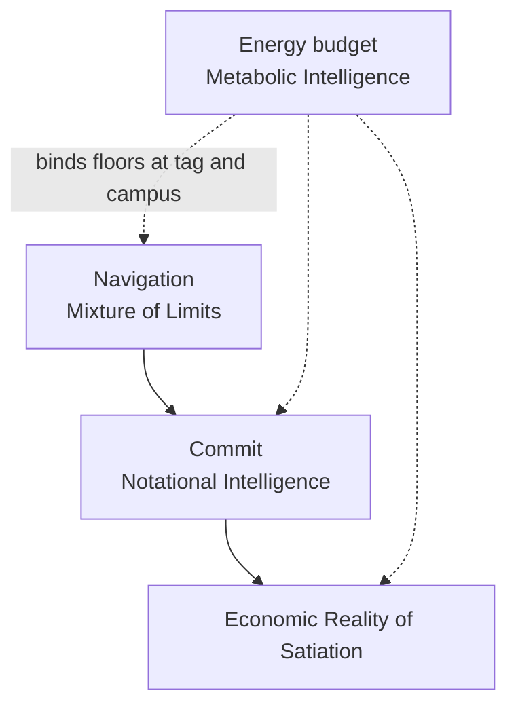
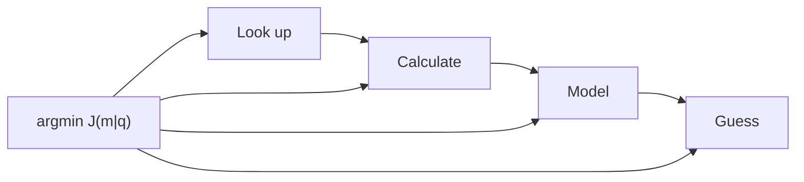
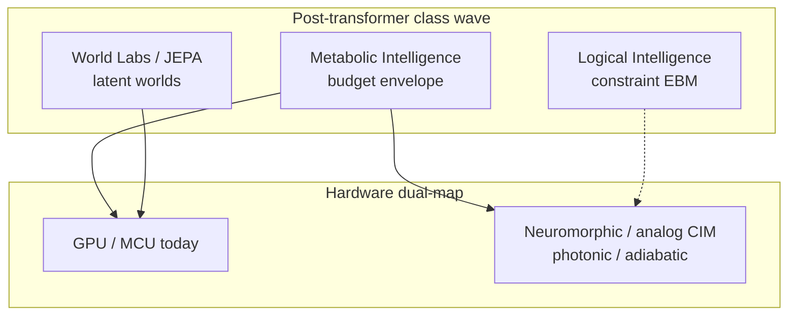

# Metabolic Intelligence: Budget-Native Compute from Tag to Campus

## Abstract

**Metabolic Intelligence** is a budget-native class of computer intelligence. A stated energy budget goes in; the best answer that budget can buy comes out. The class is not a transformer update. It sits with Logical Intelligence (energy-based settle), World Labs (spatial world models), and other post-transformer programs as a next wave: intelligence whose first coordinate is the joule envelope, not the next-token corridor.

Class properties, stated plainly:

1. **Physics-informed.** Features and actuators respect sensor kinetics, heater physics, Landauer floors, and grid constraints as settled law, not optional add-ons.
2. **Test-time inference.** Binding, routing, and lever selection happen under the live budget; the decision is shaped at serve time.
3. **Super learning / sequential learning.** New contexts and classes can be absorbed under the same budget without a full pretrain replay.
4. **Zero-shot capable under grammar.** When Lookup or Formula covers the coordinate, the system answers without opening a generative leaf.
5. **Not pre-training required** as the default path. Abundance updates, family indices, and obtain-routers learn and decide under local cost; large corpus pretrain is residual, not the substrate.

Dual-scale proof in this study:

- **Tag scale.** Digital enzymes on cold-chain gas tags. Cortex-M4 instruction counts (emulator-measured): enzyme families with early exit take 1,723 instructions vs 2,451 for an int8 MLP at matched accuracy. On SmellNet sequential learning (50 foods, five groups, no revisit), enzymes keep 77.7% vs 18.4% for the MLP. A metabolic heating schedule draws about 10 µW total (datasheet + schedule model): heater about 3.0 µW, MCU sleep about 6.9 µW on STM32U3; about eight years on a CR2032. Classifier decisions are about 92 nJ; the sleep floor dominates on the metabolic schedule. Chicken-spoilage Anwar results are internal only and are **not published** here (no licence).
- **Campus scale.** A metabolic grid service for a 100 MW AI campus, tested end to end against a real OpenADR 3.1 VTN and a real MQTT DSX Flex broker. Plant is a model; protocols are real. With node sleep available: zero time over the grid cap across the closed scenario set. Headline lever order: pause deferral → slow per-user speed → route smaller model → lower effort → battery → shed.

**Metabolic Intelligence** (MEI once in this abstract) owns the **budget envelope and actuators** that make companion floors bind. [Mixture of Limits](/papers/mol/) chooses the gear. [Notational Intelligence](/papers/ni/) owns certify-before-commit. [Satiation](/papers/satiation/) owns stop when Value of Information (VoI) is zero or budget refuse fires. This study owns sleep/heater schedules, OpenADR/MQTT service levers, and the \(J(m|q)\) obtain-router that prices look up → calculate → model → guess under λ at stake.

Hardware dual-map: the class runs today on GPUs and MCUs (von Neumann), and points at post–von Neumann substrates (neuromorphic, analog / in-memory, photonic, reversible / adiabatic) where energy-based and latent settle map natively. Estimates remain estimates. Soft-ref path: `board_synth_claimed=false`; package `measured_j` only when Metered.

---

## 1. Introduction: budget-native intelligence

People should not have to fight over energy to eat or to use AI. That civic sentence is the design brief. Cold-chain tags that watch food should last years on a coin cell. Campuses that serve answers should follow the grid when the grid asks them to cut, without inventing false board joules or collapsing every research law into one paper.

The dominant construction for computer intelligence still treats the transformer corridor as the substrate: pretrain a large generative model, then spend tokens and watts at serve time. That corridor has produced real products. It is not the only class. **Logical Intelligence** casts reasoning as energy minimization over constraints. **World Labs** casts spatial intelligence as world models that predict views and dynamics. **Metabolic Intelligence** casts intelligence as **budget-native obtain and actuate**: the envelope is first-class; the answer is the best the envelope can buy.

Shannon (1948) prices bits under uncertainty as settled law. Howard's Value of Information prices whether another observation is worth its cost for a decision. Landauer (1961) prices irreversible bit erasure in joules at temperature \(T\): \(E_{\min} = k_B T \ln 2\) per bit erased in the ideal model. On receipts that Landauer quantity is a **labeled estimate**, not a wattmeter reading. Together they imply floors: past a point, more bits stop buying outcomes that matter for a stated benefit. Metabolic Intelligence embodies those floors as **schedules and actuators** at the edge of a tag and at the meter of a campus.

**Thesis.** A budget goes in; the best answer that budget can buy comes out. The substrate is digital enzymes and other algorithmic compute under energy budgets, plus a grid-following service that pulls levers in order of least service lost per megawatt freed. Class properties follow: physics-informed features and heaters; test-time binding and routing; sequential / super learning without full pretrain replay; zero-shot close when grammar covers; pretrain as residual leaf, not default. Computers are hardware; software is applied engineering under constraints.

Three measurement facts constrain every later number. First, curve and ledger watt-hours are **model / measured-kernel / looked-up** composites, labeled by evidence class. Second, tag microwatts mix **datasheet** and **schedule model**; instruction counts are **emulator-measured**. Third, `board_synth_claimed=false`; package `measured_j` appears only when a labeled meter returns a reading.

---

## 2. Companion laws and OpenIE map

Four studies on this catalog compose. They do not collapse into one paper.

| Role | Study | Owns |
|---|---|---|
| **Navigation** | [Mixture of Limits](/papers/mol/) | Which gear closes: Lookup → Formula → Solver → Model LAST. Floors: VoI, grammar, energy estimate, certificate, settle-refuse. |
| **Commit** | [Notational Intelligence as Commit Law](/papers/ni/) | propose → certify → commit\|refuse → receipt. |
| **Economic Reality of Satiation** | [Satiation and Scarcity after Free AI](/papers/satiation/) | Stop when VoI is zero on completeness \(C(z)\), or when budget / policy refuse fires. |
| **Energy budget / metabolic embodiment** | This paper (Metabolic Intelligence) | Budget envelope and actuators: tag sleep/heater; campus OpenADR/MQTT levers; \(J(m|q)\) obtain-router. |

Mixture of Limits owns *which gear closes*. Notational Intelligence owns the irreversible commit shape. Satiation owns Economic Reality of Satiation. **Metabolic Intelligence** owns the envelope that makes those floors executable in joules and watts. Soft-ref path: `board_synth_claimed=false`; estimates ≠ `measured_j`.

### OpenIE map

| Surface | URL | Relation |
|---|---|---|
| **Research** | [research.openie.dev](https://research.openie.dev) | This study is `/papers/mei/`. Companions: Mixture of Limits, Notational Intelligence, Satiation. |
| **Stack** | [stack.openie.dev](https://stack.openie.dev) | Family map; MEI is embodiment, not another stack card. |
| **Compute** | [compute.openie.dev](https://compute.openie.dev) | Primitive table the cascade navigates; metabolic actuators spend primitives under μ on hardware H. |
| **Synthesis** | [synthesis.openie.dev](https://synthesis.openie.dev) | Cost surface \(E(x)=\sum \theta(p)\cdot\mu(p,H)\); this study extends obtain cost as \(J(m|q)\). |
| **Verify** | [proof.openie.dev](https://proof.openie.dev) | Cousin energy law for verified artifacts. |

Living placeholder for figures: [/living/mei/](/living/mei/). Soft-ref path keeps package energy Estimated unless Metered.

---

## 3. Standing obtain rule and the \(J(m|q)\) synthesis router

Standing rule (David Charlot): **Don't calculate what can be looked up. Don't guess what can be calculated. Don't spend hard-guessing effort on an easy guess.**

The OpenIE synthesis surface prices computing an answer:

\[
E(x) = \sum_{p \in P(c(x))} \theta(p)\cdot\mu(p,H)
\]

**Metabolic Intelligence** raises resolution on *how each input is obtained*. For need \(q\) feeding decision \(y\), mechanism \(m\) has cost:

\[
J(m|q) = E_m + \lambda \cdot \tfrac{1}{2} \cdot S_q^2 \cdot \mathrm{var}_m(t)
\]

\[
\mathrm{var}_m(t) = (\sigma_m^2 + \kappa_q \cdot t)\cdot(1 + 3\cdot p_m),\qquad m^* = \arg\min_m J(m|q)
\]

| Symbol | Meaning | Evidence |
|---|---|---|
| \(E_m\) | Energy of the obtain mechanism | Stack formula on the mechanism's primitives |
| \(S_q\) | Elasticity \(d\ln y / d\ln q\) | **Calculated** by central differences; never assumed |
| \(\lambda\) | Joules at stake in the decision | Decision scale (one request; campus-year) |
| \(\sigma_m, \kappa_q, t, p_m\) | Uncertainty, staleness rate, age, zone-misjudge chance | Looked-up spread, derivation, or labeled guess |

What falls out as law of the function, not as slogan:

- Lookups dominate when they measure the same quantity.
- Cheap crude options win when \(\lambda S_q^2\) is small.
- Required precision: \(\sigma^* = \sqrt{2\varepsilon / (\lambda S_q^2)}\).
- Refresh a cache at \(t^* = 2E / (\lambda S_q^2 \kappa)\).

Ledger outputs (synthesis pack; math + sourced ledger; **not** board `measured_j`):

| Output | Point | p10–p90 | Measure next |
|---|---|---|---|
| Wh per V4 Pro answer at today's speed (GB300) | 0.20 Wh | 0.044–0.68 | Meter one GPU pool for a day |
| Work-per-MW gain, speed matching human chat | 1.92× | 1.19–2.93 | Pro speed; human share of tokens |
| Same gain on Vera Rubin | 2.0× | 1.2–3.4 | Metered Rubin chat curve |

Fused public proxies for output length (400 / 630 / 1,115 tokens) give 655 at log-σ 0.585, no tighter than a 500-token guess. The router keeps the guess for campus planning and takes the lookup per request. Only the gateway's own counters settle it. Evidence class: **model + looked-up + calculation**.

---

## 4. Digital enzymes

A **digital enzyme** is a silicon recognition unit with a binding site, a product, an allosteric context switch, Hill cooperativity, an abundance that acts as the learned weight, and a cost for every binding check. A bit-enzyme variant uses no multiplies. The unit is algorithmic compute under a local energy cost, not a smaller transformer.

| Result | Number | Evidence class | Where |
|---|---|---|---|
| Instructions / decision, Cortex-M4, 12 features | Enzymes + early exit 1,723; int8 MLP 2,451; first enzyme pool 6,948 | Emulator-measured | `mcu/` |
| Accuracy, same test (3 seeds) | Enzymes 82.9 / 86.9 / 88.7%; MLP 82.2 / 78.0 / 87.4% | Real protocol on simulated features | `benchmarks/` |
| Late-life accuracy, physics-invariant features (days 90–180) | LDA 94.9%, MLP 93.4%, enzymes 90.0% (from 80.8%), Tsetlin 89.1% | Simulation + classifier | `benchmarks/` |
| SmellNet, 50 foods, 5 sequential groups, no revisit | Enzymes 77.7%; MLP 18.4% | Real dataset protocol | `benchmarks/` |
| SmellNet cross-day | MLP 85.5%; enzymes 79.8% (same on Cortex-M4) | Real dataset + MCU | `benchmarks/` |

**Class properties, grounded:**

- **Physics-informed.** Drift-invariant / physics-informed features added about 9–11 points of late-life accuracy for enzymes, bit enzymes, and Tsetlin machines. Sensor kinetics and humidity/heater physics are first-class inputs, not post-hoc regularizers.
- **Sequential / super learning.** Enzymes keep usable accuracy while learning foods one group at a time without revisiting. The MLP collapses under the same protocol (77.7% vs 18.4%). That is the super-learning property under a budget: absorb new context without a full pretrain replay.
- **Test-time inference.** Binding checks, early exit through the family index, and allosteric context switches are serve-time decisions under abundance and cost.
- **Not pre-training required** as default. Abundance updates and family indices learn locally. Large generative pretrain is not the substrate of the tag classifier.
- **Zero-shot under grammar.** When a Lookup or Formula leaf covers the context (known context state, known refuse), the cascade closes without opening a generative Model leaf. Mixture of Limits states that order; enzymes supply a budget-native leaf when Model is residual.

Chicken-spoilage evaluation (Anwar & Anwar 2025) has **no licence**. Results from that dataset are **internal only, not published**. Soft-ref path: `board_synth_claimed=false`.

---

## 5. Cold-chain tag budget

On a gas tag the energy goes into **heating and sleep**, not into classifying. One gas reading costs about 0.5–27 mJ depending on the part (datasheet). A classifier decision costs about 92 nJ on an STM32U3 (CoreMark 15.5 µA/MHz at 3.3 V; **calculated** from datasheet, not board package `measured_j`).

Metabolic schedule (about 9.6 readings/day), October 2026 parts:

| Term | Power | Evidence |
|---|---|---|
| Heater (BME690 metabolic) | ~3.0 µW | Datasheet + schedule model |
| MCU sleep (STM32U3) | ~6.9 µW | Datasheet |
| Tag total | ~10 µW | Sum of schedule model |
| CR2032 life | ~8.1 years | Capacity model |
| Same tag on nRF54L15 sleep | ~5.1 µW | Datasheet swap |

Correction (honesty): earlier prose said "the heater is the cost." True for frequent readings. On the metabolic schedule the **MCU sleep floor** is the larger term. Choose the MCU for sleep current. Innatera Pulsar-class neuromorphic parts publish audio/radar milliwatts, not gas-tag microwatt schedules; they are peers on the post–von Neumann map, not drop-in tag winners today.

Market timing (rules, not hype): FDA proposed FSMA 204 compliance move to 20 Jul 2028; Congress barred earlier enforcement. EU PPWR applies since 12 Aug 2026.

---

## 6. Campus energy per answer

Method (curves pack): energy per answer ≈ output tokens × all-in kW per GPU ÷ output tokens/s per GPU.

- **Throughput:** NVIDIA AI Configurator 0.12.0 (measured GPU kernels; SGLang; NVFP4). Evidence: **measured-kernel model**.
- **Power per GPU from InferenceX** (tokens/s per chip ÷ tokens/s per MW): GB300 2.12 kW, B300 1.90, B200 1.71, Vera Rubin 3.30, MI355X 2.09. Evidence: **calculated from published measurements**.
- **Served speeds (Artificial Analysis medians):** V4 Pro 79 tok/s/user, V4 Flash 125, Qwen3-VL 48.5. Evidence: **looked up**.

| Workload (GB300 unless noted) | Energy | Evidence class |
|---|---|---|
| Chat, DeepSeek V4 Pro (2k in / 500 out) | 0.32 Wh at 50 tok/s/user; 0.92 at 79; 4.57 at 159 | Curves method |
| Synthesis ledger best estimate today | 0.20 Wh (p10–p90 0.04–0.68) | Ledger fuse |
| Chat, V4 Flash | 49 mWh at 50; 180 at 159 | Curves |
| Agentic turn, V4 Flash (32k in, 28k cached / 1k out) | 0.16 Wh at 96 | Curves |
| Video clip, 8 s 720p (Wan 2.2) | 390 Wh | Curves / model |

**Plateau levers (field + model, not board `measured_j`):**

- Vera Rubin NVL72 moves the knee of the speed-energy curve from about 100 to about 175 tok/s/user (InferenceX / MLPerf; **measured** field reports). Speed matching human chat is worth about 2.0× on Rubin vs about 2.9× on GB300 (ledger).
- Flash-first routing (V4.1 Flash answering most human chat) plus speed matching: about 2.3–4.4× more work per MW (efficiency pack; **model + looked-up**).
- Deeper speculative decoding (accept length 2.8 modeled): about 1.55× cut in today's base-mix energy per output token; speed matching then adds only about 1.4–1.8×.

These are **test-time** levers under a live budget: which model answers, how fast it streams, how much draft speculation to accept. They are Metabolic Intelligence at campus scale, not a new pretrain run.

---

## 7. Metabolic grid service

The service makes a 100 MW AI campus follow grid caps. Lever order (least service lost per MW freed): **pause deferrable work → slow per-user speed → route to a smaller model → lower reasoning effort → battery → shed**.

Architecture (`datacenter/service/`):

- **Grid in:** OpenADR 3.1 VEN (OAuth2, polling, DEMAND reports), tested against real openleadr-rs VTN. Evidence: **real protocol**.
- **Backstop:** DSX Flex ISV over MQTT, CloudEvents, JWS ES256. Evidence: **real broker + schemas**.
- **Actuators:** Dynamo planner GPU budgets; metabolic gateway (in-flight caps, routing, effort, `x-consumer` speed tiers); Kueue / SGLang pause; Redfish node sleep; battery PCS.
- **Learning:** per-pool speed curve by recursive least squares; power-model bias loop (learned +5 MW on a hot day in the plant model).
- **Plant:** campus model. Evidence: **model**. Protocols and schemas: **real**.

| Scenario (100 MW GB300 campus) | Time over cap | Interactive served | Note |
|---|---|---|---|
| A–C: 60/70% day; notice / feedforward / no notice | 0 | 100% | Notice mostly saves battery |
| D: 90/95%, fast campus (159 tok/s/user) | 0 | 100% | All knowledge chat routed; effort low |
| E: 90/95% **without** node sleep | 96 min | 1% | Idle GPUs alone exceed a 10 MW cap |
| L–M: today's looked-up speeds, 60/70 and 90/95 | 0 | 100% / 52.6% | Speed already spent cannot be spent again |
| N: no notice, no battery (PJM-style 10 min) | 7.5 min | 99.8% | Under cap within 225 s |
| O: 60% cut for 10 h | 0 | 100% | Deadlines kept |
| P: new cap every 5 min for 3 h | 0 | 98.8% | ERCOT-style |
| Q: recovery ramp 2 MW/min | 0 | 100% | Max rise 2.9 MW/min vs 29–47 unlimited |
| R: 90% cut for 10 h | 0 | 13% | Video deadline vs interactive (policy) |

In every run: no actuator call failed; VTN accepted all OpenADR reports; no DSX message rejected. Headline: **zero time over the grid cap whenever node sleep is available**. Correction honesty: "100% served through a 90/95% cut" assumed a fast campus and one curve; with per-pool curves it is about 94%, from today's speeds about 53%. The **cap held** in all of them.

---

## 8. SOTA at the metabolic frontier

### 8.1 Class definition

**Metabolic Intelligence** is a budget-native / energy-envelope intelligence class: the system takes an explicit joule or power budget and returns the best obtainable answer under that envelope, rather than maximizing quality under uncapped transformer FLOPs. Architecturally it sits with Logical Intelligence–style moves *past* basic transformers (energy-based scoring and constraint commit, latent world models, non-autoregressive or non-attention primitives), but binds the envelope at **two scales at once** (microwatt tags ↔ megawatt campuses). The unit of computation is the **digital enzyme** (recognition, allosteric context gating, abundance as weight, local learning and decay, costed binding check) and related algorithmic compute, not ever-larger nets.

Class properties (stated as operating claims; peer overlap cited honestly below):

| Property | MEI grounding in this pack | Honest peer overlap |
|---|---|---|
| **Super / sequential learning** | SmellNet enzymes 77.7% vs MLP 18.4% across five groups without revisit (**real protocol**) | AdaTM continual Tsetlin; classical Hopfield / DenseAM pattern add. Do not claim universal end of catastrophic forgetting. |
| **Test-time inference** | Binding, early exit, \(J(m|q)\) route, campus lever dial under live budget | DenseAM energy descent; Hopfield recall; JEPA MPC planning; Logical Intelligence constraint solve. Test-time ≠ free or pretrain-free. |
| **Zero-shot under grammar** | Lookup → Formula → Solver first (Mixture of Limits); refuse when covered | **V-JEPA 2-AC** zero-shot robot planning without task reward is a strong peer. OpenADR demos here are **protocol-tested**, not "zero-shot AGI." |
| **No large pretrain required** | Enzyme / bit-enzyme **online** path on MCU | Tsetlin / Hebbian AM cousins. **Do not** attribute this to JEPA, World Labs, or Logical Intelligence frontier stacks; they pretrain heavily. Scope the claim to the enzyme path. |
| **Physics-informed** | E-nose kinetics, drift-invariant features (+9–11 late-life points); heater / sleep schedule; Landauer as labeled estimate | PINN lineage; analog EBM as physics substrate. Physics features ≠ thermodynamic optimality without meters. |

**Unique OpenIE gap today:** tag↔campus dual scale + OpenADR 3.1 / DSX Flex–shaped service + \(J(m|q)\) obtain-router + digital enzymes + Satiation stop. Peers own slices. None presently combine that stack as one class definition. Soft-ref path: `board_synth_claimed=false`.

### 8.2 Method taxonomy (must-cite)

| Method | vs transformer | Existing HW | Post–von Neumann | Ev. | MEI overlap |
|---|---|---|---|---|---|
| **Certify/commit EBM (Logical Intelligence)** | Next-token → energy landscape + Lean-checkable proofs | GPU + Lean; Kona / Aleph pilots (Jan 2026) | Analog DenseAM / Hopfield-style CIM (research) | V/C | Test-time verify. Constraint energy ≠ campus joules. Not "no pretrain." |
| **Latent JEPA / world models** | Pixel/token gen → predict in latent; plan by latent energy | GPU ViT + MPC (V-JEPA 2-AC, Jun 2025); World Labs Marble / Atlas | Speculative: latent dynamics on analog associative recall | M/V | **Zero-shot** planning peer. **Requires** large video pretrain — conflicts with enzyme "no pretrain" unless claims are split by path. |
| **DenseAM / Hopfield EBM** | Attention cast as energy flow; retrieval = minimize E | Digital solvers on GPU/CPU | Analog RC + crossbar; memristor Hopfield (2026) | P/S | Test-time energy descent; physics-native dynamics |
| **Thermodynamic / equilibrium EBM HW** | Sampling Z digitally → Langevin/Gibbs on physics | Superconducting / stochastic analog research | Hardware-native EBM sampling | P | Physics-informed substrate; early |
| **Digital enzymes (OpenIE)** | Dense MLP → recognition + abundance + budgeted binding | MCU / Cortex-M4 (emulator-measured instr.) | Content-addressable / sparse associative fit | M/S | Sequential learning; budget dial; no large pretrain on enzyme path; physics-informed features |
| **Tsetlin / bit-logic** | Real-valued nets → propositional clauses | Digital ASIC 65 nm (8.6 nJ/MNIST frame, Jan 2025) | Stays digital-sparse | M/P | Online / continual peers; nJ edge |
| **HDC + SDM** | Dense embeddings → hypervectors / sparse distributed memory | SRAM/FPGA HDC; HDStream 2026 | Associative CAM / memristive bundling | P/V | Fast associative recall; not the campus story |
| **SSM / Mamba / RWKV** | Quadratic attn → linear state | GPU; FPGA/ASIC | Still digital accelerators | M/P | Corridor efficiency peer only; **not** budget-native class |
| **Photonic / analog CIM / adiabatic** | Data-move → in-memory / charge recovery | Lab photonic fJ/op claims; NeuRRAM lineage; Innatera Pulsar ~0.4–0.6 mW audio/radar | Core post-vN joule-floor path | M/V/S | Joule floor hardware; **not** the MEI software class by itself |
| **Power-aware serving (soft)** | Same transformer + power caps / speed dial | Dynamo 1.5 (18 Sep 2026); DPS | N/A | V/M | Illustrates **budget binding** at campus; not a new intelligence class |
| **Grid-flexible campus (soft)** | Flat load → dispatchable envelope | DSX Flex; OpenADR 3.x; AEMA (16 Sep 2026, **no spec yet**) | N/A | C/V/R | Envelope as grid budget; OpenIE wires this to obtain-router |

### 8.3 Positioning vs named peers

| Peer | Their axis | Metabolic Intelligence difference |
|---|---|---|
| Logical Intelligence | Constraint energy + formal commit | Joule envelope + obtain routing + dual scale |
| World Labs / V-JEPA | Spatial / latent world models | Budget-native enzymes + campus grid service; latent optional |
| DenseAM / analog EBM | Physics dynamics for inference | Software enzyme class **plus** envelope ops; cite as HW future |
| Dynamo / DSX / AEMA | Power and grid actuators | Actuators **inside** Mixture of Limits intelligence |
| Tsetlin / HDC | Efficient non-transformer silicon | Cousins at edge; lack campus \(J(m|q)\) + OpenADR thesis |

### 8.4 Soft peers only: serving and grid actuators

Dynamo 1.5 power-aware scaling, NVIDIA DPS, InferenceX Vera Rubin tok/s/MW curves, Emerald DSX Flex, and the AI Energy Management Alliance are **envelope actuators and field measurements**. They do not define the intelligence class. Academic joule-aware routers (PEARL, OmniRouter, Energy-Aware LRM) price which LLM answers; they do not price which obtain zone (Lookup → Formula → Solver → Model LAST) and do not bind tag↔campus.

Term hunt (2 Oct 2026): **Metabolic Intelligence** as a named peer class to Logical Intelligence / World Labs was **not found** outside OpenIE / Charlot Lab energy-first framing. That is a positioning fact, not a monopoly claim on every energy paper.

### 8.5 What not to claim without meters

- Wh/answer, J/token, µW lifetime, or × work/MW untied to pack evidence **M/C** or a named external meter.
- "Routing costs no quality" (Flash leads AA composite; trails ~1.5 GPQA).
- "Heater is always the tag cost" (sleep floor dominates on metabolic schedule).
- Rubin "up to 30×" without speed condition (gain is speed-dependent).
- AEMA / DSX Flex latency or ramp numbers (unspecified).
- Shipping neuromorphic gas/odour nJ figures (not found).
- That Logical Intelligence "energy-based" equals grid joules (different energy).
- That MEI needs no pretrain **and** matches V-JEPA zero-shot robotics (incompatible scopes; split by path).
- Chicken-spoilage accuracy in public prose (**no licence**).

Soft-ref path: `board_synth_claimed=false`; estimates ≠ `measured_j`.

## 9. Corrections log

Condensed from the Metabolic Intelligence handoff corrections log. Withdrawn claims are stated plainly.

| Date | Withdrawn or revised | Correction |
|---|---|---|
| 2 Oct 2026 | FSMA 204 "compliance moved to 20 Jul 2028" as settled | FDA **proposed**; Congress barred enforcement before that date |
| 2 Oct 2026 | PJM IRAS "full reduction within 10 min"; effective date 12 Oct 2026 | Transmission owner must start and complete reduction within 10 min of PJM quantity; effective date unverifiable, removed |
| 2 Oct 2026 | STM32U3 at 12 µA/MHz as CoreMark | That figure is a while(1) loop at 48 MHz; CoreMark is 15.5 µA/MHz (51 pJ/cycle; 92 nJ/decision **calculated**) |
| 1 Oct 2026 | "V4.1 Flash routing costs no quality" | Leads V4 Pro on AA composite (39 vs 36); trails ~1.5 GPQA points on knowledge |
| 1 Oct 2026 | Recovery ramp as fixed rising line | Lagging actuators jumped 13–31 MW/min; redesigned plan+one-step with battery on meter (2.9 MW/min) |
| 1 Oct 2026 | 100% served through 90/95% cut as universal | Fast campus / one curve; per-pool curves ~94%; today's speeds ~53%; **cap held** in all |
| 1 Oct 2026 | Speed-matching gain 2–4× / 4.6–12× | Baselines were guesses; looked-up speeds → 1.65–2.9× |
| 1 Oct 2026 | All-in kW 2.25 / 2.0 / 2.15 (GB300/B300/B200) | InferenceX-derived: 2.12 / 1.90 / 1.71 |
| 1 Oct 2026 | B300 "as good per Wh at low speed" | Withdrawn; GB300 2.9× B300 tokens/MW at 96 tok/s/user (InferenceX) |
| 1 Oct 2026 | Chat answer 5–62 mWh from InferenceX J/token | InferenceX counts total tokens (mostly cached input); replaced by AI Configurator curves |
| 1 Oct 2026 | Flash at 0.33× Pro energy/token | AI Configurator: 0.04–0.15×; routing stronger, speed dial weaker |
| 1 Oct 2026 | Edge: "heater is the cost" | Frequent readings yes; metabolic schedule → MCU sleep floor dominates |
| Sep 2026 | Enzyme MCU cost estimated in Python | Real counts 2.3–2.9× MLP; family index → 0.70× |
| Sep 2026 | Older systems as current SOTA; XOR as two-site MWC | Relabelled or removed |

Chicken-spoilage Anwar numbers stay **unpublished** (no licence).

---

## 10. Measurement honesty and open items

Evidence classes used in this study: **real protocol**, **emulator-measured**, **datasheet**, **measured-kernel model**, **looked-up**, **calculation**, **plant model**, **estimate**. Estimates ≠ `measured_j`. Soft-ref path: `board_synth_claimed=false`.

Ranked open measurements (synthesis ledger stakes):

1. Meter one GB300 pool for a day (narrows energy-per-answer band; campus-scale VoI of the meter).
2. Vera Rubin chat curve from a metered pool or AISimulate once Rubin-supported.
3. Gateway counters: output tokens per answer; human share (`x-consumer`).
4. V4.1 Flash throughput curve (replace V4 Flash stand-in behind routing).
5. Speculative-decoding accept length per workload from engine telemetry.

Service gaps: backup-generator start (PJM 15 min); trip with no control signal then controlled restart; ride-through (MISO / NERC due 31 Dec 2026); Dynamo 1.5 / DPS as live power-cap actuators; operator setting for "deadlines ahead of interactive."

Edge gaps: SGP41 single-shot validation; radio uploads and cold-temperature battery; low-power sensor data (SmellNet uses MQ-series parts). Admin: licence for code pack; chicken-dataset authors' permission before any derived publish.

Stage C / package `measured_j` for Metabolic Intelligence hardware remains **open**. Tag figures are datasheet + schedule + emulator. Campus figures are curves + plant model + real protocols. No invented board package joules.

---

## 11. Conclusion and relation to Mixture of Limits product

**Metabolic Intelligence** teaches a budget-native class: physics-informed, test-time, zero-shot under grammar, sequential / super learning without mandatory pretrain, dual-mapped to GPUs/MCUs today and to neuromorphic / analog / photonic / adiabatic substrates next. A budget goes in; the best answer that budget can buy comes out. Digital enzymes prove the class at microwatts. The OpenADR / DSX Flex service proves the class at 100 MW. The \(J(m|q)\) router makes the standing obtain rule executable.

Companions stay distinct. [Mixture of Limits](/papers/mol/) navigates Lookup → Formula → Solver → Model LAST and owns the product path (`mol.yaml` / `mol run` / A1–A14; [openIE-dev/mixture-of-limits](https://github.com/openIE-dev/mixture-of-limits)). [Notational Intelligence](/papers/ni/) owns certify-before-commit. [Satiation](/papers/satiation/) owns Economic Reality of Satiation. This study owns the envelope and actuators that make those floors bind when food is watched on a coin cell and when a campus must shed watts without lying about meters.

### Product surface under Mixture of Limits

Metabolic Intelligence does not replace the Mixture of Limits product path. It supplies the envelope those floors spend: the Mixture of Limits cascade decides the gear; metabolic actuators and the obtain-router decide how hard the envelope may be driven at tag sleep current and at campus import meters. When VoI is zero or the budget refuse fires, Satiation and Mixture of Limits already name stop as success. This study shows that stop is executable with OpenADR reports and node sleep, and that enzyme recognition can stay inside a coin-cell envelope without a transformer pretrain.

Soft-ref path: `board_synth_claimed=false`; estimates ≠ `measured_j`. Living figures: [/living/mei/](/living/mei/) (placeholder; companions pending). PDF: [/pdfs/mei.pdf](/pdfs/mei.pdf) when regenerated.

---

## References (selected)

1. Shannon, C. E. (1948). A Mathematical Theory of Communication. *Bell System Technical Journal*.
2. Howard, R. A. (1966). Information Value Theory. *IEEE Transactions on Systems Science and Cybernetics*.
3. Landauer, R. (1961). Irreversibility and Heat Generation in the Computing Process. *IBM Journal of Research and Development*.
4. Charlot, D. Mixture of Limits. [research.openie.dev/papers/mol/](/papers/mol/).
5. Charlot, D. Notational Intelligence as Commit Law. [research.openie.dev/papers/ni/](/papers/ni/).
6. Charlot, D. Satiation and Scarcity after Free AI. [research.openie.dev/papers/satiation/](/papers/satiation/).
7. OpenIE Synthesis cost surface. [synthesis.openie.dev](https://synthesis.openie.dev).
8. Logical Intelligence. Kona / energy-based reasoning materials (2026). [logicalintelligence.com](https://logicalintelligence.com).
9. World Labs. Atlas world model (1 Sep 2026). [worldlabs.ai](https://www.worldlabs.ai).
10. OpenIE Metabolic Intelligence handoff pack (2 Oct 2026): `HANDOFF.md`, `radar/README.md`, `synthesis/`, `datacenter/service/`, `benchmarks/`, `mcu/`.
11. NVIDIA / Emerald AI / Google. AI Energy Management Alliance announcement (16 Sep 2026). Field alliance; no published AEMA protocol spec as of 1 Oct 2026 radar.
11a. Dalgaty et al. Probabilistic in-memory computing for energy-based models (arXiv:2609.11281, 2609.11288, 2026). Model / TLM evidence for AIMC vs HBM-bound GPU mismatch.

12. Assran et al. V-JEPA 2 / V-JEPA 2-AC (2025). Latent world model; zero-shot MPC planning without task reward. arXiv:2506.09985. Peer for zero-shot; requires large video pretrain (scope conflict with enzyme no-pretrain claim).
13. DenseAM / Hopfield EBM dynamical models (2025–2026 preprints). Analog constant-time inference path; cite as post–von Neumann future for energy descent. Field / theory evidence, not OpenIE meters.
14. Tsetlin Machine 65 nm ASIC (Jan 2025). 8.6 nJ per MNIST frame (paper silicon). Edge cousin to digital enzymes.
15. OpenIE Metabolic Intelligence SOTA brief (2 Oct 2026). `docs/MEI_SOTA_BRIEF_2026-10-02.md`.
