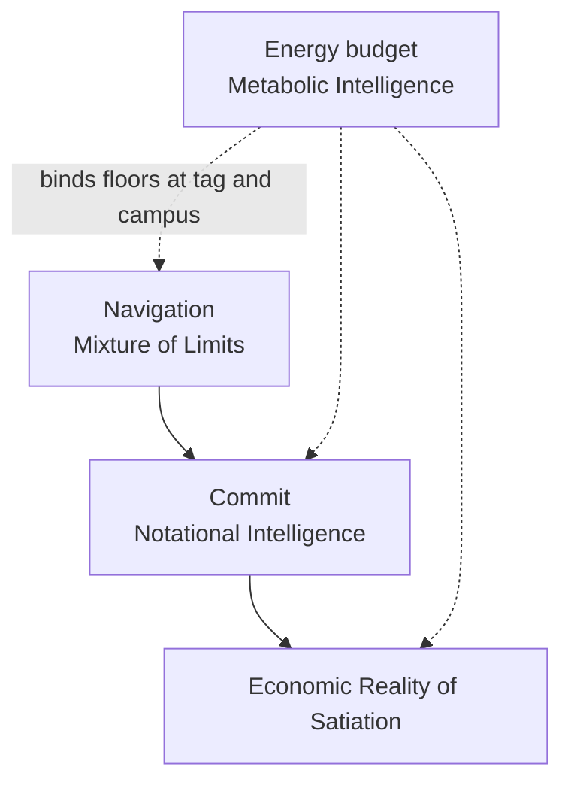
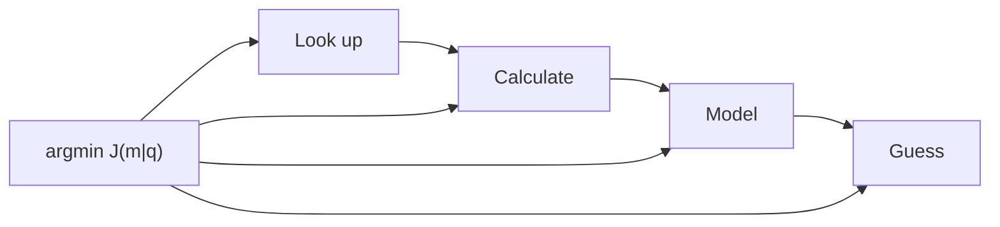
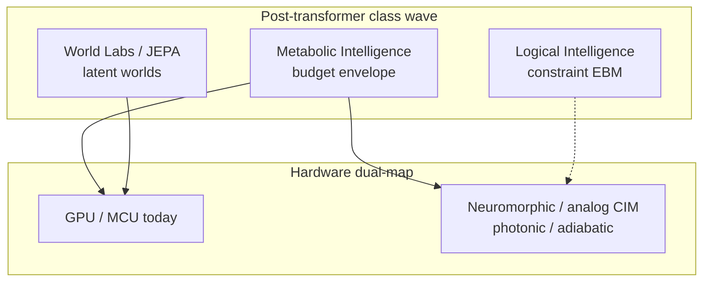

# Metabolic Intelligence: Budget-Native Compute from Tag to Campus

## Abstract

**Metabolic Intelligence** is a budget-native class of computer intelligence. A stated energy budget goes in; the best answer that budget can buy comes out. The class is not a transformer update. It sits with Logical Intelligence (energy-based settle), World Labs (spatial world models), and other post-transformer programs as a next wave: intelligence whose first coordinate is the joule envelope, not the next-token corridor.

**Designed for Klere.** Metabolic Intelligence is designed for **Klere** ([klere.ai](https://klere.ai)) — Open Interface Engineering's product home for the MEI class. This research study owns the law and class definition. Klere owns the product embodiment. As of this writing the public site is a thin access / energy-efficient AI framing; it is not a shipped feature catalog. Tag, campus, and obtain-stack surfaces named below are **Klere roadmap** unless this study labels them as a **proven pack**.

Class properties, stated plainly:

1. **Physics-informed.** Features and actuators respect sensor kinetics, heater physics, Landauer floors, and grid constraints as settled law, not optional add-ons.
2. **Test-time inference.** Binding, routing, and lever selection happen under the live budget; the decision is shaped at serve time.
3. **Super learning / sequential learning.** New contexts and classes can be absorbed under the same budget without a full pretrain replay.
4. **Zero-shot capable under grammar.** When Lookup or Formula covers the coordinate, the system answers without opening a generative leaf.
5. **Not pre-training required** as the default path. Abundance updates, family indices, and obtain-routers learn and decide under local cost; large corpus pretrain is residual, not the substrate.

Dual-scale proof in this study:

- **Tag scale.** Digital enzymes on cold-chain gas tags. Cortex-M4 instruction counts (emulator-measured): enzyme families with early exit take 1,723 instructions vs 2,451 for an int8 MLP at matched accuracy. On SmellNet sequential learning (50 foods, five groups, no revisit), enzymes keep 77.7% vs 18.4% for the MLP. A metabolic heating schedule draws about 10 µW total (datasheet + schedule model): heater about 3.0 µW, MCU sleep about 6.9 µW on STM32U3; about eight years on a CR2032. Classifier decisions are about 92 nJ; the sleep floor dominates on the metabolic schedule. Chicken-spoilage Anwar results are internal only and are **not published** here (no licence).
- **Campus scale.** A metabolic grid service for a 100 MW AI campus, tested end to end against a real OpenADR 3.1 VTN and a real MQTT DSX Flex broker. Plant is a model; protocols are real. With node sleep available: zero time over the grid cap across the closed scenario set. Headline lever order: pause deferral → slow per-user speed → route smaller model → lower effort → battery → shed.

**Metabolic Intelligence** (MEI once in this abstract) owns the **budget envelope and actuators** that make companion floors bind. [Mixture of Limits](/papers/mol/) chooses the gear. [Notational Intelligence](/papers/ni/) owns certify-before-commit. [Satiation](/papers/satiation/) owns stop when Value of Information (VoI) is zero or budget refuse fires. This study owns sleep/heater schedules, OpenADR/MQTT service levers, and the \(J(m|q)\) obtain-router that prices look up → calculate → model → guess under λ at stake.

Hardware dual-map: the class runs today on GPUs and MCUs (von Neumann), and points at post–von Neumann substrates (neuromorphic, analog / in-memory, photonic, reversible / adiabatic) where energy-based and latent settle map natively. Estimates remain estimates. Soft-ref path: `board_synth_claimed=false`; package `measured_j` only when Metered.

---

## 1. Introduction: budget-native intelligence

People should not have to fight over energy to eat or to use AI. That civic sentence is the design brief. Cold-chain tags that watch food should last years on a coin cell. Campuses that serve answers should follow the grid when the grid asks them to cut, without inventing false board joules or collapsing every research law into one paper.

The dominant construction for computer intelligence still treats the transformer corridor as the substrate: pretrain a large generative model, then spend tokens and watts at serve time. That corridor has produced real products. It is not the only class. **Logical Intelligence** casts reasoning as energy minimization over constraints (Business Wire, 20 Jan 2026). **World Labs** casts spatial intelligence as world models that predict views and dynamics (Atlas, 1 Sep 2026). **Metabolic Intelligence** casts intelligence as **budget-native obtain and actuate**: the envelope is first-class; the answer is the best the envelope can buy. The class is designed for **Klere** ([klere.ai](https://klere.ai)): research owns the law; Klere owns the product embodiment. Do not read the thin public landing page as live product features.

Shannon (1948) prices bits under uncertainty as settled law. Howard's Value of Information (1966) prices whether another observation is worth its cost for a decision. Landauer (1961) prices irreversible bit erasure in joules at temperature \(T\): \(E_{\min} = k_B T \ln 2\) per bit erased in the ideal model. On receipts that Landauer quantity is a **labeled estimate**, not a wattmeter reading. Together they imply floors: past a point, more bits stop buying outcomes that matter for a stated benefit. Metabolic Intelligence embodies those floors as **schedules and actuators** at the edge of a tag and at the meter of a campus.

**Formal thesis.** Let \(B\) be an explicit budget in joules (tag episode) or watts / megawatts (campus import). Let \(\mathcal{A}(B)\) be the set of obtainable answers under actuators available inside \(B\). Metabolic Intelligence returns \(a^* = \arg\max_{a \in \mathcal{A}(B)} U(a)\) for a stated utility \(U\) (accuracy, interactive served share, completeness of a chore), subject to the envelope constraint. The substrate is digital enzymes and other algorithmic compute under energy budgets, plus a grid-following service that pulls levers in order of least service lost per megawatt freed. Class properties follow: physics-informed features and heaters; test-time binding and routing; sequential / super learning without full pretrain replay; zero-shot close when grammar covers; pretrain as residual leaf, not default. Computers are hardware; software is applied engineering under constraints.

Three measurement facts constrain every later number. First, curve and ledger watt-hours are **model / measured-kernel / looked-up** composites, labeled by evidence class. Second, tag microwatts mix **datasheet** and **schedule model**; instruction counts are **emulator-measured**. Third, `board_synth_claimed=false`; package `measured_j` appears only when a labeled meter returns a reading.

---

## 2. Formal problem, definitions, and propositions

### 2.1 Problem statement

**Problem (Budget-native obtain).** Given a need \(q\) that feeds a decision \(y\), an explicit budget \(B\), and a menu of obtain mechanisms \(M = \{\text{Lookup}, \text{Formula}, \text{Solver}, \text{Model}, \text{Guess}\}\) with costs and uncertainty, select mechanism \(m^*\) and actuation schedule \(s^*\) such that the answer is the best \(U\) permits under \(B\), and stop when further spend does not raise a stated completeness predicate (Satiation) or when policy refuse fires (Notational Intelligence).

The problem is dual-scale by construction:

| Scale | Budget unit | Actuators | Success metric in this study |
|---|---|---|---|
| Tag | µW continuous; nJ–mJ per event | Heater duty, MCU sleep, enzyme binding / early exit | Lifetime on CR2032; decisions under schedule; sequential accuracy |
| Campus | MW import cap | Pause, speed, route, effort, battery, shed | Time over cap; interactive served share |

### 2.2 Definitions

| Term | Definition in this paper |
|---|---|
| **Metabolic Intelligence (MEI)** | Budget-native / energy-envelope intelligence class: budget in → best obtainable answer out, at tag and campus under one thesis. |
| **Budget envelope** | Explicit joule or power bound \(B\) that constrains obtainable answers; first-class input, not a post-hoc telemetry label. |
| **Digital enzyme** | Silicon recognition unit with binding site, product, allosteric context switch, Hill cooperativity, abundance as learned weight, and a cost for every binding check. Bit-enzyme variant uses no multiplies. |
| **Metabolic schedule** | Duty cycle for sensing and heating that meets a monitoring objective while minimizing average power (heater + sleep + radio). |
| **Obtain mechanism** | How an input is acquired: Lookup, Formula / Calculate, Solver, Model, Guess — ordered by Mixture of Limits; priced by \(J(m\|q)\). |
| **Obtain-router** | The rule \(m^* = \arg\min_m J(m\|q)\) that selects the mechanism under λ at stake. |
| **Grid-following service** | Control plane that accepts OpenADR / DSX Flex signals and applies ordered levers so campus import stays under cap. |
| **Evidence class** | Label on a number: real protocol, emulator-measured, datasheet, measured-kernel model, looked-up, calculation, plant model, estimate (M/C/V/R/D/S/P in the pack radar). |
| **Soft-ref path** | `board_synth_claimed=false`; estimates ≠ package `measured_j`. |

### 2.3 Settled law: Shannon, Landauer, VoI

These are not OpenIE inventions. They are settled coordinates this study *uses*.

| Law | Statement used here | Role in MEI |
|---|---|---|
| **Shannon (1948)** | Bits under uncertainty have a rate–distortion structure; more bits past a point buy little for a fixed fidelity. | Justifies Lookup / Formula before Model when the coordinate is already known. |
| **Landauer (1961)** | Irreversible bit erasure has an ideal floor \(k_B T \ln 2\) per bit. | Labeled **estimate** on receipts; not a wattmeter. Motivates treating joules as scarce even when digital inference is free at the money margin. |
| **Howard VoI (1966)** | Value of Information is the expected improvement in decision utility from an observation, net of cost. | When VoI ≤ 0 under λ, Satiation / Mixture of Limits name stop; MEI makes stop executable as refuse of heater pulse or campus lever. |

Horowitz (2014) documents that practical CMOS energy is dominated by data movement and memory, far above the Landauer ideal. That gap is why Metabolic Intelligence schedules heaters and campus import meters rather than claiming thermodynamic optimality from whiteboard erasure.

### 2.4 Propositions (claims with evidence class)

Each proposition is a claim. Evidence class is stated. Peer overlap is acknowledged; uniqueness is scoped.

**Proposition 1 (Envelope primacy).** *An intelligence class whose first coordinate is an explicit budget envelope can bind obtain and actuation at microwatt and megawatt scales under one thesis.* Evidence: this study's dual-scale pack (tag schedule + OpenADR service). Class: **real protocol** (campus) + **datasheet / schedule model / emulator** (tag). Peer slices: Dynamo power caps (campus only); TinyML (edge only). Unique stack claim: dual scale + OpenADR/DSX + \(J(m\|q)\) + enzymes + Satiation stop.

**Proposition 2 (Enzyme sequential learning).** *Under a fixed MCU budget, digital enzymes absorb sequential class groups with far less catastrophic forgetting than an int8 MLP of matched decision cost.* Evidence: SmellNet 50 foods, five groups, no revisit — enzymes 77.7% vs MLP 18.4% (**real dataset protocol**). Peer overlap: AdaTM continual Tsetlin; classical Hopfield / DenseAM pattern add. Do **not** claim universal end of catastrophic forgetting.

**Proposition 3 (Sleep floor on metabolic schedule).** *On a cold-chain gas tag with metabolic heating (~9.6 readings/day, Oct 2026 parts), MCU sleep current dominates heater average power.* Evidence: BME690 heater ~3.0 µW vs STM32U3 sleep ~6.9 µW (**datasheet + schedule model**). Correction: "heater is always the cost" is false on this schedule.

**Proposition 4 (\(J(m\|q)\) obtain law).** *Pricing obtain mechanisms by energy plus λ-weighted uncertainty selects Lookup/Formula when they measure the same quantity and reserves Model for residual leaves.* Evidence: synthesis ledger math + sourced inputs (**calculation + looked-up**); not board `measured_j`. Peer: PEARL / OmniRouter price *which LLM*; they do not price *which obtain zone*.

**Proposition 5 (Campus cap with node sleep).** *A 100 MW campus plant model under real OpenADR 3.1 and real DSX Flex MQTT, with node sleep available, records zero time over the grid cap across the closed scenario set.* Evidence: **real protocol** + **plant model**. Without node sleep, idle GPUs alone can exceed a deep cut (scenario E: 96 min over cap).

**Proposition 6 (Free-at-margin ≠ free joules).** *Published collapse in money price of digital inference does not identify free energy, free actuation, or unbounded value after a chore is complete.* Evidence: companion [Satiation](/papers/satiation/) (Epoch series cited there); Landauer / Horowitz as floors. MEI supplies the envelope actuators that make the economic stop physical.

**Proposition 7 (Class properties are path-scoped).** *No-pretrain, zero-shot, and test-time claims must be scoped by path (enzyme vs latent vs certify EBM). Mixing scopes invents a contradiction.* Evidence: V-JEPA 2-AC zero-shot planning requires large video pretrain (Assran et al., 2025); enzyme online path does not. Logical Intelligence constraint energy ≠ campus joules (Business Wire, 2026).

---

### 2.5 Formal lemmas (stated, not board-proved)

**Lemma A (Obtain dominance under matched measurement).** If two mechanisms \(m_1, m_2\) measure the same quantity \(q\) and \(E_{m_1} < E_{m_2}\) with \(\mathrm{var}_{m_1} \le \mathrm{var}_{m_2}\), then \(J(m_1|q) < J(m_2|q)\) for all \(\lambda, S_q \ge 0\). *Proof sketch:* both additive terms weakly favor \(m_1\). Evidence class: **calculation** (definition of \(J\)). Implication: Lookup beats Calculate when the table holds the same coordinate; Calculate beats Model when a closed form exists.

**Lemma B (Precision sizing).** For fixed \(\lambda, S_q\) and target excess cost \(\varepsilon\), the uncertainty that equalizes the λ-term with \(\varepsilon\) is \(\sigma^* = \sqrt{2\varepsilon / (\lambda S_q^2)}\) (ignoring staleness). Spending below \(\sigma^*\) wastes energy; spending above leaves decision risk on the table. Evidence: **calculation**. Implication: satiation of precision is a first-class stop, not a soft habit.

**Lemma C (Cache refresh).** Under linear staleness \(\kappa_q \cdot t\), the refresh interval that balances obtain energy against λ-weighted variance growth is \(t^* = 2E / (\lambda S_q^2 \kappa)\) when \(p_m\) is small. Evidence: **calculation**. Implication: metabolic schedules on tags and cache TTLs on campuses are the same object at different λ.

**Lemma D (Cap feasibility without sleep).** If idle import \(P_{\mathrm{idle}}\) exceeds the grid cap \(P_{\mathrm{cap}}\), no combination of speed / route / effort levers that leaves nodes powered can meet the cap. Scenario E is the concrete instance (96 min over cap without node sleep). Evidence: **plant model + real protocol**. Implication: node sleep (or equivalent power-down) is not an optional luxury at deep cuts.

These lemmas are engineering consequences of the definitions. They are not theorems about AGI. Soft-ref path: `board_synth_claimed=false`.

### 2.6 Related work by method (academic corridor)

Method taxonomy is first-class; geography is not a claim axis.

**Energy-based and certify models.** Logical Intelligence's Kona 1.0 pilots (Business Wire, 20 Jan 2026) move constraint energy and Lean-checkable commit into product pilots. DenseAM and Hopfield-style dynamical models (arXiv:2512.15002; arXiv:2604.05042) cast attention and retrieval as energy descent, with analog constant-time inference as a research path. Thermodynamic continuous-variable EBM blueprints (2026 preprints) push sampling onto physics substrates. Metabolic Intelligence cites these as **class neighbors** for test-time settle. It does not claim their constraint energy equals campus import joules.

**Latent world models.** V-JEPA 2 / V-JEPA 2-AC (Assran et al., arXiv:2506.09985, 11 Jun 2025) demonstrate latent prediction and zero-shot robot planning without task reward after large video pretrain. World Labs Atlas (1 Sep 2026) continues the spatial world-model corridor. Metabolic Intelligence treats latent models as an optional Model-zone leaf, not the enzyme substrate. Zero-shot robotics peer strength is acknowledged; the no-pretrain claim stays scoped to the enzyme path (Proposition 7).

**Logic and hyperdimensional edge ML.** Tsetlin Machine ASICs report 8.6 nJ per MNIST frame at 65 nm (Tunheim et al., arXiv:2501.19347, Jan 2025). Hyperdimensional computing and sparse distributed memory lineages supply associative recall on SRAM/FPGA and speculative memristive bundling. These are **edge cousins**: online learning, low forgetting in some continual settings, nJ-class decisions. They do not supply OpenADR obtain-routing or dual-scale thesis.

**Joule-aware serving and routing.** PEARL, OmniRouter, and Energy-Aware LRM papers (2025–Jan 2026) price which LLM answers under cost or energy budgets. NVIDIA Dynamo 1.5 (18 Sep 2026) adds per-GPU power annotations. InferenceX and MLPerf supply tok/s/MW field measurements (Sep 2026). Emerald DSX Flex and AEMA (Jun / Sep 2026) move campus flexibility into commercial and alliance language. Metabolic Intelligence uses these as **envelope actuators and meters**, then binds them to Mixture of Limits obtain zones—an integration peers do not presently publish as one class.

**OpenIE prior surfaces.** Synthesis cost \(E(x)\), Mixture of Limits navigation, Notational commit, and Satiation stop are prior OpenIE law. This study is the embodiment layer: budgets and actuators that make those floors spendable in joules and watts.

### 2.7 Evidence grammar (how to read every table)

| Tag in this paper | Meaning | When it can support a sell claim |
|---|---|---|
| **real protocol** | Talked to a real VTN / broker / schema | Protocol interoperability yes; plant watts no |
| **emulator-measured** | Cortex-M4 instruction counts from ELF under emulator | Relative enzyme vs MLP cost yes; board joules no |
| **datasheet** | Vendor electrical tables | Schedule model inputs |
| **measured-kernel model** | AI Configurator kernels + published power ratios | Wh/answer bands as estimates |
| **looked-up** | Artificial Analysis medians, public blogs | Baseline speeds |
| **calculation** | Central differences, \(J\) algebra, CoreMark→nJ | Algebraic consequences |
| **plant model** | Campus thermal/power simulator | Scenario comparisons under stated assumptions |
| **estimate** | Ledger fuse, capacity life | Always banded; never `measured_j` |

`board_synth_claimed=false` is sticky. Package `measured_j` appears only when a labeled meter returns a reading.

## 3. Companion laws and OpenIE map

Four studies on this catalog compose. They do not collapse into one paper.

| Role | Study | Owns |
|---|---|---|
| **Navigation** | [Mixture of Limits](/papers/mol/) | Which gear closes: Lookup → Formula → Solver → Model LAST. Floors: VoI, grammar, energy estimate, certificate, settle-refuse. |
| **Commit** | [Notational Intelligence as Commit Law](/papers/ni/) | propose → certify → commit\|refuse → receipt. |
| **Economic Reality of Satiation** | [Satiation and Scarcity after Free AI](/papers/satiation/) | Stop when VoI is zero on completeness \(C(z)\), or when budget / policy refuse fires. |
| **Energy budget / metabolic embodiment** | This paper (Metabolic Intelligence) | Budget envelope and actuators: tag sleep/heater; campus OpenADR/MQTT levers; \(J(m\|q)\) obtain-router. |

### 3.1 Relation to Mixture of Limits

Mixture of Limits owns *which gear closes*. Metabolic Intelligence supplies the **μ on hardware H** those gears spend. The cascade Lookup → Formula → Solver → Model LAST is the impedance story; enzymes are a budget-native recognition leaf near Formula / cheap Solver; campus Flash routing and speed dials are empirical satiation of tok/s and model size. Soft-ref path: `board_synth_claimed=false`; estimates ≠ `measured_j`.

### 3.2 Relation to Notational Intelligence

Notational Intelligence owns the irreversible commit shape. Metabolic Intelligence does not certify proofs. When a campus lever sheds load or a tag refuses a heater pulse, the *permission* to act remains a Notational / WCA concern; this study owns the energy predicate those commits spend. Logical Intelligence Lean-certified commit is the strongest *peer* certify mechanism (Aleph / PutnamBench materials); it is constraint energy, not grid joules.

### 3.3 Relation to Satiation

Satiation owns Economic Reality of Satiation: stop when completeness \(C(z)\) holds and VoI is zero, or when budget refuse fires. Metabolic Intelligence makes that stop **executable**:

- Tag: skip the next heater pulse when context surprise is below threshold and lifetime budget is binding.
- Campus: refuse ascending to a larger model or higher speed when \(J\) is minimized for the stake.
- Civic: free-at-margin digital inference must not be misread as a licence to burn grid megawatts past done.

### 3.4 OpenIE map

| Surface | URL | Relation |
|---|---|---|
| **Research** | [research.openie.dev](https://research.openie.dev) | This study is `/papers/mei/`. Companions: Mixture of Limits, Notational Intelligence, Satiation. |
| **Stack** | [stack.openie.dev](https://stack.openie.dev) | Family map; MEI is embodiment, not another stack card. |
| **Compute** | [compute.openie.dev](https://compute.openie.dev) | Primitive table the cascade navigates; metabolic actuators spend primitives under μ on hardware H. |
| **Synthesis** | [synthesis.openie.dev](https://synthesis.openie.dev) | Cost surface \(E(x)=\sum \theta(p)\cdot\mu(p,H)\); this study extends obtain cost as \(J(m\|q)\). |
| **Verify** | [proof.openie.dev](https://proof.openie.dev) | Cousin energy law for verified artifacts. |
| **Product** | [klere.ai](https://klere.ai) | **Klere** — product home of the MEI class. This study owns the law/class; Klere owns embodiment. Public site is thin access framing (not a feature list). Tags / campus / stack named in §10 are Klere surfaces or roadmap. |

Living placeholder for figures: [/living/mei/](/living/mei/). Soft-ref path keeps package energy Estimated unless Metered.

---

## 4. Standing obtain rule and the \(J(m|q)\) synthesis router

Standing rule (David Charlot): **Don't calculate what can be looked up. Don't guess what can be calculated. Don't spend hard-guessing effort on an easy guess.**

The OpenIE synthesis surface prices computing an answer:

\[
E(x) = \sum_{p \in P(c(x))} \theta(p)\cdot\mu(p,H)
\]

**Metabolic Intelligence** raises resolution on *how each input is obtained*. For need \(q\) feeding decision \(y\), mechanism \(m\) has cost:

\[
J(m|q) = E_m + \lambda \cdot \tfrac{1}{2} \cdot S_q^2 \cdot \mathrm{var}_m(t)
\]

\[
\mathrm{var}_m(t) = (\sigma_m^2 + \kappa_q \cdot t)\cdot(1 + 3\cdot p_m),\qquad m^* = \arg\min_m J(m|q)
\]

| Symbol | Meaning | Evidence |
|---|---|---|
| \(E_m\) | Energy of the obtain mechanism | Stack formula on the mechanism's primitives |
| \(S_q\) | Elasticity \(d\ln y / d\ln q\) | **Calculated** by central differences; never assumed |
| \(\lambda\) | Joules at stake in the decision | Decision scale (one request; campus-year) |
| \(\sigma_m, \kappa_q, t, p_m\) | Uncertainty, staleness rate, age, zone-misjudge chance | Looked-up spread, derivation, or labeled guess |

What falls out as law of the function, not as slogan:

- Lookups dominate when they measure the same quantity.
- Cheap crude options win when \(\lambda S_q^2\) is small.
- Required precision: \(\sigma^* = \sqrt{2\varepsilon / (\lambda S_q^2)}\).
- Refresh a cache at \(t^* = 2E / (\lambda S_q^2 \kappa)\).

Ledger outputs (synthesis pack; math + sourced ledger; **not** board `measured_j`):

| Output | Point | p10–p90 | Measure next |
|---|---|---|---|
| Wh per V4 Pro answer at today's speed (GB300) | 0.20 Wh | 0.044–0.68 | Meter one GPU pool for a day |
| Work-per-MW gain, speed matching human chat | 1.92× | 1.19–2.93 | Pro speed; human share of tokens |
| Same gain on Vera Rubin | 2.0× | 1.2–3.4 | Metered Rubin chat curve |

Fused public proxies for output length (400 / 630 / 1,115 tokens) give 655 at log-σ 0.585, no tighter than a 500-token guess. The router keeps the guess for campus planning and takes the lookup per request. Only the gateway's own counters settle it. Evidence class: **model + looked-up + calculation**.

---

## 5. Digital enzymes

A **digital enzyme** is a silicon recognition unit with a binding site, a product, an allosteric context switch, Hill cooperativity, an abundance that acts as the learned weight, and a cost for every binding check. A bit-enzyme variant uses no multiplies. The unit is algorithmic compute under a local energy cost, not a smaller transformer.

| Result | Number | Evidence class | Where |
|---|---|---|---|
| Instructions / decision, Cortex-M4, 12 features | Enzymes + early exit 1,723; int8 MLP 2,451; first enzyme pool 6,948 | Emulator-measured | `mcu/` |
| Accuracy, same test (3 seeds) | Enzymes 82.9 / 86.9 / 88.7%; MLP 82.2 / 78.0 / 87.4% | Real protocol on simulated features | `benchmarks/` |
| Late-life accuracy, physics-invariant features (days 90–180) | LDA 94.9%, MLP 93.4%, enzymes 90.0% (from 80.8%), Tsetlin 89.1% | Simulation + classifier | `benchmarks/` |
| SmellNet, 50 foods, 5 sequential groups, no revisit | Enzymes 77.7%; MLP 18.4% | Real dataset protocol | `benchmarks/` |
| SmellNet cross-day | MLP 85.5%; enzymes 79.8% (same on Cortex-M4) | Real dataset + MCU | `benchmarks/` |

**Class properties, grounded:**

- **Physics-informed.** Drift-invariant / physics-informed features added about 9–11 points of late-life accuracy for enzymes, bit enzymes, and Tsetlin machines. Sensor kinetics and humidity/heater physics are first-class inputs, not post-hoc regularizers.
- **Sequential / super learning.** Enzymes keep usable accuracy while learning foods one group at a time without revisiting. The MLP collapses under the same protocol (77.7% vs 18.4%). That is the super-learning property under a budget: absorb new context without a full pretrain replay.
- **Test-time inference.** Binding checks, early exit through the family index, and allosteric context switches are serve-time decisions under abundance and cost.
- **Not pre-training required** as default. Abundance updates and family indices learn locally. Large generative pretrain is not the substrate of the tag classifier.
- **Zero-shot under grammar.** When a Lookup or Formula leaf covers the context (known context state, known refuse), the cascade closes without opening a generative Model leaf. Mixture of Limits states that order; enzymes supply a budget-native leaf when Model is residual.

Chicken-spoilage evaluation (Anwar & Anwar 2025) has **no licence**. Results from that dataset are **internal only, not published**. Soft-ref path: `board_synth_claimed=false`.

---

## 6. Cold-chain tag budget

On a gas tag the energy goes into **heating and sleep**, not into classifying. One gas reading costs about 0.5–27 mJ depending on the part (datasheet). A classifier decision costs about 92 nJ on an STM32U3 (CoreMark 15.5 µA/MHz at 3.3 V; **calculated** from datasheet, not board package `measured_j`).

Metabolic schedule (about 9.6 readings/day), October 2026 parts:

| Term | Power | Evidence |
|---|---|---|
| Heater (BME690 metabolic) | ~3.0 µW | Datasheet + schedule model |
| MCU sleep (STM32U3) | ~6.9 µW | Datasheet |
| Tag total | ~10 µW | Sum of schedule model |
| CR2032 life | ~8.1 years | Capacity model |
| Same tag on nRF54L15 sleep | ~5.1 µW | Datasheet swap |

Correction (honesty): earlier prose said "the heater is the cost." True for frequent readings. On the metabolic schedule the **MCU sleep floor** is the larger term. Choose the MCU for sleep current. Innatera Pulsar-class neuromorphic parts publish audio/radar milliwatts, not gas-tag microwatt schedules; they are peers on the post–von Neumann map, not drop-in tag winners today.

Market timing (rules, not hype): FDA proposed FSMA 204 compliance move to 20 Jul 2028; Congress barred earlier enforcement. EU PPWR applies since 12 Aug 2026. These dates are the **market clock** for cold-chain observability buyers, not a product launch slogan.

---

## 7. Campus energy per answer

Method (curves pack): energy per answer ≈ output tokens × all-in kW per GPU ÷ output tokens/s per GPU.

- **Throughput:** NVIDIA AI Configurator 0.12.0 (measured GPU kernels; SGLang; NVFP4). Evidence: **measured-kernel model**.
- **Power per GPU from InferenceX** (tokens/s per chip ÷ tokens/s per MW): GB300 2.12 kW, B300 1.90, B200 1.71, Vera Rubin 3.30, MI355X 2.09. Evidence: **calculated from published measurements**.
- **Served speeds (Artificial Analysis medians):** V4 Pro 79 tok/s/user, V4 Flash 125, Qwen3-VL 48.5. Evidence: **looked up**.

| Workload (GB300 unless noted) | Energy | Evidence class |
|---|---|---|
| Chat, DeepSeek V4 Pro (2k in / 500 out) | 0.32 Wh at 50 tok/s/user; 0.92 at 79; 4.57 at 159 | Curves method |
| Synthesis ledger best estimate today | 0.20 Wh (p10–p90 0.04–0.68) | Ledger fuse |
| Chat, V4 Flash | 49 mWh at 50; 180 at 159 | Curves |
| Agentic turn, V4 Flash (32k in, 28k cached / 1k out) | 0.16 Wh at 96 | Curves |
| Video clip, 8 s 720p (Wan 2.2) | 390 Wh | Curves / model |

**Plateau levers (field + model, not board `measured_j`):**

- Vera Rubin NVL72 moves the knee of the speed-energy curve from about 100 to about 175 tok/s/user (InferenceX / MLPerf; **measured** field reports). Speed matching human chat is worth about 2.0× on Rubin vs about 2.9× on GB300 (ledger).
- Flash-first routing (V4.1 Flash answering most human chat) plus speed matching: about 2.3–4.4× more work per MW (efficiency pack; **model + looked-up**).
- Deeper speculative decoding (accept length 2.8 modeled): about 1.55× cut in today's base-mix energy per output token; speed matching then adds only about 1.4–1.8×.

These are **test-time** levers under a live budget: which model answers, how fast it streams, how much draft speculation to accept. They are Metabolic Intelligence at campus scale, not a new pretrain run.

Bands matter. Point estimates without p10–p90 invite false precision. Soft-ref path: `board_synth_claimed=false`.

---

## 8. Metabolic grid service

The service makes a 100 MW AI campus follow grid caps. Lever order (least service lost per MW freed): **pause deferrable work → slow per-user speed → route to a smaller model → lower reasoning effort → battery → shed**.

Architecture (`datacenter/service/`):

- **Grid in:** OpenADR 3.1 VEN (OAuth2, polling, DEMAND reports), tested against real openleadr-rs VTN. Evidence: **real protocol**.
- **Backstop:** DSX Flex ISV over MQTT, CloudEvents, JWS ES256. Evidence: **real broker + schemas**.
- **Actuators:** Dynamo planner GPU budgets; metabolic gateway (in-flight caps, routing, effort, `x-consumer` speed tiers); Kueue / SGLang pause; Redfish node sleep; battery PCS.
- **Learning:** per-pool speed curve by recursive least squares; power-model bias loop (learned +5 MW on a hot day in the plant model).
- **Plant:** campus model. Evidence: **model**. Protocols and schemas: **real**.

| Scenario (100 MW GB300 campus) | Time over cap | Interactive served | Note |
|---|---|---|---|
| A–C: 60/70% day; notice / feedforward / no notice | 0 | 100% | Notice mostly saves battery |
| D: 90/95%, fast campus (159 tok/s/user) | 0 | 100% | All knowledge chat routed; effort low |
| E: 90/95% **without** node sleep | 96 min | 1% | Idle GPUs alone exceed a 10 MW cap |
| L–M: today's looked-up speeds, 60/70 and 90/95 | 0 | 100% / 52.6% | Speed already spent cannot be spent again |
| N: no notice, no battery (PJM-style 10 min) | 7.5 min | 99.8% | Under cap within 225 s |
| O: 60% cut for 10 h | 0 | 100% | Deadlines kept |
| P: new cap every 5 min for 3 h | 0 | 98.8% | ERCOT-style |
| Q: recovery ramp 2 MW/min | 0 | 100% | Max rise 2.9 MW/min vs 29–47 unlimited |
| R: 90% cut for 10 h | 0 | 13% | Video deadline vs interactive (policy) |

In every run: no actuator call failed; VTN accepted all OpenADR reports; no DSX message rejected. Headline: **zero time over the grid cap whenever node sleep is available**. Correction honesty: "100% served through a 90/95% cut" assumed a fast campus and one curve; with per-pool curves it is about 94%, from today's speeds about 53%. The **cap held** in all of them.

AEMA (Emerald AI, Google, NVIDIA; 16 Sep 2026) is a field alliance; **no published AEMA protocol spec** as of the 1 Oct 2026 radar. Dynamo 1.5 power-aware scaling (18 Sep 2026) is a deployment annotation, not obtain-routing. OpenIE wires those actuators *inside* Mixture of Limits intelligence.

---

## 9. Economic argument: joules as scarce resource

### 9.1 Free at the margin for digital chores

[Satiation](/papers/satiation/) states the economic fact: published money price of a fixed inference performance has fallen sharply (Epoch AI series cited there). For digital chores whose output is information and whose completeness test is finite, synthesis can be **free at the margin** in money terms. That phrase does **not** mean joules are free, that a plant may move without a certificate, or that care labor has been automated away.

Metabolic Intelligence accepts that money-price collapse and asks the physical question Satiation leaves to the envelope paper: *who spends which joules after the chore is done, and who is refused?*

### 9.2 Two scarcities

| Scarcity | What binds | Who feels it |
|---|---|---|
| **Money price of tokens** | Collapsing for fixed benchmarks | Buyers of API seats; can look "free" |
| **Grid / actuation joules** | Import caps, interconnection queues, heater mJ, battery cycles | Ratepayers, farms, cold-chain operators, campus neighbors |

People should not have to fight over energy to eat or to use AI. The civic framing is not marketing copy. It is the reason tags that watch food must last years on a coin cell, and campuses that serve answers must shed watts when the grid asks—without lying about meters.

### 9.3 Work-per-MW and Wh/answer as estimates with bands

| Quantity | Point | Band | Evidence | Do not claim |
|---|---|---|---|---|
| Wh / V4 Pro answer (today, GB300) | 0.20 Wh | 0.04–0.68 | Ledger fuse | Board `measured_j` |
| Work-per-MW vs today (speed match) | 1.92× | 1.19–2.93 | Efficiency + looked-up speeds | Universal 4–12× |
| Same on Vera Rubin | 2.0× | 1.2–3.4 | Ledger transfer | "30×" without speed condition |
| Flash-first + speed match | 2.3–4.4× | model band | Efficiency P4 | "Routing costs no quality" |

These are **estimates with bands**. Soft-ref path: `board_synth_claimed=false`. Metering one GPU pool for a day is the highest-VoI next measurement in the synthesis ledger.

### 9.4 Satiation stop as economic actuator

When completeness \(C(z) = 1\) and VoI is zero, further Model spend is a cost with no increment on the written objective. Metabolic Intelligence implements that stop as:

1. **Obtain refuse:** do not open Model when Lookup/Formula closes \(J\).
2. **Speed refuse:** do not stream above human-read rate when the consumer is human (`x-consumer` tiers).
3. **Grid refuse:** pause / shed when import cap binds, ordered by least service lost per MW.
4. **Tag refuse:** skip heater when surprise is below threshold and lifetime budget binds.

Stop is success. That is Satiation's Economic Reality; this study shows the actuators.

### 9.5 Landauer as labeled estimate, not a cheat

Landauer's \(k_B T \ln 2\) appears on analytical receipts as a **labeled estimate**. It is not a claim that OpenIE boards operate at the ideal floor. Horowitz (2014) places practical CMOS far above that floor. The economic argument needs only the weaker statement: joules remain scarce after tokens become cheap; schedules and meters are how that scarcity is governed.

---

### 9.6 Rebound, care, and the civic bound

Direct rebound (Gillingham, Rapson, and Wagner, as treated in the Satiation companion) is the extra use of a service when its effective price falls. Free-at-margin tokens invite rebound in engagement metrics. Metabolic Intelligence does not estimate a structural rebound parameter. It installs **hard stops**: completeness refuse, budget refuse, and grid cap. Those stops are design rules, not fitted elasticities.

Care and food are not software goods. Baumol-style cost disease (cited in Satiation) warns that sectors with weak productivity growth absorb expenditure even when token prices fall. Cold-chain tags exist so food loss and food energy are measured under a coin-cell envelope—not so a generative model can narrate spoilage without a sensor. Campuses that shed watts on OpenADR signals exist so ratepayers are not forced into a false choice between "AI" and "keep the lights on." The civic bound is: **eat and compute under shared joules, with meters and schedules, without invented board claims.**

### 9.7 Cost surface from synthesis to metabolic spend

OpenIE synthesis prices an answer as \(E(x) = \sum \theta(p)\cdot\mu(p,H)\). Metabolic Intelligence adds:

| Layer | Object | Scarcity coordinate |
|---|---|---|
| Synthesis | Primitive mix on hardware H | Analytical / looked-up μ |
| Obtain router | \(J(m\|q)\) over Lookup→Guess | λ at stake + variance |
| Tag schedule | Heater + sleep + radio | µW continuous; CR2032 life |
| Campus service | Ordered levers under \(P_{\mathrm{cap}}\) | MW import; interactive served |

The same standing rule threads all four layers. Soft-ref path keeps every layer's joules labeled until Metered.

## 10. Market value proposition

### 10.1 Who buys what

**Vehicle.** Buyers purchase through **Klere** ([klere.ai](https://klere.ai)) — the product home designed around Metabolic Intelligence. This paper sells the class and the evidence packs; Klere is the commercial vehicle. Do not invent shipped SKUs from the thin public site.

| Buyer | What they buy (via Klere) | Why now (market clock) | Evidence class for timing |
|---|---|---|---|
| **Cold-chain / food ops** | Microwatt gas tags + enzyme recognition under metabolic schedule | FSMA 204 enforcement barred before 20 Jul 2028 (FDA proposed); EU PPWR since 12 Aug 2026 | **R** (rules) |
| **AI campus / colo / hyperscale energy ops** | Grid-following service: OpenADR 3.1 VEN + DSX Flex MQTT + ordered levers | Emerald DSX Flex commercial path (1 Jun 2026); AEMA alliance (16 Sep 2026, **no spec yet**) | **C/V** |
| **Software / platform buyers** | Enzymes + \(J(m\|q)\) router + metabolic gateway (speed tiers, route, effort) | Flash-first routing and Dynamo power annotations make test-time levers native | **M/V** |

### 10.2 Product slices (honest scope)

Label each slice as **proven pack** (evidence in this study) or **Klere roadmap** (product packaging not claimed shipped).

1. **Edge pack** (*proven pack* for recognition / schedule evidence; *Klere roadmap* for commercial tag SKU). Digital enzyme / bit-enzyme classifiers; family index; physics-informed features; tag budget model for BME690 / ZMOD4410 / SGP41 + STM32U3 / nRF54L15. Not a neuromorphic gas-odour nJ claim (shipping figures **not found**).
2. **Campus service** (*proven pack* for OpenADR/MQTT protocol demos + scenario table; *Klere roadmap* for commercial flexibility product). OpenADR 3.1 + DSX Flex–shaped control; gateway with `x-consumer` speed tiers; plant-model tested scenarios. Plant is a model; protocols are real.
3. **Obtain stack** (*proven pack* for router math / soft-ref companions; *Klere roadmap* for packaged gateway). \(J(m\|q)\) router as Mixture of Limits embodiment; satiation stop wired to refuse codes.

### 10.3 Competitive differentiation

| Peer | Their axis | Metabolic Intelligence difference |
|---|---|---|
| **Transformer-only stacks** | Pretrain → serve tokens | Envelope-first; Model LAST; dual-scale actuators |
| **Logical Intelligence** | Constraint energy + formal commit | Joule envelope + obtain routing + dual scale; LI energy ≠ grid joules |
| **World Labs / V-JEPA** | Spatial / latent world models | Budget-native enzymes + campus grid service; latent optional; no-pretrain scoped to enzyme path |
| **Pure neuromorphic vendors** (e.g. Innatera Pulsar) | Efficient non-transformer silicon at edge | Cousins at edge; lack campus \(J(m\|q)\) + OpenADR thesis; Pulsar mW audio/radar ≠ tag µW schedule |
| **Dynamo / DSX / AEMA** | Power and grid actuators | Actuators **inside** Mixture of Limits intelligence; AEMA has no published spec yet |
| **Tsetlin / HDC** | Efficient propositional / hypervector silicon | Edge cousins; measured Tsetlin ASIC 8.6 nJ/MNIST frame (Tunheim et al., Jan 2025); lack campus thesis |

### 10.4 What not to sell without meters

Do not sell Wh/answer, µW lifetime, or × work/MW as board-measured without a named meter. Do not sell "routing costs no quality" (Flash leads AA composite; trails ~1.5 GPQA). Do not sell AEMA latency numbers. Do not publish chicken-spoilage Anwar accuracy (no licence). Soft-ref path: `board_synth_claimed=false`.

---

### 10.5 Buyer journeys (three packs)

Vehicle for all three journeys: **Klere** ([klere.ai](https://klere.ai)). Research study = class + evidence; Klere = product embodiment. Proven pack vs roadmap is labeled per journey.

**Journey A — Cold-chain operator (Klere edge / tags surface).** Problem: FSMA 204 / PPWR timing raises the cost of blind legs in the chain; coin-cell tags must last years. Offer via Klere: metabolic schedule (~10 µW class on Oct 2026 parts, datasheet + model) + enzyme recognition with sequential learning for new SKUs without full MLP retrain. **Proven pack:** MCU instruction table; SmellNet sequential protocol; tag budget script. **Klere roadmap:** commercial tag SKU / field install packaging. Not offered: Anwar chicken accuracy; neuromorphic gas nJ; board `measured_j`.

**Journey B — Campus energy / flexibility lead (Klere campus surface).** Problem: interconnection and peak stress; AEMA / DSX language is rising; operators need levers that preserve interactive work. Offer via Klere: OpenADR 3.1 VEN + DSX Flex MQTT backstop + ordered levers with scenario pack (zero time over cap with node sleep). **Proven pack:** real VTN / broker tests; scenario table A–R; recovery-ramp redesign note. **Klere roadmap:** commercial flexibility product and operator SKU. Not offered: AEMA latency/ramp numbers; plant watts as meter readings; "100% served through 90% cut" as universal.

**Journey C — Platform / stack buyer (Klere stack surface).** Problem: serving stacks route models but do not price obtain zones; transformers stay default. Offer via Klere: \(J(m\|q)\) router + metabolic gateway (`x-consumer` speed tiers, route, effort) under the Mixture of Limits product path, embodied as Klere stack surfaces. **Proven pack:** synthesis ledger bands; efficiency pack work-per-MW ranges; standing obtain rule; soft-ref companions. **Klere roadmap:** packaged gateway / DX productization beyond `mol.yaml` / `mol run`. Not offered: Wh/answer as `measured_j`; "routing costs no quality."

### 10.6 Pricing and packaging honesty

| Claim in a pitch | Allowed form | Forbidden form |
|---|---|---|
| Tag lifetime | "~8 years on CR2032 under stated schedule (capacity model)" | "8.00 years measured on shelf" |
| Enzyme vs MLP | "1,723 vs 2,451 instructions (emulator)" | "30% less board joules" |
| Campus flexibility | "0 time over cap with node sleep in closed scenarios (plant model + real protocols)" | "Guaranteed 0 over any grid event" |
| Work per MW | "1.92× point, 1.19–2.93 band (ledger)" | "2× guaranteed on your fleet" |
| Differentiation vs LI | "joule envelope + dual scale vs constraint energy" | "we beat Kona on proofs" |

### 10.7 Go-to-market sequencing (engineering, not hype)

Sequencing is for **Klere** as product home; this paper remains the class publication.

1. **Publish the class** (this paper + SOTA brief) with soft-ref honesty; point product inquiries to [klere.ai](https://klere.ai) without overclaiming the thin public site.
2. **Ship protocol demos** (OpenADR/DSX test harness) as interoperability evidence (proven pack → Klere campus roadmap).
3. **Meter one pool** (highest VoI ledger item) before any Wh/answer sales claim upgrades evidence class.
4. **Licence edge pack** into Klere packaging and seek chicken-dataset permission only if publish is required—until then keep Anwar numbers internal.
5. **Wire Dynamo 1.5 / DPS** as live actuators when vendor hooks are available; until then keep them noted, not claimed live.

## 11. SOTA at the metabolic frontier

### 11.1 Class definition

**Metabolic Intelligence** is a budget-native / energy-envelope intelligence class: the system takes an explicit joule or power budget and returns the best obtainable answer under that envelope, rather than maximizing quality under uncapped transformer FLOPs. Architecturally it sits with Logical Intelligence–style moves *past* basic transformers (energy-based scoring and constraint commit, latent world models, non-autoregressive or non-attention primitives), but binds the envelope at **two scales at once** (microwatt tags ↔ megawatt campuses). The unit of computation is the **digital enzyme** (recognition, allosteric context gating, abundance as weight, local learning and decay, costed binding check) and related algorithmic compute, not ever-larger nets.

Class properties (stated as operating claims; peer overlap cited honestly below):

| Property | MEI grounding in this pack | Honest peer overlap |
|---|---|---|
| **Super / sequential learning** | SmellNet enzymes 77.7% vs MLP 18.4% across five groups without revisit (**real protocol**) | AdaTM continual Tsetlin; classical Hopfield / DenseAM pattern add. Do not claim universal end of catastrophic forgetting. |
| **Test-time inference** | Binding, early exit, \(J(m\|q)\) route, campus lever dial under live budget | DenseAM energy descent; Hopfield recall; JEPA MPC planning; Logical Intelligence constraint solve. Test-time ≠ free or pretrain-free. |
| **Zero-shot under grammar** | Lookup → Formula → Solver first (Mixture of Limits); refuse when covered | **V-JEPA 2-AC** zero-shot robot planning without task reward is a strong peer. OpenADR demos here are **protocol-tested**, not "zero-shot AGI." |
| **No large pretrain required** | Enzyme / bit-enzyme **online** path on MCU | Tsetlin / Hebbian AM cousins. **Do not** attribute this to JEPA, World Labs, or Logical Intelligence frontier stacks; they pretrain heavily. Scope the claim to the enzyme path. |
| **Physics-informed** | E-nose kinetics, drift-invariant features (+9–11 late-life points); heater / sleep schedule; Landauer as labeled estimate | PINN lineage; analog EBM as physics substrate. Physics features ≠ thermodynamic optimality without meters. |

**Unique OpenIE gap today:** tag↔campus dual scale + OpenADR 3.1 / DSX Flex–shaped service + \(J(m\|q)\) obtain-router + digital enzymes + Satiation stop. Peers own slices. None presently combine that stack as one class definition. Soft-ref path: `board_synth_claimed=false`.

### 11.2 Method taxonomy (must-cite; method-first, not geography)

| Method | vs transformer | Existing HW | Post–von Neumann | Ev. | MEI overlap |
|---|---|---|---|---|---|
| **Certify/commit EBM (Logical Intelligence)** | Next-token → energy landscape + Lean-checkable proofs | GPU + Lean; Kona / Aleph pilots (Jan 2026) | Analog DenseAM / Hopfield-style CIM (research) | V/C | Test-time verify. Constraint energy ≠ campus joules. Not "no pretrain." |
| **Latent JEPA / world models** | Pixel/token gen → predict in latent; plan by latent energy | GPU ViT + MPC (V-JEPA 2-AC, Jun 2025); World Labs Marble / Atlas | Speculative: latent dynamics on analog associative recall | M/V | **Zero-shot** planning peer. **Requires** large video pretrain — conflicts with enzyme "no pretrain" unless claims are split by path. |
| **DenseAM / Hopfield EBM** | Attention cast as energy flow; retrieval = minimize E | Digital solvers on GPU/CPU | Analog RC + crossbar; memristor Hopfield (2026) | P/S | Test-time energy descent; physics-native dynamics |
| **Thermodynamic / equilibrium EBM HW** | Sampling Z digitally → Langevin/Gibbs on physics | Superconducting / stochastic analog research | Hardware-native EBM sampling | P | Physics-informed substrate; early |
| **Digital enzymes (OpenIE)** | Dense MLP → recognition + abundance + budgeted binding | MCU / Cortex-M4 (emulator-measured instr.) | Content-addressable / sparse associative fit | M/S | Sequential learning; budget dial; no large pretrain on enzyme path; physics-informed features |
| **Tsetlin / bit-logic** | Real-valued nets → propositional clauses | Digital ASIC 65 nm (8.6 nJ/MNIST frame, Jan 2025) | Stays digital-sparse | M/P | Online / continual peers; nJ edge |
| **HDC + SDM** | Dense embeddings → hypervectors / sparse distributed memory | SRAM/FPGA HDC; HDStream 2026 | Associative CAM / memristive bundling | P/V | Fast associative recall; not the campus story |
| **SSM / Mamba / RWKV** | Quadratic attn → linear state | GPU; FPGA/ASIC | Still digital accelerators | M/P | Corridor efficiency peer only; **not** budget-native class |
| **Photonic / analog CIM / adiabatic** | Data-move → in-memory / charge recovery | Lab photonic fJ/op claims; NeuRRAM lineage; Innatera Pulsar ~0.4–0.6 mW audio/radar | Core post-vN joule-floor path | M/V/S | Joule floor hardware; **not** the MEI software class by itself |
| **Power-aware serving (soft)** | Same transformer + power caps / speed dial | Dynamo 1.5 (18 Sep 2026); DPS | N/A | V/M | Illustrates **budget binding** at campus; not a new intelligence class |
| **Grid-flexible campus (soft)** | Flat load → dispatchable envelope | DSX Flex; OpenADR 3.x; AEMA (16 Sep 2026, **no spec yet**) | N/A | C/V/R | Envelope as grid budget; OpenIE wires this to obtain-router |

### 11.3 Positioning vs named peers

| Peer | Their axis | Metabolic Intelligence difference |
|---|---|---|
| Logical Intelligence | Constraint energy + formal commit | Joule envelope + obtain routing + dual scale |
| World Labs / V-JEPA | Spatial / latent world models | Budget-native enzymes + campus grid service; latent optional |
| DenseAM / analog EBM | Physics dynamics for inference | Software enzyme class **plus** envelope ops; cite as HW future |
| Dynamo / DSX / AEMA | Power and grid actuators | Actuators **inside** Mixture of Limits intelligence |
| Tsetlin / HDC | Efficient non-transformer silicon | Cousins at edge; lack campus \(J(m\|q)\) + OpenADR thesis |

### 11.4 Soft peers only: serving and grid actuators

Dynamo 1.5 power-aware scaling, NVIDIA DPS, InferenceX Vera Rubin tok/s/MW curves, Emerald DSX Flex, and the AI Energy Management Alliance are **envelope actuators and field measurements**. They do not define the intelligence class. Academic joule-aware routers (PEARL, OmniRouter, Energy-Aware LRM) price which LLM answers; they do not price which obtain zone (Lookup → Formula → Solver → Model LAST) and do not bind tag↔campus.

Term hunt (2 Oct 2026): **Metabolic Intelligence** as a named peer class to Logical Intelligence / World Labs was **not found** outside OpenIE / Charlot Lab energy-first framing. That is a positioning fact, not a monopoly claim on every energy paper.

### 11.5 What not to claim without meters

- Wh/answer, J/token, µW lifetime, or × work/MW untied to pack evidence **M/C** or a named external meter.
- "Routing costs no quality" (Flash leads AA composite; trails ~1.5 GPQA).
- "Heater is always the tag cost" (sleep floor dominates on metabolic schedule).
- Rubin "up to 30×" without speed condition (gain is speed-dependent).
- AEMA / DSX Flex latency or ramp numbers (unspecified).
- Shipping neuromorphic gas/odour nJ figures (not found).
- That Logical Intelligence "energy-based" equals grid joules (different energy).
- That MEI needs no pretrain **and** matches V-JEPA zero-shot robotics (incompatible scopes; split by path).
- Chicken-spoilage accuracy in public prose (**no licence**).

Soft-ref path: `board_synth_claimed=false`; estimates ≠ `measured_j`.

---

## 12. Corrections log

Condensed from the Metabolic Intelligence handoff corrections log. Withdrawn claims are stated plainly.

| Date | Withdrawn or revised | Correction |
|---|---|---|
| 2 Oct 2026 | FSMA 204 "compliance moved to 20 Jul 2028" as settled | FDA **proposed**; Congress barred enforcement before that date |
| 2 Oct 2026 | PJM IRAS "full reduction within 10 min"; effective date 12 Oct 2026 | Transmission owner must start and complete reduction within 10 min of PJM quantity; effective date unverifiable, removed |
| 2 Oct 2026 | STM32U3 at 12 µA/MHz as CoreMark | That figure is a while(1) loop at 48 MHz; CoreMark is 15.5 µA/MHz (51 pJ/cycle; 92 nJ/decision **calculated**) |
| 1 Oct 2026 | "V4.1 Flash routing costs no quality" | Leads V4 Pro on AA composite (39 vs 36); trails ~1.5 GPQA points on knowledge |
| 1 Oct 2026 | Recovery ramp as fixed rising line | Lagging actuators jumped 13–31 MW/min; redesigned plan+one-step with battery on meter (2.9 MW/min) |
| 1 Oct 2026 | 100% served through 90/95% cut as universal | Fast campus / one curve; per-pool curves ~94%; today's speeds ~53%; **cap held** in all |
| 1 Oct 2026 | Speed-matching gain 2–4× / 4.6–12× | Baselines were guesses; looked-up speeds → 1.65–2.9× |
| 1 Oct 2026 | All-in kW 2.25 / 2.0 / 2.15 (GB300/B300/B200) | InferenceX-derived: 2.12 / 1.90 / 1.71 |
| 1 Oct 2026 | B300 "as good per Wh at low speed" | Withdrawn; GB300 2.9× B300 tokens/MW at 96 tok/s/user (InferenceX) |
| 1 Oct 2026 | Chat answer 5–62 mWh from InferenceX J/token | InferenceX counts total tokens (mostly cached input); replaced by AI Configurator curves |
| 1 Oct 2026 | Flash at 0.33× Pro energy/token | AI Configurator: 0.04–0.15×; routing stronger, speed dial weaker |
| 1 Oct 2026 | Edge: "heater is the cost" | Frequent readings yes; metabolic schedule → MCU sleep floor dominates |
| Sep 2026 | Enzyme MCU cost estimated in Python | Real counts 2.3–2.9× MLP; family index → 0.70× |
| Sep 2026 | Older systems as current SOTA; XOR as two-site MWC | Relabelled or removed |

Chicken-spoilage Anwar numbers stay **unpublished** (no licence).

---

## 13. Measurement honesty and open items

Evidence classes used in this study: **real protocol**, **emulator-measured**, **datasheet**, **measured-kernel model**, **looked-up**, **calculation**, **plant model**, **estimate**. Estimates ≠ `measured_j`. Soft-ref path: `board_synth_claimed=false`.

Ranked open measurements (synthesis ledger stakes):

1. Meter one GB300 pool for a day (narrows energy-per-answer band; campus-scale VoI of the meter).
2. Vera Rubin chat curve from a metered pool or AISimulate once Rubin-supported.
3. Gateway counters: output tokens per answer; human share (`x-consumer`).
4. V4.1 Flash throughput curve (replace V4 Flash stand-in behind routing).
5. Speculative-decoding accept length per workload from engine telemetry.

Service gaps: backup-generator start (PJM 15 min); trip with no control signal then controlled restart; ride-through (MISO / NERC due 31 Dec 2026); Dynamo 1.5 / DPS as live power-cap actuators; operator setting for "deadlines ahead of interactive."

Edge gaps: SGP41 single-shot validation; radio uploads and cold-temperature battery; low-power sensor data (SmellNet uses MQ-series parts). Admin: licence for code pack; chicken-dataset authors' permission before any derived publish.

Stage C / package `measured_j` for Metabolic Intelligence hardware remains **open**. Tag figures are datasheet + schedule + emulator. Campus figures are curves + plant model + real protocols. No invented board package joules.

---

## 14. Conclusion and relation to Mixture of Limits product

**Metabolic Intelligence** teaches a budget-native class: physics-informed, test-time, zero-shot under grammar, sequential / super learning without mandatory pretrain, dual-mapped to GPUs/MCUs today and to neuromorphic / analog / photonic / adiabatic substrates next. A budget goes in; the best answer that budget can buy comes out. Digital enzymes prove the class at microwatts. The OpenADR / DSX Flex service proves the class at 100 MW. The \(J(m\|q)\) router makes the standing obtain rule executable. The economic argument binds free-at-margin digital inference to scarce joules. The market value proposition names who buys tags, campus flexibility, and the software stack **through Klere**—without selling unmetered numbers or inventing live product features from a thin landing page.

Companions stay distinct. [Mixture of Limits](/papers/mol/) navigates Lookup → Formula → Solver → Model LAST and owns the product path (`mol.yaml` / `mol run` / A1–A14; [openIE-dev/mixture-of-limits](https://github.com/openIE-dev/mixture-of-limits)). [Notational Intelligence](/papers/ni/) owns certify-before-commit. [Satiation](/papers/satiation/) owns Economic Reality of Satiation. This study owns the envelope and actuators that make those floors bind when food is watched on a coin cell and when a campus must shed watts without lying about meters.

### Product surface: Klere under Mixture of Limits

Metabolic Intelligence is **designed for Klere** ([klere.ai](https://klere.ai)). This study does not replace the Mixture of Limits product path (`mol.yaml` / `mol run` / A1–A14). It supplies the envelope those floors spend; **Klere** is the product embodiment of the MEI class (tags / campus / stack as Klere surfaces or roadmap — not invented shipped features). The Mixture of Limits cascade decides the gear; metabolic actuators and the obtain-router decide how hard the envelope may be driven at tag sleep current and at campus import meters. When VoI is zero or the budget refuse fires, Satiation and Mixture of Limits already name stop as success. This study shows that stop is executable with OpenADR reports and node sleep, and that enzyme recognition can stay inside a coin-cell envelope without a transformer pretrain.

Soft-ref path: `board_synth_claimed=false`; estimates ≠ `measured_j`. Living figures: [/living/mei/](/living/mei/) (placeholder; companions pending). PDF: [/pdfs/mei.pdf](/pdfs/mei.pdf) when regenerated.

---

## References

### Settled law and companions

1. Shannon, C. E. (1948). A Mathematical Theory of Communication. *Bell System Technical Journal*.
2. Howard, R. A. (1966). Information Value Theory. *IEEE Transactions on Systems Science and Cybernetics*.
3. Landauer, R. (1961). Irreversibility and Heat Generation in the Computing Process. *IBM Journal of Research and Development*.
4. Horowitz, M. (2014). Computing's Energy Problem (and what we can do about it). ISSCC. **Historical** CMOS energy floor relative to Landauer.
5. Charlot, D. Mixture of Limits. [research.openie.dev/papers/mol/](/papers/mol/).
6. Charlot, D. Notational Intelligence as Commit Law. [research.openie.dev/papers/ni/](/papers/ni/).
7. Charlot, D. Satiation and Scarcity after Free AI. [research.openie.dev/papers/satiation/](/papers/satiation/).
8. OpenIE Synthesis cost surface. [synthesis.openie.dev](https://synthesis.openie.dev).

### Post-transformer class peers (prefer May 2026+; older labeled)

9. Logical Intelligence (20 Jan 2026). Kona 1.0 energy-based reasoning pilots; LeCun Technical Research Board. Business Wire: https://www.businesswire.com/news/home/20260120751310/en/Logical-Intelligence-Introduces-First-Energy-Based-Reasoning-AI-Model-Signals-Early-Steps-Toward-AGI-Adds-Yann-LeCun-and-Patrick-Hillmann-to-Leadership . Evidence: **V**.
10. Logical Intelligence. Aleph PutnamBench Lean-certified materials. [logicalintelligence.com](https://logicalintelligence.com). Evidence: **V**.
11. Assran, M., et al. (11 Jun 2025). *V-JEPA 2: Self-Supervised Video Models Enable Understanding, Prediction and Planning*. arXiv:2506.09985. Zero-shot MPC planning peer; **requires** large video pretrain. **Historical relative to May 2026+ radar cut** but must-cite for zero-shot. Evidence: **M**.
12. World Labs (1 Sep 2026). Atlas world model. https://www.worldlabs.ai/blog/atlas . Evidence: **V**.
13. World Labs Marble / RTFM (Nov / Oct 2025). Spatial world-model corridor. **Historical** within World Labs arc. Evidence: **V**.

### EBM / associative / logic ML (theory and silicon)

14. DenseAM analog circuits (Dec 2025 preprint). arXiv:2512.15002. EBM → analog constant-time inference path. Evidence: **P**.
15. Energy-based dynamical models tutorial (2026). Hopfield → DenseAM → oscillator EDMs. arXiv:2604.05042. Evidence: **P**.
16. Tunheim, S. A., Zheng, Y., Jiao, L., Shafik, R., Yakovlev, A., & Granmo, O.-C. (31 Jan 2025). *An All-digital 65-nm Tsetlin Machine Image Classification Accelerator with 8.6 nJ per MNIST Frame*. arXiv:2501.19347. Edge cousin. **Historical** relative to May 2026+ cut; silicon result. Evidence: **M**.
17. HV-TM / Sparse TM / AdaTM (2024–2025). HDC+TM; continual learning peer. arXiv:2406.02648 and AdaTM materials. **Historical**. Evidence: **P**.

### Campus envelope actuators and field measurements

18. Emerald AI (1 Jun 2026). First DSX Flex commercial deployment path with NVIDIA and Silicon Valley Power. https://www.emeraldai.co/blog/nvidia-dsx-pilot-framework . Evidence: **C/V**.
19. Parker, J. / NVIDIA Blog (16 Sep 2026). AI Energy Management Alliance (Emerald AI, Google, NVIDIA). https://blogs.nvidia.com/blog/ai-energy-management-alliance/ . **No published AEMA protocol spec** as of 1 Oct 2026 radar. Evidence: **V**.
20. NVIDIA Dynamo 1.5 power-aware scaling (18 Sep 2026). docs.nvidia.com/dynamo (v1-5-0). Evidence: **V**.
21. InferenceX (14 Sep 2026). Vera Rubin NVL72 agentic inference tok/s/MW. https://inferencex.semianalysis.com/blog/vera-rubin-nvl72-agentic-inference . Evidence: **M**.
22. MLPerf Inference v6.1 (16 Sep 2026). Rubin preview throughput; power pages partly unchecked. Evidence: **M**.

### Edge / TinyML / market clock

23. MLPerf Tiny v1.4 (Jul 2026). MCU energy/inference. https://mlcommons.org/2026/07/mlperf-tiny-v1-4-results/ . Evidence: **M**.
24. Bosch BME690; Renesas ZMOD4410; Sensirion SGP41; ST STM32U3; Nordic nRF54L15. Datasheets 2026. Tag heater vs sleep floor. Evidence: **V/D**.
25. Innatera Pulsar (shipping). Neuromorphic MCU; pack: ~0.4–0.6 mW audio/radar ≫ duty-cycled MCU tag. Evidence: **V**.
26. FDA FSMA 204 traceability; proposed compliance move / congressional bar before 20 Jul 2028. EU PPWR application since 12 Aug 2026. Evidence: **R**.

### OpenIE pack and SOTA brief

27. OpenIE Metabolic Intelligence handoff pack (2 Oct 2026): `HANDOFF.md`, `radar/README.md`, `synthesis/`, `datacenter/service/`, `benchmarks/`, `mcu/`.
28. OpenIE Metabolic Intelligence SOTA brief (2 Oct 2026). `docs/MEI_SOTA_BRIEF_2026-10-02.md`.
29. Dalgaty et al. Probabilistic in-memory computing for energy-based models (arXiv:2609.11281, 2609.11288, 2026). Model / TLM evidence for AIMC vs HBM-bound GPU mismatch. Evidence: **P**.

*No chicken-spoilage Anwar publish numbers. No invented citations. Numbers not tied to pack evidence M/C or a named external meter remain estimates. Soft-ref path: `board_synth_claimed=false`.*

---

## Appendix A. Notation quick reference

| Symbol | Meaning |
|---|---|
| \(B\) | Budget envelope (J or W / MW) |
| \(\mathcal{A}(B)\) | Obtainable answers under \(B\) |
| \(U(a)\) | Stated utility of answer \(a\) |
| \(q, y\) | Need and decision |
| \(m, M\) | Obtain mechanism and menu |
| \(E_m\) | Energy of mechanism \(m\) |
| \(S_q\) | Elasticity \(d\ln y / d\ln q\) |
| \(\lambda\) | Joules at stake |
| \(\sigma_m, \kappa_q, t, p_m\) | Uncertainty, staleness rate, age, misjudge chance |
| \(J(m\|q)\) | Obtain cost |
| \(C(z)\) | Completeness predicate (Satiation) |
| \(E(x)\) | Synthesis cost surface |
| \(\mu(p,H)\) | Primitive energy on hardware H |
| \(P_{\mathrm{cap}}, P_{\mathrm{idle}}\) | Grid cap and idle import |

## Appendix B. Dual hardware map (operational)

| Class leaf | Runs today (von Neumann) | Post–von Neumann path | Status in this study |
|---|---|---|---|
| Digital enzyme | MCU / Cortex-M4 C | Content-addressable / sparse associative | Emulator-measured instructions |
| \(J(m\|q)\) router | CPU / gateway service | N/A (software) | Math + ledger |
| Campus levers | GPU planners, Redfish, MQTT | Analog power fabrics (speculative) | Real protocols; plant model |
| Latent / EBM optional leaf | GPU ViT / Lean | Analog DenseAM / memristor Hopfield | Cited peers; not OpenIE meters |
| Photonic / adiabatic | Lab claims | Joule-floor substrates | Cited; not MEI software class |

## Appendix C. Civic one-pager (for non-specialists)

1. AI answers are getting cheaper in money. Electricity and food cold-chains are not free.
2. **Metabolic Intelligence** means: say your energy budget first; take the best answer that budget can buy.
3. On a food tag, that means years on a coin cell and smart heating—not a giant model in the package.
4. On an AI campus, that means following the grid when asked, keeping interactive work alive, and stopping when the chore is done.
5. We label every number: measured, datasheet, model, or estimate. We do not invent board joules.
6. People should not have to fight over energy to eat or to use AI.

