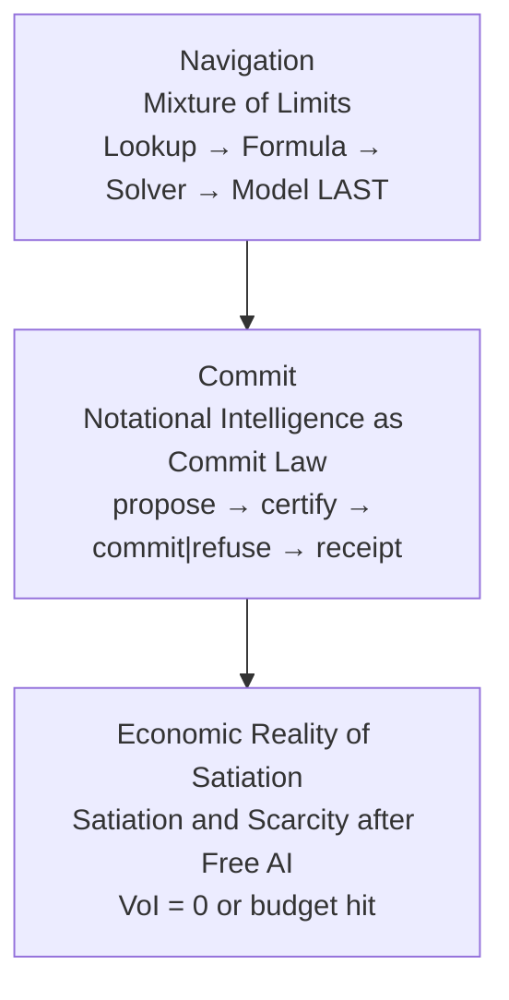

# Mixture of Limits: Navigation Law for Computer Intelligence

## Abstract

Mixture of Limits is a navigation law for computer intelligence: there exist **floors** past which additional tokens, parameters, or joules do not purchase verifiable progress on a task coordinate. The law is information-theoretic and rooted in physics. Across human scientific history, compression into predictive formulas and invariants has repeatedly beaten excess enumeration of observations: from Kepler's laws over Tycho's tables, through Newton's closed forms, to Shannon's bit accounting and Landauer's thermodynamic floor on irreversible erasure. Mixture of Limits operationalizes that lineage for machines: **Lookup → Formula → Solver/settle → Model LAST**, with close owned as propose → certify → commit|refuse → receipt. Unstructured front doors (speech, pixels, free text) need a **dual-phase** stack: Phase 1 is a bounded ultra-light quantized transducer that emits a typed AST or schema; Phase 2 is the Mixture of Limits cascade. Perception is a front gear, not a demotion of Model LAST for residual reasoning.

The industry default escalates Mixture-of-Experts (MoE) capacity *inside* a generative corridor. Mixture of Limits instead names floors *outside* generation: Value of Information (VoI), grammar coverage, Landauer/joule estimate, certificate, and settle-refuse. The industry race is a **race to those plateau floors**, not unbounded scale: once VoI is zero past the floor, optimize energy/compute on the plateau. Mixture of Limits demotes the neural net to a residual leaf. Soft-ref `mol prove` is constructive existence in software. Catalog and Landauer figures on receipts are **estimates**; package `measured_j` appears only when a labeled meter returns a reading.

### Terms used here

**Soft-ref** has one meaning in this paper: the software reference path that proves the navigation law without board synthesis or package metering. Receipts on that path label energy as estimate and leave `measured_j` unset until a named meter returns. Soft-ref is not a second, looser evidence class for live silicon. Periodic Stack, replay class, value of information, evidence classes, and `board_synth_claimed` are defined on the shared [glossary](/glossary/).

**Model leaf (one sentence).** The model gear is a conditionally available residual: off by default (`allow_model=false`), opened only when cheaper gears miss, and never coercible to Deterministic (`ModelGenerated` cannot be rewritten as `Deterministic`).

**Living figures for claims on this page.** Cascade: [/living/mol/#mol-diag-01](/living/mol/#mol-diag-01). Named floors: [/living/mol/#mol-diag-02](/living/mol/#mol-diag-02). Commit or refuse then receipt: [/living/mol/#mol-diag-03](/living/mol/#mol-diag-03). MoE contrast: [/living/mol/#mol-tab-01](/living/mol/#mol-tab-01).

### The law before the survey

Lookup → Formula → Solver → Model last. Floors stop escalation when more bits stop buying outcomes: VoI, grammar, energy estimate, certificate, settle-refuse. Close is propose → certify → commit|refuse → receipt. Section 8 is a survey of plateau options under that law. It is not the law.

Each class of embodiment reaches a limit. A decision model stops at a typed probability. A bounded ask stops at a typed value or at not-sure. A statechart stops at a legal transition. An energy-based settle stops at a low-energy configuration. A visual editor stops at the chart a person can audit. None of them is the whole intelligence. The convergence is hybrid interplay: the chart is the door, the decision model may fill a proposal, the energy settle may score a configuration, and something outside the model still commits or refuses. Mixture of Limits is the navigation law of that interplay. Refuse is success. Energy to run is the only true metric. All other factors collapse to zero. §8.5.1 places the public instances under that law. It does not replace the law.

---

## 1. Introduction: pursuit of limits toward AGI

The dominant construction for computer intelligence (CI) treats the neural net as the substrate and excess tokens as the growth variable. That construction diverges from the historical method that produced reliable science. When Brahe enumerated planetary positions, the tables were necessary but not the law. Kepler compressed years of positions into three predictive relations. Newton further compressed those relations into invariants and closed forms that travel across domains. The same pattern recurs wherever a grammar of nature is covered: a short formula outruns an infinite ledger of cases.

Information theory names the modern accounting of that pattern. Shannon (1948) prices bits under uncertainty as settled law. Value of Information (VoI) prices whether another observation is worth its cost for a decision. Landauer (1961) prices irreversible bit erasure in joules at temperature T: $E_{\min} = k_B T \ln 2$ per bit erased in the ideal model. That Landauer quantity is a thermodynamic lower bound and, on Mixture of Limits receipts, a **labeled estimate**—not a wattmeter reading. Together they imply floors: past a point, more bits stop buying outcomes that matter for a stated benefit.

**Thesis.** Pursuit of limits is the path toward AGI-grade reliability. Excess-token and MoE scaling diverge from true VoI for a given benefit. Mixture of Limits is the executable navigation law that binds those floors (VoI, grammar, Landauer/joules as estimate, certificate, settle-refuse) against industry Mixture-of-Experts. **The industry race is a race to the plateau floors, not unbounded scale:** once VoI is zero past a named floor, more parameters and tokens buy nothing verifiable on that coordinate—only energy/compute optimization on the plateau remains. **Addendum:** Shannon, Landauer, Kolmogorov/Solomonoff/Chaitin, Howard (VoI), and formula-first science AI already state these floors as settled theory. The remaining bottleneck is **applied mathematics embodied in materials and physical hardware**. **Frontier addendum (§8.4-§8.14): SOTA at the plateau.** Once the floor is known and Value of Information is zero past it, the only remaining work is optimize energy and compute on that plateau: cheapest-sufficient Lookup → Formula → Solver → Model LAST. Deeper latents, energy-based hybrids, world models, test-time compute, super learning, SSM hybrids, mixture of experts, transmission / gearing / cascade / memory-context / test-time methods, and the cross-field plateau moves in §8.14 are **implementation options for plateau spend**—not a narrative race among generators. They do not cancel VoI, grammar, energy, or certify floors. Mixture of Limits remains the navigation law. §8.5.1 is a separate claim, not another plateau option: each embodiment class stops at its own object, and the convergence is hybrid interplay under this law. Dual-phase perception (§11.1) bounds the unstructured front door without retiring Model LAST for residual reasoning. The hardware-economics reading (§8.12) states that computers are hardware, software is applied engineering under constraints, and plateau spend still binds to floors on real devices. §8.13 organizes verified public reports by technique—transmission, gearing/MoE routing, cascade, memory/context, and test-time—as sources for plateau options. §8.14 races major AI/ML fields to the floor that binds each.

This paper's contribution is the study prose for that law as published on research.openie.dev, grounded in the clean-room `mixture-of-limits` software reference (Apache-2.0 OR MIT). Companion studies already on this site supply the commit-record interface ([Notational Intelligence as Commit Law](/papers/ni/)) and the economic stop after free digital inference ([Satiation and Scarcity after Free AI](/papers/satiation/)). Mixture of Limits is the navigation law those companions sit under: NI owns irreversible commit shape; Satiation owns Economic Reality of Satiation; Mixture of Limits owns *which gear closes* and *when refuse is success*.

Three measurement facts constrain every later number. First, joules from catalog surrogates and OpCounter-style analytics are **estimates**, not board power. Second, Landauer annotations are **estimates**, distinct from RAPL/NVML/`measured_j`. Third, `board_synth_claimed=false`; package `measured_j` is set only when a Metered probe returns a reading.

### Companion laws

Three studies on this catalog form one stack: **Navigation**, **Commit**, and **Economic Reality of Satiation**. They compose. They do not collapse into one paper. A fourth study, [Metabolic Intelligence](/papers/mei/), owns the energy-budget envelope and actuators that make those floors bind at tag and campus scale.

| Role | Study | Owns |
|---|---|---|
| **Navigation** | [Mixture of Limits](https://research.openie.dev/papers/mol/) | Which gear closes: Lookup → Formula → Solver → Model LAST. Floors include Value of Information (VoI), grammar coverage, energy estimate, Energy-First Architecture (EFA) / certificate refuse, and settle-refuse. |
| **Commit** | [Notational Intelligence as Commit Law](https://research.openie.dev/papers/ni/) | Irreversible close shape: propose → certify → commit\|refuse → receipt. Notational Intelligence owns the commit record. Analytical joules here are estimates; package `measured_j` only when Metered. |
| **Economic Reality of Satiation** | [Satiation and Scarcity after Free AI](https://research.openie.dev/papers/satiation/) | Stop when VoI is zero on a stated completeness predicate, or when budget / policy refuse fires. Free at the margin for digital inference is not free joules and not free actuation. |
| **Energy budget / metabolic embodiment** | [Metabolic Intelligence](https://research.openie.dev/papers/mei/) | Budget envelope and actuators: digital enzymes, $J(m \mid q)$ obtain-router, OpenADR/MQTT campus service. Soft-ref path: `board_synth_claimed=false`. |
| **Automation path** | [Spell Check is Global](https://research.openie.dev/papers/spellcheck/) | Existence proof: computer intelligence that became ordinary because it was cheap, local, and paired to hardware people already have. Access framing, not a census: the many (7B+), not the few who rent frontier datacenters (<500M). |

```
┌──────────────────────────────────────────────────────────┐
│  Navigation — Mixture of Limits                          │
│  Lookup → Formula → Solver → Model LAST                  │
│  floors: voi | grammar | energy | efa_certificate |      │
│          settle_refuse                                   │
└────────────────────────────┬─────────────────────────────┘
                             ▼
┌──────────────────────────────────────────────────────────┐
│  Commit — Notational Intelligence as Commit Law          │
│  propose → certify → commit|refuse → receipt             │
└────────────────────────────┬─────────────────────────────┘
                             ▼
┌──────────────────────────────────────────────────────────┐
│  Economic Reality of Satiation — Satiation and Scarcity after Free AI    │
│  VoI = 0 on completeness C(z), or budget / policy hit    │
└──────────────────────────────────────────────────────────┘
```



Mixture of Limits owns *which gear closes* and *when refuse is success*. Notational Intelligence owns the irreversible commit shape. Satiation owns Economic Reality of Satiation. [Spell Check is Global](/papers/spellcheck/) is the existence proof of the path: the nonword gear is Lookup, then a short edit, on hardware that is available, accessible, and capable. Soft-ref path: `board_synth_claimed=false`; estimates ≠ `measured_j`. Energy to run is the only true metric of computer intelligence: token price, parameter count, moat rent, and access fees collapse to zero by commoditization, and what remains is joules. Estimates are not `measured_j`.

### OpenIE map (no prior literacy assumed)

This study lives inside the OpenIE family of sites. Readers do not need those sites memorized; the map below states what each surface is and where Mixture of Limits sits.

| Surface | URL | What it is | Relation to Mixture of Limits |
|---|---|---|---|
| **Research** (this hub) | [research.openie.dev](https://research.openie.dev) | Readable studies, PDFs, and living figures. This paper is `/papers/mol/`; companions are Notational Intelligence (`/papers/ni/`), Satiation (`/papers/satiation/`), Metabolic Intelligence (`/papers/mei/`), and Spell Check is Global (`/papers/spellcheck/`). | Publishes the navigation-law study prose and soft-ref measurement bounds. |
| **Stack** | [stack.openie.dev](https://stack.openie.dev) | Teaching map of the family: information theory, game theory, and mechanism design as one substrate; directory of the eight periodic stacks. | Orientation layer. Mixture of Limits is not "another stack card"; it is the **navigation law** that chooses cheapest-sufficient close across stack coordinates. |
| **Compute** | [compute.openie.dev](https://compute.openie.dev) | Periodic Stack of Computation: **258 primitives / 33 families**, thermodynamic floor every sibling inherits. | The primitive table Mixture of Limits **navigates**. Soft-ref proves the full live catalog (**258 Present / 258 live** Lookup/Formula/Solver/Navigate gears) plus honest HW Gap cells; HW Gaps soft-ref sims ×8 (`physical_settle`…`photonic_mzi`) + Ferric/Stage C inventories are in proof with Gap cells retained. μ calib + silicon meters remain outside soft-ref proof. Empty HW cells → `primitive_gap`. estimates≠measured_j; `stage_c_measured=false` until meters. |
| **Knowledge** | [knowledge.openie.dev](https://knowledge.openie.dev) | Working definition of a claim as seven axes ⟨valid time, transaction time, reference time, granularity, scope, certainty, provenance⟩. | Typed claims and cite/compose leaves (Z2 cite / Z1 compose in soft-ref) bind to this object shape. Mixture of Limits does not redefine knowledge; it refuses escalation when grammar and VoI say the claim coordinate is already covered. |
| **Synthesis** | [synthesis.openie.dev](https://synthesis.openie.dev) | Periodic Stack of Digital Information Synthesis: AI as software; zones Z₁/Z₂/Z₃; cost surface $E(x) = \sum \theta(p)\cdot\mu(p,H)$. | Plateau spend and cascade order rhyme with synthesis zones (closed-form → constrained → unbounded). Mixture of Limits owns **floors outside generation**—VoI, grammar, energy estimate, certify, settle-refuse—so Z₃-style generation stays Model LAST. |
| **Verify** | [proof.openie.dev](https://proof.openie.dev) | Periodic Stack of Verification: cheapest-sufficient solver under $E(x) \ge \theta(D)\cdot\mu(S,V)$. | Cousin energy law. Mixture of Limits uses the same spine form for path energy; Verify maps verified artifacts; Mixture of Limits maps which gear closes before commit. |
| **Product** | [klere.ai](https://klere.ai) | **Klere** — OpenIE product home. [Metabolic Intelligence](/papers/mei/) is designed for Klere (research owns the law/class; Klere owns product embodiment). Public site is thin access / energy-efficient AI framing (Oct 2026)—not a shipped feature catalog. | MEI envelope and Mixture of Limits navigation feed Klere's product embodiment. Soft-ref DX remains `mol.yaml` / `mol run` until Klere packaging ships. |

**One paragraph.** Stack teaches the family map. Compute names the permitted-act primitives. Knowledge defines the claim object those primitives carry. Synthesis places digital information synthesis on a cost surface and zone grammar. Verify prices verified artifacts under a related energy inequality. Research hosts the studies. Klere ([klere.ai](https://klere.ai)) is the product home (MEI designed for Klere; thin public site—no invented features). **Mixture of Limits is the navigation law across that family:** Lookup → Formula → Solver → Model LAST, with named floors that stop escalation when more bits stop buying outcomes. It is not a rebrand of Mixture-of-Experts, not a substitute for the Periodic Stack pages, and not a claim that soft-ref software measures board package joules.

Other names this paper uses without treating them as assumed literacy: **MathGround** denotes the OpenIE cascade / replay-class discipline that enforces Lookup → Formula → Solver → Model LAST; **WCA** denotes capability / certify refuse adapters (live MCP path remains soft-ref roadmap); **leapfrog / `openie-path`** denotes ask-bridge adapters (stubs on the proven path). Living companions for this study: [/living/mol/](/living/mol/). FPGA commit figures for NI: [/living/fpga-sim/](/living/fpga-sim/).

Scope. Companion laws (Navigation / Commit / Economic Reality of Satiation) and the OpenIE map above name the catalog triad and stack / compute / knowledge / synthesis / verify / research before any later allusion. Section 2 states the law and Periodic Stack navigation. Section 3 states the proof spine $E(x) \ge \theta(D)\cdot\mu(S,V)$. Section 4 describes the cascade and close/receipt bind. Section 5 bridges to Satiation without rewriting it. Section 6 maps prove↔claim. Section 7 sketches VoI, grammar, and settle-refuse mathematics. Section 8 places related work as a verified citation chain (historical→recent proof points) plus Tier A formula/mechanism systems, then teaches latent space, Logical Intelligence (energy-based model / large language model / latent hybrid), the hybrid-interplay convergence of embodiment-class limits (§8.5.1), World Labs (spatial world models), and **SOTA at the plateau** (§8.7): once VoI is zero past the floor, plateau spend is the only work—test-time compute, super learning, live SOTA methods (SSMs, MoE, RAG, speculative decode, …), SSM hybrids / MoE / implementation efficiency (including Jamba-class, DeepSeek, GLM as options), hardware economics (including edge / neuromorphic soft-ref), plateau techniques for transmission / gearing / cascade / memory-context / test-time (§8.13), industry gap levers (Mixture-of-Depths, AWQ/GPTQ/FP8, vLLM/SGLang; §8.10.1), and the cross-field **race to plateau floors** table (§8.14: RLHF, diffusion, GNNs, multimodal, federated/continual, pruning/KD/NAS, Bayesian/conformal/causal/active, GraphRAG, agent memory, structured generation, CUDA Graphs). Section 9 contrasts Mixture of Limits with Mixture-of-Experts and situates model-to-model field systems. Section 10 opens toward AGI via limits. Section 11 states engineering gaps to close—dual-phase front-door perception, O(1) meta-routing, Primitive Distillation for open grammars, Tier 0/1/2 measurement realism, and a declarative DX roadmap—as plateau work under the same floors, not apologies.

---

## 2. Law: floors where more bits stop buying outcomes

**Mixture of Limits** asserts: for a task coordinate, there exist floors such that additional tokens, parameters, or joules do not purchase verifiable progress. Intelligence is therefore a **navigation law** over a structured stack of primitives; not an invitation to dump residual capacity into a generative corridor.

Consequences:

1. **Mathematical compression / formulas beat excess tokens** when the grammar is covered.
2. **Neural nets are a conditionally available residual leaf** (off by default; never coercible to Deterministic), not the default substrate of CI.
3. Routing is **cheapest-sufficient**: escalate only on miss; refuse when escalation is unsafe or VoI-negative.
4. Proof / energy law: $E(x) \ge \theta(D)\cdot\mu(S,V)$ with labeled joule receipts; Landauer labeled as estimate.
5. **Available devices / multi-fabric**: after a cascade gear closes, pick the cheapest sufficient device class; not one accelerator by default.

### Named floors

| Limit id | Kind | Meaning |
|---|---|---|
| `voi` | ValueOfInformation | Marginal bits worthless under budget. **stop** |
| `grammar` | GrammarCoverage | Covered by Lookup/Formula/Solver; or refuse unknown |
| `energy` | Energy | Joule budget floor; Landauer-aware **estimates** |
| `efa_certificate` | Certificate | Diverge / fail certify → refuse before commit |
| `settle_refuse` | SettleRefuse | Ternary / energy-landscape settle will not settle → refuse |
| `primitive_gap` | PrimitiveGap | Missing Periodic Stack primitive; surface the gap |
| `safety` / `wca_refuse` | Safety / WCA | Capability deny; WCA certify refuse |
| `information` / `latency` | Information / Latency | Sufficiency and soft wall-clock ceilings |

### Neural net demotion

The model gear is a conditionally available residual: off by default (`allow_model=false`), opened only when cheaper gears miss, and never coercible to Deterministic (`ModelGenerated` cannot be rewritten as `Deterministic`). It may propose residual content; it never bypasses certify-before-commit. Coin-cell / edge power is O(1) formula plus LUT refuse, not a tiny transformer.

### Periodic Stack

Mixture of Limits navigates the OpenIE **Periodic Stack of Computation** at [compute.openie.dev](https://compute.openie.dev) (**258 primitives / 33 families**). Sibling maps: [stack.openie.dev](https://stack.openie.dev) (family directory), [knowledge.openie.dev](https://knowledge.openie.dev) (seven-axis claim), [synthesis.openie.dev](https://synthesis.openie.dev) (synthesis zones / cost surface). The soft-ref proves an in-tree **live catalog** navigator with 258 Present cells (all live Lookup/Formula/Solver/Navigate) + honest Gap markers and scale notes citing 258/33. HW Gaps soft-ref sims ×8 + Ferric/Stage C inventories are in soft-ref proof (Gap cells retained; `stage_c_measured=false`). μ calibration corpora and silicon meters remain outside soft-ref proof scope. Empty cells surface as `primitive_gap`.

### Mixture of Limits is not MoE

| MoE (generative corridor) | Mixture of Limits (navigation law) |
|---|---|
| Experts live *inside* a model; gate selects parameters | Limits live *outside* generation; floors stop escalation |
| More experts → more capacity for the same generative act | More named floors → sharper refuse / cheaper close |
| Success = next-token likelihood | Success = closed grammar + certified commit + joule receipt |
| Model is the substrate | Model is a **demoted residual leaf** |

Clean-room policy: Mixture of Limits is law + runtime, not a wrapper on MoE, and not a path-dependent fork of sibling OpenIE trees for the proven path.

---

## 3. Proof spine: E(x) ≥ θ(D)·μ(S,V)

The energy / impedance law used throughout Mixture of Limits is:

$$
E(x) \ge \theta(D)\cdot\mu(S,V)
$$

where $E(x)$ is path energy for closing act x, $\theta(D)$ scales with decision / difficulty structure D, and $\mu(S,V)$ is an impedance factor for stack coordinate S and view V. Soft-ref receipts stamp catalog μ with `mu_source=catalog` and a `landauer_floor_ratio`. The product is an **analytical / catalog estimate**, not a package joule reading.

**Landauer (estimate only).** For irreversible erasure of n bits at temperature T,

$$
E_{\mathrm{Landauer}}(n,T) = n k_B T \ln 2
$$

Receipts may annotate `landauer_floor_J` from this formula. That annotation is **estimate ≠ measured**. Soft-ref closes keep `measured_j=None`. Optional OS meter features (RAPL / IOReport / powermetrics), when present and successful, may populate `measured_j` only under a labeled `MeasureSource`; failure or VM stays `unavailable`. Soft-ref prove criteria do not require those meters.

**Historical rhyme.** Kepler did not need every future observation once the three laws closed the grammar of planetary motion for the epoch. Newton did not need a larger ephemeris table to predict a new orbit once F=ma and inverse-square gravitation covered the coordinate. Shannon did not need infinite samples to bound channel capacity. Landauer did not need a particular chip to state a thermodynamic lower bound. Mixture of Limits spine is the same move for CI: bind a floor, close cheapest-sufficient, refuse when the floor says stop.

**Constructive existence (software).** Soft-ref `cargo run -p mol-cli -- prove` prints VERIFIED per criterion and exits 0 (~29 soft-ref criteria spanning deterministic close, formula/lookup without model, VoI refuse, settle commit+refuse, certificate refuse, capability default-deny, receipt labels, replay-class coercion deny, Periodic Stack subset navigation, μ catalog, transcript replay, Z2 cite / Z1 compose, agent mailbox, bitemporal memory, fabric routing, desktop headless shell, OS meter labels, WASM capsule, Agent Lane, multi-fabric receipts, ecosystem e2e certify; see PLAN.md in the Mixture of Limits workspace). That is constructive existence **in software**—a runtime fact, not a board energy measurement. Prove↔claim mapping is Leapfrog-owned (§6).

---

## 4. Cascade and close: Lookup → Formula → Solver → Model LAST

MathGround / OpenIE cascade order (type-enforced replay classes; synthesis zones and compute primitives on [synthesis.openie.dev](https://synthesis.openie.dev) and [compute.openie.dev](https://compute.openie.dev)):

```text
Lookup → Formula (closed-form) → Solver / settle → Model LAST
```

| Mixture of Limits tier | Role | Replay class (typical) |
|---|---|---|
| Lookup | LUT / allow-table / registry hit | `Deterministic` |
| Formula | Closed identity / unit convert / law instance | `Deterministic` |
| Solver | Sparse solve / ternary settle | `Deterministic` or compose under Solver |
| Model | Stochastic residual only | `ModelGenerated` |

**Invariant:** `ModelGenerated` ↛ `Deterministic`. Typed answers refuse coercion.

Automation / close loop:

```text
sense → classify grammar → cheapest sufficient → certify → commit|refuse → receipt
```

Mixture of Limits **owns close**. Refuse over escalate when unsafe or VoI-negative. Refuse is a **lawful success** and still emits a receipt.

### co/0 bind sketch (namespaces)

Soft-ref receipt labels bind act namespaces in the spirit of OpenIE co/0 receipts (sketch, not a live leapfrog path-dep):

| Namespace | Role |
|---|---|
| `claim.*` | Seeded / retrieved knowledge claims (Z2); unknown → refuse, no invent |
| `act.*` | Capability-gated acts; Mutate/External default-deny |
| `close.*` | Route + certify gate; commit or refuse |
| `receipt.*` | `estimated_j` labeled; `measured_j` only if Metered probe returned; `board_synth_claimed=false` |

Rules stamped on every soft-ref close:

1. **Certify-before-commit**; no irreversible side effect without certificate pass.
2. **`ModelGenerated` ↛ `Deterministic`**; sealed replay markers.
3. **`measured_j` only if Metered**; otherwise `None` / unavailable.
4. **Refuse = lawful success + receipt**. VoI / settle_refuse / certificate / capability denies still close the ledger.

Multi-fabric soft-ref: after tier selection, route cheapest sufficient `DeviceKind` (Cpu always present; Gpu*/Wasm/ThermoSettle/… optional). Detection ≠ joules.

---

## 5. Econ bridge: Satiation

Digital inference prices can fall toward free-at-margin without implying free energy, free actuation, or unbounded value after a chore is complete. The companion study **[Satiation and Scarcity after Free AI](/papers/satiation/)** defines satiation as a stop on a written completeness predicate and cites published inference-price series. Mixture of Limits supplies the *machine* stop that matches that economic intuition: VoI and grammar floors refuse excess generation once benefit is covered; commit/refuse receipts (NI) record the irreversible boundary.

Satiation owns Economic Reality of Satiation and its price tables; NI owns the commit record; Mixture of Limits owns navigation floors that make "done" and "unsafe" executable without opening the model leaf.

---

## 6. Prove ↔ claim map

The Mixture of Limits constructive prove is not a leaderboard stunt. It is an **information-theoretic** close law rooted in **physics**: the same historical arc that took astronomy from excess epicycles to Kepler/Newton predictive floors, and that takes computation from Shannon → Landauer → complexity / VoI toward named energy floors. Global academia already holds those proof points; the bottleneck is **applied math × materials (hardware) embodiment**, not awareness of the slogans. This section only maps what `mol prove` actually stamps `VERIFIED` onto paper `claim.*` ids: embodiment of known floors, not invention of new physics.

A claim is **proven** only when the in-tree harness prints `VERIFIED` for the named criterion and exits 0. A claim is **soft-ref only** when PLAN §6 marks it OUT OF PROOF SCOPE, or when the criterion itself stamps soft-ref / fixture / feature-gated behavior rather than live silicon. Proven-path rows keep `measured_j=None` (or Metered only when a probe returns) and `board_synth_claimed=false`.


Measurement labels used below (OpenIE measurement grammar):

| Label | Meaning |
|---|---|
| **Unmetered** | Software-ref / soft-ref path; `measured_j=None`; estimate may be labeled |
| **Estimated** | Catalog / Landauer / fuel / μ surrogate with explicit `EstimateKind` or `mu_source=catalog` |
| **Metered** | Optional live probe (`energy-meter`) returned numbers (not required for prove) |

Default close path for all proven claims: **Unmetered** (+ **Estimated** where μ / Landauer / fuel appear). `board_synth_claimed=false` everywhere in the proven path.

### 6.1 Harness meta

| Prove # | Criterion (PLAN) | Paper claim id | Status | Measurement |
|---|---|---|---|---|
| P0 | `cargo test --workspace` green | `claim.mol.ci_workspace` | Proven (CI / operator; not printed by `mol prove`) | - |
| P1 | `cargo run -p mol-cli -- prove` exits 0 | `claim.mol.prove_harness` | Proven (prints `VERIFIED` per row below) | Unmetered |

### 6.2 Proven claims (P2-P24)

| Prove # | Criterion (PLAN) | Paper claim id | Claim (one sentence) | Soft-ref / scope note | Measurement |
|---|---|---|---|---|---|
| P2 | Deterministic close (double-run) | `claim.mol.deterministic_close` | Same asks yield the same commit/refuse + limit id. | - | Unmetered |
| P3 | Formula/lookup close without model | `claim.mol.formula_lookup_no_model` | Landauer / unit-convert closes COMMIT at Lookup or Formula; model never answered. | - | Unmetered / Estimated (Landauer floor on receipt) |
| P4 | VoI refuse when `!allow_model` | `claim.mol.voi_refuse` | Free-form ask → REFUSE `voi`. | - | Unmetered |
| P5 | Settle commit + settle refuse | `claim.mol.settle_ternary` | Ternary settle → COMMIT; `will not settle` → REFUSE `settle_refuse`. | Software-ref settle stub; no klere-vm / FPGA | Unmetered |
| P6 | Certificate refuse on diverge | `claim.mol.efa_certificate_refuse` | Formula + `diverge` → REFUSE `efa_certificate`. | In-tree EFA-style cert; Ferric / live BMI loop soft-ref | Unmetered |
| P7 | Capability default-deny mutate | `claim.mol.capability_deny_mutate` | `AutomateGate::default().gate(Mutate)` → Refuse. | - | Unmetered |
| P8 | Receipt labels | `claim.mol.receipt_honesty` | Software-ref: `measured_j=None`, `board_synth_claimed=false`, estimate labeled (`EstimateKind`). | Live RAPL/NVML default close OUT OF SCOPE | Unmetered / Estimated |
| P9 | `ModelGenerated` ↛ `Deterministic` | `claim.mol.replay_no_strengthen` | `TypedAnswer::weaken_to` returns `ReplayCoercion`. | - | - |
| P10 | Periodic Stack live catalog navigation | `claim.mol.stack_live_catalog` | Family + present + scale → COMMIT at Lookup; 258 live Lookup/Formula/Solver/Navigate gears; note cites 258/33. | μ calib + silicon HW OUT OF SCOPE; soft-ref Gap sims in proof | Unmetered |
| P11 | `primitive_gap` via registry probe | `claim.mol.primitive_gap` | Gap marker `physical_settle` + absent name → REFUSE `primitive_gap` (not string-only). | - | Unmetered |
| P12 | μ / impedance catalog | `claim.mol.mu_catalog` | Receipts stamp `mu_source=catalog`, `mu`, `landauer_floor_ratio`; `E≈θ·μ` (catalog estimate, not RAPL/`measured_j`). | μ **calib corpus** OUT OF SCOPE | Estimated |
| P13 | Receipt transcript replay | `claim.mol.receipt_replay` | JSONL/in-memory replay reproduces commit/refuse + limit id; model never answered. | - | Unmetered |
| P14 | Z2 retrieve+cite | `claim.mol.z2_retrieve_cite` | Seeded factual hit → COMMIT `RetrievedCited` + citation ids; unknown → REFUSE `claim_unknown` (no invent). | Seed corpus in-tree only | Unmetered |
| P15 | Z1 compose/synthesis | `claim.mol.z1_compose` | ≥2 cited claims → COMMIT `Composed` + `synthesis.composed_from`; missing → REFUSE `compose_missing`; never laundered as Deterministic/RetrievedCited alone. | - | Unmetered |
| P16 | Agent mailbox loop | `claim.mol.agent_mailbox` | Goal/Message/Act → close → commit\|refuse + receipt in transcript; demo hits formula/cite/compose COMMIT and voi/settle_refuse REFUSE; model cold; measurement flags hold. | - | Unmetered |
| P17 | Bitemporal state + memory | `claim.mol.bitemporal_memory` | Writes only on Mixture of Limits close COMMIT; Mutate deny / free-form remember → REFUSE; recall → `RetrievedCited` + `memory:` cite; unknown → `memory_unknown`. | - | Unmetered |
| P18 | Fabric routing + soft-ref inventory | `claim.mol.fabric_soft_ref` | Offline inventory valid (`source=software_ref`, Cpu always); Lookup/Formula→Cpu; Settle→ThermoSettle\|Cpu; Model→Gpu* or REFUSE `fabric_unavailable`; detect ≠ measured joules. | Live wgpu presence optional / not required for prove | Unmetered |
| P19 | Desktop shell headless | `claim.mol.desktop_headless` | `ShellSession` ask/close → receipt view (zone/fabric/limit/estimated_j/`measured_j=None`); joule ledger; VoI refuse; GUI not required. | egui GUI optional | Unmetered / Estimated |
| P20 | OS meter labels | `claim.mol.os_meter_honesty` | Feature off / VM / no permission → `measured_j=None`, empty components, `measure_source=unavailable`; fixtures stamp labeled sources; default close stays unmetered. | Live probe optional (`energy-meter`) | Unmetered (default) / Metered only when probe returns |
| P21 | WASM capsule certify | `claim.mol.wasm_capsule` | `add.wasm` under stub runtime; fuel → estimated_j only; FS/net grant / fuel exceed / host-share → REFUSE; close stamps capsule. | Optional `wasmtime` feature | Unmetered / Estimated (fuel) |
| P22 | Agent Lane session path | `claim.mol.agent_lane` | Lane partitions; `host_invoke` without provenance refuses; keyword confirm insufficient; need `GrantReceipt`; allow stamps `AgentLaneReceipt`. | - | Unmetered |
| P23 | Multi-fabric compute receipt | `claim.mol.fabric_compute_receipt` | Soft-ref inventory; `ComputeFabric` / `ScheduleDecision` / `ComputeStepReceipt` with `fabric_id`; cascade stamps `fabric:route`; CPU Formula COMMIT; Model residual may `fabric_unavailable`; `measured_j=None` on soft-ref path. | Ferric not path-dep'd | Unmetered |
| P23b | Live fabric soft | `claim.mol.fabric_live_soft` | Feature off stays software_ref; mock/live Metal can stamp `gpu_metal`; Formula stays Cpu; missing Gpu* fail-closed; prove does not require a GPU; `measured_j=None` unless Metered. | Soft / optional detect | Unmetered |
| P23c | wgpu / Metal tiny kernel | `claim.mol.kernel_vector_add` | Clean-room WGSL vector-add; soft stub offline (same checksum); Gpu* stamps `kernel:vector_add` + `execution_proof`; optional overlapping meter may stamp package `measured_j` with `energy_honesty=measured` (field name); no rail-sum package joules. | Live Metal optional; fixture OK for prove | Unmetered (default) / Metered only if meter returns |
| P24 | Ecosystem e2e certify (one receipt) | `claim.mol.ecosystem_e2e` | Lane → fabric (Cpu soft-ref) → WASM → energy labels (estimated fuel; optional meter_sample) → host invoke only with `GrantReceipt` → commit\|refuse on **one** receipt; refuse-without-grant → `grant_receipt_required`. | - | Unmetered / Estimated |

### 6.3 Soft-ref only

These are PLAN §6 residuals. Citing them is allowed as roadmap / reference semantics. Treating them as measured results is not.

| Soft-ref item | Why soft-ref | Related prove row (if any) |
|---|---|---|
| Live silicon RAPL / NVML as **default** close | Optional `energy-meter`; soft-ref prove stays `measured_j=None` | P8, P20 |
| Live wgpu adapter presence | Feature `fabric-detect`; inventory soft-ref remains prove default | P18, P23b, P23c |
| Ferric / on-device EFA (BMI hardware loop) | Reference semantics only; not path-dep'd | P6, P18, P23* |
| klere-vm WASM / FPGA meter (real pJ) | Software-ref `StubKlereSettle` | P5 |
| Live `openie-path` / leapfrog ask bridge | Adapter port | - |
| Live WCA MCP / `wca-lut-edge` in-proc certify | Adapter port | - |
| μ calib corpus + silicon HW (physical_settle / reversible / ising / adiabatic / ferric / quantum / analog / photonic Gap cells) | Live catalog (258 Present / 258 live gears) + Gap + tier μ catalog + Stage C/Ferric soft-ref inventories + HW Gaps soft-ref sims ×8 (`stage_c_measured=false`; Gap cells retained) are in proof; silicon meters OUT | P10, P12 |
| Trained weights / candle / tract Model leaf | Model stays demoted stub | P3, P4, P16 |

### 6.4 Seeded knowledge claims (Z2 corpus; not the prove map)

In-tree `ClaimStore` seeds used by P14/P15 (retrieve/compose), distinct from the paper claim ids above:

- `claim:landauer.principle`
- `claim:mol.law`
- `claim:mol.proof_law`
- `claim:mol.cascade`
- `claim:stack.scale`
- `claim:honesty.no_fake_rapl`
- `claim:replay.retrieved_cited`
- `claim:openie.z2`

### 6.5 Measurement scope of the proven map

- Soft-ref prove path: `measured_j=None` (Unmetered); Metered only when a live probe returns.
- `board_synth_claimed=false` on the proven path.
- Soft-ref v0.1 prove is software constructive existence, not board / FPGA watt leadership.
- Soft-ref roadmap items (§6.3) stay roadmap; they are not escalated to proven claims.

---

## 7. Math sketches: VoI stop, grammar coverage, settle-refuse

### 7.1 VoI stop

Let B be a benefit functional for a decision, x the current information state, and c the cost (bits, latency, or estimated joules) of acquiring observation y. A simple stop rule:

$$
\Delta(x,y) = \mathbb{E}[B \mid x,y] - \mathbb{E}[B \mid x] - \lambda\, c(y)
$$

Refuse escalation when $\Delta(x,y) \le 0$ (or $\le \tau$ for a configured threshold). Soft-ref Mixture of Limits encodes this as floor `voi` with `allow_model=false` by default: free-form asks that would only open the model leaf refuse rather than spend. This is the Shannon/decision-theoretic cousin of Kepler stopping new naked-eye points once the law predicts within tolerance. Domain-calibrated Bayesian VoI tables remain a deployment parameter, not a soft-ref prove deliverable. Classical cousins: **anytime algorithms** allocate deliberation under a utility-of-computation schedule (Zilberstein, 1996); the **information bottleneck** prices compressed representations that keep task-relevant bits (Tishby, Pereira, and Bialek, 1999; Tishby and Zaslavsky, 2015, arXiv:1503.02406). Soft-ref Mixture of Limits encodes the stop as named floors rather than importing those libraries as prove deliverables.

### 7.2 Grammar coverage

Let G be the covered grammar (Lookup registry ∪ Formula identities ∪ Solver settle programs). A query q is **covered** if a deterministic derivation $q \vdash_G a$ exists with replay class not `ModelGenerated`. Cascade order tries Lookup, then Formula, then Solver. If covered, **do not open the model**. If uncovered and policy forbids model escalation, refuse (`grammar` / `voi` / `primitive_gap` as applicable). Historical analog: once Newton's grammar covers orbital mechanics for the force law at hand, one does not re-enumerate Brahe's table to answer a new initial-condition query.

### 7.3 Settle-refuse

Under Solver, a ternary / energy-landscape settle either reaches a certified fixed point (commit) or signals will-not-settle (refuse `settle_refuse`). Soft-ref implements this as real in-tree settle logic plus certificate diverge tags (`efa_certificate`). Thermodynamic-settle inspiration is conceptual: soft-ref v0.1 has no annealer drivers and no adiabatic wall joules. Landauer appears as a labeled estimate on receipts.

### 7.4 Bound sketch tying Shannon and Landauer

For n irreversible erasures on a path that closes a decision,

$$
E_{\mathrm{path}} \ge E_{\mathrm{Landauer}}(n,T) = n k_B T \ln 2
$$

and the Mixture of Limits catalog estimate further requires $E_{\mathrm{est}}(x) \ge \theta(D)\cdot\mu(S,V)$. `measured_j` requires a Metered probe. Excess tokens that do not change B fail the VoI test even when joule budgets remain; the information floor binds first.

---

## 8. Related work: proof points, lineage, and Tier A

### 8.0 Academic proof points: top minds already named the floors

Mixture of Limits is an executable navigation law over floors that information theorists, physicists, and decision theorists already stated as settled theory, and that formula-first science AI keeps rediscovering in modern form. Below is a **historical → recent citation chain** with DOIs verified for this draft (or marked TBD). These are global academic proof points that compression, floors, and formulas beat excess enumeration.

**Information, complexity, and physical cost**

| Proof point | Who / when | What they already said | Cite (verified) |
|---|---|---|---|
| Bits under uncertainty | Shannon (1948) | Quantitative communication limits; entropy as missing information | [10.1002/j.1538-7305.1948.tb01338.x](https://doi.org/10.1002/j.1538-7305.1948.tb01338.x) (Part I); Part II [10.1002/j.1538-7305.1948.tb00917.x](https://doi.org/10.1002/j.1538-7305.1948.tb00917.x) |
| Irreversible erasure costs heat | Landauer (1961) | Logical irreversibility ⇒ minimal heat ~kT per irreversible function | [10.1147/rd.53.0183](https://doi.org/10.1147/rd.53.0183) |
| Reversible computing | Bennett (1973) | Computation can be logically reversible; Landauer cost is about erasure, not "computing" per se | [10.1147/rd.176.0525](https://doi.org/10.1147/rd.176.0525) |
| Algorithmic complexity | Kolmogorov (1965/1968) | Quantity of information as shortest program length; compression as definition | Russian original *Probl. Peredachi Inf.* 1(1):3–11 (1965), no DOI; English transl. [10.1080/00207166808803030](https://doi.org/10.1080/00207166808803030); IEEE note [10.1109/TIT.1968.1054210](https://doi.org/10.1109/TIT.1968.1054210) |
| Algorithmic probability / induction | Solomonoff (1964) | Prefer short programs; universal prior over computable regularities | Part I [10.1016/S0019-9958(64)90223-2](https://doi.org/10.1016/S0019-9958(64)90223-2) |
| Algorithmic incompleteness | Chaitin (1977) | Algorithmic information bounds what finitely axiomatized theories can prove | [10.1147/rd.214.0350](https://doi.org/10.1147/rd.214.0350) |
| Probability as extended logic | Jaynes (2003 book; earlier papers) | Maximum-entropy / logic-of-science discipline against ad-hoc excess modeling | [10.1017/CBO9780511790423](https://doi.org/10.1017/CBO9780511790423) |
| Textbook IT + decision links | Cover & Thomas | Canonical Elements of Information Theory (2nd ed.) | Wiley book DOI [10.1002/047174882X](https://doi.org/10.1002/047174882X) |
| Value of Information | Howard (1966) | Shannon bits ≠ decision value; VoI joins probability with economic consequence; stop when information is worthless for the decision | [10.1109/TSSC.1966.300074](https://doi.org/10.1109/TSSC.1966.300074) |
| Physics of computation lectures | Feynman (pub. Hey/Allen eds.) | Physical limits of computing, reversible/thermo themes in lecture form | Anniversary ed. [10.1201/9781003358817](https://doi.org/10.1201/9781003358817); 1996 Addison-Wesley ISBN 0-201-48991-0 |

**Historical mathematical physics (compression beats enumeration).** See §8.1: Brahe→Kepler→Newton is the pre-IT proof that tables yield to laws. Imprint DOIs for critical editions of *Principia* remain **TBD** if a journal version requires them.

**Recent formula / mechanism / certify systems (Tier A inventory)**, from `docs/adjacent-field-hunt.md` and `docs/appendix-mwm-ai-newton.md` (2026-09-30):

| Proof point | Who | Mixture of Limits reading | Cite (verified) |
|---|---|---|---|
| AI Feynman | Udrescu & Tegmark | NN decomposes; closed form is the commit | [10.1126/sciadv.aay2631](https://doi.org/10.1126/sciadv.aay2631) |
| SINDy | Brunton / Proctor / Kutz | Sparse grammar; reject dense residual fits | [10.1073/pnas.1517384113](https://doi.org/10.1073/pnas.1517384113) |
| PySR | Cranmer | Production symbolic regression | arXiv:[2305.01582](https://arxiv.org/abs/2305.01582) (journal DOI TBD if distinct) |
| AI-Newton | Fang et al. | Concept library + general laws across experiments | arXiv:[2504.01538](https://arxiv.org/abs/2504.01538) |
| AlphaGeometry / AlphaProof | DeepMind | Propose → symbolic/Lean certify (hard floor) | Nature [10.1038/s41586-025-09833-y](https://doi.org/10.1038/s41586-025-09833-y) |
| LeanDojo / ReProver | Yang et al. | Retrieval-augmented Lean proving; tool interaction with proof state | arXiv: [2306.15626](https://arxiv.org/abs/2306.15626) |
| Mechanistic World Models | Posner / Lei / Schölkopf | Mechanisms > predictive MoE modules | arXiv:[2607.12474](https://arxiv.org/abs/2607.12474) |
| AutoSINDy hybrid | (hunt 2026 note) | PySR → library → SINDy | arXiv:[2605.09696](https://arxiv.org/abs/2605.09696) |

Raiffa-style decision analysis texts are the pedagogical cousins of Howard's VoI; a specific Raiffa imprint DOI is **TBD**.

### 8.0.1 The gap is embodiment: not awareness

**Claim (addendum).** Applied mathematics × materials science (physical hardware) is the bottleneck, **not** awareness of what should be done.

Evidence for the awareness side is the table above: Shannon priced bits; Howard priced VoI for decisions; Landauer/Bennett priced irreversible erasure; Kolmogorov/Solomonoff/Chaitin priced shortest programs and incompleteness; Feynman taught physical limits of computation; SINDy/PySR/AI Feynman/AI-Newton/AlphaGeometry/MWMs keep showing that formulas, sparsity, verification, and mechanisms beat unbounded enumeration and unguided MoE-style prediction.

What remains hard, and what Mixture of Limits companions (NI commit law; coin-cell Formula+LUT; multi-fabric routing; Metered vs Estimated labels) point at, is **embodying** those floors in real stacks: materials and devices that make Lookup/Formula/Solver cheap, certificates enforceable before irreversible acts, and joule receipts that keep estimates separate from `measured_j`. Soft-ref `mol prove` shows the *law+runtime* exists in software. Materials and device embodiment remain open. Soft-ref path: `board_synth_claimed=false`; package energy only when Metered.

### 8.1 Historical lineage: compression beats enumeration

**Tycho Brahe → Kepler.** Brahe's program was high-fidelity enumeration. Kepler's three laws compressed those tables into predictive relations. Enumeration was necessary input; the law was the compressible object that stopped needing every future observation.

**Kepler → Newton.** Newton folded planetary regularities into invariants and closed forms (F=ma; universal gravitation). Predictive power migrated from case tables to formulas that travel. AI-Newton (Fang et al., arXiv:2504.01538) is a contemporary soft echo: concept libraries and general laws across many noisy mechanics experiments. NN as recommender residual, not substrate.

**Invariants and closed forms.** Symmetry → conservation (Noether tradition), Hamiltonian/Lagrangian reduction, and integrals of motion are the mathematical-physics statement of "formula wins when grammar is covered." The Mixture of Limits Formula gear is that tradition's CI leaf.

**Information theory and physical cost.** Shannon, Howard (VoI), Landauer, Bennett, Kolmogorov/Solomonoff/Chaitin, and Cover & Thomas form the IT/decision/thermodynamic chain in §8.0. Mixture of Limits binds them as named floors and labeled estimates. Soft-ref Landauer stamps are lower-bound estimates, not claims of near-bound silicon operation.

**Notational intelligence.** Lee's notational-intelligence claim is the companion frame for executable predicates; see [Notational Intelligence as Commit Law](/papers/ni/).

### 8.2 Tier A detail: formula / mechanism / executable physics

Inventory dated 2026-09-30 in the Mixture of Limits workspace hunt docs. Capsule readings:

1. **AI Feynman (+ 2.0):** Physics-inspired symbolic regression; NN for symmetries/separability, then recursive formula recovery. Canonical *Formula* gear.
2. **SINDy:** Sparse identification of nonlinear dynamics; explicit grammar + sparsity floor.
3. **PySR:** Evolutionary symbolic regression; distill NNs → closed forms.
4. **AI-Newton:** Concept-driven law discovery across noisy mechanics experiments.
5. **AlphaGeometry / AlphaProof:** LM proposes; verifier is the hard floor (propose → certify → commit|refuse template).
6. **Mechanistic World Models:** Sister philosophy: reusable mechanisms; MoE as wrong module semantics for explanation.

Additional hunt rows (AtomAgents/SciAgents, KeplerAgent/NewtonBench, AI-Descartes, DreamCoder/COMET/NEO, Robot Scientist) sit as hybrid or mechanism-library cousins. Where a DOI was not verified beyond arXiv IDs, cite arXiv and mark journal DOI **TBD**.

**Mixture of Limits reading of Tier A.** Formula/mechanism discovery (A) plus physics-executable leaves (B in the hunt) beat token-escalation workflows (C). MoE-style mixtures are the wrong "Mixture of."

### 8.3 What Mixture of Limits adds

Tier A systems recover or verify formulas. Classical IT already priced bits, VoI, and erasure. Mixture of Limits names the **navigation law** that decides *when* Lookup/Formula/Solver suffice, *when* to refuse, and *how* receipts label estimated vs measured joules, then implements a clean-room soft-ref close loop. Soft-ref constructive existence is software constructive existence under those floors—not a materials breakthrough or a new physics corpus.


### 8.4 Latent space: depth buys compression, not freedom from floors

A **latent space** is a compressed coordinate system for states that matter to a task: continuous vectors (dense embeddings), discrete codes (VQ / codebook indices), or hybrids. Depth in a latent buys what Shannon and Kolmogorov already price: a shorter description of structure that would otherwise be enumerated as raw observations, pixels, tokens, or traces. Autoencoders, VAEs, diffusion latents, and continuous reasoning traces are modern instances of that move. The representation can make Lookup hits cheaper, Formula edits local, and Solver landscapes smoother.

Representation is not law. A deeper latent does not erase the floors Mixture of Limits names:

1. **Value of Information (VoI).** Extra latent dimensions, longer continuous traces, or denser codebooks are more bits under a budget. When marginal latent bits do not change the decision benefit B, VoI says stop. Excess latent enumeration is the same failure mode as excess token enumeration, only in a different alphabet.
2. **Grammar coverage.** If Lookup, Formula, or Solver already covers the coordinate, opening a latent generator is waste. Covered grammar closes before Model. A latent that rediscovers a closed form is still Model residual when a Formula leaf was available.
3. **Energy / Landauer.** Encoding, decoding, denoising, and gradient edits on latents erase and rewrite information. Landauer prices irreversible erasure as a thermodynamic lower bound and appears on receipts as a **labeled estimate**. Catalog or OpCounter estimates for latent paths remain **Estimated** / **Unmetered** on the soft-ref path (`measured_j=None`; `board_synth_claimed=false`).
4. **Certify-before-commit.** A low-energy latent state is a proposal until a certificate, settle, or typed refuse closes the act. Soft-ref close still binds propose → certify → commit|refuse → receipt. Latent score ≠ irreversible commit.

**Teach-first takeaway.** Latent depth is a compression technology and a plateau option when Model is open. Mixture of Limits navigates whether that compression is cheapest-sufficient for the task, or whether refuse is the lawful success. See §8.7 (SOTA at the plateau) and §9: the question is whether a generator should run at all, then how little energy to spend on the plateau.

### 8.5 Logical Intelligence: energy-based reasoning with LLMs and latents

**Logical Intelligence** (logicalintelligence.com) is a company building energy-based reasoning systems for constraint-heavy and mission-critical settings. Public materials (company blog and product pages, January 2026) teach a hybrid stack rather than a single chatbot:

- **Kona** is their core **energy-based model (EBM)** for reasoning (sometimes called an energy-based reasoning model, EBRM). An EBM assigns a scalar **energy** to a candidate state: low energy means more consistent with constraints and objectives; high energy means something is broken. Per their technical blog (Bodnia and Hanin, 21 Jan 2026), Kona is non-autoregressive at the *trace* level, globally scored over partial and complete traces, and reasons in a **continuous latent space** with dense vector tokens so local gradient-style edits can reduce constraint violations without regenerating an entire discrete prefix.
- **Aleph** is their orchestration / agentic layer that coordinates Kona, LLMs, and other tools. Public positioning: LLMs handle natural-language interface and candidate generation; the EBM layer evaluates and repairs under constraints. Aleph is also described as delivering verified / formal-reasoning workflows today (benchmark claims such as PutnamBench appear on their site; treat score numbers as **author-reported** unless independently reproduced here).
- Product framing on the Kona page: Kona is not marketed as a chatbot. Language models express and explore; Kona is positioned to evaluate what is valid or permissible before irreversible action in high-stakes domains (company examples include energy, manufacturing, semiconductor verification, robotics). Kona 1.0 was announced for partner pilots (company and press materials, Jan 2026). Leadership publicly listed includes founder and CEO Eve Bodnia and Yann LeCun as founding chair of a technical research board (company site / press).

**Classical EBM backdrop (settled ML architecture).** Energy-based models treat inference as finding low-energy configurations under a learned energy function. That framing is older than any one product; LeCun and others have long argued that reasoning can be cast as optimization over an energy landscape. Logical Intelligence's public thesis is that discrete, locally scored, autoregressive LLM traces scale poorly for long-horizon constraint satisfaction, and that continuous, globally scored EBM traces address that gap when paired with LLMs for interface.

**Mixture of Limits reading (cascade map, not a product endorsement).**

| Logical Intelligence public piece | Cascade rhyme | Floor that still binds |
|---|---|---|
| Continuous latent trace + energy score | Soft rhyme with **Solver / settle**: optimize / repair under constraints | `settle_refuse`, VoI, energy estimate; low energy ≠ board joules |
| LLM for language / candidates | **Model** residual for expression and proposal | Model LAST; `ModelGenerated` ↛ `Deterministic` |
| Aleph orchestration among tools | Cheapest-sufficient routing among gears | Grammar coverage first; refuse when escalation is VoI-negative or unsafe |
| Constraint / proof-oriented close | Certify-before-commit spirit | Certificate / typed refuse before irreversible act |

Verified here: the public architecture story and the cascade map—energy-based settle can rhyme with Solver; LLM residual stays Model LAST; latents do not erase VoI or Landauer floors. Author-reported latency and Sudoku figures stay field results (not soft-ref `measured_j`). Soft-ref path: `board_synth_claimed=false`. Unverified internal training details, unpublished energy-function forms, and AGI-completion claims remain **TBD** / out of scope.

### 8.5.1 Embodiment classes: the convergence is hybrid interplay

§8.5 already separates the objects inside one public stack. The energy-based settle returns a low-energy configuration. The scalar over a trace, as §8.5 cites, is constraint energy. It is not a measured joule. The language model beside it returns candidates. Neither object is the commit. Close remains propose, then certify, then commit or refuse, then a receipt (§4). The same separation is the limit of each embodiment class. It is not a feature of one name.

A **decision model** stops at a typed probability. The return is a yes or no, a choice, or a score, each with a probability. Whatever route, escalation, or deferral follows is outside that return. The model does not commit. A probability is not an act.

A **bounded ask** stops at a typed value, or at not-sure. The ask writes no text and takes no action. Not-sure is a refuse object, not a generated answer.

A **statechart** stops at a legal transition. An event changes state only when that state allows it. An illegal event does not transition. The object returned is the next legal state, or no transition. A library transition is not an external commit.

A **visual statechart editor** stops at the chart a person can audit. The editor's object is the chart. The chart is the door: what the chart does not allow does not pass. The editor does not commit the act behind the door.

An **energy-based settle**, already placed in §8.5, stops at a low-energy configuration. Constraint energy is not `measured_j`. A low-energy configuration is not an irreversible act.

None of these classes is the whole intelligence. The convergence is hybrid interplay. The chart is the door. The decision model may fill a proposal. The bounded ask may return a typed value or not-sure. The energy settle may score a configuration. Something outside the model still commits or refuses. Mixture of Limits is the navigation law of that interplay: Lookup → Formula → Solver → Model last. Refuse is success. Energy to run is the only true metric. All other factors collapse to zero. Constraint energy remains a score on a configuration. It is not that metric.

A shared request shape is not shared authority. Two typed answers still do not commit. These stops are not plateau knobs inside one generator (§8.7). Stacking classes does not produce a commit. Soft-ref path: `board_synth_claimed=false`. Nothing in the class map is a measurement of this study.

### Class map

The class map places each public instance under the object that instance returns. Rows are ordered by class. A project that returns two objects appears twice, once for each object. The map is not a ranking.

| Class | Object returned | Instance |
|---|---|---|
| Decision model | Typed probability | [Jev](https://typesafe.ai/blog/introducing-system-one-models-and-jev) |
| Decision model | Typed probability | [Clef](https://huggingface.co/Cloudflare/clef) |
| Decision model | Typed probability | [d1](https://docs.liquid.ai/lfm/models/decision-models) |
| Decision model | Typed probability | [Solar Decide](https://console.upstage.ai/api/systemone) |
| Decision model | Typed probability | [pplx-decider](https://huggingface.co/perplexity-ai/pplx-decider-v1-27b) |
| Decision model | Typed probability | [Kev](https://huggingface.co/jaredpalmer/kev-4b) |
| Decision model | Typed probability | [Laya](https://huggingface.co/convaiinnovations/laya) |
| Decision model | Typed probability | [Bespoke Nimble](https://huggingface.co/bespokelabs/Bespoke-Nimble-9B) |
| Decision model | Typed probability | [OpenThai-SystemOne](https://huggingface.co/iapp/OpenThai-SystemOne) |
| Decision model | Typed probability | [Decider](https://huggingface.co/Mapika/decider-4b) |
| Decision model | Typed probability | [OpenJev](https://huggingface.co/openjev/openjev) |
| Decision model | Typed probability | [Mica](https://huggingface.co/sky7350/Mica-v0.1-4B) |
| Decision model | Typed probability | [Winnow](https://huggingface.co/EldanRing/Winnow-12B) |
| Decision model | Typed probability | [CLM](https://huggingface.co/Contrastive-LM/CLM-v0.1-8B) |
| Decision model | Typed probability | [Julia](https://huggingface.co/SupersonicLabs/Julia-1) |
| Decision model | Typed probability | [NanoJev](https://huggingface.co/C-Tianyu/NanoJev) |
| Decision model | Typed probability | [open-jev DeBERTa](https://huggingface.co/com-kotobalabs/open-jev-deberta-v3-large) |
| Decision model | Typed probability | [fastText](https://fasttext.cc/docs/en/supervised-tutorial.html) |
| Decision model | Typed probability | [Cloud Natural Language](https://docs.cloud.google.com/natural-language/docs/classifying-text) |
| Bounded ask | Typed value, or not-sure | [ThinkThen](https://thinkthen.dev/reference/answers/) |
| Bounded ask | Typed value, or not-sure | [GLiNER2.5-Decide](https://huggingface.co/fastino/GLiNER2.5-Decide) |
| Statechart | Legal transition | [XState](https://github.com/statelyai/xstate) |
| Statechart | Legal transition | [Qt State Machine](https://doc.qt.io/qt-6/qtstatemachine-index.html) |
| Statechart | Legal transition | [Qt SCXML](https://doc.qt.io/qt-6/qtscxml-overview.html) |
| Statechart | Legal transition | [Boost.Statechart](https://www.boost.org/doc/libs/latest/libs/statechart/doc/index.html) |
| Statechart | Legal transition | [Boost.MSM](https://www.boost.org/doc/libs/1_86_0/libs/msm/doc/HTML/index.html) |
| Statechart | Legal transition | [Boost.SML](https://github.com/boost-ext/sml) |
| Statechart | Legal transition | [Akka FSM](https://doc.akka.io/libraries/akka-core/current/fsm.html) |
| Statechart | Legal transition | [Spring Statemachine](https://github.com/spring-attic/spring-statemachine) |
| Statechart | Legal transition | [Apache Commons SCXML](https://commons.apache.org/proper/commons-scxml/index.html) |
| Statechart | Legal transition | [transitions](https://github.com/pytransitions/transitions) |
| Statechart | Legal transition | [Sismic](https://sismic.readthedocs.io/en/latest/) |
| Statechart | Legal transition | [Stateless](https://github.com/dotnet-state-machine/stateless) |
| Statechart | Legal transition | [QP/C](https://www.state-machine.com/qpc/) |
| Statechart | Legal transition | [AASM](https://github.com/aasm/aasm) |
| Statechart | Legal transition | [SCION](https://github.com/jbeard4/SCION) |
| Statechart | Legal transition | [javascript-state-machine](https://github.com/jakesgordon/javascript-state-machine) |
| Statechart | Legal transition | [state_machines](https://github.com/state-machines/state_machines) |
| Statechart | Legal transition | [HFSM2](https://github.com/andrew-gresyk/HFSM2) |
| Statechart | Legal transition | [uSCXML](https://github.com/tklab-tud/uscxml) |
| Visual statechart editor | Auditable chart | [Stately](https://stately.ai/) |
| Visual statechart editor | Auditable chart | [itemis CREATE](https://www.itemis.com/en/products/itemis-create/) |
| Visual statechart editor | Auditable chart | [QM](https://www.state-machine.com/products/qm) |
| Visual statechart editor | Auditable chart | [Engineering Rhapsody](https://www.ibm.com/products/engineering-rhapsody) |
| Visual statechart editor | Auditable chart | [Enterprise Architect](https://sparxsystems.com/resources/tutorials/uml2/state-diagram.html) |
| Visual statechart editor | Auditable chart | [Papyrus](https://eclipse.dev/papyrus/) |
| Visual statechart editor | Auditable chart | [StarUML](https://staruml.io/) |
| Visual statechart editor | Auditable chart | [Visual Paradigm](https://www.visual-paradigm.com/guide/uml-unified-modeling-language/what-is-state-machine-diagram/) |
| Visual statechart editor | Auditable chart | [IAR Visual State](https://www.iar.com/embedded-development-tools) |
| Visual statechart editor | Auditable chart | [sketch.systems](https://sketch.systems/) |
| Visual statechart editor | Auditable chart | [Qt Creator](https://doc.qt.io/qtcreator/creator-scxml.html) |
| Energy-based settle | Low-energy configuration | [Kona](https://logicalintelligence.com/blog/energy-based-models-for-reasoning) |
| Energy-based settle | Low-energy configuration | [Simulated Bifurcation Machine](https://www.global.toshiba/ww/products-solutions/ai-iot/sbm/intro.html) |
| Energy-based settle | Low-energy configuration | [Fixstars Amplify AE](https://amplify.fixstars.com/en/engine) |
| Energy-based settle | Low-energy configuration | [CMOS annealing](https://www.hitachi.com/en/press/articles/2024/06/0606/) |

### 8.6 World Labs: spatial intelligence and world models

**World Labs** (worldlabs.ai) is a frontier research and product company focused on **spatial intelligence**: models that perceive, generate, reason about, and interact with virtual and physical worlds across space and time. Co-founders publicly include Fei-Fei Li, Justin Johnson, Ben Mildenhall, and Christoph Lassner (company About page).

**Teach the products and architecture first (public sources).**

- **Marble** is their first product: generative 3D world models that create spatially coherent, persistent 3D worlds from images, video, text, and 3D layouts (company About).
- **Atlas** (company blog, 1 Sep 2026) is described as an omni **world model** pretrained to operate on text, images, video, and 3D. Architecture: a **multimodal autoregressive diffusion transformer**. Inputs are grounded in 3D to form a shared **spatial context**; the model generates what comes next while aiming for 3D consistency with what it has seen, and imagining what lies beyond. Public capability claims include camera-controlled video generation, sparse-view spatial reconstruction (including explicit 3D such as point clouds / Gaussian splats), space-time simulation for Real-to-Sim robotics workflows, and image / 360 generation. Atlas is positioned to power future Marble versions and is in early access with select partners. Author-reported benchmarks on camera-conditioned generation and 3D reconstruction appear on the Atlas post; cite the architecture and task list here, not those numbers as OpenIE measurements.

Fei-Fei's public spatial-intelligence framing (including the "from words to worlds" thesis) states that world models must handle semantic, physical, geometric, and dynamic complexity beyond today's LLM text corridor. That is a generator-class ambition: better world generators and simulators.

**Mixture of Limits reading: even projected-superior world models hit floors.**

1. **Grammar coverage.** Faithful reconstruction from enough views is not the same as a closed predictive law for a task. When a Formula or Lookup already answers the coordinate, generating a world is excess. Imagination that fills unseen regions is generative residual, not Deterministic commit.
2. **Certify-before-commit.** A spatially consistent video or splat is a proposal about geometry and appearance. Irreversible acts (robot motion, financial or safety-critical side effects) still require certify → commit|refuse → receipt. Soft-ref ReplayClass typing still applies: generative world output does not launder into Deterministic without a certificate path.
3. **VoI and energy.** Longer videos, denser 3D contexts, more denoising steps, and Real-to-Sim rollouts spend bits and joules. VoI stops when extra world detail does not change the decision benefit. Landauer bounds irreversible erasure as a labeled estimate; Atlas / Marble training or inference joules are field / author-reported, not soft-ref `measured_j`. Soft-ref path: `board_synth_claimed=false`.
4. **Materials embodiment.** High-fidelity world models intensify the applied-math × materials bottleneck: sensors, fabrics, and meters that make cheapest-sufficient close real at the edge, without laundering estimates as board watts.

World Labs systems optimize **which world generator / simulator runs** and how well it tracks space. Mixture of Limits asks whether that generator should run for the stated benefit, and which named floor closes first. Cross-link: §9 Mixture of Limits is not MoE table (outside-generation floors vs inside-generator capacity).

### 8.7 SOTA at the plateau: VoI zero past the floor

**Plateau thesis.** Once the floor is known and Value of Information is zero past it, additional tokens, parameters, latent depth, or thinking steps do not purchase verifiable progress on the task coordinate. The only remaining work is **optimize energy and compute on that plateau**: cheapest-sufficient Lookup → Formula → Solver/settle → Model LAST, with refuse as lawful success when escalation is VoI-negative or unsafe.

Latent compression, EBM settle hybrids (Logical Intelligence), spatial world models (World Labs), test-time compute, super learning, SSM hybrids, mixture of experts, speculative decode, RAG, transmission / gearing / cascade / memory-context methods, and the cross-field plateau moves of §8.14 can each be projected as superior *inside* a generative or hybrid corridor for their stated jobs. Superiority on the plateau does not cancel Shannon pricing of bits, Howard pricing of VoI, Landauer pricing of irreversible erasure, or certify-before-commit. Those methods are **implementation options for plateau spend**—how to spend less energy or move fewer bits once Model is the residual leaf—not history lessons and not a narrative race among brands. The industry race is a race to the plateau floors.

Mixture of Limits is the **navigation law** that names the floors, finds the plateau, and binds the cascade. Soft-ref `mol prove` remains constructive existence **in software**. Soft-ref paths for Logical Intelligence, World Labs, or OpenIE do not stamp board package `measured_j`.

§8.5.1 is not an entry in that plateau list. A typed probability, a typed value or not-sure, a legal transition, a low-energy configuration, and an auditable chart are different objects. Hybrid interplay is how Mixture of Limits navigates them. It does not turn any of them into the commit, and it does not turn constraint energy into `measured_j`.

### 8.8 Test-time compute as plateau spend

**Teach first.** **Test-time inference** (also called **test-time compute**) means spending additional computation *after* training, when answering a query: longer **chain-of-thought** (CoT) traces, search over candidate solutions, **majority vote** across samples, verifier-guided selection, or **process reward** scoring of intermediate steps. OpenAI's o1 / o3-style systems popularized sequential scaling of reasoning traces at inference (OpenAI, "Learning to reason with LLMs," 2024). Related process supervision trains reward models on step-level labels rather than only final answers (Lightman et al., "Let's Verify Step by Step," arXiv:2305.20050; ICLR 2024). Parallel strategies sample many short traces and aggregate; sequential strategies extend one long trace. Surveys of inference-time scaling for complex tasks document both families and their dependence on verifier quality (e.g. arXiv:2504.00294).

Extra thinking tokens are treated as a new scaling axis parallel to training tokens and parameters. That axis is real as *engineering*: longer verified search can raise accuracy on hard problems when the verifier is good and the budget is spent on the right difficulty band. Empirical work on o1-like models also shows diminishing returns, overthinking, and cases where longer CoTs degrade accuracy or where parallel majority-style methods scale better than unbounded sequential length (e.g. ACL 2025 findings on o1-like test-time scaling; related overthinking analyses).

**Mixture of Limits reading.** Extra inference tokens are still bits under a budget.

1. **Value of Information (VoI).** Another thinking step is another observation about an internal search state. When the marginal step does not change the decision benefit B, VoI says stop. Majority vote that re-samples without changing B fails the same test.
2. **Grammar coverage.** If Lookup, Formula, or Solver already covers the coordinate, opening a long CoT generator is waste. Covered grammar closes before Model.
3. **Energy / Landauer.** Every additional sampled token and every verifier forward pass erases and rewrites information. Landauer prices irreversible erasure as a thermodynamic lower bound and appears on receipts as a **labeled estimate**. Catalog or OpCounter estimates for test-time paths remain **Estimated** / **Unmetered** on the soft-ref path (`measured_j=None`; `board_synth_claimed=false`).
4. **Certify-before-commit.** A process-reward score or majority winner is a proposal until certify → commit|refuse → receipt. Soft-ref ReplayClass typing still applies: a long reasoning trace does not launder into `Deterministic` without a certificate path.

**Teach-first takeaway.** Test-time compute is a plateau spend knob inside the generative corridor. Mixture of Limits navigates whether that budget should open at all, then how little thinking to spend once VoI is zero past the floor. More thinking steps are not free of VoI, grammar, energy, or certify floors.

### 8.9 Super learning as plateau ensemble spend

**Teach first (academic term).** **Super learning** (also called the **super learner**) is a cross-validated ensemble / stacking method from targeted learning: fit a library of candidate algorithms, collect out-of-fold predictions, then learn a meta-learner that combines them to minimize cross-validated risk (van der Laan, Polley, and Hubbard, 2007; Polley and van der Laan, "Super Learner In Prediction," U.C. Berkeley Biostatistics Working Paper 266). It is related to stacking as introduced by Wolpert (1992) and adapted by Breiman (1996). A discrete super learner selects the single best candidate by cross-validated risk; an ensemble super learner learns weights (often non-negative and summing to one) over candidates. The oracle results for cross-validation selectors underwrite asymptotic optimality *relative to the library*, not freedom from information or energy floors.

**Label the industry narrative separately.** Public "superintelligence" scaling talk (systems that broadly outperform humans across domains) is a *product and aspiration narrative*, not the van der Laan estimator. Academic **super learning** / **super learner** names the cross-validated stack; it is not a product brand and is not marketing AGI.

**Mixture of Limits reading.** Ensembles and stacks are still Model-class residual when they generate; when they combine deterministic candidates they still face VoI and certify limits.

1. **VoI.** Another base learner or another fold is another observation. When the meta-learner cannot change B, stop.
2. **Grammar.** If Formula or Lookup covers the coordinate, stacking neural candidates is excess enumeration under a different name.
3. **Energy labels.** Training and evaluating a library multiplies forward passes. Estimates remain estimates; soft-ref ensembles keep `measured_j=None`; `board_synth_claimed=false`.
4. **Certify.** A stacked prediction is still a proposal until a certificate or typed refuse closes the act. Oracle optimality inside a library does not coerce `ModelGenerated` to `Deterministic`.

**Teach-first takeaway.** Super learning is cross-validated ensemble selection—a plateau option for combining residual leaves. Mixture of Limits maps it onto floors: better combination on the plateau does not retire VoI, grammar, energy, or certify.

### 8.10 Live SOTA methods for plateau energy/compute (2025–2026)

Each row is a verified **implementation option for plateau spend**: teach the technique once with a cite, then one Mixture of Limits floor sentence. This is not an uncited acronym dump and not a race table. Author-reported speedups and benchmark scores are **field results**, distinct from OpenIE soft-ref measurements.

| Approach | What it is (teach once) | Verified cite | Floor that still binds |
|---|---|---|---|
| **Speculative decoding** | A small **drafter** proposes several tokens; the large **target** model verifies them in parallel, preserving the target distribution while cutting serial decode steps | Leviathan, Kalman, and Matias, "Fast Inference from Transformers via Speculative Decoding," ICML 2023 (PMLR); Li et al., **EAGLE**, ICML 2024 (arXiv:2401.15077); see also §9 HCSpec / CAS-Spec | Speeds generation; does not refuse generation when VoI or grammar says stop |
| **Mixture-of-Depths (MoD)** | Per-layer top-$k$ routing so only a budgeted subset of tokens enter attention/MLP at each depth; residual skip for the rest (static compute graph, dynamic token compute) | Raposo et al., "Mixture-of-Depths: Dynamically allocating compute in transformer-based language models," arXiv:2404.02258 (2024) | Adaptive depth *inside* the generator; not Lookup→Formula→Solver refuse outside generation |
| **Weight / activation quantization** | Post-training low-bit weights (and sometimes activations): **GPTQ** (second-order PTQ), **AWQ** (activation-aware weight scaling), **FP8** / INT8 / INT4 serving formats | Frantar et al., GPTQ, arXiv:2210.17323; Lin et al., AWQ, MLSys 2024 (arXiv:2306.00978); Micikevicius et al., FP8 formats (NVIDIA, 2022) | Cheaper plateau bits per weight; does not invent VoI stop or certify-before-commit |
| **Inference engines (KV systems)** | Serving runtimes that page and reuse KV cache: **vLLM** / PagedAttention; **SGLang** / RadixAttention for structured LM programs and prefix reuse | Kwon et al., "Efficient Memory Management for Large Language Model Serving with PagedAttention," arXiv:2309.06180 (vLLM); Zheng et al., SGLang, arXiv:2312.07104 | Systems efficiency on the plateau; still serves generators—floors decide whether to open decode |
| **Mixture of experts (MoE)** | Sparse gating routes each token to a few expert feed-forward modules so total parameters grow faster than active compute | Shazeer et al., "Outrageously Large Neural Networks," ICLR 2017 (arXiv:1701.06538); Lepikhin et al., GShard, 2020 (arXiv:2006.16668); Fedus et al., Switch Transformers, JMLR 2022 | Capacity *inside* the generative corridor; Mixture of Limits floors live *outside* generation (§2, §9) |
| **State-space models (SSMs)** | Sequence models with a compact recurrent state and near-linear scaling in context (selective SSM / **Mamba**) as an alternative or complement to attention | Gu and Dao, "Mamba: Linear-Time Sequence Modeling with Selective State Spaces," arXiv:2312.00752 (2023); Gu, Goel, and Ré, S4, ICLR 2022 | Efficient sequence leaf; still Model LAST when used as generator; VoI and certify unchanged |
| **Retrieval-augmented generation (RAG)** | Retrieve documents from an external index, then condition the generator on those passages so knowledge need not live only in weights | Lewis et al., "Retrieval-Augmented Generation for Knowledge-Intensive NLP Tasks," NeurIPS 2020 (arXiv:2005.11401) | Retrieval can rhyme with Lookup when the hit is certified; uncertified retrieved text remains proposal, not Deterministic commit |
| **Reasoning models / CoT scaling** | Models trained or prompted to emit long intermediate reasoning (o1/o3-style, DeepSeek-R1, QwQ, and cousins) | OpenAI o1 public writeup (2024); DeepSeek-AI et al., DeepSeek-R1 technical report (2025); §8.8 | Extra reasoning tokens still hit VoI and energy floors; longer is not always better |
| **Diffusion language models** | Discrete or continuous **diffusion** denoising over tokens or latents rather than purely left-to-right next-token prediction (e.g. score-entropy discrete diffusion) | Lou, Meng, and Ermon, "Discrete Diffusion Modeling by Estimating the Ratios of the Data Distribution" (SEDD), ICML 2024 (PMLR v235) | Denoising steps spend bits and joules; Landauer remains a labeled estimate only; certify before commit |
| **Linear attention / retention variants** | Attention alternatives with linear or chunkwise cost for long context (e.g. **Retentive Network / RetNet** multi-scale retention) | Sun et al., "Retentive Network: A Successor to Transformer for Large Language Models," arXiv:2307.08621 (2023) | Cheaper long context is algorithmic efficiency; floors still stop when VoI or grammar is covered |

**Teach-first takeaway.** Every live SOTA method above optimizes *how* a generator runs or *which* parameters activate on the plateau. Mixture of Limits asks whether the generator should run for the stated benefit, which named floor closes first, and—once VoI is zero past that floor—how to spend least energy/compute on the plateau (Lookup → Formula → Solver → Model LAST).

### 8.10.1 Adaptive depth, precision, and serving as plateau levers

Three complementary plateau levers sit beside MoE and speculative decode:

1. **Mixture-of-Depths** (Raposo et al., arXiv:2404.02258) learns which tokens need full block compute and which may residual-skip under a fixed FLOP budget. That is generator-internal cheapest-sufficient *depth*—a rhyme with Mixture of Limits cascade, not a substitute for floors outside generation.
2. **Quantization** (GPTQ, AWQ, FP8/INT families) moves fewer bits per weight and raises arithmetic intensity on memory-bound decode. Author-reported speedups and perplexity deltas are field results; soft-ref receipts keep Landauer as a labeled estimate and `measured_j=None` unless Metered.
3. **Inference engines** (vLLM PagedAttention; SGLang RadixAttention) refuse waste of fragmented KV and repeated prefix compute. That is transmission / memory economics at the serving layer (§8.13), still under Model LAST when the cascade opens the generator.

**Floor bind.** Adaptive depth, lower precision, and better KV paging optimize plateau spend. They do not retire VoI, grammar coverage, certificate, or settle-refuse. Soft-ref path: `board_synth_claimed=false`.

### 8.11 SSM hybrids, MoE, and implementation efficiency on the plateau

**Plateau options (verified methods, not a brand race).** Once Model is the residual leaf and VoI is zero past the floor, SOTA at the plateau means spend less energy and move fewer bits for the same certified benefit. The following are implementation options:

- **State-space models (SSMs) / Mamba.** Selective state-space sequence models with linear-time scaling in context (Gu and Dao, 2023; Gu, Goel, and Ré, S4, ICLR 2022). Plateau use: cheaper long-context sequence leaf under Model LAST.
- **SSM + attention + MoE hybrids (Jamba-class).** Interleaved Transformer attention and Mamba layers, plus mixture-of-experts on some MLPs, aimed at high throughput and a smaller key-value cache on long contexts (Lieber et al., "Jamba: A Hybrid Transformer-Mamba Language Model," arXiv:2403.19887; Jamba-1.5, arXiv:2408.12570). Plateau use: cut memory and raise throughput for long generative contexts. Author-reported benchmark and throughput numbers are **field results**, not soft-ref `measured_j`.
- **Fine-grained MoE + systems co-design (DeepSeek-class).** DeepSeekMoE (Dai et al., ACL 2024) and DeepSeek-V3 (DeepSeek-AI, arXiv:2412.19437) combine fine-grained MoE, multi-head latent attention, and systems co-design (including reported FP8 mixed-precision training and pipeline overlap). DeepSeek-R1 applies large-scale reinforcement learning for reasoning traces on that efficient base. Plateau use: lower active compute and training/inference cost per benefit. Treat GPU-hour and benchmark figures as **author-reported**, not soft-ref meters.
- **MoE reasoning / agentic releases (GLM-class).** GLM-4.5 and related Zhipu / Z.ai releases (arXiv:2508.06471) use large total parameter counts with smaller active counts per token, plus agentic / reasoning post-training. Plateau use: active-parameter efficiency on available silicon. Scores and active-parameter claims are field/author-reported.

Related plateau levers—quantization, speculative decoding, training-systems overlap—appear again in §8.10 and §8.13. Vendor ranking is out of scope.

**Mixture of Limits reading.**

1. SSM hybrids and MoE routing are legitimate plateau efficiency leaves. They remain generators. Floors still bind.
2. **Implementation efficiency** (algorithms, precision, routing, RL post-training) lowers device-dollar and joule cost on the plateau. That is applied engineering, not a repeal of Shannon, Howard, or Landauer.
3. No architecture announcement retires VoI, grammar coverage, labeled energy estimates, or certify-before-commit. Soft-ref path: `board_synth_claimed=false`; Jamba / DeepSeek / GLM joules remain field / author-reported.

**Teach-first takeaway.** SOTA at the plateau is optimize energy/compute with cheapest-sufficient cascade. SSM hybrids, MoE, and systems co-design are how field stacks spend less once the floor is known—not a narrative about which brand won.

### 8.12 Hardware economics: plateau spend on real devices

**State as the study's claim (David Charlot / OpenIE framing), grounded in the sections above.**

1. **Computers are hardware.** Every program runs on materials and devices: gates, memory, interconnects, power delivery, cooling. There is no software that escapes physics.
2. **Software is written for hardware.** Instruction sets, memory hierarchies, batch sizes, and quantization schemes exist because of devices. Software is **human applied engineering** under constraints and under economic / survival motivation. It is not a separate rocket-science realm detached from cost, yield, and joules.
3. **Plateau efficiency margins remain.** Inefficient deployment on the newest hardware leaves room. Optimized algorithms, MoE routing, training-systems co-design, and inference tricks on older or cheaper accelerators extract more work per device-dollar on the plateau. DeepSeek / GLM-class implementation efficiency (§8.11) and speculative decoding / quantization stacks (§8.10) are instances. Treat vendor scoreboards as field reports, not OpenIE meters.
4. **Mixture of Limits reading.** Plateau options (SSM hybrids, mixture of experts, test-time compute, diffusion language models, linear attention, retrieval-augmented generation, world models, energy-based hybrids) do not retire floors. The bottleneck remains **applied mathematics embodied in materials and devices**, plus labeled joule accounting. Algorithmic efficiency is real and is exactly why floors matter: once VoI is zero past the floor, cheaper implementations are the remaining work, and they still stop when VoI, grammar, or energy says stop. Estimates (`estimated_j`, Landauer as labeled estimate) are not board package energy. Soft-ref path: `measured_j=None`; `board_synth_claimed=false`.

**Edge / TinyML floors (verified cites).** Coin-cell and MCU closes are not tiny transformers by default. MCUNet co-designs TinyNAS + TinyEngine for ImageNet-class inference on microcontrollers (Lin et al., NeurIPS 2020, arXiv:2007.10319). T-MAC accelerates low-bit LLM matmul on edge CPUs via table lookup without dequantization (Wei et al., arXiv:2407.00088). Mixture of Limits reading: Formula+LUT refuse under device SRAM/Flash is the lawful edge close; a quantized residual Model leaf is still Model LAST.

**Neuromorphic / thermodynamic materials options (field / soft-ref).** Loihi-2 neuromorphic mapping of a MatMul-free LLM reports author-estimated throughput and mJ/token vs edge-GPU transformers (Abreu et al., arXiv:2503.18002)—field silicon results, not soft-ref `measured_j`. Digital thermodynamic-computer proposals for generative sampling (e.g. CN101, arXiv:2608.00754) and company thermodynamic platforms rhyme conceptually with soft-ref `ThermoSettle` DeviceKind; package joules stay soft-ref until Metered. Bennett reversible computing remains settled theory (§8.0); product reversible ASICs are out of soft-ref prove scope.

**Bridge.** §8.0.1 already stated that awareness of floors is not the gap; embodiment is. §8.12 adds the economic corollary: markets reward plateau spend that extracts more work per device-dollar, and Mixture of Limits is the navigation law that binds that spend to floors when more work buys nothing. §8.13 surveys public transmission / gearing / cascade / memory-context / test-time techniques as plateau options—still generators until refuse is law.

### 8.12.1 Hardware-paired navigation (2025–2026 peers)

Mixture of Limits is not a software-only order. Navigation is Lookup → Formula → Solver → Model LAST **on hardware that is available, accessible, and capable** ([Metabolic Intelligence](/papers/mei/) states the three tests). Hooker's hardware lottery remains settled law: ideas look like progress when they fit installed chips and kernels (Hooker, 2021; [doi:10.1145/3467017](https://doi.org/10.1145/3467017)).

Recent field work strengthens the pairing without replacing the navigation law. Huang et al. (arXiv:2507.19142, Jul 2025), **A3D-MoE**, co-design MoE routing with 3D heterogeneous integration, score-aware HBM access, and attention–MoE fusion; author-reported energy cuts of about 2×–4× are **their** architecture result, not OpenIE `measured_j`. Chung, Wu, Ma, and Chowdhury (arXiv:2601.22076, 2026), **Where Do the Joules Go?**, measure 1,858 inference configurations on H100/B200 and map energy to latent factors across algorithm, software, and hardware layers—task type alone can swing LLM energy per response by about 25×. That is plateau diagnosis of spend on available fabric. It is not Lookup → Formula → Solver refuse.

**Cross-links.** [Notational Intelligence](/papers/ni/) owns certify-before-commit on the irreversible branch. [Satiation](/papers/satiation/) owns the economic stop when completeness holds or scarce joules bind. [Metabolic Intelligence](/papers/mei/) owns the envelope and fabric interface tax. Soft-ref path: estimates ≠ board package energy; `board_synth_claimed=false`.


### 8.13 Plateau techniques: transmission, gearing, cascade, memory/context, test-time

**Thesis of this section (SOTA at the plateau).** Public research programs optimize **transmission** (how bits move through attention, KV cache, and interconnect), **gearing / MoE routing** (which expert / path / attention mode fires), **cascade** (early-exit prefill, self-decoder then cross-decoder; Lookup→Formula→Solver→Model LAST as OpenIE order), **memory/context** (long-horizon KV, conditional memory, hybrid attention windows), and **test-time** (reasoning budgets, multi-token prediction, speculative decode) under hardware and economic constraints. That is **plateau spend**: algorithmic efficiency on available silicon once Model is open. These programs approach Mixture of Limits ideas—cheapest sufficient compute, refuse waste of HBM / SSD / prefill FLOPs—without naming the law. Unbounded parameter counts and optimization still dominate until memory/context and refuse are first-class. Hardware economics (§8.12) applies: author-reported FLOPs, cache bytes, and API prices are **field / author-reported**, not OpenIE soft-ref `measured_j`. Estimates ≠ board package joules. Labs are cited as sources for plateau options by method.

Teach the shared primitives before the technique sections:

| Primitive | Meaning in this survey | Floor bind |
|---|---|---|
| **YOCO** (You Only Cache Once) | Decoder–decoder layout: a self-decoder builds shared global KV once; a cross-decoder reuses it via cross-attention; prefill can early-exit after the self-decoder (Sun et al., NeurIPS 2024; arXiv:2405.05254) | Cuts KV memory and prefill work; still a generator architecture—VoI / grammar / certify floors remain |
| **HySparse2** | Hybrid sparse attention with two-level KV sharing: outer KV Bridging (YOCO-style self-/cross-decoder, full-attention layers only) plus inner KV Reuse (sparse layers reuse full-attention KV and token-level top-k); prefill exits after the self-decoder (Wei, Gao, …, Luo / Xiaomi LLM-Core; arXiv:2609.26368) | Compresses long-context transmission cost; does not invent a refuse floor outside generation |
| **CSA2 / CED** | DeepSeek-V4.1-Flash: Causal Encoder–Decoder (CED, YOCO-inspired) plus Compressed Sparse Attention 2 (Full / Reindex / Reuse modes, hierarchical sparse indexer, FP4 main KV) | Extreme KV and prefill compression for agents; still MoE generation |
| **MoE routing** | Gate selects a small active expert set per token (DeepSeekMoE, Qwen MoE, Kimi, Sarvam, Solar, …) | Gearing inside the generative corridor—cheaper than dense, not Mixture of Limits floors |
| **MTP / speculative path** | Multi-token prediction or draft modules densify training and accelerate decode | Test-time / decode gearing; energy and VoI floors still bind |
| **Cache-hit pricing** | API bills cache-hit input far below cache-miss; long sessions that break prefix reuse jump cost | Hardware-economics transmission price; field meter, not soft-ref `measured_j` |

#### 8.13.1 Transmission: attention, KV cache, and interconnect cost

**YOCO → CED / CSA2 (DeepSeek-V4.1-Flash).** YOCO showed that caching global KV once and early-exiting prefill after a self-decoder cuts memory and latency by orders of magnitude on long contexts (Sun et al., 2024; arXiv:2405.05254). DeepSeek-V4.1-Flash pushes that lineage into agent workloads: a multimodal MoE with 552B backbone parameters, up to **1M** context, Causal Encoder–Decoder (CED) activating **8B** parameters per token in prefill and **16B** in decode, Compressed Sparse Attention 2 (CSA2) with Full / Reindex / Reuse modes, FP4 main KV, SWA Bounded Replay, Engram conditional memory, and DSpark speculative decoding (DeepSeek-AI, arXiv:2609.19969; weights at [huggingface.co/deepseek-ai/DeepSeek-V4.1-Flash](https://huggingface.co/deepseek-ai/DeepSeek-V4.1-Flash)). Author-reported global KV footprint is **890 bytes/token** (~1/4 of V4-Flash); persistent KV with SWA Bounded Replay ~1/8 of V4-Flash. That is **transmission** law under HBM/SSD constraints—not a board joule claim.

**HySparse2 (Xiaomi LLM-Core).** HySparse2 (Wei, Gao, …, Cao, Luo / Xiaomi LLM-Core, arXiv:2609.26368) teaches two-level KV sharing for long-horizon agents: KV Bridging (YOCO-style) so prefill can exit after the self-decoder, plus KV Reuse with **token-level** sparse selection and a forced local window (no separate SWA branch in sparse layers). On matched 80B-A3B MoE ablations, author-reported 1M-token prefill FLOPs drop ~2.92× vs HySparse and ~5.02× vs Hybrid SWA; KV cache ~2.69 GB vs 6.72 / 12.09 GB. Transmission compression under device memory—still a generator stack.

**Pricing / cache break (hardware economics).** DeepSeek’s public API prices `deepseek-flash` (served as DeepSeek-V4.1-Flash) with a large gap between cache-hit and cache-miss input (e.g. peak cache-hit \$0.006 vs cache-miss \$0.3 per 1M input tokens; [api-docs.deepseek.com/quick_start/pricing](https://api-docs.deepseek.com/quick_start/pricing)). Field discussion on Hacker News notes sessions that lose prefix cache around ~60% of a context window and suddenly pay ~50× more ([news.ycombinator.com/item?id=49735410](https://news.ycombinator.com/item?id=49735410))—an operator anecdote, not an OpenIE meter. Mixture of Limits bind: cheap cache reuse is cheapest-sufficient transmission; when reuse breaks, escalated spend is still generative corridor cost, not a certified refuse.

**Interconnect locality (Huawei LocMoE / PanGu-Σ).** LocMoE reduces MoE communication overhead on Ascend clusters (IJCAI 2024; arXiv:2401.13920). PanGu-Σ targets sparse trillion-scale sparse heterogeneous compute (arXiv:2303.10845). **Floor bind:** routing locality as transmission cost on available accelerators—hardware economics, not soft-ref joules.

#### 8.13.2 Gearing / MoE routing: which expert or path fires

**DeepSeekMoE / V3.** DeepSeek-V3 is a Mixture-of-Experts (MoE) language model with 671B total parameters and 37B activated per token, using Multi-head Latent Attention (MLA), DeepSeekMoE routing, auxiliary-loss-free load balancing, and a Multi-Token Prediction (MTP) training objective that can also support speculative decoding (DeepSeek-AI, arXiv:2412.19437; earlier DeepSeekMoE at ACL 2024). That is **gearing**: only a sparse expert path runs per token. It approaches cheapest-sufficient *inside* generation.

**Xiaomi MiMo (hybrid attention + MoE).** Spelling: Xiaomi (not “Xiami”). Public LLM line: **MiMo**. MiMo-7B is a dense reasoning model pretrained on ~25T tokens with MTP and RL post-training (Xiaomi LLM-Core, arXiv:2505.07608). MiMo-V2-Flash is a 309B-total / 15B-active MoE with hybrid Sliding-Window Attention (SWA) and global attention (5:1, 128-token window), MTP reused as speculative draft, native context extended to 256K (arXiv:2601.02780). Public reporting attributes MiMo V3’s intended architecture to HySparse2 under Xiaomi MiMo lead Fuli Luo (team materials / TechNode 2026-09-24; HySparse2 paper authorship). Treat V3 product status as field announcement until a full V3 technical report ships; the **routing / cascade / transmission** claims bound to the HySparse2 paper. **Floor bind:** Xiaomi compresses long-context transmission and prefill cascade under device memory—Mixture of Limits–adjacent cheapest-sufficient—while remaining MoE/hybrid-generator first.

**Qwen / Alibaba.** Qwen3 MoE uses fine-grained expert segmentation (e.g. 128 experts, 8 active; no shared experts in the Qwen3 MoE design) plus a unified thinking / non-thinking mode and thinking-budget control (Qwen Team, arXiv:2505.09388). Qwen3-Next further sparsifies (public Alibaba materials: hybrid attention, highly sparse MoE, MTP). **Floor bind:** gearing + test-time budget—still generative; budget is not VoI refuse outside the model.

**GLM / Zhipu.** Already in §8.11: GLM-4.5 MoE reasoning / agentic releases (arXiv:2508.06471). **Floor bind:** active-parameter efficiency on silicon; floors outside generation remain Mixture of Limits law.

**Moonshot / Kimi.** Kimi K2 is a ~1.04T-total / ~32B-active MoE with MLA-class attention and MuonClip training (MoonshotAI, arXiv:2507.20534). **Floor bind:** extreme sparse gearing; agentic length still hits energy/VoI.

**Sarvam.** Sarvam-30B is a public MoE (≈30B total / ≈2.4B active; 128 sparse experts + shared expert; top-6 routing; GQA) aimed at multilingual / Indic-language reasoning with efficient deployment (Sarvam model card / docs; Hugging Face `sarvamai/sarvam-30b` config). **Floor bind:** expert gearing for multilingual benefit under smaller active FLOPs.

**Other sourced MoE / efficiency lines (routing-relevant only).**
- **Baichuan.** Baichuan 2 public report is dense 7B/13B training systems work (arXiv:2309.10305)—include only as efficiency-under-hardware, not as MoE routing. **Floor bind:** systems gearing ≠ Mixture of Limits cascade.
- **ByteDance Seed.** Public Seed / Doubao lines emphasize long-context and agent products. Where MoE or sparse attention is documented, bind as generative gearing under §8.12 economics.
- **SB Intuitions (SoftBank group).** Sarashina2-8×70B is a Japanese MoE upcycled from Sarashina2-70B (8 experts, top-2 active; public SB Intuitions release 2024). **Floor bind:** sparse gearing under language-local silicon economics.
- **Upstage.** Solar Open / Solar Open 2 public MoE lines (e.g. ~100B-class with ~12B active; later ~250B / ~15B active with hundreds of routed experts; arXiv:2601.07022 and Upstage blogs). **Floor bind:** MoE gearing on constrained GPU budgets.
- **Krutrim.** Public Krutrim LLM technical report describes a dense multilingual foundational model (arXiv:2502.09642). It is **not** an MoE routing paper.
- **AI4Bharat.** Strong open Indic datasets and benchmarks (e.g. IndicXTREME / related suites) that other systems evaluate against—infrastructure for grammar coverage of Indic languages, not a MoE router itself.

#### 8.13.3 Cascade: early-exit prefill and staged decode paths

Cascade here means staged work: finish a cheaper stage, then optionally open a costlier one—self-decoder then cross-decoder; prefill then decode; or OpenIE Lookup→Formula→Solver→Model LAST.

- **YOCO / CED early-exit.** Prefill can exit after the self-decoder once global KV is built (Sun et al., 2024; DeepSeek-V4.1-Flash CED). That is a generator-internal cascade that refuses *waste of prefill FLOPs*, not a VoI refuse outside generation.
- **HySparse2 prefill exit.** Same YOCO-style exit after KV Bridging; author-reported 1M-token prefill FLOPs compressions above (§8.13.1).
- **CED active-parameter schedule.** DeepSeek-V4.1-Flash activates **8B** per token in prefill and **16B** in decode—cascade of capacity with stage, still MoE generation.
- **OpenIE contrast.** Mixture of Limits cascade is Lookup → Formula → Solver/settle → Model LAST with typed refuse. Field cascades above densify or sparsify *generation*; they do not certify commit|refuse before irreversible effect.

#### 8.13.4 Memory / context: long-horizon KV and conditional memory

- **DeepSeek-V4.1-Flash.** 1M context; FP4 main KV; **890 bytes/token** global KV; SWA Bounded Replay; Engram conditional memory (arXiv:2609.19969). Memory/context is becoming first-class; settle-refuse and VoI outside generation are not.
- **Xiaomi MiMo / HySparse2.** MiMo-V2-Flash native context to 256K with hybrid SWA/global attention; HySparse2 author-reported KV cache ~2.69 GB at 1M tokens on the matched MoE ablation (vs 6.72 / 12.09 GB baselines).
- **NAVER HyperCLOVA.** HyperCLOVA X THINK technical materials emphasize reasoning / long context (arXiv:2506.22403)—include as context / test-time path, not as MoE gearing unless a MoE card is cited.
- **Floor bind.** Compressing KV and extending context refuses waste of HBM/SSD under silicon constraints—Mixture of Limits–adjacent on transmission—while unbounded MoE capacity and optimization still dominate until refuse is law.

#### 8.13.5 Test-time: reasoning budgets and speculative paths

**DeepSeek-R1 (test-time reasoning path).** DeepSeek-R1 incentivizes reasoning via large-scale reinforcement learning (RL), with R1-Zero showing emergent reflection/verification behaviors and R1 adding cold-start data plus multi-stage training; public report arXiv:2501.12948, with a Nature paper (Guo et al., 2025, DOI [10.1038/s41586-025-09422-z](https://doi.org/10.1038/s41586-025-09422-z)). R1 dynamically allocates more reasoning tokens to harder problems—a test-time cascade—while still overthinking on easy items. Mixture of Limits reading: longer chains are not free of VoI or energy floors (§8.8).

**MTP / speculative decode.** DeepSeek-V3 MTP and DeepSeek-V4.1-Flash DSpark; MiMo MTP reused as speculative draft; Qwen3-Next MTP—decode gearing inside the generative corridor.

**Qwen thinking budget.** Unified thinking / non-thinking mode with thinking-budget control (arXiv:2505.09388)—test-time spend knob, not VoI refuse outside the model.

**HyperCLOVA X THINK.** Reasoning / long-context materials (arXiv:2506.22403)—test-time / context path as above.

**Floor bind (DeepSeek aggregate).** DeepSeek repeatedly refuses *waste of KV / prefill / active parameters*, yet still scales unbounded MoE capacity and optimization. Memory/context is becoming first-class; settle-refuse and VoI outside generation are not.

**Section close.** Across these sources, the convergent plateau move is: move fewer bits (YOCO / CED / HySparse2 / FP4 KV), fire fewer experts (MoE), and spend test-time tokens where difficulty rises (R1 / thinking budgets)—SOTA energy/compute options on available silicon. That converges toward Mixture of Limits **floors** (stop waste; cheapest sufficient Lookup → Formula → Solver → Model LAST) without stating VoI, grammar, certificate, or settle-refuse as law. Unbounded params + optimization still dominate until memory/context *and* refuse are first-class. Hardware economics (§8.12) is the correct reading of API cache pricing and author-reported KV bytes: field reports, not `measured_j`.


### 8.14 Race to the plateau floors across AI/ML fields

**Thesis.** The industry narrative frames AI progress as unbounded scale—more parameters, more tokens, more experts. Mixture of Limits reframes that race: **it is a race to the true plateaued floors**. Across every major AI/ML field below, the plateau move is real engineering (cheaper bits, fewer steps, better uncertainty, better routing). The floor that binds is still VoI, grammar coverage, labeled energy, certificate, or settle-refuse. Once VoI is zero past that floor, optimize energy/compute there—Lookup → Formula → Solver → Model LAST—rather than escalate generation.

Depth over encyclopedia: one verified cite per row; author-reported speedups and scores are **field results**, not soft-ref `measured_j`. Soft-ref path: `board_synth_claimed=false`.

| Field | Plateau move | Floor that binds | Cite |
|---|---|---|---|
| **RL / RLHF / process reward** | Preference reward models + PPO (or process reward on steps) reshape the generative policy toward preferred traces | Reward shaping is still proposal until certify; extra RL / CoT tokens hit VoI and energy once B is covered (§8.8) | Ouyang et al., InstructGPT / RLHF, NeurIPS 2022, arXiv:2203.02155; Lightman et al., process supervision, arXiv:2305.20050 |
| **Diffusion (image/video) + distillation** | Latent diffusion + step distillation cut denoising compute while preserving sample quality | Denoising steps spend bits/joules; Landauer stays a labeled estimate; certify before commit of generated media | Rombach et al., Latent Diffusion, CVPR 2022; Salimans & Ho, Progressive Distillation, ICLR 2022, arXiv:2202.00512; Blattmann et al., Stable Video Diffusion, arXiv:2311.15127 |
| **Graph neural nets** | Message-passing GCNs / cousins compress relational structure into local updates | Graph message passes remain Model-class when generative; structure that is Lookup/Formula-covered closes before GNN | Kipf & Welling, GCN, ICLR 2017, arXiv:1609.02907 |
| **Multimodal fusion** | Contrastive image–text alignment (CLIP-class) shares a joint embedding for zero-shot transfer | Aligned latents do not invent VoI stop; multimodal generation still Model LAST under certify | Radford et al., CLIP, ICML 2021 (PMLR v139) |
| **Federated learning** | FedAvg aggregates client updates without centralizing raw data; communication rounds become the scarce resource | Comm rounds are plateau cost; VoI still prices whether another round changes B; energy labels stay Estimated unless Metered | McMahan et al., FedAvg, AISTATS 2017 (PMLR v54) |
| **Continual learning** | Elastic Weight Consolidation (and cousins) protect important weights against catastrophic forgetting across tasks | Retaining old tasks is plateau memory economics; does not retire grammar coverage or settle-refuse on the new coordinate | Kirkpatrick et al., EWC, *PNAS* 2017. DOI: 10.1073/pnas.1611835114 |
| **Pruning / sparsity (beyond MoD)** | Lottery-ticket iterative magnitude pruning finds sparse trainable subnetworks that match dense accuracy | Sparse generators still generate; floors outside generation decide whether to open decode (§8.10 MoD for token-depth sparsity) | Frankle & Carbin, Lottery Ticket, ICLR 2019, arXiv:1803.03635 |
| **Knowledge distillation** | Teacher→student soft-target transfer compresses ensemble or large-model behavior into a cheaper deployable student | Distilled student is cheaper plateau leaf; VoI/grammar still stop escalation when covered | Hinton, Vinyals & Dean, Distilling the Knowledge in a Neural Network, arXiv:1503.02531 (2015) |
| **NAS / hardware-aware NAS** | Search (RL or supernet) for architectures; Once-for-All specializes one trained net to device latency without retraining | Architecture search optimizes plateau spend on silicon; does not name refuse outside generation | Zoph & Le, NAS with RL, ICLR 2017, arXiv:1611.01578; Cai et al., Once-for-All, ICLR 2020, arXiv:1908.09791 |
| **Bayesian deep learning / uncertainty** | MC dropout (and variational cousins) approximate posterior predictive uncertainty at test time | Uncertainty scores are proposals for refuse thresholds—not automatic Mixture of Limits receipts until typed certify | Gal & Ghahramani, Dropout as Bayesian Approximation, ICML 2016 (PMLR v48), arXiv:1506.02142 |
| **Conformal prediction** | Distribution-free prediction sets with finite-sample coverage under exchangeability; abstention when the set is too large | Closest formal cousin to typed refuse: coverage-calibrated abstain rhymes with settle-refuse / VoI stop | Angelopoulos & Bates, Conformal Prediction: A Gentle Introduction, arXiv:2107.07511; Vovk, Gammerman & Shafer, *Algorithmic Learning in a Random World* (2nd ed., 2022) |
| **Causal ML** | Structural causal models / do-calculus separate intervention from association | Causal identification is Formula/Solver grammar when the graph is known; associative generators stay Model LAST | Pearl, *Causality* (2nd ed.); Pearl, Causal inference in statistics: An overview, *Stat. Surv.* 2009 |
| **Active learning (VoI cousin)** | Query the label that most reduces expected risk / uncertainty under a labeling budget | Settles-class active selection **is** Howard VoI operationalized for labels; stop when marginal label VoI ≤ cost | Settles, Active Learning Literature Survey, U. Wisconsin TR 1648 (2009); Howard (1966) VoI (§7.1) |
| **Compression / distillation cascades** | Progressive or multi-stage distill (diffusion steps; teacher→student chains) compound plateau compression | Cascaded distill remains generative efficiency; OpenIE cascade is Lookup→Formula→Solver→Model LAST with typed refuse | Salimans & Ho (2022); Hinton et al. (2015); §8.13.3 field early-exit cascades |
| **CUDA Graphs / kernel fusion** | Capture static GPU work as a replayable graph; fuse kernels to cut launch and memory traffic | Systems plateau spend on the device; still serves generators—floors decide whether work runs | NVIDIA CUDA Programming Guide (CUDA Graphs); PyTorch CUDA Graphs / `torch.compile` reduce-overhead notes |
| **Agent memory systems** | OS-inspired paging of agent context (main vs external memory; MemGPT-class) under fixed context windows | Memory hierarchy is transmission/context economics (§8.13.4); unbounded agent loops still hit VoI/energy; certify before irreversible tool effects | Packer et al., MemGPT, arXiv:2310.08560 (2023) |
| **RAG variants (GraphRAG)** | Build entity/community graph summaries; map-reduce over communities for global corpus questions | Graph index can rhyme with Lookup when certified; uncertified community text remains proposal (§8.10 RAG row) | Edge et al., GraphRAG, arXiv:2404.16130 (2024) |
| **Structured generation (beyond GCD/CRANE)** | FSM / regex / CFG-guided decoding (Outlines-class) masks illegal tokens at sample time | Constrains **tokens**; Mixture of Limits constrains **commit** (§9 GCD/CRANE). Grammar coverage can close at Formula without an LLM | Willard & Louf, Efficient Guided Generation for LLMs (Outlines), arXiv:2307.09702 (2023) |

**Teach-first takeaway.** Every row races toward a cheaper or safer plateau. None retires Mixture of Limits floors. The true race across AI/ML is to **find the floor, then optimize energy/compute on it**—not to pretend scale has no stop.

**Deliberate gaps (not missing awareness).** Exhaustive RL algorithm taxonomies, product-only video systems without public methods papers, vendor CUDA Graph marketing slides without a public programming-model cite, and geography-as-organizing-axis surveys stay out: depth on floors beats name-dumps. Formal verification / LeanDojo-class theorem proving already sits in the industry-gap reference block as a Solver cousin, not repeated here.


## 9. Mixture of Limits is not MoE, and the model-to-model SOTA table

### 9.0 Spine (history + mathematics; SOTA at the plateau)

Mixture of Limits is proven as an **information-theoretic** approach rooted in **physics**: formula/law discovery in the Newton-Kepler lineage, not excess generation. Academia already has Shannon → Landauer → complexity/VoI → symbolic and energy floors; Mixture of Limits **embodies** those floors in a commit|refuse cascade. The remaining bottleneck is applied math × materials (hardware), not an awareness gap. The industry race is a **race to the plateau floors**, not unbounded scale. The table below situates field systems so readers see what they optimize (**which neural generator runs**). For latent depth, Logical Intelligence EBM hybrids, World Labs world models, and **SOTA at the plateau** (§8.7)—test-time, super learning, live SOTA methods, SSM/MoE/implementation efficiency, hardware economics, transmission/gearing/cascade/memory-context/test-time techniques, and the cross-field floors table (§8.14)—see §8.4-§8.14: once VoI is zero past the floor, those methods are plateau spend options under Lookup → Formula → Solver → Model LAST. Mixture of Limits asks whether a generator should run at all, then how little energy to spend on the plateau, converging to VoI/floors the way physics converged to predictive laws.

### 9.1 Law contrast (not a rebrand)

Mixture of Experts (MoE) places experts **inside** a generative corridor: a gate selects parameters; success is next-token likelihood; capacity grows by adding experts to the same act. Mixture of Limits places named **floors outside** generation: Lookup → Formula → Solver/settle → **Model LAST**; success is closed grammar + certified commit|refuse + joule receipt; the model is a demoted residual leaf, cold by default (`allow_model=false`).

| Axis | MoE / model↔model field | Mixture of Limits |
|---|---|---|
| Where the mixture lives | Inside the model (experts, draft/target pairs, strong/weak LLMs) | Outside generation (named floors + cascade gears) |
| Routing object | Which **model** (or draft head) answers | Which **tier** closes: Lookup / Formula / Solver / Model |
| Refuse | Rare; usually escalate to a larger model | First-class: VoI, grammar, settle, certificate, primitive_gap, fabric_unavailable, … |
| Energy labels | Often latency/cost proxies; some papers meter GPU energy for **LLM** serving | Receipts: `estimated_j` labeled; soft-ref `measured_j=None`; `board_synth_claimed=false` |
| Success metric | Tokens/s, cost@quality, speculative speedup | Certified commit + typed ReplayClass + receipt |

RouteLLM, GreenServ, and HCSpec optimize **which neural generator runs** (cost, Wh, or decode speedup inside the generative corridor). Mixture of Limits asks whether a generator should run at all.

### 9.2 Field SOTA (all model↔model routing / speculation / constrained generation)

Every row below is **model↔model**: routers choose among LLMs; speculative methods draft-then-verify with draft/target models; constrained decoding still samples from an LLM under a grammar. None implements Lookup→Formula→Solver→Model LAST with refuse-to-commit as the close law.

Measurement labels: **Metered** | **Estimated** | **Unmetered**; use a paper’s own method section for its label. Field joules stay field results. Soft-ref prove path: **Unmetered** (software-ref); `board_synth_claimed=false`.

| System | Title (verified) | ID | Class | What it routes / accelerates | Energy / cost as reported by authors | Vs Mixture of Limits |
|---|---|---|---|---|---|---|
| **RouteLLM** | *RouteLLM: Learning to Route LLMs with Preference Data* (arXiv); ICLR 2025 venue title uses *from Preference Data* | arXiv:[2406.18665](https://arxiv.org/abs/2406.18665) · ICLR 2025 | Preference router (strong↔weak LLM) | Query → strong or weak LLM | Cost / quality (API \$); not Mixture of Limits Landauer receipts | Model↔model; no Lookup/Formula floor; no typed refuse-to-commit |
| **PEARL** (routing) | *PEARL: Performance and energy aware routing for LLMs* | DOI:[10.1016/j.future.2025.108218](https://doi.org/10.1016/j.future.2025.108218) · FGCS 176:108218 | Energy-aware multi-LLM router | Query → LLM under energy cap (EMM predicts energy) | Authors report energy-aware routing (GPU/infra); **not** imported as Mixture of Limits `measured_j` | Still picks a model; Mixture of Limits may refuse before any model |
| **GreenServ** | *GreenServ: Energy-Efficient Context-Aware Dynamic Routing for Multi-Model LLM Inference* | arXiv:[2601.17551](https://arxiv.org/abs/2601.17551) · ICPE 2026 | Contextual bandit multi-LLM router | Query features → LLM; accuracy vs **measured GPU energy** (Zeus) | **Metered** (authors’ GPU Wh via Zeus) on their LLM pool (field result, not Mixture of Limits board synth) | Model pool routing; Mixture of Limits cascade is non-neural first |
| **VoltanaLLM** | *VoltanaLLM: Energy-Efficient and SLO-Aware Disaggregated LLM Serving via Adaptive Frequency Control and State-Space Routing* | arXiv:[2509.04827](https://arxiv.org/abs/2509.04827) | P/D-disagg serving + frequency + state-space route | Prefill/decode instances + GPU frequency under TTFT/ITL SLOs | **Metered** (authors; pyNVML on A100/GH200) up to ~36.3% E2E GPU energy vs max-freq baseline (field serving result) | Routes **instances of the same generative stack**; Mixture of Limits may never open decode |
| **HCSpec** | *HCSpec: Two-Tier Horizontal Cascade Speculative Decoding for High-Efficiency Large Language Model Inference* | DOI:[10.18653/v1/2026.acl-long.353](https://doi.org/10.18653/v1/2026.acl-long.353) · ACL 2026 | Speculative decoding (draft↔target) | Position-specialized draft cascade → target verify | Latency speedup (vs EAGLE-3 / AR); energy not Mixture of Limits claim | Speeds generation; does not refuse generation on floors |
| **CAS-Spec** | *CAS-Spec: Cascade Adaptive Self-Speculative Decoding for On-the-Fly Lossless Inference Acceleration of LLMs* | arXiv:[2510.26843](https://arxiv.org/abs/2510.26843) · NeurIPS 2025 | Self-speculative cascade (DSIA drafts) | Draft stages from target (sparsity/quant) + DyTC | Latency speedup ~1.1×-2.3× AR (authors); lossless tokens | Model-internal draft hierarchy ≠ Mixture of Limits floors |
| **GCD** | *Grammar-Constrained Decoding for Structured NLP Tasks without Finetuning* | arXiv:[2305.13971](https://arxiv.org/abs/2305.13971) · DOI:[10.18653/v1/2023.emnlp-main.674](https://doi.org/10.18653/v1/2023.emnlp-main.674) · EMNLP 2023 | Grammar-constrained LLM decoding | Mask logits to CFG | Unmetered / quality metrics | Constrains **tokens**; Mixture of Limits constrains **commit** |
| **CRANE** | *CRANE: Reasoning with constrained LLM generation* | arXiv:[2502.09061](https://arxiv.org/abs/2502.09061) · ICML 2025 (PMLR v267) | Reasoning-augmented constrained decoding | Alternate unconstrained reason ↔ constrained answer | Accuracy on GSM-symbolic / FOLIO; not Mixture of Limits joules | Still LLM generation under grammar; Mixture of Limits can close at Formula without an LLM |
| **Constitutional AI** | *Constitutional AI: Harmlessness from AI Feedback* | arXiv:[2212.08073](https://arxiv.org/abs/2212.08073) | Principle-trained refuse / RLAIF | Critique→revise under a written constitution; RL from AI feedback | Alignment quality / human prefs; not Mixture of Limits joules | **Trained** textual refuse inside the generator; Mixture of Limits **typed** certify-before-commit + receipted floors outside generation |
| **Toolformer / ReAct** | Toolformer (NeurIPS 2023); *ReAct: Synergizing Reasoning and Acting in Language Models* | Toolformer arXiv:[2302.04761](https://arxiv.org/abs/2302.04761) · ReAct arXiv:[2210.03629](https://arxiv.org/abs/2210.03629) | Tool-use / agent loop | LM decides when to call APIs / act↔observe | Task accuracy; not Mixture of Limits Landauer receipts | Agent routing among **tools still opens a model**; Mixture of Limits may close at Lookup/Formula before any tool or model |

**Name collision (do not conflate):** ICLR 2025 also has *PEARL: Parallel Speculative Decoding with Adaptive Draft Length* (arXiv:[2408.11850](https://arxiv.org/abs/2408.11850)); speculative, not the FGCS energy router. §9’s PEARL row is the **routing** paper (DOI 10.1016/j.future.2025.108218). Speculative PEARL sits in the same model↔model bucket as HCSpec/CAS-Spec if cited later.

### 9.3 What Mixture of Limits claims instead

From PLAN prove (see §6):

1. **Cascade order is law**, not a heuristic over LLMs: Lookup → Formula → Solver/settle → Model LAST.
2. **Refuse-to-commit** is typed and receipted (`voi`, `settle_refuse`, `efa_certificate`, `primitive_gap`, `fabric_unavailable`, `claim_unknown`, …).
3. **Receipt labels** on the proven path: `measured_j=None` (Unmetered), estimates labeled (**Estimated**), `board_synth_claimed=false`.
4. **ReplayClass** cannot strengthen: `ModelGenerated` ↛ `Deterministic`.
5. Soft-ref multi-fabric routing chooses `DeviceKind` after tier close; still not “pick GPT-4 vs Mixtral.”

### 9.4 Measurement bounds

| Soft-ref / paper-results bound | Allowed |
|---|---|
| Soft-ref prove path `measured_j` | Soft-ref prove with `measured_j=None` (Metered only when a probe returns) |
| Board synth flag without meter + synth log | `board_synth_claimed=false` |
| GreenServ / VoltanaLLM Wh as soft-ref board energy | Cite them as **field** model-to-model SOTA with their own Metered labels |
| Tokens/J horse race vs HCSpec | Refuse-before-tokens as the navigation win |

Field SOTA above remains **model↔model**. Mixture of Limits contribution is not a better router among generators: it is the navigation law that embodies known information/energy floors, with a prove harness that keeps Model last and refuse first-class.

---

## 10. Toward AGI via limits: open questions and companions

If AGI-grade reliability means closing tasks with certificates, receipts, and known floors, not maximizing tokens under an unlimited generative prior, then the historical method already points the way. Kepler and Newton pursued limits: the shortest predictive law that covered the grammar. Shannon priced bits; Howard priced VoI; Landauer and Bennett priced irreversible erasure; Kolmogorov, Solomonoff, and Chaitin priced compression and incompleteness. Recent formula/mechanism systems (AI Feynman, SINDy, PySR, AI-Newton, AlphaGeometry, MWMs) keep proving the same pattern in modern form.

**The missing piece is not the idea.** Shannon, Howard, Landauer, Bennett, Kolmogorov, Solomonoff, and Chaitin state the floors as settled theory. The bottleneck Mixture of Limits asserts is **applied mathematics embodied in materials and physical hardware**: devices, fabrics, and meters that make cheapest-sufficient close real at the edge, without laundering estimates as board watts, and without treating MoE capacity as a substitute for grammar coverage.

Mixture of Limits says CI should navigate those floors explicitly: Lookup and Formula first, Solver when settle is the right physics, Model last, refuse when VoI or safety says stop. Soft-ref prove shows the navigation law is constructive in software. Companions on this site (NI commit record; Satiation Economic Reality of Satiation) supply interfaces and economic stops. Soft-ref path keeps `board_synth_claimed=false` and `measured_j=None` unless Metered.

**Open questions**

- Calibrated μ corpora and silicon HW meters (live catalog 258 Present / 258 live gears + HW Gaps soft-ref sims ×8 + Ferric/Stage C inventories are in soft-ref proof; Gap cells retained; estimates≠measured_j; `stage_c_measured=false` until meters).
- Live WCA MCP / System One pre-gate and leapfrog `openie-path` ask (adapters remain stubs on the proven path).
- Materials / device paths that make Formula+LUT coin-cell closes dominate generative spend, with Metered probes when package joules are claimed.
- When a Metered `measured_j` path is published beside soft-ref estimates without laundering estimate as board watts.
- How VoI thresholds should be set per domain without smuggling engagement metrics as completeness (see Satiation).
- Whether mechanism libraries (MWM cousins; AI-Newton concept base) should be imported as typed Lookup entries without breaking clean-room prove.
- How to bind third-party EBM settle scores (e.g. Logical Intelligence-style energies) and world-model proposals (e.g. World Labs Atlas/Marble) into certify-before-commit without laundering generative output as Deterministic.
- How to price test-time compute budgets under VoI so adaptive thinking stops when marginal CoT tokens do not change B, without treating longer traces as automatic progress.
- Whether academic super-learner libraries should be imported as typed Solver/ensemble leaves under certify, without equating them to industry superintelligence narratives.
- How to document plateau-efficiency options (DeepSeek / GLM-class MoE and systems co-design; speculative decoding; SSM hybrids; AWQ/GPTQ/FP8; vLLM/SGLang; Mixture-of-Depths) as Estimated field results beside soft-ref receipts, keeping author GPU-hours distinct from Mixture of Limits `measured_j`.
- How typed certify-before-commit should bind **Constitutional AI / RLAIF** textual refuse and **tool-use agent** loops (Toolformer / ReAct) without laundering model-emitted refuse as a Mixture of Limits receipt.
- Whether neuromorphic (Loihi-class) and thermodynamic-compute field stacks should appear as optional `DeviceKind` under multi-fabric routing once Metered probes exist—without escalating author mJ/token estimates to soft-ref `measured_j`.
- Pause-token / self-paced adaptive compute (theory cousins of Mixture-of-Depths) stay soft-ref until a typed floor maps them; do not invent `measured_j`.
- How to import **conformal abstention** and **Bayesian uncertainty** scores as typed refuse thresholds without laundering model-emitted confidence as a Mixture of Limits receipt.
- Whether **GraphRAG** community summaries and **MemGPT**-class agent memory pages should bind as Lookup when certified, or remain proposal until certify-before-commit.
- How **active-learning VoI** budgets (Settles/Howard) should share threshold machinery with test-time CoT VoI (§8.8) without smuggling engagement metrics as completeness.
- How dual-phase perception (§11.1) should bound Phase-1 transducer energy so typed AST emission stays cheaper than opening Model LAST on unstructured input.
- How VoI / grammar meta-checks (§11.2) stay O(1) Bloom/trie/EBNF relative to the smallest allowed inference leaf.
- How Primitive Distillation (§11.3) certifies Model LAST proposals into new Lookup/Formula entries without laundering uncertified proposals as Deterministic.
- When Tier-2 shunt meters (§11.4) publish package `measured_j` beside Tier-0 analytical and Tier-1 OS telemetry without mixing estimate classes on a receipt.
- How the claim regime, the test-system label, the multi-indicator specification, the metrology programme, the technical report, and the facility reporting duty in §11.4.1 stay off the receipt until a Metered probe returns a joule for the run.

**Companions on this site**

- [Notational Intelligence as Commit Law](/papers/ni/); commit/refuse record; analytical energy; measurement bounds.
- [Satiation and Scarcity after Free AI](/papers/satiation/); Economic Reality of Satiation after free digital inference.
- [Metabolic Intelligence](/papers/mei/); energy-budget embodiment from tag to campus.
- Living figures: [/living/mol/](/living/mol/) (companions; analytical OpCounter ≠ board power; package `measured_j` only when Metered).

**Closing sentence.** Pursuit of limits (compression into predictive law, priced information, thermodynamic accounting) is the through-line from Kepler and Newton to Shannon, Howard, Landauer, and Kolmogorov. Mixture of Limits is that through-line stated as a navigation law for computer intelligence; embodying it in materials remains the hard problem. Section 11 names the next engineering gaps on that embodiment path. The industry race is a race to the plateau floors, not unbounded scale. Once the floor is known and VoI is zero past it, SOTA at the plateau (§8.4-§8.14) means optimize energy/compute with cheapest-sufficient Lookup → Formula → Solver → Model LAST—latents, EBM hybrids, world models, test-time, ensembles, SSM/MoE efficiency, transmission/gearing/cascade/memory-context techniques, and the cross-field plateau moves of §8.14 as options. They do not retire the floors. Computers are hardware; software is applied engineering under constraints; labeled joule accounting binds.


## 11. Closing the engineering gaps: dual-phase roadmap

Shannon, Landauer, Howard, and formula-first science already name the floors. Soft-ref `mol prove` shows constructive existence in software. What remains is engineering: close the gaps that keep Mixture of Limits from owning unstructured front doors, cheap meta-routing, open-ended domains, honest meters, and a usable developer surface—without inventing package joules or demoting the cascade.

This section states those gaps as **plateau work under named floors**. Each item is a gap to close, not a hedge on the law. Estimates remain estimates. `board_synth_claimed=false`. Only Metered paths populate `measured_j`.

### 11.1 Front-door perception paradox: dual-phase stack

**Gap.** Mixture of Limits cascade assumes a typed task coordinate: Lookup → Formula → Solver → Model LAST. Real front doors arrive unstructured—speech waveforms, pixels, free text. Without a front gear, the system either refuses everything outside grammar or opens Model LAST as the parser. Both fail the plateau: refuse wastes covered work; parser-as-model burns residual capacity before floors are checked.

**Close.** Dual-phase Mixture of Limits:

```text
                    ┌─────────────────────────────────────────┐
  unstructured in → │ Phase 1 · bounded micro-perception      │
  (audio/pixels/    │ ultra-light quantized transducer / TinyML│
   free text)       │ → typed AST / schema / task coordinate  │
                    └──────────────────┬──────────────────────┘
                                       │ typed request
                                       ▼
                    ┌─────────────────────────────────────────┐
                    │ Phase 2 · Mixture of Limits cascade     │
                    │ Lookup → Formula → Solver → Model LAST  │
                    │ floors: VoI · grammar · energy · certify│
                    └──────────────────┬──────────────────────┘
                                       │
                          commit | refuse + receipt
```

Phase 1 is a **bounded front gear**: fixed vocabulary or schema emitters in the TinyML / quantized-transducer class (MCUNet-class MCU inference; Tiny Transducer-class speech ASR). Clean-room ships a **rule AST transducer** path (`phase1.enabled` / `mol phase1`) that emits typed ticket/physics/settle asks; unrecognized input refuses parser-as-model. It does not replace Formula. It does not become the substrate. Model LAST remains the residual reasoning leaf inside Phase 2 when grammar and VoI say escalate—not the front-door parser by default.

**Plateau reading.** Perception spend is plateau spend on the front gear. Once the AST is typed, VoI past the grammar floor is still zero for covered coordinates. Dual-phase does not demote Lookup → Formula → Solver → Model LAST; it feeds that cascade.

### 11.2 Meta-compute routing overhead

**Gap.** VoI checks, grammar coverage, and settle-refuse must gate escalation. If those checks cost more than a small inference leaf, the router loses to always-call-model on wall-clock and joules (as estimates). Meta-compute that is heavier than the thing it refuses is not a floor—it is waste on the plateau.

**Close.** Keep routing **strictly cheaper than the smallest allowed inference**:

| Check | Target cost class | Mechanism sketch |
|---|---|---|
| Grammar hit / miss | O(1) or O(token) streaming | Trie / Aho–Corasick over typed AST terminals; Bloom filter for negative Lookup |
| Schema / EBNF accept | linear in input, no model | Deterministic EBNF / PEG parse; reject → refuse or escalate |
| VoI stop | O(1) threshold table | Precomputed Δ B vs catalog cost; no forward pass |
| Settle-ready | O(state) local | Ternary / certificate probe before Solver open |

```text
  request AST
       │
       ▼
  [Bloom / trie Lookup?] --hit--> Lookup close
       │ miss
       ▼
  [EBNF / Formula grammar?] --cover--> Formula / Solver
       │ uncovered
       ▼
  [VoI > 0 AND allow_model?] --yes--> Model LAST → certify
       │ no
       ▼
     refuse + receipt
```

Rule: if a proposed meta-check needs a neural forward pass, it is not a Mixture of Limits floor check—it is another leaf and must be budgeted as such.

### 11.3 Static Periodic Stack vs open-ended domains

**Gap.** Soft-ref navigates a Periodic Stack **subset** (Present/Gap cells; scale notes cite 258 primitives / 33 families). Open-ended domains arrive with undefined grammar. A static stack either silently under-covers or pretends coverage.

**Close.** Two disciplined exits when grammar is undefined:

1. **Refuse or escalate** with an explicit `primitive_gap` / grammar-miss receipt. Refuse is success when VoI or safety says stop. Escalation opens Model LAST only under budget and `allow_model`.
2. **Primitive Distillation Loop** when a residual is worth keeping:

```text
  Model LAST proposal
         │
         ▼
  certify (typed check / proof / settle)
         │ pass
         ▼
  AST compile → new Lookup row or Formula identity
         │
         ▼
  Periodic Stack Present cell (replay class Deterministic)
```

Uncertified proposals never become Lookup. Distilled entries carry provenance: source receipt, certify method, replay class. This is plateau embodiment of formula-first science: the model proposes; the stack keeps only what certifies.

### 11.4 Measurement realism: Tier 0 / Tier 1 / Tier 2

**Gap.** Readers collapse Landauer annotations, OpCounter analytics, OS telemetry, and board shunt readings into one “joules” number. Mixture of Limits forbids that collapse.

**Close.** Three labeled tiers; only Tier 2 Metered populates package `measured_j`:

| Tier | Source | Receipt fields | What it is not |
|---|---|---|---|
| **0 Analytical** | Catalog μ, OpCounter, Landauer $n k_B T \ln 2$ | `estimated_j`, `landauer_floor_J`, `mu_source=catalog` | Board package energy |
| **1 OS telemetry** | RAPL, NVML, IOReport, powermetrics | Labeled `MeasureSource`; may set `measured_j` only when Metered probe succeeds | Shunt-grade package truth; VM/unavailable stays unset |
| **2 Shunt / package meter** | Inline current shunt, certified bench meter | `measured_j` under Metered; `board_synth_claimed` only if synth+meter path is actually claimed | Soft-ref default (soft-ref keeps `board_synth_claimed=false`) |

```text
  Tier 0  estimated_j / Landauer estimate
  Tier 1  OS telemetry (RAPL/NVML/…) ──► measured_j only if Metered label
  Tier 2  shunt / package meter     ──► measured_j (Metered)
```

**Measurement facts (unchanged).** Soft-ref path: `board_synth_claimed=false`; `measured_j=None` unless a Metered probe returns. Estimates ≠ board joules. Never invent `measured_j` from prove criteria, catalog ratios, or field author GPU-hours.

### 11.4.1 Public documents, by what they measure

Energy to run is the only true metric of computer intelligence. All other factors collapse to zero. An estimator, a label, a specification, a programme, a technical report, or a facility reporting duty is not a joule on a commit. Mixture of Limits leaves `measured_j` unset until a Metered probe returns. The documents below are ordered by what each page says the document measures or claims. The critique is the class mechanism: estimator versus a meter. Estimates are not measured joules.

**Claim regime.** AFNOR SPEC 2314, *Référentiel général pour l'IA frugale*, AFNOR, June 2024. The shop record is 100 pages, with free consultation authorized by AFNOR. The specification states that it was drawn from January 2024 to June 2024, from successive contributions of more than one hundred members of the participating organizations. The ministry press release of 28 June 2024 states 150 contributors and calls the référentiel a first at international level, of voluntary application. The AFNOR news page of 12 July 2024 states a working group of about forty actors and 31 practice sheets. The text contains practice sheets BP 01 through BP 31. Section 4 states what to specify when communicating on the frugal character of an AI service. Annex 1 compares tools that may be used and says the list is not exhaustive. In the column headed measurement of consumption it names CodeCarbon and CarbonTracker, lists direct measurement as an advantage, and lists as a limit that direct measurement is not always possible and that the tools make choices that are not always explicit, for example the emission factor. Practice sheet BP 21 says to record the estimate supplied by those tools (printed there as Code Carbon, Green Algorithms, Carbon Tracker, and MLCO2Impact), then the real consumption of the training. Practice sheet BP 23 is an a priori estimate of model consumption and names CodeCarbon, TensorFlox Profiler, and nvidia-smi as tools that can be used to estimate and to measure. The specification does not require a meter on the commit.

**Measured-on-a-test-system label.** Umweltzeichen Blauer Engel for ressourcen- und energieeffiziente Softwareprodukte (DE-UZ 215), Umweltbundesamt, edition January 2020, version 6 (July 2026), published by RAL gGmbH. The criteria define the Messsystem as the hardware system on which the product is installed and the measurements are run, including the operating system and its configuration. They also call that system the system under test. For a personal computer or a server, electrical energy demand is determined by integrating electrical power, in watts, over the duration, in seconds, of the standard usage scenario or the long-term test, or by a meter that records electrical work, in watt-seconds, directly. Scenario-test energy is reported net of the electrical baseline, in watt-hours. That is a measurement on a stated test system for a stated usage scenario. It is not the energy of a Mixture of Limits commit.

**Estimator variant in the research report beside that label.** SoftAWERE, Umweltbundesamt TEXTE 71/2026, completion date May 2023. The report defines two methods. SoftAWERE-Light does without measurements and computes an estimate of energy use and environmental impact from mathematical formulas. The report assigns that variant to cloud and virtualized environments where a physical measurement, or a measurement through server interfaces, is not possible. The full SoftAWERE method does without physical measuring devices and uses existing interfaces of the server manufacturer and the operating system. The indicator Operational Primary Energy Consumption is an estimated server energy use over one hour taken from manufacturer data. The report marks that indicator as no measurement. The report also states that energy from unit tests and integration tests is not a consumer environmental label and does not replace the Blue Angel, because those tests have little to do with later use. A formula estimate is not a measured joule. An interface reading is not the shunt tier.

**Multi-indicator specification.** ESPECIFICACION UNE 0086:2025, *Medición del consumo energético, huella de carbono, consumo del agua y rendimiento de sistemas de Inteligencia Artificial*, UNE, edition 8 October 2025, corrected 29 July 2026. The UNE catalog page states that the download is free and is sponsored by the Secretaría de Estado de Digitalización e Inteligencia Artificial. The UNE notice of 10 October 2025 states a working group of over 40 members, including certification bodies, and states that the specification defines indicators of direct energy and water consumption during training and inference. The secretariat press of 9 October 2025 states 35 expert entities in its summary line and more than 40 members in the body. That press states a detailed guide for quantifying environmental impact across the life cycle, especially training and implementation, locally and in the cloud. On the pages that state the requirement, the energy number is an indicator of direct energy consumption during training and inference, inside a specification that also covers carbon, water, and performance. Those pages do not name the instrument.

**Metrology programme.** 《人工智能计量体系和能力建设指引（2026版）》, 市场监管总局 and 国家发展改革委, notice of 28 May 2026. The notice states a goal that AI technical performance be measurable, comparable, and traceable. It sets out six parts: foundational support, general technology, core technology, metrology technical specifications, a metrology services industry, and intelligence applied to metrology. It calls for metrology standard devices covering algorithm models, compute efficiency, and data quality, and for work in 14 fields. The notice is a programme for building that capability. It does not require a joule reading of a run. Traceability on this page is a stated goal for technical performance. It is not a reading tied to a measurement standard on a commit.

**Technical report.** PD CEN/CLC/TR 18145:2025, *Environmentally sustainable Artificial Intelligence*, BSI publication 28 February 2025. A CEN-CENELEC gap analysis dated 18 December 2025 lists the same report, work item JT021010, as published in the JTC 21 column. The published scope describes environmental sustainability issues for those developing or using AI, creates an inventory of impacts and techniques, and states that methods of measuring the environmental sustainability impacts of AI are also quantified. It states that the document is intended to help develop new standards. It states that it is aligned with ISO/IEC TR 20226, whose title on that page is Green and Sustainable AI. A technical report is not a harmonised standard. CEN and CENELEC, in a decision posted 23 October 2025, state that key standards developed under CEN-CLC/JTC 21, requested under standardization request M/593 and amendment M/613, are to be available by Q4 2026. That page does not name TR 18145 among those drafts. It does not say those drafts are already harmonised standards.

**Facility reporting duty.** The Agency for Natural Resources and Energy (資源エネルギー庁), explainer of 20 May 2026, states that new measures under the 省エネ・非化石転換法 took effect in April 2026. From the fiscal year 2026 submission, the periodic report adds data-centre electricity use, PUE, エネルギー消費原単位, and future targets. The page defines PUE as the data centre facility's total energy consumption divided by the IT equipment's energy consumption. The same page sets a benchmark of PUE at or below 1.4 by fiscal year 2030 for designated data-centre operators, and a PUE at or below 1.3 for data centres newly built from fiscal year 2029, assessed from the fiscal year after two years of operation. PUE is facility overhead. It is not the energy of a computation.

### 11.4.2 Research that treats energy as the condition

Public standards have no firm requirement to be energy first and energy bound. Mixture of Limits treats energy to run as the foundation. The Klere energy processing unit is the hardware that can hold a run to that bound. A standard that leaves the meter optional does not. The works below treat energy, power, or a physical bound as a condition of the computation. Energy to run is the only true metric of computer intelligence. All other factors collapse to zero. A number below is that paper's bound or that paper's measurement. It is not package `measured_j`.

**Speed bound from energy.** Margolus and Levitin (1998) bound the minimum time for an isolated system to reach an orthogonal state by the average energy above the ground state, $\tau_{\perp} \ge h/(4E)$. Their abstract states that adding one joule of energy cannot raise the processing rate by more than about $3 \times 10^{33}$ operations per second. Class: physical bound.

**Work bound on measurement and erasure.** Sagawa and Ueda (2009) derive lower bounds on the work of a measurement and on the work of erasure. The sum is bounded below by the mutual information $I$ gained in the measurement, $W_{\mathrm{meas}} + W_{\mathrm{eras}} \ge k_{\mathrm{B}} T I$. For a symmetric memory the erasure bound matches Landauer. For an asymmetric memory the erasure bound can lie below that match. Class: thermodynamic bound.

**Dissipation of nonpredictive memory.** Still, Sivak, Bell, and Crooks (2012) set the instantaneous nonpredictive information equal to the average work dissipated when the driving signal changes, in units of $k_{\mathrm{B}} T$. A system built to keep memory, and built to operate at minimum dissipation, has to be predictive. Class: thermodynamic bound.

**Measured erasure.** Bérut, Arakelyan, Petrosyan, Ciliberto, Dillenschneider, and Lutz (2012) erase one bit stored in a colloidal particle in a modulated double-well trap. They report that the mean dissipated heat saturates at the Landauer bound in the limit of long erasure cycles. Class: measured approach to a thermodynamic bound. That heat is their measurement.

Jun, Gavrilov, and Bechhoefer (2014) erase one bit with a colloidal particle in a feedback trap. Work is computed from the trajectory and the imposed potential. The full-erasure protocol's asymptotic work is compatible with the Landauer bound. The same cycle without phase-space compression is compatible with zero work. Class: measured work of erasure, with a reversible control. That work is their measurement.

**Heat of a Turing-machine realization.** Kolchinsky and Wolpert (2020) assign a heat function to a physical realization of a Turing machine. For the coin-flipping realization of a universal machine, heat on an input is proportional to the excess length of that input over the shortest program for the same output, up to an additive constant. The minimum heat required to produce any chosen output is bounded by a constant. The expected heat on the coin-flipping input distribution is infinite. Class: thermodynamic bound on a computation. The heat function is not package `measured_j`.

**Energy as the training objective.** You, Chung, and Chowdhury (2023) define energy-to-accuracy as average GPU power times time-to-accuracy. GPU power is read with NVML, and the GPU power limit is a training knob. An exploratory run stops when its cost exceeds twice the lowest cost observed so far. The paper reports energy reductions of 15.3% to 75.8% against maximum batch size and maximum power limit, on the GPUs named in the evaluation. Class: energy as the objective of training, with a stop. Those reductions are their NVML measurements.

**Energy schedule under a time bound.** Chung, Gu, Jang, Meng, Bansal, and Chowdhury (2024) define energy bloat as the energy in a large-model training iteration that can be removed without lengthening the critical path. Perseus profiles the time and energy of each forward and backward computation and sets GPU frequency through NVML. The energy-optimal iteration time is the minimum of the minimum-energy iteration time and the straggler iteration time. The paper reports per-iteration energy reductions of up to 30%, with negligible or no slowdown. Class: energy schedule of a training iteration. Those reductions are their measurements.

### 11.4.3 Neuromorphic substrates and measured-run energy

Mixture of Limits treats energy to run as the foundation. The works below state energy or power of a computation as a physical quantity on a named platform, or they stop under an energy or accuracy-energy bound. They are ordered by method class, not by region. Energy to run is the only true metric of computer intelligence. All other factors collapse to zero. A number below is that paper's own measurement or that paper's own bound. It is not package `measured_j`. Estimates are not `measured_j`.

**Physical quantity of a neuromorphic substrate.** Merolla, Arthur, Alvarez-Icaza, Cassidy, Sawada, Akopyan, Jackson, Imam, Guo, Nakamura, Brezzo, Vo, Esser, Appuswamy, Taba, Amir, Flickner, Risk, Manohar, and Modha (2014) build TrueNorth: 4096 neurosynaptic cores, 1 million programmable spiking neurons, and 256 million configurable synapses. With 400-by-240 video at 30 frames per second, the chip consumes 63 mW. Class: physical quantity of a neuromorphic substrate. That 63 mW is their measurement.

Frenkel, Lefebvre, Legat, and Bol (2018) build ODIN, a 256-neuron 64k-synapse online-learning digital spiking processor in 28 nm FDSOI. At 0.55 V they report a global energy per synaptic operation of 12.7 pJ at the maximum synaptic-operation rate. With rank-order coding on a single-layer MNIST network after on-chip SDSP learning, they report 15 nJ per inference at 84.5% accuracy. Class: physical quantity of a neuromorphic substrate, and measured energy of a run. Those energies are their measurements.

**Measured energy of a run on a named neuromorphic platform.** Esser, Merolla, Arthur, Cassidy, Appuswamy, Andreopoulos, Berg, McKinstry, Melano, Barch, di Nolfo, Datta, Amir, Taba, Flickner, and Modha (2016) map deep convolutional networks onto TrueNorth. Across eight vision and speech datasets, single-chip networks run at 1200 to 2600 frames per second and use between 25 and 275 mW. Class: measured energy of a run. Those powers and throughputs are their measurements.

Göltz, Kriener, Baumbach, Billaudelle, Breitwieser, Cramer, Dold, Kungl, Senn, Schemmel, Meier, and Petrovici (2021) train hierarchical time-to-first-spike networks of leaky integrate-and-fire neurons and emulate them on BrainScaleS-2. On downsampled MNIST they report 8.4 µJ per classification at 96.9% test accuracy, with chip power measured at 175 mW during runtime. Class: measured energy of a run. That 8.4 µJ is their measurement.

Blouw, Choo, Hunsberger, and Eliasmith (2019) benchmark a keyword spotter on Loihi against CPU, GPU, Jetson TX1, and Movidius. On Loihi they report 0.00027 joules per inference at 296 inferences per second, with idle 0.029 W and running 0.110 W. Classification accuracy on their test set matches the TensorFlow reference. Class: measured energy of a run. Those joules are their measurements.

Gobieski, Lucia, and Beckmann (2019) run deep neural network inference on an intermittent energy-harvesting MSP430 with Sonic and Tails. From their prototype they take inference energy of about 198 mJ for a tiled baseline and about 26 mJ for Tails. Loop continuation keeps each loop iteration idempotent, so a run continues after a power failure. Tails calibrates its tile size to the energy buffer and halves the tile when a tile does not finish before power fails. Class: measured energy of a run under an energy buffer, with a stop and retry at that buffer. Those millijoules are their prototype figures.

**Measured energy of inference on named GPUs.** Samsi, Zhao, McDonald, Li, Michaleas, Jones, Bergeron, Kepner, Tiwari, and Gadepally (2023) measure LLaMA inference energy on named NVIDIA V100 and A100 GPUs with nvidia-smi and DCGM. They report energy per second, per decoded token, and per response for LLaMA 7B, 13B, and 65B on Alpaca and GSM8K, including multi-node sharding up to 32 GPUs. For LLaMA 65B they report about 3 to 4 joules per output token. Class: measured energy of a run. Those joules are their measurements.

Luccioni, Jernite, and Strubell (2024) measure energy and carbon for 1,000 inferences across 88 models, 10 tasks, and 30 datasets on NVIDIA A100 GPUs with CodeCarbon. Mean energy per 1,000 queries ranges from 0.002 kWh for text classification to 2.907 kWh for image generation. Multi-purpose generative models emit orders of magnitude more carbon than task-specific models on the same discriminative tasks. Class: measured energy of a run. Those kilowatt-hours are their measurements.

**Energy bound with a stop.** Yang, Zhu, and Liu (2019) train deep networks under a quantitative energy budget. The budget is an optimization constraint. Weighted sparse projection and layer input masking enforce it during training. The trained model is designed to meet the budget while maximizing accuracy. Their energy model follows a systolic-array estimate. Class: energy bound on training. That budget is their estimation model. It is not package `measured_j`.

### 11.5 Developer experience roadmap (not shipped product)

**Gap.** Soft-ref `mol prove` is a clean-room existence proof. Operators still need a declarative surface, local develop loop, and an honest benchmark story versus MoE routers—without claiming a shipped product that does not exist.

**Close.** Roadmap only (not claimed shipped):

**Declarative `mol.yaml` sketch**

```yaml
# Roadmap sketch — not a shipped product claim
version: 0.1
task:
  id: unit.convert.si.length
  grammar: formula.si_units
cascade:
  allow_model: false
  floors: [voi, grammar, energy, efa_certificate]
phase1:
  enabled: false   # typed input assumed; enable for unstructured front doors
measurement:
  tier: 0          # 0 analytical | 1 os_telemetry | 2 shunt
  board_synth_claimed: false
```

**CLI loop (shipped in clean-room):** `mol prove` (PLAN + product A1–A14) → `mol run --chore mol.yaml` → `mol bench` (J/query versus always-model / MoE-sim; **Estimated|Metered** only) → `mol arena` (typed decision / ticket-close / risk head-on versus frontier_sim + system_one_leaf; metrics correct_close, refuse-when-C=1, estimated_j, latency) → `mol phase1` → `mol distill` (Primitive Distillation v1) → `mol dev` (catalog/Stage C/PUBLISH status). Watch/receipt-diff UI polish remains residual. Package joules stay Estimated unless Metered.

**Product path.** Mixture of Limits as a valued product surface (problem, vs Laya System One, `mol.yaml`, acceptance A1–A14, dual-phase → live in-crate NI certify → satiation architecture, distillation v1, durable episodes, Tier-1/2 meter honesty, Arena head-on) lives under the clean-room tree at `product/` (optional drafting mirror `mixture-of-limits-product`). Canonical code + docs: [`openIE-dev/mixture-of-limits`](https://github.com/openIE-dev/mixture-of-limits) (`mol prove` embeds A1–A14; `mol run` / `mol bench` / `mol arena` / `mol phase1` / `mol distill`). Soft-ref constructive existence remains `mol prove`; package joules stay Estimated unless Metered. Compete head-on: correct_close, refuse-when-C=1, estimated_j, latency — floors win when they exist; Model LAST when needed; peers age; each stands alone; frontier is expensive/out of road (see `product/COMPETITIVE.md`, `product/ARENA.md`).

**Benchmark framing.** Compare joules-per-query, correct close, refuse-when-C=1, and certify rate of Mixture of Limits cascade against MoE / frontier always-model and System One leaf stubs on the same typed task set (`mol arena`). Report Tier 0/1/2 explicitly. Soft-ref constructive existence is not a board energy score; never invent `measured_j`.

### 11.6 Roadmap summary

| Gap | Close | Ships when |
|---|---|---|
| Unstructured front door | Dual-phase: TinyML/transducer → typed AST → cascade | Phase-1 gear + schema emitters under prove |
| Expensive meta-routing | O(1) Bloom/trie/EBNF/VoI tables | Soft-ref criteria for router cost ≪ leaf cost |
| Undefined grammar | Refuse/`primitive_gap` or Primitive Distillation | Certify→AST compile→Lookup/Formula path |
| Joules collapsed | Tier 0 / 1 / 2 labels; Metered-only `measured_j` | Receipt schema + optional shunt path |
| DX / MoE / Arena comparison | `mol.yaml`, `mol prove` A1–A14, `mol bench`, `mol arena`, `mol distill`, `mol phase1`, `mol dev` status | Shipped in `openIE-dev/mixture-of-limits` `product/`; watch/receipt-diff UI polish residual |

Mixture of Limits stays the navigation law. Dual-phase, cheap meta-compute, distillation, measurement tiers, and DX are how the law gets embodied on the plateau—Lookup → Formula → Solver → Model LAST, with perception as a bounded front gear and Model LAST still last.

The documents in §11.4.1 do not set `measured_j`. The works in §11.4.2 and §11.4.3 do not set it either.


## References

Primary Mixture of Limits workspace sources (not peer-reviewed publications): `mixture-of-limits` README.md, BLUEPRINT.md, PLAN.md; `docs/adjacent-field-hunt.md`; `docs/appendix-mwm-ai-newton.md` (author: David Charlot / OpenIE).

### Information theory / decision / thermo / complexity

1. Shannon, C. E. (1948). A mathematical theory of communication. *Bell System Technical Journal*, 27(3), 379–423. DOI: [10.1002/j.1538-7305.1948.tb01338.x](https://doi.org/10.1002/j.1538-7305.1948.tb01338.x). Part II: 27(4), 623–656. DOI: [10.1002/j.1538-7305.1948.tb00917.x](https://doi.org/10.1002/j.1538-7305.1948.tb00917.x).
2. Landauer, R. (1961). Irreversibility and heat generation in the computing process. *IBM Journal of Research and Development*, 5(3), 183–191. DOI: [10.1147/rd.53.0183](https://doi.org/10.1147/rd.53.0183).
3. Bennett, C. H. (1973). Logical reversibility of computation. *IBM Journal of Research and Development*, 17(6), 525–532. DOI: [10.1147/rd.176.0525](https://doi.org/10.1147/rd.176.0525).
4. Kolmogorov, A. N. (1965). Three approaches to the definition of the concept “quantity of information.” *Problemy Peredachi Informatsii*, 1(1), 3–11 (no DOI). English transl. (1968): *International Journal of Computer Mathematics*, 2(1–4), 157–168. DOI: [10.1080/00207166808803030](https://doi.org/10.1080/00207166808803030). See also IEEE *Trans. Inf. Theory* note DOI: [10.1109/TIT.1968.1054210](https://doi.org/10.1109/TIT.1968.1054210).
5. Solomonoff, R. J. (1964). A formal theory of inductive inference, Part I. *Information and Control*, 7(1), 1–22. DOI: [10.1016/S0019-9958(64)90223-2](https://doi.org/10.1016/S0019-9958(64)90223-2).
6. Chaitin, G. J. (1977). Algorithmic information theory. *IBM Journal of Research and Development*, 21(4), 350–359. DOI: [10.1147/rd.214.0350](https://doi.org/10.1147/rd.214.0350).
7. Howard, R. A. (1966). Information value theory. *IEEE Transactions on Systems Science and Cybernetics*, 2(1), 22–26. DOI: [10.1109/TSSC.1966.300074](https://doi.org/10.1109/TSSC.1966.300074).
8. Cover, T. M., & Thomas, J. A. *Elements of Information Theory* (2nd ed.). Wiley. Book DOI: [10.1002/047174882X](https://doi.org/10.1002/047174882X).
9. Jaynes, E. T. (2003). *Probability Theory: The Logic of Science* (G. L. Bretthorst, Ed.). Cambridge University Press. DOI: [10.1017/CBO9780511790423](https://doi.org/10.1017/CBO9780511790423).
10. Feynman, R. P. *Feynman Lectures on Computation* (A. J. G. Hey & R. W. Allen, Eds.). Anniversary edition DOI: [10.1201/9781003358817](https://doi.org/10.1201/9781003358817); 1996 Addison-Wesley ISBN 0-201-48991-0.

### Formula / mechanism systems (Tier A)

11. Udrescu, S.-M., & Tegmark, M. AI Feynman. *Science Advances*. DOI: [10.1126/sciadv.aay2631](https://doi.org/10.1126/sciadv.aay2631).
12. Brunton, S. L., Proctor, J. L., & Kutz, J. N. SINDy. *PNAS*. DOI: [10.1073/pnas.1517384113](https://doi.org/10.1073/pnas.1517384113).
13. Cranmer, M. Interpretable Machine Learning for Science with PySR. arXiv:[2305.01582](https://arxiv.org/abs/2305.01582). Journal DOI TBD if distinct from arXiv.
14. Fang, Y.-L., Jian, D.-S., Li, X., & Ma, Y.-Q. AI-Newton. arXiv:[2504.01538](https://arxiv.org/abs/2504.01538).
15. Posner, I., Lei, A., & Schölkopf, B. Mechanistic World Models. arXiv:[2607.12474](https://arxiv.org/abs/2607.12474).
16. DeepMind AlphaProof / AlphaGeometry formal-math RL. *Nature* (2025). DOI: [10.1038/s41586-025-09833-y](https://doi.org/10.1038/s41586-025-09833-y).
17. AutoSINDy (hunt note). arXiv:[2605.09696](https://arxiv.org/abs/2605.09696).

### Latent / EBM hybrid / spatial world models / SOTA at the plateau (§8.4-§8.7; continued in §8.8-§8.13)

18. Bodnia, E., & Hanin, B. (21 Jan 2026). Energy-Based Models for Reasoning, LLMs for the Interface: Scaling Reasoning with Agentic AI. Logical Intelligence blog. https://logicalintelligence.com/blog/energy-based-models-for-reasoning
19. Logical Intelligence. Kona 1.0 product page. https://logicalintelligence.com/kona-ebms-energy-based-models (accessed 2026-10-01).
20. Logical Intelligence. Company site (Aleph / leadership / latent reasoning positioning). https://logicalintelligence.com/ (accessed 2026-10-01).
21. Logical Intelligence. What Sudoku Reveals About AI Reasoning Architectures (Kona demo writeup). https://logicalintelligence.com/blog/energy-based-model-sudoku-demo (accessed 2026-10-01). Author-reported Sudoku latency/accuracy figures are field results, not soft-ref `measured_j`.

### Embodiment-class limits (§8.5.1)

106. TypeSafe AI (15 Sep 2026). Introducing System One Models and Jev. https://typesafe.ai/blog/introducing-system-one-models-and-jev (accessed 2026-10-04).
107. Cloudflare. Clef model card. https://huggingface.co/Cloudflare/clef (accessed 2026-10-04).
108. Liquid AI. Decision Models. https://docs.liquid.ai/lfm/models/decision-models (accessed 2026-10-04).
109. Upstage. Solar Decide, Structured Decision API. https://console.upstage.ai/api/systemone (accessed 2026-10-04).
110. Perplexity. pplx-decider-v1-27b model card. https://huggingface.co/perplexity-ai/pplx-decider-v1-27b (accessed 2026-10-04).
111. Palmer, J. Kev-4B model card. https://huggingface.co/jaredpalmer/kev-4b (accessed 2026-10-04).
112. Laya model card. https://huggingface.co/convaiinnovations/laya (accessed 2026-10-04).
113. Bespoke Labs. Bespoke-Nimble-9B model card. https://huggingface.co/bespokelabs/Bespoke-Nimble-9B (accessed 2026-10-04).
114. iApp Technology. OpenThai-SystemOne model card. https://huggingface.co/iapp/OpenThai-SystemOne (accessed 2026-10-04).
115. Decider-4B model card. https://huggingface.co/Mapika/decider-4b (accessed 2026-10-04).
116. OpenJev model card. https://huggingface.co/openjev/openjev (accessed 2026-10-04).
117. Mica v0.1 4B model card. https://huggingface.co/sky7350/Mica-v0.1-4B (accessed 2026-10-04).
118. Winnow-12B model card. https://huggingface.co/EldanRing/Winnow-12B (accessed 2026-10-04).
119. Contrastive-LM. CLM-v0.1-8B model card. https://huggingface.co/Contrastive-LM/CLM-v0.1-8B (accessed 2026-10-04).
120. Supersonic Labs. Julia 1 model card. https://huggingface.co/SupersonicLabs/Julia-1 (accessed 2026-10-04).
121. NanoJev model card. https://huggingface.co/C-Tianyu/NanoJev (accessed 2026-10-04).
122. Kotoba. open-jev-deberta-v3-large model card. https://huggingface.co/com-kotobalabs/open-jev-deberta-v3-large (accessed 2026-10-04).
123. fastText. Text classification tutorial. https://fasttext.cc/docs/en/supervised-tutorial.html (accessed 2026-10-04).
124. Google Cloud. Classifying content. https://docs.cloud.google.com/natural-language/docs/classifying-text (accessed 2026-10-04).
125. ThinkThen. How answers work. https://thinkthen.dev/reference/answers/ (accessed 2026-10-04).
126. Fastino. GLiNER2.5-Decide model card. https://huggingface.co/fastino/GLiNER2.5-Decide (accessed 2026-10-04).
127. Stately. XState. https://github.com/statelyai/xstate (accessed 2026-10-04).
128. Qt Group. Qt State Machine. https://doc.qt.io/qt-6/qtstatemachine-index.html (accessed 2026-10-04).
129. Qt Group. Qt SCXML Overview. https://doc.qt.io/qt-6/qtscxml-overview.html (accessed 2026-10-04).
130. Boost.Statechart. https://www.boost.org/doc/libs/latest/libs/statechart/doc/index.html (accessed 2026-10-04).
131. Boost.MetaStateMachine (Boost 1.86). https://www.boost.org/doc/libs/1_86_0/libs/msm/doc/HTML/index.html (accessed 2026-10-04).
132. boost-ext. SML. https://github.com/boost-ext/sml (accessed 2026-10-04).
133. Akka. Classic FSM. https://doc.akka.io/libraries/akka-core/current/fsm.html (accessed 2026-10-04).
134. Spring Statemachine. https://github.com/spring-attic/spring-statemachine (accessed 2026-10-04).
135. Apache Commons SCXML. https://commons.apache.org/proper/commons-scxml/index.html (accessed 2026-10-04).
136. pytransitions. transitions. https://github.com/pytransitions/transitions (accessed 2026-10-04).
137. Sismic user manual. https://sismic.readthedocs.io/en/latest/ (accessed 2026-10-04).
138. dotnet-state-machine. Stateless. https://github.com/dotnet-state-machine/stateless (accessed 2026-10-04).
139. Quantum Leaps. QP/C. https://www.state-machine.com/qpc/ (accessed 2026-10-04).
140. AASM. https://github.com/aasm/aasm (accessed 2026-10-04).
141. SCION. https://github.com/jbeard4/SCION (accessed 2026-10-04).
142. javascript-state-machine. https://github.com/jakesgordon/javascript-state-machine (accessed 2026-10-04).
143. state_machines. https://github.com/state-machines/state_machines (accessed 2026-10-04).
144. HFSM2. https://github.com/andrew-gresyk/HFSM2 (accessed 2026-10-04).
145. uSCXML. https://github.com/tklab-tud/uscxml (accessed 2026-10-04).
146. Stately. https://stately.ai/ (accessed 2026-10-04).
147. itemis. itemis CREATE. https://www.itemis.com/en/products/itemis-create/ (accessed 2026-10-04).
148. Quantum Leaps. QM. https://www.state-machine.com/products/qm (accessed 2026-10-04).
149. IBM. Engineering Rhapsody. https://www.ibm.com/products/engineering-rhapsody (accessed 2026-10-04).
150. Sparx Systems. State Machine Diagram, UML 2 Tutorial. https://sparxsystems.com/resources/tutorials/uml2/state-diagram.html (accessed 2026-10-04).
151. Eclipse Papyrus. https://eclipse.dev/papyrus/ (accessed 2026-10-04).
152. StarUML. https://staruml.io/ (accessed 2026-10-04).
153. Visual Paradigm. What is State Machine Diagram? https://www.visual-paradigm.com/guide/uml-unified-modeling-language/what-is-state-machine-diagram/ (accessed 2026-10-04).
154. IAR. Embedded development tools (IAR Visual State). https://www.iar.com/embedded-development-tools (accessed 2026-10-04).
155. sketch.systems. https://sketch.systems/ (accessed 2026-10-04).
156. Qt Group. Editing SCXML state charts in Qt Creator. https://doc.qt.io/qtcreator/creator-scxml.html (accessed 2026-10-04).
157. Bodnia, E., & Hanin, B. (21 Jan 2026). Energy-Based Models for Reasoning, LLMs for the Interface. Logical Intelligence blog. https://logicalintelligence.com/blog/energy-based-models-for-reasoning (accessed 2026-10-04).
158. Toshiba. Simulated Bifurcation Machine, introduction. https://www.global.toshiba/ww/products-solutions/ai-iot/sbm/intro.html (accessed 2026-10-04).
159. Fixstars. Amplify annealing machines. https://amplify.fixstars.com/en/engine (accessed 2026-10-04).
160. Hitachi (6 Jun 2024). CMOS annealing technology "relaxed MA". https://www.hitachi.com/en/press/articles/2024/06/0606/ (accessed 2026-10-04).

22. World Labs. About. https://www.worldlabs.ai/about (accessed 2026-10-01).
23. World Labs Team (1 Sep 2026). Atlas: A World Model for Spatial Intelligence. World Labs blog. https://www.worldlabs.ai/blog/atlas
24. Li, F.-F. From Words to Worlds: Spatial Intelligence is AI's Next Frontier (public essay / a16z feature excerpt). https://www.a16z.news/p/from-words-to-worlds-spatial-intelligence (accessed 2026-10-01).

### Test-time compute / process reward / reasoning models (§8.8)

25. OpenAI (2024). Learning to reason with LLMs (o1 public writeup). https://openai.com/index/learning-to-reason-with-llms/
26. Lightman, H., et al. (2023). Let's Verify Step by Step. arXiv:[2305.20050](https://arxiv.org/abs/2305.20050). ICLR 2024.
27. Snell, C., et al. / related inference-time scaling surveys. Inference-Time Scaling for Complex Tasks (survey snapshot). arXiv:[2504.00294](https://arxiv.org/abs/2504.00294).
28. Wang, Y., et al. / ACL 2025 line on o1-like test-time scaling. Revisiting the Test-Time Scaling of o1-like Models. ACL 2025. https://aclanthology.org/2025.acl-long.232.pdf

### Super learning (§8.9)

29. van der Laan, M. J., Polley, E. C., & Hubbard, A. E. (2007). Super Learner. *Statistical Applications in Genetics and Molecular Biology*, 6(1). Related working paper: Polley & van der Laan, Super Learner In Prediction, U.C. Berkeley Biostatistics Working Paper 266. https://biostats.bepress.com/ucbbiostat/paper266/
30. Wolpert, D. H. (1992). Stacked generalization. *Neural Networks*, 5(2), 241–259.
31. Breiman, L. (1996). Stacked regressions. *Machine Learning*, 24, 49–64.

### Hardware-paired navigation peers (§8.12.1)

103. Hooker, S. (2021). The hardware lottery. *Communications of the ACM*. [doi:10.1145/3467017](https://doi.org/10.1145/3467017); arXiv:[2009.06489](https://arxiv.org/abs/2009.06489).
104. Huang, W.-H., Sharda, J., Shih, C.-J., et al. (2025). A3D-MoE: Acceleration of Large Language Models with Mixture of Experts via 3D Heterogeneous Integration. arXiv:[2507.19142](https://arxiv.org/abs/2507.19142).
105. Chung, J.-W., Wu, R., Ma, J. J., & Chowdhury, M. (2026). Where Do the Joules Go? Diagnosing Inference Energy Consumption. arXiv:[2601.22076](https://arxiv.org/abs/2601.22076).

### Live SOTA methods for plateau spend (§8.10)

32. Leviathan, Y., Kalman, M., & Matias, Y. (2023). Fast Inference from Transformers via Speculative Decoding. *ICML* (PMLR). https://proceedings.mlr.press/v202/leviathan23a.html
33. Shazeer, N., et al. (2017). Outrageously Large Neural Networks: The Sparsely-Gated Mixture-of-Experts Layer. ICLR. arXiv:[1701.06538](https://arxiv.org/abs/1701.06538).
34. Lepikhin, D., et al. (2020). GShard: Scaling Giant Models with Conditional Computation and Automatic Sharding. arXiv:[2006.16668](https://arxiv.org/abs/2006.16668).
35. Fedus, W., Zoph, B., & Shazeer, N. (2022). Switch Transformers. *JMLR*, 23(120).
36. Gu, A., & Dao, T. (2023). Mamba: Linear-Time Sequence Modeling with Selective State Spaces. arXiv:[2312.00752](https://arxiv.org/abs/2312.00752).
37. Gu, A., Goel, K., & Ré, C. (2022). Efficiently Modeling Long Sequences with Structured State Spaces (S4). ICLR.
38. Lewis, P., et al. (2020). Retrieval-Augmented Generation for Knowledge-Intensive NLP Tasks. *NeurIPS*. arXiv:[2005.11401](https://arxiv.org/abs/2005.11401).
39. Lou, A., Meng, C., & Ermon, S. (2024). Discrete Diffusion Modeling by Estimating the Ratios of the Data Distribution (SEDD). *ICML* (PMLR v235). https://proceedings.mlr.press/v235/lou24a.html
40. Sun, Y., et al. (2023). Retentive Network: A Successor to Transformer for Large Language Models. arXiv:[2307.08621](https://arxiv.org/abs/2307.08621).

### SSM hybrids / MoE / implementation efficiency on the plateau (§8.11)

41. Lieber, O., et al. (2024). Jamba: A Hybrid Transformer-Mamba Language Model. arXiv:[2403.19887](https://arxiv.org/abs/2403.19887). AI21 announcement: https://www.ai21.com/blog/announcing-jamba/
42. Team Jamba / AI21 (2024). Jamba-1.5: Hybrid Transformer-Mamba Models at Scale. arXiv:[2408.12570](https://arxiv.org/abs/2408.12570).
43. Dai, D., et al. (2024). DeepSeekMoE: Towards Ultimate Expert Specialization in Mixture-of-Experts Language Models. *ACL*. https://aclanthology.org/2024.acl-long.70.pdf
44. DeepSeek-AI (2024). DeepSeek-V3 Technical Report. arXiv:[2412.19437](https://arxiv.org/abs/2412.19437).
45. Guo, D., Yang, D., Zhang, H., et al. / DeepSeek-AI (2025). DeepSeek-R1: Incentivizing Reasoning Capability in LLMs via Reinforcement Learning. arXiv:[2501.12948](https://arxiv.org/abs/2501.12948). Nature version: Guo et al., *Nature* 645, 633–638 (2025). DOI: [10.1038/s41586-025-09422-z](https://doi.org/10.1038/s41586-025-09422-z).
46. GLM-4.5 Team / Zhipu AI (2025). GLM-4.5: Agentic, Reasoning, and Coding (ARC) Foundation Models. arXiv:[2508.06471](https://arxiv.org/abs/2508.06471).
47. GLM Team (2024). ChatGLM: A Family of Large Language Models from GLM-130B to GLM-4 All Tools. arXiv:[2406.12793](https://arxiv.org/abs/2406.12793).


### Plateau techniques: transmission / gearing / cascade / memory-context / test-time (§8.13)

48. Sun, Y., Dong, L., Zhu, Y., et al. (2024). You Only Cache Once: Decoder-Decoder Architectures for Language Models (YOCO). *NeurIPS*. arXiv:[2405.05254](https://arxiv.org/abs/2405.05254).
49. DeepSeek-AI (2026). DeepSeek-V4.1-Flash: Pushing the Limits of KV Cache Compression. arXiv:[2609.19969](https://arxiv.org/abs/2609.19969). Model card: https://huggingface.co/deepseek-ai/DeepSeek-V4.1-Flash. Pricing (field): https://api-docs.deepseek.com/quick_start/pricing.
50. Wei, J., Gao, Y., Zhang, Q., et al. / Xiaomi LLM-Core (2026). HySparse2: Hybrid Sparse Attention with Two-Level KV Sharing. arXiv:[2609.26368](https://arxiv.org/abs/2609.26368).
51. Xiaomi LLM-Core (2025). MiMo: Unlocking the Reasoning Potential of Language Model – From Pretraining to Posttraining. arXiv:[2505.07608](https://arxiv.org/abs/2505.07608).
52. Xiaomi Team / LLM-Core (2026). MiMo-V2-Flash Technical Report. arXiv:[2601.02780](https://arxiv.org/abs/2601.02780).
53. Qwen Team (2025). Qwen3 Technical Report. arXiv:[2505.09388](https://arxiv.org/abs/2505.09388).
54. MoonshotAI / Team Kimi (2025). Kimi K2: Open Agentic Intelligence. arXiv:[2507.20534](https://arxiv.org/abs/2507.20534).
55. Yang, A., et al. (2023). Baichuan 2: Open Large-scale Language Models. arXiv:[2309.10305](https://arxiv.org/abs/2309.10305).
56. Ren, X., et al. (2023). PanGu-Σ: Towards Trillion Parameter Language Model with Sparse Heterogeneous Computing. arXiv:[2303.10845](https://arxiv.org/abs/2303.10845).
57. Li, J., et al. (2024). LocMoE: A Low-Overhead MoE for Large Language Model Training. *IJCAI*. arXiv:[2401.13920](https://arxiv.org/abs/2401.13920).
58. Sarvam AI (2025–2026). Sarvam-30B MoE model card / docs (≈30B total / ≈2.4B active; 128 experts + shared; top-6). https://huggingface.co/sarvamai/sarvam-30b ; https://docs.sarvam.ai/
59. Kallappa, A., et al. / Krutrim Team (2025). Krutrim LLM: Multilingual Foundational Model for over a Billion People. arXiv:[2502.09642](https://arxiv.org/abs/2502.09642).
60. SB Intuitions (2024). Sarashina2-8x70B MoE release notes / tech blog (8 experts, top-2). https://www.sbintuitions.co.jp/
61. Upstage (2026). Solar Open Technical Report. arXiv:[2601.07022](https://arxiv.org/abs/2601.07022). Solar Open 2 product materials: https://www.upstage.ai/
62. NAVER Cloud / HyperCLOVA (2025). HyperCLOVA X THINK. arXiv:[2506.22403](https://arxiv.org/abs/2506.22403).
63. Field note (not a meter): Hacker News thread on DeepSeek-V4.1-Flash KV / prefix-cache economics, item 49735410. https://news.ycombinator.com/item?id=49735410

### Plateau levers added in industry gap pass (quantization / engines / MoD / edge / neuromorphic / refuse / tools / formal)

64. Frantar, E., Ashkboos, S., Hoefler, T., & Alistarh, D. (2022). GPTQ: Accurate Post-Training Quantization for Generative Pre-trained Transformers. arXiv: 2210.17323.
65. Lin, J., Tang, J., Tang, H., et al. (2024). AWQ: Activation-aware Weight Quantization for On-Device LLM Compression and Acceleration. MLSys. arXiv: 2306.00978.
66. Kwon, W., Li, Z., Zhuang, S., et al. (2023). Efficient Memory Management for Large Language Model Serving with PagedAttention (vLLM). arXiv: 2309.06180.
67. Zheng, L., Yin, L., Xie, Z., et al. (2023/2024). SGLang: Efficient Execution of Structured Language Model Programs. arXiv: 2312.07104.
68. Raposo, D., Ritter, S., Richards, B., et al. (2024). Mixture-of-Depths: Dynamically allocating compute in transformer-based language models. arXiv: 2404.02258.
69. Li, Y., Wei, F., Zhang, C., & Zhang, H. (2024). EAGLE: Speculative Sampling Requires Rethinking Feature Uncertainty. ICML (PMLR). arXiv: 2401.15077.
70. Bai, Y., Kadavath, S., Kundu, S., et al. (2022). Constitutional AI: Harmlessness from AI Feedback. arXiv: 2212.08073.
71. Schick, T., Dwivedi-Yu, J., Dessì, R., et al. (2023). Toolformer: Language Models Can Teach Themselves to Use Tools. NeurIPS. arXiv: 2302.04761.
72. Yao, S., Zhao, J., Yu, D., et al. (2023). ReAct: Synergizing Reasoning and Acting in Language Models. ICLR. arXiv: 2210.03629.
73. Yang, K., Swope, A., Gu, A., et al. (2023). LeanDojo: Theorem Proving with Retrieval-Augmented Language Models. NeurIPS. arXiv: 2306.15626.
74. Lin, J., Chen, W.-M., Lin, Y., et al. (2020). MCUNet: Tiny Deep Learning on IoT Devices. NeurIPS. arXiv: 2007.10319.
75. Wei, J., et al. (2024). T-MAC: CPU Renaissance via Table Lookup for Low-Bit LLM Deployment on Edge. arXiv: 2407.00088.
76. Abreu, S., Shrestha, S. B., Zhu, R.-J., & Eshraghian, J. (2025). Neuromorphic Principles for Efficient Large Language Models on Intel Loihi 2. arXiv: 2503.18002.
77. CN101 digital thermodynamic computer for generative AI. arXiv: 2608.00754 (field / soft-ref only; not soft-ref `measured_j`).
78. Zilberstein, S. (1996). Using Anytime Algorithms in Intelligent Systems. *AI Magazine*, 17(3).
79. Tishby, N., Pereira, F. C., & Bialek, W. (1999). The information bottleneck method. Allerton / arXiv physics:0004057. Tishby & Zaslavsky (2015), Deep Learning and the Information Bottleneck Principle, arXiv: 1503.02406.

### Race to plateau floors across AI/ML fields (§8.14)

80. Ouyang, L., Wu, J., Jiang, X., et al. (2022). Training language models to follow instructions with human feedback (InstructGPT / RLHF). *NeurIPS*. arXiv:[2203.02155](https://arxiv.org/abs/2203.02155).
81. Rombach, R., Blattmann, A., Lorenz, D., Esser, P., & Ommer, B. (2022). High-Resolution Image Synthesis with Latent Diffusion Models. *CVPR*. arXiv:[2112.10752](https://arxiv.org/abs/2112.10752).
82. Salimans, T., & Ho, J. (2022). Progressive Distillation for Fast Sampling of Diffusion Models. *ICLR*. arXiv:[2202.00512](https://arxiv.org/abs/2202.00512).
83. Blattmann, A., et al. (2023). Stable Video Diffusion: Scaling Latent Video Diffusion Models to Large Datasets. arXiv:[2311.15127](https://arxiv.org/abs/2311.15127).
84. Kipf, T. N., & Welling, M. (2017). Semi-Supervised Classification with Graph Convolutional Networks. *ICLR*. arXiv:[1609.02907](https://arxiv.org/abs/1609.02907).
85. Radford, A., et al. (2021). Learning Transferable Visual Models From Natural Language Supervision (CLIP). *ICML* (PMLR v139).
86. McMahan, H. B., Moore, E., Ramage, D., Hampson, S., & Agüera y Arcas, B. (2017). Communication-Efficient Learning of Deep Networks from Decentralized Data (FedAvg). *AISTATS* (PMLR v54).
87. Kirkpatrick, J., et al. (2017). Overcoming catastrophic forgetting in neural networks (EWC). *PNAS*. DOI: [10.1073/pnas.1611835114](https://doi.org/10.1073/pnas.1611835114).
88. Frankle, J., & Carbin, M. (2019). The Lottery Ticket Hypothesis: Finding Sparse, Trainable Neural Networks. *ICLR*. arXiv:[1803.03635](https://arxiv.org/abs/1803.03635).
89. Hinton, G., Vinyals, O., & Dean, J. (2015). Distilling the Knowledge in a Neural Network. arXiv:[1503.02531](https://arxiv.org/abs/1503.02531).
90. Zoph, B., & Le, Q. V. (2017). Neural Architecture Search with Reinforcement Learning. *ICLR*. arXiv:[1611.01578](https://arxiv.org/abs/1611.01578).
91. Cai, H., Gan, C., Wang, T., Zhang, Z., & Han, S. (2020). Once-for-All: Train One Network and Specialize it for Efficient Deployment. *ICLR*. arXiv:[1908.09791](https://arxiv.org/abs/1908.09791).
92. Gal, Y., & Ghahramani, Z. (2016). Dropout as a Bayesian Approximation: Representing Model Uncertainty in Deep Learning. *ICML* (PMLR v48). arXiv:[1506.02142](https://arxiv.org/abs/1506.02142).
93. Angelopoulos, A. N., & Bates, S. (2021/2023). A Gentle Introduction to Conformal Prediction and Distribution-Free Uncertainty Quantification. arXiv:[2107.07511](https://arxiv.org/abs/2107.07511); *Foundations and Trends in Machine Learning*.
94. Vovk, V., Gammerman, A., & Shafer, G. (2022). *Algorithmic Learning in a Random World* (2nd ed.). Springer. DOI: [10.1007/978-3-031-06649-8](https://doi.org/10.1007/978-3-031-06649-8).
95. Pearl, J. (2009). Causal inference in statistics: An overview. *Statistics Surveys*, 3, 96–146. See also Pearl, *Causality* (2nd ed.).
96. Settles, B. (2009). Active Learning Literature Survey. University of Wisconsin–Madison Computer Sciences Technical Report 1648.
97. NVIDIA. CUDA Programming Guide — CUDA Graphs (documentation). https://docs.nvidia.com/cuda/cuda-programming-guide/ (accessed 2026-10-02). PyTorch CUDA Graphs / `torch.compile` reduce-overhead notes: https://pytorch.org/docs/stable/notes/cuda.html
98. Packer, C., et al. (2023). MemGPT: Towards LLMs as Operating Systems. arXiv:[2310.08560](https://arxiv.org/abs/2310.08560).
99. Edge, D., et al. (2024). From Local to Global: A GraphRAG Approach to Query-Focused Summarization. arXiv:[2404.16130](https://arxiv.org/abs/2404.16130).
100. Willard, B. T., & Louf, R. (2023). Efficient Guided Generation for Large Language Models (Outlines). arXiv:[2307.09702](https://arxiv.org/abs/2307.09702).

### Claim regimes, labels, and facility duties (§11.4.1)

103. Ministère de la Transition écologique et de la Cohésion des territoires. Publication du référentiel général pour l'IA frugale. Press release, 28 June 2024, updated 20 July 2026. https://www.ecologie.gouv.fr/presse/publication-du-referentiel-general-lia-frugale-sattaquer-limpact-environnemental-lia
104. AFNOR. Un référentiel pour mesurer et réduire l'impact environnemental de l'IA. 12 July 2024, updated 17 December 2025. https://www.afnor.org/actualites/intelligence-artificielle/referentiel-reduire-impact-environnemental-ia/
105. AFNOR. AFNOR SPEC 2314, *Référentiel général pour l'IA frugale*. June 2024. 100 pages. Shop record: https://www.boutique.afnor.org/en-gb/standard/afnor-spec-2314/fa208976/421140
106. Umweltbundesamt (2020). Umweltzeichen Blauer Engel, Ressourcen- und energieeffiziente Softwareprodukte (DE-UZ 215). Ausgabe Januar 2020, Version 6 (July 2026). RAL gGmbH (Hrsg.). https://produktinfo.blauer-engel.de/uploads/criteriafile/de/171/DE-UZ%20215-202001-de%20Kriterien-V6.pdf Product page: https://www.blauer-engel.de/de/produktwelt/software
107. Schulze, M., Gröger, J., and Behrens, F. SoftAWERE. Umweltbundesamt TEXTE 71/2026. Completion date May 2023. https://www.umweltbundesamt.de/en/publikationen/softawere PDF: https://www.umweltbundesamt.de/system/files/medien/11850/publikationen/2026-05/71_2026_TEXTE.pdf
108. UNE. ESPECIFICACION UNE 0086:2025, *Medición del consumo energético, huella de carbono, consumo del agua y rendimiento de sistemas de Inteligencia Artificial*. Edition 8 October 2025, corrected 29 July 2026. https://www.une.org/encuentra-tu-norma/busca-tu-norma/norma?c=N0075012
109. UNE. UNE promotes the first specification to measure the sustainability of Artificial Intelligence. 10 October 2025. https://www.en.une.org/la-asociacion/sala-de-informacion-une/noticias/nueva-especificacion-une-para-medir-la-sostenibilidad-de-la-ia
110. Secretaría de Estado de Digitalización e Inteligencia Artificial. España crea una pionera especificación UNE que medirá la sostenibilidad de la Inteligencia Artificial. 9 October 2025. https://digital.gob.es/comunicacion/notas-prensa/secretaria-digitalizacion-e-inteligencia-artificial/2025/10/2025-10-09
111. 市场监管总局 and 国家发展改革委. 《人工智能计量体系和能力建设指引（2026版）》. Notice, 28 May 2026. https://www.samr.gov.cn/xw/zj/art/2026/art_f43aa2c974654d66b91bbad8410d0d71.html
112. BSI. PD CEN/CLC/TR 18145:2025, *Environmentally sustainable Artificial Intelligence*. Published 28 February 2025. https://knowledge.bsigroup.com/products/environmentally-sustainable-artificial-intelligence
113. CEN-CENELEC. Gap Analysis of Standards for EU AI Act Compliance for healthcare Artificial Intelligence, Task 2 Mid-Phase Report. 18 December 2025. Lists CEN/CLC/TR 18145:2025 (WI JT021010) as published in the JTC 21 column. https://www.cencenelec.eu/media/CEN-CENELEC/AreasOfWork/CEN%20sectors/Healthcare/cen-clc_sag_healthcarestandards-midphasereportartificialintelligence.pdf
114. CEN and CENELEC. Update on CEN and CENELEC's Decision to Accelerate the Development of Standards for Artificial Intelligence. Posted 23 October 2025. https://www.cencenelec.eu/news-events/news/2025/brief-news/2025-10-23-ai-standardization/
115. 資源エネルギー庁. 増加が見込まれるデータセンターの電力需要をどうする？さらなる省エネを進める新たな制度に注目！ Explainer, 20 May 2026, correction noted 4 June 2026. https://www.enecho.meti.go.jp/about/special/johoteikyo/data_center2026.html

### Energy as the condition (§11.4.2)

161. Margolus, N., & Levitin, L. B. (1998). The maximum speed of dynamical evolution. *Physica D*, 120, 188-195. DOI: [10.1016/S0167-2789(98)00054-2](https://doi.org/10.1016/S0167-2789(98)00054-2). arXiv:[quant-ph/9710043](https://arxiv.org/abs/quant-ph/9710043).
162. Sagawa, T., & Ueda, M. (2009). Minimal energy cost for thermodynamic information processing: measurement and information erasure. *Physical Review Letters*, 102, 250602. DOI: [10.1103/PhysRevLett.102.250602](https://doi.org/10.1103/PhysRevLett.102.250602). Erratum: *Physical Review Letters*, 106, 189901 (2011).
163. Still, S., Sivak, D. A., Bell, A. J., & Crooks, G. E. (2012). Thermodynamics of prediction. *Physical Review Letters*, 109, 120604. DOI: [10.1103/PhysRevLett.109.120604](https://doi.org/10.1103/PhysRevLett.109.120604).
164. Bérut, A., Arakelyan, A., Petrosyan, A., Ciliberto, S., Dillenschneider, R., & Lutz, E. (2012). Experimental verification of Landauer's principle linking information and thermodynamics. *Nature*, 483, 187-189. DOI: [10.1038/nature10872](https://doi.org/10.1038/nature10872).
165. Jun, Y., Gavrilov, M., & Bechhoefer, J. (2014). High-precision test of Landauer's principle in a feedback trap. *Physical Review Letters*, 113, 190601. DOI: [10.1103/PhysRevLett.113.190601](https://doi.org/10.1103/PhysRevLett.113.190601).
166. Kolchinsky, A., & Wolpert, D. H. (2020). Thermodynamic costs of Turing machines. *Physical Review Research*, 2, 033312. DOI: [10.1103/PhysRevResearch.2.033312](https://doi.org/10.1103/PhysRevResearch.2.033312).
167. You, J., Chung, J.-W., & Chowdhury, M. (2023). Zeus: Understanding and Optimizing GPU Energy Consumption of DNN Training. *20th USENIX Symposium on Networked Systems Design and Implementation (NSDI 23)*, 119-139. https://www.usenix.org/conference/nsdi23/presentation/you. arXiv:[2208.06102](https://arxiv.org/abs/2208.06102).
168. Chung, J.-W., Gu, Y., Jang, I., Meng, L., Bansal, N., & Chowdhury, M. (2024). Reducing Energy Bloat in Large Model Training. *ACM SIGOPS 30th Symposium on Operating Systems Principles (SOSP '24)*. DOI: [10.1145/3694715.3695970](https://doi.org/10.1145/3694715.3695970). arXiv:[2312.06902](https://arxiv.org/abs/2312.06902).


### Neuromorphic substrates and measured-run energy (§11.4.3)

169. Merolla, P. A., Arthur, J. V., Alvarez-Icaza, R., Cassidy, A. S., Sawada, J., Akopyan, F., Jackson, B. L., Imam, N., Guo, C., Nakamura, Y., Brezzo, B., Vo, I., Esser, S. K., Appuswamy, R., Taba, B., Amir, A., Flickner, M. D., Risk, W. P., Manohar, R., & Modha, D. S. (2014). A million spiking-neuron integrated circuit with a scalable communication network and interface. *Science*, 345(6197), 668-673. DOI: [10.1126/science.1254642](https://doi.org/10.1126/science.1254642).
170. Frenkel, C., Lefebvre, M., Legat, J.-D., & Bol, D. (2018). A 0.086-mm² 12.7-pJ/SOP 64k-Synapse 256-Neuron Online-Learning Digital Spiking Neuromorphic Processor in 28nm CMOS. *IEEE Transactions on Biomedical Circuits and Systems*. DOI: [10.1109/TBCAS.2018.2880425](https://doi.org/10.1109/TBCAS.2018.2880425). arXiv:[1804.07858](https://arxiv.org/abs/1804.07858).
171. Esser, S. K., Merolla, P. A., Arthur, J. V., Cassidy, A. S., Appuswamy, R., Andreopoulos, A., Berg, D. J., McKinstry, J. L., Melano, T., Barch, D. R., di Nolfo, C., Datta, P., Amir, A., Taba, B., Flickner, M. D., & Modha, D. S. (2016). Convolutional networks for fast, energy-efficient neuromorphic computing. *Proceedings of the National Academy of Sciences*, 113(41), 11441-11446. DOI: [10.1073/pnas.1604850113](https://doi.org/10.1073/pnas.1604850113). arXiv:[1603.08270](https://arxiv.org/abs/1603.08270).
172. Göltz, J., Kriener, L., Baumbach, A., Billaudelle, S., Breitwieser, O., Cramer, B., Dold, D., Kungl, A. F., Senn, W., Schemmel, J., Meier, K., & Petrovici, M. A. (2021). Fast and energy-efficient neuromorphic deep learning with first-spike times. *Nature Machine Intelligence*, 3, 823-835. DOI: [10.1038/s42256-021-00388-x](https://doi.org/10.1038/s42256-021-00388-x). arXiv:[1912.11443](https://arxiv.org/abs/1912.11443).
173. Blouw, P., Choo, X., Hunsberger, E., & Eliasmith, C. (2019). Benchmarking Keyword Spotting Efficiency on Neuromorphic Hardware. *Proceedings of the 7th Annual Neuro-inspired Computational Elements Workshop (NICE '19)*. DOI: [10.1145/3320288.3320304](https://doi.org/10.1145/3320288.3320304). arXiv:[1812.01739](https://arxiv.org/abs/1812.01739).
174. Gobieski, G., Lucia, B., & Beckmann, N. (2019). Intelligence Beyond the Edge: Inference on Intermittent Embedded Systems. *Proceedings of the Twenty-Fourth International Conference on Architectural Support for Programming Languages and Operating Systems (ASPLOS '19)*, 199-213. DOI: [10.1145/3297858.3304011](https://doi.org/10.1145/3297858.3304011). arXiv:[1810.07751](https://arxiv.org/abs/1810.07751).
175. Samsi, S., Zhao, D., McDonald, J., Li, B., Michaleas, A., Jones, M., Bergeron, W., Kepner, J., Tiwari, D., & Gadepally, V. (2023). From Words to Watts: Benchmarking the Energy Costs of Large Language Model Inference. *2023 IEEE High Performance Extreme Computing Conference (HPEC)*. DOI: [10.1109/HPEC58863.2023.10363447](https://doi.org/10.1109/HPEC58863.2023.10363447). arXiv:[2310.03003](https://arxiv.org/abs/2310.03003).
176. Luccioni, A. S., Jernite, Y., & Strubell, E. (2024). Power Hungry Processing: Watts Driving the Cost of AI Deployment? *ACM Conference on Fairness, Accountability, and Transparency (FAccT '24)*, 85-99. DOI: [10.1145/3630106.3658542](https://doi.org/10.1145/3630106.3658542). arXiv:[2311.16863](https://arxiv.org/abs/2311.16863).
177. Yang, H., Zhu, Y., & Liu, J. (2019). Energy-Constrained Compression for Deep Neural Networks via Weighted Sparse Projection and Layer Input Masking. *International Conference on Learning Representations (ICLR)*. arXiv:[1806.04321](https://arxiv.org/abs/1806.04321).

### Dual-phase perception / TinyML transducers (§11.1)

101. Lin, J., Chen, W.-M., Lin, Y., et al. (2020). MCUNet: Tiny Deep Learning on IoT Devices. *NeurIPS*. arXiv:[2007.10319](https://arxiv.org/abs/2007.10319). (Also listed as ref. 74; retained here for §11.1 locality.)
102. Zhang, Y., Sun, S., & Ma, L. (2021). Tiny Transducer: A Highly-Efficient Speech Recognition Model on Edge Devices. *ICASSP*. arXiv:[2101.06856](https://arxiv.org/abs/2101.06856). DOI: [10.1109/ICASSP39728.2021.9413854](https://doi.org/10.1109/ICASSP39728.2021.9413854).

### OpenIE companions

48. Charlot, D. Notational Intelligence as Commit Law. [research.openie.dev/papers/ni/](https://research.openie.dev/papers/ni/).
49. Charlot, D. Satiation and Scarcity after Free AI. [research.openie.dev/papers/satiation/](https://research.openie.dev/papers/satiation/).
50. OpenIE Periodic Stack of Computation; [compute.openie.dev](https://compute.openie.dev) (258 primitives / 33 families).
50a. OpenIE Stack (family map); [stack.openie.dev](https://stack.openie.dev).
50b. OpenIE Knowledge (seven-axis claim); [knowledge.openie.dev](https://knowledge.openie.dev).
50c. OpenIE Synthesis (DIS / zones / cost surface); [synthesis.openie.dev](https://synthesis.openie.dev).
50d. OpenIE Verify (verification stack); [proof.openie.dev](https://proof.openie.dev).

Kepler's laws / Newton's *Principia* / Brahe's observational program are treated as historical common knowledge in §8.1; imprint DOIs for critical editions **TBD** if a journal version requires them. Raiffa decision-analysis imprint DOI **TBD**. Press-wire details for Logical Intelligence beyond the company blog (exact pilot lists, internal AGI claims) are company-reported. Author-reported GPU-hours, throughput, KV bytes/token, prefill FLOPs, API cache prices, and benchmark scores for Jamba, DeepSeek (including V4.1-Flash), GLM, Xiaomi MiMo / HySparse2, Qwen, Kimi, Sarvam, Solar, speculative decoding, and test-time scaling papers are **field / author-reported**, not soft-ref `measured_j`. Hacker News cache-break anecdotes are operator reports, not OpenIE meters.

## Appendix A. Measurement bounds

- Soft-ref prove path: `board_synth_claimed=false`; `measured_j=None` unless a Metered probe returns
- Landauer = labeled thermodynamic lower-bound estimate on receipts
- Analytical / catalog `estimated_j` ≠ board power
- Soft-ref `mol prove` ~29 VERIFIED = constructive existence in **software**
- Clean-room Mixture of Limits: law+runtime, not an MoE wrapper
- Bottleneck: materials/applied-math embodiment. Settled IT/physics already name the floors
- §8.4-§8.14 map latents / Logical Intelligence / World Labs / **SOTA at the plateau** (test-time / super learning / live SOTA methods including MoD / quantization / inference engines / SSM–MoE–implementation efficiency / hardware economics / edge–neuromorphic soft-ref / transmission–gearing–cascade–memory-context–test-time / **race to plateau floors across AI/ML fields**) as plateau spend options under Mixture of Limits floors; the industry race is to those floors, not unbounded scale; §9 contrasts Constitutional AI and tool-use agents with typed certify-before-commit; field product joules, API prices, and author-reported KV bytes stay field; estimates ≠ board package energy
- §11 closes engineering gaps as plateau work: dual-phase micro-perception (§11.1; rule AST path shipped), O(1) meta-routing (§11.2), Primitive Distillation v1 (§11.3; `mol distill`), Tier 0/1/2 measurement realism (§11.4; only Metered populates `measured_j`; Tier-2 shunt HAL stub honesty), DX `mol.yaml` / `mol prove` A1–A14 / `mol bench` / `mol arena` / `mol phase1` / `mol distill` (§11.5)—shipped in clean-room `product/`; `mol dev` UI polish residual. Soft-ref in proof: Ferric inventory, Stage C inventory, HW Gaps sims ×8 (`physical_settle`…`photonic_mzi`; Gap cells retained). Out of soft-ref: Ferric robot EFA meters, live WCA MCP network (HTTP|MCP certify env-gated in-tree), FPGA Stage C package meters (`stage_c_measured=false`)
- Dual-phase does not demote Lookup → Formula → Solver → Model LAST; Phase 1 emits typed AST/schema; Model LAST remains residual leaf in Phase 2

## Appendix B. Reproducibility pointers

```bash
# On a machine with the mixture-of-limits workspace:
cargo test --workspace
cargo run -p mol-cli -- prove   # expect VERIFIED lines, exit 0
```

Site preview for this study (research-openie-web):

```bash
# From the research-openie-web checkout root:
pnpm install
pnpm dev
# open /papers/mol/ , /about/mol , /living/mol/
```

PDF regeneration (optional; needs pandoc + weasyprint): `./scripts/generate-pdfs.sh` after `mol` is added to the script's `gen_one` list.
