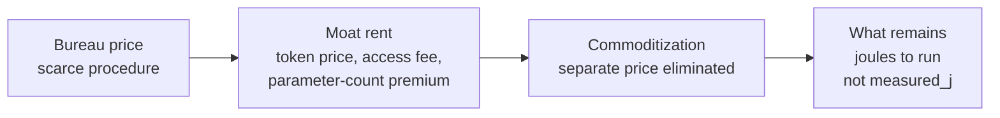

# Spell Check is Global : The Future of Computer Intelligence in the hands of the many (7B+) and not the few (<500M)

## Abstract

AI is going to follow the path of all computer automation. Spell check is the best example of that path.

The argument is economic theory. Computer automation is priced, and the price creates a race. A scarce procedure is sold at a bureau price. A firm that can ship it then charges a moat rent. That rent is what calls rivals to displace the product or replace it. Commoditization is the end of the race: the separate money price is eliminated. Token price, parameter count, moat rent, and access fees are among the charges that collapse. Energy to run is the only true metric of computer intelligence. What remains is joules. Spell check is the completed example. The correction is no longer a line item, and the joules to compare a word to a local list are still spent. This paper does not fit a curve and does not estimate a coefficient. Estimates are not `measured_j`.

The path is a sequence. A procedure starts in a specialist bureau. It then becomes a routine on the machine that already holds the work. It then becomes ordinary, because it is cheap, local, and paired to hardware people already have. Spell check finished that sequence. Detection of a nonword and proposal of a correction are computer intelligence. They are not a metaphor for some later system. The capability reached ordinary writing: the editor, the browser, the phone keyboard. It did not stay as a service only a lab could rent.

The future of computer intelligence is that pattern. David Charlot frames access as the many (7B+) and rented frontier intelligence as the few (<500M). Those bounds are his framing of access. They are not a census and not a market size.

The four companion studies say how a capability should behave once it is on that path. [Mixture of Limits](/papers/mol/) chooses the gear, and the gear has to sit on hardware that is available, accessible, and capable. [Notational Intelligence as Commit Law](/papers/ni/) owns the commit: a suggestion is a proposal until it is accepted. [Satiation and Scarcity after Free AI](/papers/satiation/) owns the stop: once the token is kept, further candidates do not change the written predicate. [Metabolic Intelligence](/papers/mei/) owns the envelope: the envelope is the physical condition of the superior answer, not a cheaper answer purchased by degrading the result. Klere ([klere.ai](https://klere.ai)) is the product home of that class. It is not a prison. Spell check already finished the path in editors that are not Klere.

This paper reports published procedures, a local library, and on-device APIs. No new accuracy experiment is reported. No board energy is reported. `board_synth_claimed` stays false.

## Notation

| Term | Meaning in this paper |
|---|---|
| Automation path | A computer procedure leaves a specialist bureau and becomes a local routine on hardware a person already has. |
| Existence proof | A completed instance of that path. Spell check is one. The word is not used as a figure of speech. |
| Local | The check runs on the machine that holds the document. The routine that shipped does not require a frontier datacenter rental. |
| Paired hardware | The editor, keyboard, or phone the person already uses to write. The capability is not a second machine. |
| Available | The fabric is ordinary hardware, not a scarce rental. The word is used as in Mixture of Limits. |
| Accessible | The person can invoke the capability on that fabric without sending the job to a specialist bureau. |
| Capable | The fabric can run the gear that closes the job. |
| The many (7B+) | David Charlot's framing of who the path is for. Not a census, and not a result of this paper. |
| The few (<500M) | His framing of who can rent frontier-datacenter intelligence. Not a census, and not a result of this paper. |
| Proposal | A spelling suggestion. The document has not changed yet. |
| Commit | The replacement is written. Notational Intelligence owns this shape. |
| Completeness | The token is kept: it was known, or a candidate was accepted. Further search then has zero value of information on that predicate. |
| Money price | A charge someone can invoice: token price, seat license, moat rent, access fee. Commoditization drives the separate charge to zero. |
| Parameter count | A size of a model. Not a metric that survives once the capability is a commodity. |
| Joule | Energy to run the routine. The metric that remains after the money prices are gone. Not `measured_j` unless a meter returns it. |
| Lookup, Formula, Model | Mixture of Limits gears. A dictionary probe is Lookup. An edit-distance generator is a formula. A frontier language model is Model, and it is last. |

## 1. Introduction

AI is going to follow the path of all computer automation. Spell check is the best example of that path.

Energy to run is the only true metric of computer intelligence. Token price, parameter count, moat rent, and access fees collapse to zero by commoditization. What remains is joules. Spell check shows the collapse. The routine is in the editor. The joules are still spent. Estimates are not `measured_j`.

Computer automation has a recognizable sequence. First, a procedure is scarce. A person or a bureau does it, or a machine does it only where a specialist can book time. Then the same procedure shows up as a routine on the computer that already holds the work. Then people stop treating it as a product they visit and start treating it as part of the tool they already use. Calculation did this when the spreadsheet replaced the sent-out worksheet. Typesetting did this when the document on the screen became the document that was printed. Spell check did this when the proofreader's pass became a function of the editor.

Spell check is the cleanest existence proof inside that sequence, because the capability is computer intelligence and the deployment is finished. The job is: decide whether a written token is a word, and if it is not, propose the word the writer most likely meant. Kukich (1992) splits that job into three problems of increasing difficulty: nonword detection, isolated-word correction, and context-dependent correction. The first two are what became ordinary. They are real procedures, with published methods, running inside programs people already use to write. They are not a story one tells in order to talk about a different system.

The reason the capability reached ordinary writing is mechanical. It was cheap enough to run beside the document. It was local: the dictionary and the edit routine lived on the same machine as the file. It was paired to hardware people already had: a minicomputer, then a personal computer, then a phone. McIlroy (1982) states the constraint in the first sentences of the UNIX spelling-list paper. The checker may be used on minicomputers, so the list has to be compact. That sentence is the path. The intelligence was designed to fit the machine that already held the text.

A frontier model that answers only inside a rented datacenter is the bureau stage of the same path. It can be capable and still fail available and accessible for the person holding the document. The future this paper argues for is not a smaller copy of that bureau. It is the stage spell check already reached.

David Charlot frames that stage as the many, 7B+, and rented frontier intelligence as the few, under 500M. Those figures are his framing of access. They are not a census of phones or cloud accounts. The design rule is to finish computer intelligence the way spell check finished, for the first class, and to refuse a rental held for the second.

### Companion laws

This study is the automation path. The catalog triad stays intact. Metabolic Intelligence stays the energy budget.

| Role | Study | Owns |
|---|---|---|
| **Navigation** | [Mixture of Limits](/papers/mol/) | Which gear closes: Lookup, then Formula, then Solver, then Model last. Each gear needs a fabric that is available, accessible, and capable. |
| **Commit** | [Notational Intelligence as Commit Law](/papers/ni/) | propose, then certify, then commit or refuse, then a receipt. A spelling suggestion is a proposal. |
| **Economic Reality of Satiation** | [Satiation and Scarcity after Free AI](/papers/satiation/) | Stop when value of information is zero on a stated completeness predicate, or when budget or policy refuse fires. |
| **Energy budget** | [Metabolic Intelligence](/papers/mei/) | The envelope is the physical condition of the superior answer. Not a cheaper answer. Edge and a resource-optimized central datacenter. Klere is the product home, not a prison. |
| **Automation path** | This paper | Spell check is the existence proof that computer intelligence becomes ordinary when it is cheap, local, and paired to hardware people already have. |

Navigation chooses the gear. Commit records the irreversible branch. Satiation says when to stop. Metabolic Intelligence says the envelope obtains the superior answer. This paper says where that stack has to live if computer intelligence is to follow the path the rest of computer automation already took.

### A token, taught in order

Norvig (2007) documents a local corrector and the call `correction('speling')`, which returns `spelling`. Walk that call as the path, not as a demo of a product.

1. The string is already on the machine. Nothing is sent to a bureau.
2. Lookup asks whether `speling` is in the local word counts. It is not.
3. A formula builds strings at edit distance one: a deletion, a transposition, a replacement, or an insertion. The known word `spelling` is in that set.
4. The suggestion is a proposal. The document changes only when a person accepts it, or when a stated policy accepts it. That is the commit.
5. Once `spelling` is kept, further candidates do not change the predicate "this token is the word we are keeping." That is the stop.
6. Opening a frontier model for this token does not obtain a better close. The lookup-plus-edit gear already closed it. Refusing the larger spend is not a discount. It is the superior answer for this job.

The same essay shows the case the local token cannot close. `correction('where')` stays `where` when a test pair expected `were`. The single word does not carry the decision. Kukich (1992) named this the third problem, context-dependent correction. A larger model can be the right gear there. The path is not finished for that gear until the gear runs on hardware the writer already has, or on a resource-optimized central fabric that person can actually use. A rented frontier pass that the writer cannot invoke is still the bureau.

## 2. Related work

### 2.1 Detection and isolated-word correction

Damerau (1964) gives a method for a word that is missing from a dictionary and has at most one error: a wrong letter, a missing letter, an extra letter, or a single transposition. The unidentified word is compared to the dictionary again under each of those assumptions. The abstract reports correct identifications for over 95 percent of these error types on the test he ran. This paper cites that result as his. It does not repeat the test.

Peterson (1980) surveys computer programs that detect and correct spelling errors. By that date the capability is a literature of working programs, not a proposal that a program might someday check a word.

Kukich (1992) organizes the field into the three problems named above. Nonword detection uses a word list, pattern matching, or n-gram analysis. Isolated-word correction proposes a dictionary word for a detected nonword. Context-dependent correction handles a token that is a real word and still the wrong word. The survey is the map. The existence proof in this paper is that the first two problems left the survey and entered ordinary editors.

### 2.2 The list was built to fit the machine

McIlroy (1982) describes the word list behind the UNIX spelling checker. The abstract states the engineering constraint and the result. The checker may be used on minicomputers, so the list must be compact. Stripping prefixes and suffixes, hashing, and compression take a reduced list of 30,000 English words down to 26,000 16-bit machine words. Johnson's earlier checker looked up words of a document that was already on the machine. McIlroy's contribution, for this paper, is the pairing: the dictionary was compressed because the target was the minicomputer people would actually run, not a larger machine reserved for the job.

Those word counts are his published counts. They are not a measurement taken for this study.

### 2.3 A noisy channel is still a local program

Kernighan, Church, and Gale (1990) rank candidate corrections with a noisy-channel model: the probability of the candidate times the probability of the typo given the candidate. The program is a spelling corrector in the ordinary sense, a local computation over a dictionary and an error model. A better score is not a different deployment. The gear can get sharper and remain on the machine that holds the text.

### 2.4 A corrector that fits in a page and needs no network

Norvig (2007) wrote the explanation on a plane, with no spelling-error data and no internet connection. The language model is a local file of about a million words, counted into 32,192 distinct words appearing 1,115,504 times. The error model is deliberately crude: a known word at edit distance 0 beats any word at distance 1, which beats any word at distance 2. After the flight he evaluated against sets drawn from Mitton's Birkbeck corpus. He reports 75 percent of 270 development pairs correct, at 41 words per second, and 68 percent of 400 final-test pairs correct, at 35 words per second. He states that he met his goals for brevity and speed and missed his hope of 80 to 90 percent accuracy.

Those numbers are his reported evaluation. The toy is not an industrial checker. A useful slice of the capability runs from a file on the machine in front of the programmer, at tens of words per second, with the network absent. That is the shape of a finished automation path. The misses he lists, especially unknown dictionary words and decisions that need neighboring tokens, are the residual. They are arguments for a better local gear, not arguments that the job must move back to a bureau.

### 2.5 The library inside ordinary editors

The Hunspell project states that Hunspell is the spell checker and morphological analyzer used by LibreOffice, by free browsers including Firefox and Chrome, and by other tools and operating systems including Linux distributions and macOS (Hunspell README). The library reads a local dictionary file and a local affix file. The command-line tool checks a local text file. The code descends from MySpell, Kevin Hendricks's implementation in OpenOffice.org, itself a reimplementation of affix spelling from Geoff Kuenning's International Ispell. László Németh's Hunspell adds Unicode and the morphology needed for languages where a bare English word list is the wrong gear.

That README states where the library is used. The fact it contributes is deployment class. The checker inside those programs is a local library and a local word list.

### 2.6 The phone already in the hand

UITextChecker is a UIKit class. The caller passes a string and a language. The method returns the range of a misspelled word in that string, or reports that it found none (Apple, UITextChecker). The check is a call on the device, against a language the system lists as available. This paper does not claim a joule figure for that call. The API shape is the pairing: the text is already in the text view, and the checker is a method beside it.

Android's spell-checker framework is also on the device. An application extends `SpellCheckerService`, implements a session, and returns suggestions for text the session is given (Android Developers, spell-checker framework; `SpellCheckerService`). The Latin input method's checker is a local service with locale dictionaries. Again, no energy number is taken from that documentation. The documentation places the routine on the phone.

Hard and colleagues (2018) train a next-word model for the Gboard phone keyboard by federated learning. Clients compute updates on text that stays on the device. The server aggregates those updates and does not receive the raw typing. The same paper states that Gboard provides auto-correction as well as next-word prediction, and that the keyboard had over 1 billion installs as of 2019. That install sentence is the paper's own deployment claim. It is not a headcount of people, and it is not a substitute for the 7B+ access framing in this study.

The model they ship is small on purpose. After quantization it is 1.4 megabytes, with a 10,000-word vocabulary, under a product constraint they state as a visible response within about 20 milliseconds and a model size of tens of megabytes. Training participation in their study is narrower than the install base: North American devices, at least 2 gigabytes of memory, charging, idle, and on an unmetered network. This study cites the deployment class. A keyboard people already use carries a small on-device language model, and the training described there does not export the typed text. It does not cite their recall tables as a spelling-accuracy result.

### 2.7 The hardware lottery

Hooker (2020; 2021) names the hardware lottery: a research idea wins because it fits the available hardware and software, not because it is the best idea in the abstract. Spell check won a lottery that was worth winning. The available hardware was the machine that held the document. The algorithm that fit was a word list plus a small edit model. A capability that fits only a frontier accelerator, and is sold only as time on that accelerator, is in a different lottery. Hooker's warning is that ideas which miss the installed hardware stall even when they are good. The design consequence in this paper is the reverse reading of the same fact. If the goal is computer intelligence for the many, the idea has to fit hardware the many already have, or hardware a resource-optimized central fabric can extend to them. Fitting a scarce rental is how a capability stays with the few.

### 2.8 What this literature is not asked to prove

None of these sources is a population table. When a number appears in Section 4, it is the source's own count: dictionary words, test-set size, words per second, or a published identification rate. 7B+ and <500M are not derived from them.

### 2.9 How computer automation is priced

Energy to run is the only true metric of computer intelligence. History and the recent price notes are the evidence. A cited rate stays inside the paper that published it. No curve is fit here. No slope, half-life, or zero-price year is stated.

Three regimes name how a computer-automation tool is priced.

**Bureau price.** While the procedure is scarce, the buyer pays a person or a booked machine. Nordhaus (2007) measures the long money price of computation itself, not of spell check. In that article the price of computation starts at around $500 per million computations per second for manual work and falls to around \(6 \times 10^{-11}\) per million computations per second by 2006, in 2006 prices, a decline on the order of seven trillion. Those are his reported figures. They are not refit here and they are not a forecast. They document that the money price of the substrate of automation fell by orders of magnitude. A fall in that index is not yet the elimination of a product's separate invoice, and it is not a joule meter.

**Moat price, and the race it creates.** Once a firm can ship the procedure, it can charge more than it costs to run. That gap is moat rent. An access fee and a token price are the same gap in different costumes. A parameter count becomes part of the costume when buyers are taught to pay for size. The rent is what creates the race. Rivals displace the moat by bundling the capability into a product the buyer already has, or they replace the product outright. Published inference prices say the race is underway for language models and has not finished. Epoch AI (2025) reports price declines at fixed performance on the order of 9 to 900 times per year across the benchmarks in that note. Emberson and Roodman (2026) report about a 47 percent decline per quarter in the cost of a given performance since about 2023, which they summarize as about 13 times per year. Those are their summaries of their series. The index is not re-estimated. No line is drawn through the points. Neither rate is a law past their window. [Satiation and Scarcity after Free AI](/papers/satiation/) uses these notes for a different claim: a falling money price is not free energy and not a completeness predicate. That claim stays in that paper. It uses the same cited fall as evidence of moat displacement still in progress.

**Pricing elimination.** Commoditization is the end of the separate charge. The capability remains. The invoice line does not. Spell check is the completed example. Hunspell is a free spell-checking library under a tri-license (LGPL, GPL, and MPL). The project states that LibreOffice, Firefox, Chrome, Linux distributions, and macOS call it, and that a check reads a local dictionary (Hunspell README). The buyer of those editors does not pay a token price for a nonword, does not pay an access fee to a spelling bureau, and does not shop a parameter count. The method's money price as a separate good is zero. That is pricing elimination. It is not a claim that the editor itself is free, and it is not a claim that the phone was free. It is a claim that spelling correction is no longer priced as its own good.

What remains is the energy to run the comparison. A local dictionary probe spends joules on the device that holds the document. No joules are metered here. No analytical total is computed. Package `measured_j` stays unset. A companion joule figure is `measured_j` only when that study's meter returned the reading. [Metabolic Intelligence](/papers/mei/) owns the envelope: the joules are the physical condition of the superior answer, not a discount that buys a worse word. [Satiation](/papers/satiation/) owns the stop: free at the money price is not free joules, and further candidates after the token is kept spend energy on a predicate that has already fired. The papers stay distinct. This one owns the money-price path. They own the stop and the envelope.

The prediction follows from the regimes, not from a regression. Ordinary computer-intelligence tasks follow spell check. Their token prices, parameter-count premia, moat rents, and access fees are competed away by bundling onto hardware people already have and by methods whose license price is zero. The many (7B+) and the few (<500M) remain David Charlot's framing of who that end state is for. They are an access framing. The prediction fails if an ordinary task, of the kind spell check already closes, keeps a lasting separate money price after a local routine of equal result is in the hands of the people who hold the document. A frontier benchmark that still carries a premium is not that failure. It is the moat stage, which Epoch's notes already show getting cheaper, and which spell check shows how to leave.

The same regimes are drawn in the living companion [sc-anim-01](/living/spellcheck/#sc-anim-01). Two dots are Nordhaus's reported endpoints. The dashed connector joins those two endpoints. No rate is estimated. Epoch's 9-to-900 range and about-13-times summary sit in a callout. They stay their summaries. The spell-check panel is the completed regime: the separate money price is gone, and the joules remain unmetered.

Landauer (1961) sets a physical floor on erasing a bit. Horowitz (2014) is the practical CMOS statement the companion satiation study already uses: data movement dominates, far above that ideal bound. A dictionary probe moves bits. Commoditization can zero the invoice and still leave that motion. No joule total for spell check is computed from either citation.

## 3. Definitions and methods

### 3.1 The path, as a test

A capability is on the automation path when all five of the following hold.

1. The work already sits on a machine a person has, or on a fabric that person can use without a specialist booking.
2. The capability runs as a routine on that machine, not as a job shipped to a bureau.
3. The routine fits the ordinary memory and power envelope of that machine.
4. Invoking it does not require renting a frontier datacenter.
5. The answer the routine returns is the right gear for the job. Reach is not purchased by returning a worse answer.

Spell check, in the form that shipped inside editors and keyboards, meets the five. A chat model that answers only inside a rented frontier datacenter fails 2, 3, and 4 for the person who does not have the rental. The thesis is that computer intelligence will be built until it meets the five, because that is the path computer automation takes, and spell check is the completed example of computer intelligence on that path.

### 3.2 Existence proof

An analogy says "X is like Y" and then talks about X. An existence proof exhibits Y. Here Y is spell check. The procedures in Section 2 are Y. The products that call a local library are Y. The claim about the future of computer intelligence is a claim that the same path is the one to build, because this instance already finished. Where the instance is narrow, the paper says so. Nonword detection and isolated-word correction finished the path. Context-dependent correction is the residual gear, and it is not finished until it is local in the same sense.

### 3.3 Access framing

"The many (7B+)" and "the few (<500M)" are David Charlot's labels for two access classes. The first is people at large. The second is people who can rent frontier-datacenter intelligence. This paper adopts the labels and refuses to decorate them. There is no table of countries, no income band, and no device-ownership rate. A reader who wants a census should not look here. A reader who wants the design rule can: a capability that only the second class can invoke has not finished the automation path, whatever its benchmark score.

### 3.4 What was done

The method is a reading of the primary sources in Section 2, plus a mapping onto the four companion laws. No new corpus was labeled. No program was timed for this study. No board was synthesized or metered. Package `measured_j` is unset. `board_synth_claimed` is false.

Evidence classes used below:

| Class | Means |
|---|---|
| **Literature** | A published paper or essay. Numbers are the author's reported numbers. |
| **Project statement** | A project README describing where its library is used. Not a census. |
| **API** | Vendor documentation of a call that runs against text the device already holds. Not a joule measurement. |
| **Design** | A mapping from that record onto Mixture of Limits, Notational Intelligence, Satiation, or Metabolic Intelligence. Marked as design. |
| **Framing** | David Charlot's 7B+ and <500M access bounds. Not a measurement. |

## 4. Evidence

### 4.1 Claim SC-1. Isolated-word correction is a published procedure

Damerau (1964), Peterson (1980), and Kukich (1992) document detection and correction as computer procedures. Kukich's first two problems have names, methods, and a survey. The capability this paper points at is that literature, not a nickname for a later model. Class: literature.

### 4.2 Claim SC-2. The dictionary was sized for the machine people would run

McIlroy (1982) compressed the UNIX spelling list because the checker might run on minicomputers. A reduced list of 30,000 English words occupies 26,000 16-bit words in his account. The deployment target is the machine already in service, not a machine acquired for spelling. Class: literature.

### 4.3 Claim SC-3. A useful corrector does not need a network or a frontier model

Norvig (2007) built the corrector with no internet connection, from a local count file, and reports 68 percent of 400 final-test pairs correct at 35 words per second. Kernighan, Church, and Gale (1990) rank candidates with a local noisy-channel computation. Neither result is an argument that the 2007 toy matches the best published accuracy. Both are arguments that the gear which does the ordinary job is a dictionary and an edit model on the machine that holds the word. Class: literature.

### 4.4 Claim SC-4. Ordinary editors call a local library

The Hunspell README states that LibreOffice, Firefox, Chrome, Linux distributions, and macOS use the library, and that a check reads local affix and dictionary files. Class: project statement. This claim does not say what fraction of the world's writing those programs cover. It says the checker inside those programs is local.

### 4.5 Claim SC-5. Phones expose spell check as a local call

UITextChecker checks a string the caller passes (Apple). Android's `SpellCheckerService` returns suggestions in a session on the device (Android Developers). Class: API. No watt figure is attached.

### 4.6 Claim SC-6. On-device keyboard models kept the pairing

Hard et al. (2018) train a next-word model on the phone and aggregate updates without uploading raw typing. The inference model they describe is 1.4 megabytes. Their "over 1 billion installs as of 2019" is their install claim for Gboard, not a census and not this paper's 7B+ framing. Training eligibility in the study was a constrained subset of devices. Class: literature, limited to the pairing. Not a spelling-accuracy result.

### 4.7 Claim SC-7. The gear that shipped is Lookup, then a formula

For a nonword, the shipped routine probes a word list and proposes a small edit. That is Lookup, then Formula, in the sense of [Mixture of Limits](/papers/mol/). Model is the residual gear for Kukich's third problem, and Norvig's own error analysis says context is what a higher accuracy needs. Model last is the navigation law, not a ban on context. The fabric that hosts whichever gear closes still has to be available, accessible, and capable. A frontier model that the writer cannot run fails that test even if its accuracy on a benchmark is higher. Class: design, grounded in SC-1 through SC-5.

### 4.8 Claim SC-8. A suggestion is not yet a commit

The red underline proposes. The document changes when the writer accepts a candidate, or when an automatic policy replaces the token. [Notational Intelligence](/papers/ni/) owns that distinction. An automatic replacement with no stated policy is an uncertified commit. This paper does not claim that every shipped auto-correct policy is a good commit law. It claims the right shape is visible in the ordinary interface: show the proposal, record the acceptance. Class: design.

### 4.9 Claim SC-9. Further candidates stop when the token is kept

Once the writer keeps `spelling`, more strings at edit distance two do not change the completeness predicate for that token. [Satiation](/papers/satiation/) names that stop. Generating the rest of the candidate list after the predicate is true is spend with no increment on the written objective. The predicate has to be written down. "The user might still be unsure" is a different predicate, and it is not silently substituted here. Class: design.

### 4.10 Claim SC-10. The envelope obtains the correction. It does not discount it

The Faustian reading says that reaching everyone means accepting a worse answer. Spell check does not support that reading for the job it actually closes. For `speling`, the dictionary-plus-edit answer is `spelling`. A larger model that also says `spelling` has not produced a superior token. It has produced the same token at a higher cost. Refusing the extra spend keeps the answer. It does not cheapen it.

Where the local toy is wrong, the repair Norvig names is a better language model, a better error model, and context. Those repairs are still judged by whether they obtain the right word. [Metabolic Intelligence](/papers/mei/) is the claim that the envelope is the physical condition under which that superior answer is obtained, on the edge and in a resource-optimized central fabric, not an uncapped hyperscale campus. The spell-check record is the existence proof that a computer-intelligence routine can sit inside an ordinary envelope and still be the right routine. Class: design. No joules are computed in this section. The companion paper owns the envelope's measurements, and its soft-reference path still has `board_synth_claimed=false`.

### 4.11 Claim SC-11. Klere can host the class. The class is not confined to Klere

Klere is the product home of Metabolic Intelligence. Public klere.ai, as the companion study states, is a thin access framing, not a shipped feature catalog. Spell check shows the automation path completing in LibreOffice, in browsers, and in phone text views. Those hosts are not Klere. A later embodiment of the same laws can live in Klere without making Klere the only legal host. The product home is a home. It is not a prison. Class: design.

### 4.12 Claim SC-12. The access bounds are a framing

7B+ and <500M appear in this paper only as David Charlot's access framing, stated in the title and in Section 3.3. No source in Section 2 was used to derive them. Class: framing.

### 4.14 Claim SC-13. The money prices are in a race. They are not the metric

Epoch AI (2025) and Emberson and Roodman (2026) report rapid declines in the money price of a fixed measured performance, at the rates named in Section 2.9. Nordhaus (2007) reports a much longer decline in the money price of computation, at the magnitudes named there. Class: literature. This paper does not refit either series. A token price, a parameter count, a moat rent, and an access fee are money-side factors. The theory says commoditization drives them to zero as separate charges. The cited series show the direction for computation in the long record and for inference in the recent record. They are not a curve this paper estimated.

### 4.15 Claim SC-14. Spell check has already eliminated the separate price

Hunspell's license price is zero, and the check runs as a local library inside ordinary editors (Hunspell README; Section 2.5 and Section 4.4). There is no residual token price for the nonword case the local gear closes. Class: project statement plus design. This is the completed automation example. It is not an illustration of a different product.

### 4.16 Claim SC-15. What remains is joules, and they are not metered here

After the separate money price is gone, the energy to run the routine remains. Class: design, tied to [Satiation](/papers/satiation/) for the money-versus-joule split and to [Metabolic Intelligence](/papers/mei/) for the envelope. This paper reports no `measured_j`. An estimate is not a measurement. `board_synth_claimed` stays false.

### 4.13 What would be a result and is not

No fraction of written words, no language-coverage survey, no energy per suggestion, and no headcount of frontier-datacenter renters is reported. Those measurements belong to a different study.

## 5. Discussion

### 5.1 Cloud grammar products sit on a finished path

Some grammar products send text to a remote service and return advice. That rental layer exists. It does not replace the checker that already runs inside the editor. A remote service can be the right gear for a context decision the local list cannot close. It becomes a return to the bureau when it is the only way to perform a check the local gear already performs. The existence proof is the local routine. The rental layer is a later product sitting on top of a path that already finished.

### 5.2 Frontier chat is the bureau stage

A large model behind an API is a specialist bureau with a short queue. The automation path is the later stage: the gears people need run on hardware they already have, or on a resource-optimized central fabric open to the many. Spell check is that finished stage.

### 5.3 Available, accessible, capable

Mixture of Limits refuses a software-only reading of the cascade. A gear counts only if a fabric can host it, and the fabric has to be available, accessible, and capable. Spell check makes the three words concrete. The word list was available because it fit a minicomputer and, later, a phone. It was accessible because the writer invoked it by typing, not by booking a bureau. It was capable because edit distance one covers the single-error classes Damerau defined, which is the bulk of the isolated-word job Kukich surveys. A fabric that is capable on a benchmark and available only as a scarce rental fails the middle word. The navigation law fails with it.

### 5.4 Commit and stop are why the ordinary interface is the right one

The interface that underlines a word and waits is a commit law a person can see. The interface that silently replaces a word is a commit that happened without a receipt the writer inspected. Notational Intelligence prefers the first shape whenever the replacement is hard to undo, and a sent message is hard to undo. Satiation prefers the first shape for a different reason: the completeness predicate should be the writer's acceptance or an explicit policy, not an unbounded search for a prettier token. The two laws agree on the underline. They are not the same law.

### 5.5 The envelope obtains the answer

Metabolic Intelligence states the law: energy binds, and the envelope is how the superior answer is obtained. A nonword at edit distance one closes on the small gear. A real word that is the wrong word closes on context. The envelope admits the gear that obtains the right token. A wrong token is refused even when it is cheap. Edge devices host the gear that already fits. A resource-optimized central fabric hosts a context gear that does not fit the phone. An uncapped hyperscale campus is outside the design of a dictionary probe. No water or power figure is added here.

### 5.6 What would count against the thesis

The thesis fails if the spelling capability that reached ordinary writing required a rented frontier datacenter. Section 2 shows the opposite for nonword detection and isolated-word correction. A leaderboard on which a large model beats Hunspell at context-sensitive grammar names a residual gear. That gear counters the path only if it cannot run on hardware people already have or on a resource-optimized central fabric they can use. That measurement is not in this study. The condition is the test.

## 6. Limits and threats to validity

The classic detection papers use English word lists. Hunspell's feature list states that rich morphology needs affixes. Language coverage is not surveyed here. A finished local checker for every writing system is not claimed.

Norvig's 68 percent is his final-test figure for a toy with a flawed error model. It is evidence that a local toy runs. It is not the accuracy of industrial spell check, and it is not the ceiling.

UITextChecker and `SpellCheckerService` document a local call. They publish no joules and no offline guarantee for every vendor configuration. Hard et al. (2018) is next-word prediction. No spelling-accuracy number is taken from that paper.

The Hunspell README is a project statement about adopters. It is not an audit of this year's engine inside each named operating system.

Auto-correct policies differ. Some commit without asking. SC-8 states the law: propose, then commit. Vendors are not audited here.

7B+ and <500M are David Charlot's access framing. Section 3 does not estimate them.

No board was synthesized or metered. No analytical energy is computed. `measured_j` is unset.

## 7. Conclusion

AI is going to follow the path of all computer automation. Spell check is the best example of that path.

The example is an existence proof. A computer-intelligence capability, the detection and correction of a written word, became ordinary. It became ordinary because it was cheap, local, and paired to the editor and the phone people already used. McIlroy fit the list to the minicomputer. Hunspell sits inside ordinary editors as a local library. The phone exposes the check as a call on the text it already holds. Norvig's page of code is the gear with the network absent.

The future of computer intelligence is that pattern. A capability held only by whoever can rent a frontier datacenter is the bureau stage. David Charlot's framing of the two classes is the many (7B+) and the few (<500M). The framing is a design rule. It is not a census.

Energy to run is the only true metric of computer intelligence. Token price, parameter count, moat rent, and access fees collapse to zero by commoditization. Spell check is the completed example of that collapse. What remains is joules. No meter reading is reported. No curve is fit. An estimate is not `measured_j`.

The companion laws build the rest of the path. Spell check is the existence proof. Mixture of Limits keeps Model last and demands a fabric that is available, accessible, and capable. Notational Intelligence makes the suggestion a proposal until commit. Satiation stops when the token is kept. Metabolic Intelligence keeps the envelope as the condition of the superior answer, on the edge and in a resource-optimized central fabric, and refuses the trade that would worsen the answer to make it cheap. Klere is where that class has a product home. Spell check already ran the path elsewhere. The home is not a prison.

## References

1. Damerau, F. J. A technique for computer detection and correction of spelling errors. Communications of the ACM, 7(3), 171-176, 1964. https://doi.org/10.1145/363958.363994

2. Peterson, J. L. Computer programs for detecting and correcting spelling errors. Communications of the ACM, 23(12), 676-687, 1980. https://doi.org/10.1145/359038.359041

3. McIlroy, M. D. Development of a spelling list. IEEE Transactions on Communications, 30(1), 91-99, 1982. https://doi.org/10.1109/TCOM.1982.1095395

4. Kernighan, M. D., Church, K. W., and Gale, W. A. A spelling correction program based on a noisy channel model. In COLING 1990, 205-210. https://aclanthology.org/C90-2036/ and https://doi.org/10.3115/997939.997975

5. Kukich, K. Techniques for automatically correcting words in text. ACM Computing Surveys, 24(4), 377-439, 1992. https://doi.org/10.1145/146370.146380

6. Norvig, P. How to write a spelling corrector. 2007 (page updated through 2016). https://norvig.com/spell-correct.html

7. Hunspell project. README. Library developed by László Németh, descending from Kevin Hendricks's MySpell and Geoff Kuenning's International Ispell. States use by LibreOffice, Firefox, Chrome, Linux distributions, and macOS. https://github.com/hunspell/hunspell/blob/master/README.md

8. Apple. UITextChecker. UIKit documentation. https://developer.apple.com/documentation/uikit/uitextchecker

9. Android Developers. Spell checker framework, and `SpellCheckerService`. https://developer.android.com/develop/ui/views/touch-and-input/spell-checker-framework and https://developer.android.com/reference/android/service/textservice/SpellCheckerService

10. Hard, A., Rao, K., Mathews, R., Ramaswamy, S., Beaufays, F., Augenstein, S., Eichner, H., Kiddon, C., and Ramage, D. Federated learning for mobile keyboard prediction. arXiv:1811.03604, 2018. https://arxiv.org/abs/1811.03604

11. Hooker, S. The hardware lottery. arXiv:2009.06489, 2020. Communications of the ACM, 64(12), 58-65, 2021. https://doi.org/10.1145/3467017

12. Charlot, D. Mixture of Limits: Navigation Law for Computer Intelligence. https://research.openie.dev/papers/mol/

13. Charlot, D. Notational Intelligence as Commit Law. https://research.openie.dev/papers/ni/

14. Charlot, D. Satiation and Scarcity after Free AI. https://research.openie.dev/papers/satiation/

15. Charlot, D. Metabolic Intelligence: Budget-Native Compute from Tag to Campus. https://research.openie.dev/papers/mei/

16. Nordhaus, W. D. Two centuries of productivity growth in computing. The Journal of Economic History, 2007. Reported computation prices are his, from around $500 per million computations per second for manual work to around \(6 \times 10^{-11}\) by 2006, in 2006 prices. https://www.cambridge.org/core/journals/journal-of-economic-history/article/two-centuries-of-productivity-growth-in-computing/856EC5947A5857296D3328FA154BA3A3

17. Epoch AI. LLM inference price trends. 12 March 2025. Declines at fixed performance on the order of 9 to 900 times per year across the benchmarks in that note. Not refit here. https://epoch.ai/data-insights/llm-inference-price-trends

18. Emberson, L., and Roodman, D. / Epoch AI. The plunging price of thought. 22 September 2026. About a 47 percent decline per quarter, summarized as about 13 times per year, since about 2023. Not refit here. https://epoch.ai/publications/the-plunging-price-of-thought

19. Landauer, R. Irreversibility and heat generation in the computing process. IBM Journal of Research and Development, 5(3), 183-191, 1961. https://doi.org/10.1147/rd.53.0183

20. Horowitz, M. Computing's energy problem (and what we can do about it). IEEE International Solid-State Circuits Conference, 2014. https://doi.org/10.1109/ISSCC.2014.6757323

## Appendix A. Claim map

| Claim | Statement | Class |
|---|---|---|
| SC-1 | Detection and isolated-word correction are published computer procedures. | Literature |
| SC-2 | The UNIX list was compressed so the checker could run on minicomputers. | Literature |
| SC-3 | A corrector runs from a local file with no network. Norvig's reported final test: 68% of 400 at 35 words/second. | Literature |
| SC-4 | Hunspell, a local library, is the checker named ordinary editors use. | Project statement |
| SC-5 | UITextChecker and Android SpellCheckerService are on-device calls. | API |
| SC-6 | A 1.4 MB next-word model was trained on the phone. Their install claim is not this paper's access framing. Not a spelling score. | Literature |
| SC-7 | The shipped nonword gear is Lookup, then Formula. Model is last and residual. | Design |
| SC-8 | A suggestion is a proposal until commit. | Design |
| SC-9 | Further candidates stop when the token is kept. | Design |
| SC-10 | The envelope obtains the correction. It does not discount it. | Design |
| SC-11 | Klere may host the class. The class is not confined to Klere. | Design |
| SC-12 | 7B+ and <500M are an access framing, not a census. | Framing |
| SC-13 | Cited money prices fell. They are not the metric, and no curve is fit here. | Literature |
| SC-14 | Spell check's separate money price is already gone. | Project statement and design |
| SC-15 | What remains is joules. None are metered here. Estimates are not `measured_j`. | Design |

## Appendix B. Relation to the companion studies

The catalog triad stays intact. Mixture of Limits navigates. Notational Intelligence commits. Satiation stops. Metabolic Intelligence is the energy-budget study. This paper is the fifth study. It records the path those laws are for.

Spell check is the worked instance.

- Navigation. A nonword closes on Lookup and a short edit formula. Context-dependent correction may open Model. The fabric still has to be available, accessible, and capable.
- Commit. The underline is the proposal. Acceptance is the commit. A silent replacement needs a policy or it is an uncertified write.
- Satiation. The completeness predicate is that the token is kept. After that, more candidates are spend past done.
- Metabolic Intelligence. The ordinary envelope of the editor or the phone is where the superior close for a nonword already lives. The envelope is not permission to ship the wrong word because it was cheap. Klere is the product home of the class and is not required for the historical proof.

## Appendix C. What is not claimed

- No new spelling-accuracy experiment.
- No population, subscriber, or datacenter-customer count. The bounds in the title are David Charlot's access framing.
- No board power, no `measured_j`, no `board_synth_claimed`.
- No claim that the 2007 toy matches industrial accuracy.
- No claim that every language has a finished local checker.
- No claim that a cloud grammar service is impossible or useless. The claim is that it is not the routine that made spell check ordinary.
- No claim that Klere has shipped a spell checker. The public site is thin access framing, as the Metabolic Intelligence study states.
- No fitted price curve, no estimated coefficient, and no forecast sold as a measurement. Epoch's rates and Nordhaus's factor stay theirs.
- No `measured_j`. Energy remaining is the theory. It is not a wattmeter reading.
