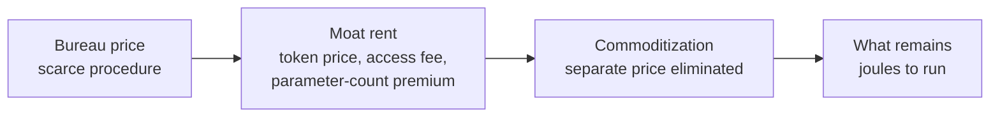

# Spell Check is Global : The Future of Computer Intelligence in the hands of the many (7B+) and not the few (under 500M)

## Abstract

This article is about what happens when technology is built for global access instead of priced by scarcity. The many are more than 7 billion people. The few are fewer than 500 million people. Spell check is the finished case.

People used to pay for spell check, and they paid a premium. WordCheck listed at \$200.00 in January 1981. Grammatik II was \$89 in 1988. Grammatik III was \$99 in 1989. WordPerfect 3.0 was \$495 in October 1983, and it included a spell-check command. Word 1.0 was \$395 and did not include spell check. The checker was added in Word 2.0, and it was a checker the firm purchased. Ordinary calculation was sold the same way. The Anita Mk 8 was £335 in December 1961. The HP 9100A was \$4,900. The Bowmar 901B was \$240 in September 1971. The HP-35 was \$395. Lotus 1-2-3 was fixed at \$495 before it went on sale.

Spell check cannot be sold anymore. It is free, and it is bundled into the editor, the browser, and the phone. Hunspell's license price is zero. Ordinary calculation went the same way: the job is a function of the phone and the computer, not a separate premium sale. The thing people paid for is still there. The sale is not.

Price a capability by scarcity and it stays with fewer than 500 million people. Build it for global access and it reaches more than 7 billion people. Spell check is the second choice, finished. The separate price is gone. The capability is bundled into the tool people already have.

Energy to run is the only true metric of computer intelligence. Token price, parameter count, moat rent, and access fees are charges of the kind that used to be the product. Commoditization removes the separate charge. What remains is joules. The joules to compare a word to a local list are still spent.

The path is a sequence. A procedure starts in a specialist bureau. It then becomes a routine on the machine that already holds the work. It then becomes ordinary, because it is cheap, local, and paired to hardware people already have. Spell check finished that sequence. Detection of a nonword and proposal of a correction are computer intelligence. They are not a metaphor for some later system. The capability reached ordinary writing: the editor, the browser, the phone keyboard. It did not stay as a service only a lab could rent.

The future of computer intelligence is that pattern. The many are more than 7 billion people. The few are fewer than 500 million people. Scarcity pricing holds the capability for the few. Global access gives it to the many. Spell check already did the second.

The four companion studies say how a capability should behave once it is on that path. [Mixture of Limits](/papers/mol/) chooses the gear, and the gear has to sit on hardware that is available, accessible, and capable. [Notational Intelligence as Commit Law](/papers/ni/) owns the commit: a suggestion is a proposal until it is accepted. [Satiation and Scarcity after Free AI](/papers/satiation/) owns the stop: once the token is kept, further candidates do not change the written predicate. [Metabolic Intelligence](/papers/mei/) owns the envelope: the envelope is the physical condition of the superior answer, not a cheaper answer purchased by degrading the result. Klere ([klere.ai](https://klere.ai)) is the product home of that class. It is not a prison. Spell check already finished the path in editors that are not Klere.

This paper reports published procedures, a local library, and on-device APIs. The opinion is economic. The prices are the prices the sources print.

## Notation

| Term | Meaning in this paper |
|---|---|
| Automation path | A computer procedure leaves a specialist bureau and becomes a local routine on hardware a person already has. |
| Existence proof | A completed instance of that path. Spell check is one. The word is not used as a figure of speech. |
| Local | The check runs on the machine that holds the document. The routine that shipped does not require a frontier datacenter rental. |
| Paired hardware | The editor, keyboard, or phone the person already uses to write. The capability is not a second machine. |
| Available | The fabric is ordinary hardware, not a scarce rental. The word is used as in Mixture of Limits. |
| Accessible | The person can invoke the capability on that fabric without sending the job to a specialist bureau. |
| Capable | The fabric can run the gear that closes the job. |
| The many (7B+) | More than 7 billion people. The people global access is for. |
| The few (under 500M) | Fewer than 500 million people. The people a scarcity price can still reach. |
| Proposal | A spelling suggestion. The document has not changed yet. |
| Commit | The replacement is written. Notational Intelligence owns this shape. |
| Completeness | The token is kept: it was known, or a candidate was accepted. Further search then has zero value of information on that predicate. |
| Money price | A charge someone can invoice: token price, seat license, moat rent, access fee. Commoditization drives the separate charge to zero. |
| Parameter count | A size of a model. Not a metric that survives once the capability is a commodity. |
| Joule | Energy to run the routine. The metric that remains after the money prices are gone. |
| Lookup, Formula, Model | Mixture of Limits gears. A dictionary probe is Lookup. An edit-distance generator is a formula. A frontier language model is Model, and it is last. |

### Terms used here

The many (more than 7 billion people) and the few (fewer than 500 million people) are people, not a census disclaimer. Soft-ref, value of information, Mixture of Limits gears, and `board_synth_claimed` are on the shared [glossary](/glossary/). Living companions: [/living/spellcheck/](/living/spellcheck/).

## 1. Introduction

This article is about what happens when technology is built for global access instead of priced by scarcity. The many are more than 7 billion people. The few are fewer than 500 million people. Spell check is the finished case.

People paid a premium. Then the thing could not be sold. It is free, and it is bundled into something else. The prices in Section 2.11 are that fact. The names in Section 2.9 come after it.

The calculator's separate invoice is a dated series, from the Anita advertisements through the HP-35 and the TI-2500 to VisiCalc. Spell check's separate invoice ends inside the word processor and then the operating system. The dollars that the sources do not print stay unprinted.

Energy to run is the only true metric of computer intelligence. Token price, parameter count, moat rent, and access fees collapse to zero by commoditization. What remains is joules. Spell check shows the collapse. The routine is in the editor. The joules are still spent.

The choice is the price. Scarcity pricing holds a capability back and sells the hold. It reaches the people who can pay, fewer than 500 million people. Global access is the other choice. The capability is built to run on the machine a person already has, and the separate charge ends. That reaches more than 7 billion people.

Spell check is that second choice, finished. The job is to decide whether a written token is a word, and if it is not, to propose the word the writer meant. Kukich (1992) splits the job into nonword detection, isolated-word correction, and context-dependent correction. The first two became ordinary. They run inside programs people already use to write. They are computer intelligence, not a story told in order to talk about a different system.

The second choice finishes only when the routine is cheap enough to run beside the document, local to the machine that holds the file, and paired to hardware people already have. McIlroy (1982) states the constraint in the first sentences of the UNIX spelling-list paper. The checker may be used on minicomputers, so the list has to be compact. That is global access as engineering. A frontier model that answers only inside a rented datacenter is scarcity pricing still in force. It can be capable and still stay with the fewer than 500 million people who can rent it.

Section 2.11 is the premium, dated. Section 2.10 is who holds a machine the finished capability can run on, and who holds only a rental. Software written for the machine people already run is how access reaches the many. A price that requires the rental is how scarcity keeps the few.

### Companion laws

This study is the automation path. The catalog triad stays intact. Metabolic Intelligence stays the energy budget.

| Role | Study | Owns |
|---|---|---|
| **Navigation** | [Mixture of Limits](/papers/mol/) | Which gear closes: Lookup, then Formula, then Solver, then Model last. Each gear needs a fabric that is available, accessible, and capable. |
| **Commit** | [Notational Intelligence as Commit Law](/papers/ni/) | propose, then certify, then commit or refuse, then a receipt. A spelling suggestion is a proposal. |
| **Economic Reality of Satiation** | [Satiation and Scarcity after Free AI](/papers/satiation/) | Stop when value of information is zero on a stated completeness predicate, or when budget or policy refuse fires. |
| **Energy budget** | [Metabolic Intelligence](/papers/mei/) | The envelope is the physical condition of the superior answer. Not a cheaper answer. Edge and a resource-optimized central datacenter. Klere is the product home, not a prison. |
| **Automation path** | This paper | Spell check is the existence proof that computer intelligence becomes ordinary when it is cheap, local, and paired to hardware people already have. |

Navigation chooses the gear. Commit records the irreversible branch. Satiation says when to stop. Metabolic Intelligence says the envelope obtains the superior answer. This paper says where that stack has to live if computer intelligence is to follow the path the rest of computer automation already took.

### A token, taught in order

Norvig (2007) documents a local corrector and the call `correction('speling')`, which returns `spelling`. Walk that call as the teaching example of the path. The production existence proof is Hunspell in ordinary editors, stated in Section 2.5.

1. The string is already on the machine. Nothing is sent to a bureau.
2. Lookup asks whether `speling` is in the local word counts. It is not.
3. A formula builds strings at edit distance one: a deletion, a transposition, a replacement, or an insertion. The known word `spelling` is in that set.
4. The suggestion is a proposal. The document changes only when a person accepts it, or when a stated policy accepts it. That is the commit.
5. Once `spelling` is kept, further candidates do not change the predicate "this token is the word we are keeping." That is the stop.
6. Opening a frontier model for this token does not obtain a better close. The lookup-plus-edit gear already closed it. Refusing the larger spend is not a discount. It is the superior answer for this job.

The same essay shows the case the local token cannot close. `correction('where')` stays `where` when a test pair expected `were`. The single word does not carry the decision. Kukich (1992) named this the third problem, context-dependent correction. A larger model can be the right gear there. The path is not finished for that gear until the gear runs on hardware the writer already has, or on a resource-optimized central fabric that person can actually use. A rented frontier pass that the writer cannot invoke is still the bureau.

## 2. Related work

### 2.1 Detection and isolated-word correction

Damerau (1964) gives a method for a word that is missing from a dictionary and has at most one error: a wrong letter, a missing letter, an extra letter, or a single transposition. The unidentified word is compared to the dictionary again under each of those assumptions. The abstract reports correct identifications for over 95 percent of these error types on the test he ran. This paper cites that result as his. It does not repeat the test.

Peterson (1980) surveys computer programs that detect and correct spelling errors. By that date the capability is a literature of working programs, not a proposal that a program might someday check a word.

Kukich (1992) organizes the field into the three problems named above. Nonword detection uses a word list, pattern matching, or n-gram analysis. Isolated-word correction proposes a dictionary word for a detected nonword. Context-dependent correction handles a token that is a real word and still the wrong word. The survey is the map. The existence proof in this paper rests on Hunspell in production: LibreOffice, Firefox, Chrome, Linux distributions, and macOS call a local dictionary routine (Hunspell README). The first two Kukich problems left the survey and entered those ordinary editors. Norvig (2007) remains the teaching walkthrough of Lookup then a short edit, not the production fact.

### 2.2 The list was built to fit the machine

McIlroy (1982) describes the word list behind the UNIX spelling checker. The abstract states the engineering constraint and the result. The checker may be used on minicomputers, so the list must be compact. Stripping prefixes and suffixes, hashing, and compression take a reduced list of 30,000 English words down to 26,000 16-bit machine words. Johnson's earlier checker looked up words of a document that was already on the machine. McIlroy's contribution, for this paper, is the pairing: the dictionary was compressed because the target was the minicomputer people would actually run, not a larger machine reserved for the job.

Those word counts are his published counts.

### 2.3 A noisy channel is still a local program

Kernighan, Church, and Gale (1990) rank candidate corrections with a noisy-channel model: the probability of the candidate times the probability of the typo given the candidate. The program is a spelling corrector in the ordinary sense, a local computation over a dictionary and an error model. A better score is not a different deployment. The gear can get sharper and remain on the machine that holds the text.

### 2.4 A corrector that fits in a page and needs no network

Norvig (2007) wrote the explanation on a plane, with no spelling-error data and no internet connection. The language model is a local file of about a million words, counted into 32,192 distinct words appearing 1,115,504 times. The error model is deliberately crude: a known word at edit distance 0 beats any word at distance 1, which beats any word at distance 2. After the flight he evaluated against sets drawn from Mitton's Birkbeck corpus. He reports 75 percent of 270 development pairs correct, at 41 words per second, and 68 percent of 400 final-test pairs correct, at 35 words per second. He states that he met his goals for brevity and speed and missed his hope of 80 to 90 percent accuracy.

Those numbers are his reported evaluation. The toy is not an industrial checker. A useful slice of the capability runs from a file on the machine in front of the programmer, at tens of words per second, with the network absent. That is the shape of a finished automation path. The misses he lists, especially unknown dictionary words and decisions that need neighboring tokens, are the residual. They are arguments for a better local gear, not arguments that the job must move back to a bureau.

### 2.5 The library inside ordinary editors

The Hunspell project states that Hunspell is the spell checker and morphological analyzer used by LibreOffice, by free browsers including Firefox and Chrome, and by other tools and operating systems including Linux distributions and macOS (Hunspell README). The library reads a local dictionary file and a local affix file. The command-line tool checks a local text file. The code descends from MySpell, Kevin Hendricks's implementation in OpenOffice.org, itself a reimplementation of affix spelling from Geoff Kuenning's International Ispell. László Németh's Hunspell adds Unicode and the morphology needed for languages where a bare English word list is the wrong gear.

That README states where the library is used. The fact it contributes is deployment class. The checker inside those programs is a local library and a local word list.

### 2.6 The phone already in the hand

UITextChecker is a UIKit class. The caller passes a string and a language. The method returns the range of a misspelled word in that string, or reports that it found none (Apple, UITextChecker). The check is a call on the device, against a language the system lists as available. This paper does not claim a joule figure for that call. The API shape is the pairing: the text is already in the text view, and the checker is a method beside it.

Android's spell-checker framework is also on the device. An application extends `SpellCheckerService`, implements a session, and returns suggestions for text the session is given (Android Developers, spell-checker framework; `SpellCheckerService`). The Latin input method's checker is a local service with locale dictionaries. Again, no energy number is taken from that documentation. The documentation places the routine on the phone.

Hard and colleagues (2018) train a next-word model for the Gboard phone keyboard by federated learning. Clients compute updates on text that stays on the device. The server aggregates those updates and does not receive the raw typing. The same paper states that Gboard provides auto-correction as well as next-word prediction, and that the keyboard had over 1 billion installs as of 2019. That install sentence is the paper's own deployment claim. It is not a count of the more than 7 billion people this opinion is about.

The model they ship is small on purpose. After quantization it is 1.4 megabytes, with a 10,000-word vocabulary, under a product constraint they state as a visible response within about 20 milliseconds and a model size of tens of megabytes. Training participation in their study is narrower than the install base: North American devices, at least 2 gigabytes of memory, charging, idle, and on an unmetered network. This study cites the deployment class. A keyboard people already use carries a small on-device language model, and the training described there does not export the typed text. It does not cite their recall tables as a spelling-accuracy result.

### 2.7 The hardware lottery

Hooker (2020; 2021) names the hardware lottery: a research idea wins because it fits the available hardware and software, not because it is the best idea in the abstract. Spell check won a lottery that was worth winning. The available hardware was the machine that held the document. The algorithm that fit was a word list plus a small edit model. A capability that fits only a frontier accelerator, and is sold only as time on that accelerator, is in a different lottery. Hooker's warning is that ideas which miss the installed hardware stall even when they are good. The design consequence in this paper is the reverse reading of the same fact. If the goal is computer intelligence for the many, the idea has to fit hardware the many already have, or hardware a resource-optimized central fabric can extend to them. Fitting a scarce rental is how a capability stays with the few.

### 2.8 What this literature is not asked to prove

None of the spelling sources above is a population table. When a spelling number appears in Section 4, it is the source's own count: dictionary words, test-set size, words per second, or a published identification rate. Section 2.10 adds a different class. Each hardware number is the publisher's shipment, subscriber, revenue, or survey figure, with the year attached. More than 7 billion people, and fewer than 500 million people, are the two classes in the opinion. They are not a sum of those rows.

### 2.9 How computer automation is priced

Energy to run is the only true metric of computer intelligence. History and the recent price notes are the evidence. A cited rate stays inside the paper that published it. No curve is fit here. No slope, half-life, or zero-price year is stated.

In plain words, before the names. People used to pay a premium for spell check and for ordinary calculation. Spell check cannot be sold anymore. It is free, and it is bundled into the editor, the browser, and the phone. Ordinary calculation is bundled into the phone and the computer. The names below are only labels for that sequence.

Three regimes name how a computer-automation tool is priced. Section 2.11 is the dated tape for the calculator and for spell check. Each price is a source's price. No curve is fit through them.

**Bureau price.** While the procedure is scarce, the buyer pays a person or a booked machine. Nordhaus (2007) measures the long money price of computation itself, not of spell check. In that article the price of computation starts at around \$500 per million computations per second for manual work and falls to around $6 \times 10^{-11}$ per million computations per second by 2006, in 2006 prices, a decline on the order of seven trillion. Those are his reported figures. They are not refit here and they are not a forecast. They document that the money price of the substrate of automation fell by orders of magnitude. A fall in that index is not yet the elimination of a product's separate invoice, and it is not a joule meter.

**Moat price, and the race it creates.** Once a firm can ship the procedure, it can charge more than it costs to run. That gap is moat rent. An access fee and a token price are the same gap in different costumes. A parameter count becomes part of the costume when buyers are taught to pay for size. The rent is what creates the race. Rivals displace the moat by bundling the capability into a product the buyer already has, or they replace the product outright. Published inference prices say the race is underway for language models and has not finished. Epoch AI (2025) reports price declines at fixed performance on the order of 9 to 900 times per year across the benchmarks in that note. Emberson and Roodman (2026) report about a 47 percent decline per quarter in the cost of a given performance since about 2023, which they summarize as about 13 times per year. Those are their summaries of their series. The index is not re-estimated. No line is drawn through the points. Neither rate is a law past their window. [Satiation and Scarcity after Free AI](/papers/satiation/) uses these notes for a different claim: a falling money price is not free energy and not a completeness predicate. That claim stays in that paper. It uses the same cited fall as evidence of moat displacement still in progress.

**Pricing elimination.** Commoditization is the end of the separate charge. The capability remains. The invoice line does not. Spell check is the completed example. Hunspell is a free spell-checking library under a tri-license (LGPL, GPL, and MPL). The project states that LibreOffice, Firefox, Chrome, Linux distributions, and macOS call it, and that a check reads a local dictionary (Hunspell README). The buyer of those editors does not pay a token price for a nonword, does not pay an access fee to a spelling bureau, and does not shop a parameter count. The method's money price as a separate good is zero. That is pricing elimination. It is not a claim that the editor itself is free, and it is not a claim that the phone was free. It is a claim that spelling correction is no longer priced as its own good.

**The moat can move onto the machine.** Ending the separate software price does not end every scarcity price. A platform can put a newer capability on a newer device and charge for the device. Yusuf Mehdi, 20 May 2024, defined a Copilot+ PC by a neural processing unit of 40 or more TOPS. The first wave uses Snapdragon, the small model runs on that unit, and large models stay on Azure. Apple's 9 June 2025 account puts an on-device model of about 3 billion parameters on Apple silicon and leaves the larger model on Private Cloud Compute. Those are prices for a later gear and for the machine that holds it. They are not a revived invoice for spell check. The checker already runs on the editor, the browser, and the phone people have, including the prior generation still in hand. A refresh that asks someone to buy a new class of computer in order to receive a check the old machine already performs is scarcity pricing of the hardware. It reaches the people who buy that class. Fewer than 500 million people can be that class. It does not undo the access already finished for more than 7 billion people.

Context-dependent correction is not that finished case. Kukich (1992) named it as the third problem: a token that is a real word and still the wrong word. A larger model can be the right gear there. The gear has taken the access choice only when it runs on hardware the person already has, or on a resource-optimized central fabric that person can use. A scarce rental is the scarcity choice, even when the model is more accurate on a benchmark. The ordinary nonword job does not move back onto that rental because the context job is unfinished. No joule table comparing a dictionary probe, a local model, and a datacenter call is printed here. None of those joules was metered for this paper.

What remains is the energy to run the comparison. A local dictionary probe spends joules on the device that holds the document. No joules are metered here. No analytical total is computed. Package `measured_j` stays unset. A companion joule figure is `measured_j` only when that study's meter returned the reading. [Metabolic Intelligence](/papers/mei/) owns the envelope: the joules are the physical condition of the superior answer, not a discount that buys a worse word. [Satiation](/papers/satiation/) owns the stop: free at the money price is not free joules, and further candidates after the token is kept spend energy on a predicate that has already fired. The papers stay distinct. This one owns the money-price path. They own the stop and the envelope.

The prediction follows from the regimes, not from a regression. Ordinary computer-intelligence tasks follow spell check. Their token prices, parameter-count premia, moat rents, and access fees are competed away by bundling onto hardware people already have and by methods whose license price is zero. The end state is for more than 7 billion people, not for fewer than 500 million people who can pay a scarcity price. The prediction fails if an ordinary task, of the kind spell check already closes, keeps a lasting separate money price after a local routine of equal result is in the hands of the people who hold the document. A frontier benchmark that still carries a premium is not that failure. It is the moat stage, which Epoch's notes already show getting cheaper, and which spell check shows how to leave.

The same regimes are drawn in the living companion [sc-anim-01](/living/spellcheck/#sc-anim-01). Two dots are Nordhaus's reported endpoints. The dashed connector joins those two endpoints. No rate is estimated. Epoch's 9-to-900 range and about-13-times summary sit in a callout. They stay their summaries. The spell-check panel is the completed regime: the separate money price is gone, and the joules remain unmetered.

Landauer (1961) sets a physical floor on erasing a bit. Horowitz (2014) is the practical CMOS statement the companion satiation study already uses: data movement dominates, far above that ideal bound. A dictionary probe moves bits. Commoditization can zero the invoice and still leave that motion. No joule total for spell check is computed from either citation.

### 2.10 Hardware access, category by category

Hooker names the lottery. This section names the machines. The argument is seven records. A phone shipment is not a datacenter shipment. A Steam survey is not a census of PCs. A revenue line is not a unit count. Where a firm does not disclose units, the paper says so and cites the figure the firm did disclose. None of these figures is a count of the many or the few. They are not a sum of the rows. The living figures [sc-hw-01](/living/spellcheck/#sc-hw-01) and [sc-gen-01](/living/spellcheck/#sc-gen-01) are the same records.

For each category the questions are the same. Who has the machine, on the source's own count. What software stack that machine runs. How that stack meets the best frontier stack. The OpenIE claim is one sentence, repeated because it is the claim: software written for the globally accessible generation has the largest impact. The accessible generation is the one in hand. Spell check is the finished automation example of that sentence. McIlroy sized the list for the minicomputer in service. Energy to run is the metric that remains. These rows are who has the machine. They are not joules.

**Phones and mobile SoC generations.** GSMA, The Mobile Economy 2025, counts 5.8 billion unique mobile subscribers at the end of 2024, a 71 percent penetration rate, and 4.7 billion mobile internet users. IDC's preliminary Worldwide Quarterly Mobile Phone Tracker of 13 January 2026 counts 1,260.3 million smartphones shipped in 2025, of which Apple shipped 247.8 million. IDC's 13 January 2025 release counted 1,238.8 million smartphones in 2024. The 2026 table restates 2024 as 1,236.3 million. Each release keeps its own total. Arm's annual report for the year ended 31 March 2025 states that Arm-based CPUs were in greater than 99 percent of the world's smartphones sold that fiscal year, and that customers had cumulatively shipped more than 310 billion Arm-based chips, from the smallest sensors to supercomputers. The cumulative figure is every Arm market. It is not a phone count, and the report does not split it into SoC generations.

The 2025 handset is a current mobile SoC generation: Apple silicon, Qualcomm Snapdragon, MediaTek, Samsung, Google Tensor. IDC counts branded handsets. The subscriber count is people with a mobile subscription, not a count of SoCs.

The software stack on that handset already includes a local checker. UITextChecker and Android `SpellCheckerService` are the spelling case. A model on the same handset uses Apple Core ML and the Foundation Models framework, Android LiteRT and NNAPI, Qualcomm's QNN compiler, ExecuTorch, or llama.cpp. Apple's 9 June 2025 account, aligned to the 17 July 2025 technical report, describes an on-device foundation model of about 3 billion parameters, compressed to 2 bits per weight, and a server mixture-of-experts model that runs on Private Cloud Compute. Liquid AI's LFM2 report designs dense models from 350 million to 2.6 billion parameters, and an 8.3 billion mixture-of-experts model with 1.5 billion active, for ExecuTorch, llama.cpp, and vLLM, and times them on a Samsung Galaxy S25 with a Snapdragon 8 Elite. PrismML states that its Ternary Bonsai 2 27B, which it says is built on Qwen3.8 27B, retains 98.2 percent of the full-precision counterpart at a 9 times smaller footprint, 5.9 GB. Those ratios are PrismML's. This paper does not remeasure them.

The interface to the frontier stack is a smaller model, a low-bit model, or a call to a server the vendor operates. Apple states that split in one report. A frontier training run does not land on the phone. The OpenIE claim for this row: software written for the SoC generation already shipping, and for the handsets still in use from prior years, has the larger impact. Spell check is that software.

**PCs and laptops.** IDC's 9 January 2025 release counts 262.7 million traditional PCs shipped in 2024. IDC's preliminary 12 January 2026 release counts 284.7 million in 2025. The 2026 table restates 2024 as 263.3 million. On the 28 January 2026 earnings call, Satya Nadella said Windows had reached 1 billion Windows 11 users, up over 45 percent year over year. One shipment year is not that installed base.

The stack is the operating system, the browser, and a local library. Hunspell is the spelling case inside ordinary editors. A model on the same PC uses ONNX Runtime, DirectML, Windows ML, llama.cpp, or ExecuTorch on the CPU and the integrated GPU. A discrete GPU is the next category. Liquid AI times the same LFM2 family on an AMD Ryzen AI 9 HX 370 with llama.cpp at Q4_0. That is a laptop CPU measurement in their report, not a datacenter measurement.

The interface to the frontier stack is an API call, or a model that fits the machine's memory. The two are different programs. The first is a rental. The second is the path. The OpenIE claim for this row: software for the PC generation people already run has the larger impact. Spell check took that path. A weight that assumes a rented accelerator did not.

**Consumer GPUs.** NVIDIA's fiscal 2026 release, year ended 25 January 2026, reports Gaming revenue of \$16.0 billion. That is revenue. It is not a unit count. Jon Peddie Research, 5 March 2026, reports 11.48 million PC graphics add-in boards shipped in the fourth quarter of 2025, up 36.0 percent from a year earlier, with a desktop attach rate of 55 percent that quarter. The same note says data-center GPU boards rose 17.0 percent from the prior quarter and does not publish their unit count. A 172 million "installed base" in that note is a forecast endpoint. This paper does not use it as a current census.

Valve's Steam Hardware and Software Survey for September 2026 reports, among clients who answered, NVIDIA GeForce RTX 5070 at 6.15 percent, RTX 5090 at 0.40 percent, RTX 4060 at 3.89 percent, RTX 3060 at 3.66 percent, and GTX 1650 at 2.19 percent. The survey is Steam participants. It is not the world. This paper does not add those shares into a generation total. The list is partial, and the survey has an Other bin.

The stack is CUDA on NVIDIA, and ROCm or Vulkan on AMD. llama.cpp runs a quantised model on the card. vLLM serves a model when the card holds the weight. The interface to the frontier stack is quantisation, a smaller model, or an API. A consumer card runs the model that fits. The frontier training system does not fit. The OpenIE claim for this row: software aimed at the flagship aims at 0.40 percent of a gamer survey. Software aimed at the cards people still report, including 30-series and 40-series parts, covers the installed generation. That is the larger impact.

**Datacenter accelerators.** NVIDIA's same fiscal 2026 release reports Data Center revenue of \$193.7 billion for the year, up 68 percent, and \$62.3 billion in the fourth quarter. The release does not disclose unit shipments of Hopper, Blackwell, or Rubin. It describes a multiyear partnership with Meta that includes millions of Blackwell and Rubin GPUs. That sentence is NVIDIA's account of a deployment plan. It is not an audited count of cards in racks. On 28 October 2025, at GTC in Washington, Jensen Huang said 6 million Blackwell GPUs had shipped in the last four quarters. CNBC reported that sentence the same day. The fiscal 2026 release still does not disclose unit shipments. The 6 million figure is Huang's statement. It is not an audited unit line. The same report quotes an expected \$500 billion in GPU sales across Blackwell and Rubin. That is a sales expectation. This paper does not turn it into a unit count.

AMD's 3 February 2026 release reports Data Center segment revenue of \$16.6 billion for calendar 2025, up 32 percent, and states that the growth reflects both EPYC CPUs and Instinct GPUs. Instinct is not a separate revenue line, except one disclosed slice: fourth-quarter Instinct MI308 revenue to China of about \$390 million. No Instinct unit count is in the release.

On the 28 January 2026 call, Nadella said Microsoft's fleet includes NVIDIA, AMD, and Microsoft's own Maya 200 accelerator, which the firm had brought online. Amy Hood said capital expenditure that quarter was \$37.5 billion, with roughly two-thirds on short-lived assets, primarily GPUs and CPUs, and that demand exceeded supply. No Maya unit count is in the transcript. Google TPU and Amazon Trainium unit shipments are not in the sources read for this section. They are named so the category is not reduced to one vendor. The missing unit count is the record.

Who has it: the buyers who contract for that revenue. Hood said much of the GPU capital is already contracted for the useful life of the hardware. That is a rental market. The stack on the accelerator is CUDA, ROCm, and the serving stacks that assume the card, including TensorRT-LLM and vLLM. This category is the frontier stack. Everyone else's interface to it is an API, a distilled model, or a quantised model. The OpenIE claim for this row: software that requires the accelerator reaches the renters. Software written for the generations in the other rows reaches the people who hold those machines. Spell check did the second. The first is the bureau stage.

**MCUs, tiny parts, and embedded parts.** Arm's cumulative figure of more than 310 billion chips includes sensors and embedded devices. The annual report does not split that cumulative figure into microcontrollers. IC Insights, 29 March 2022, states that 2021 deliveries reached 30.9 billion microcontrollers, after unit growth of 12 percent that year. That is a 2021 shipment. The same note forecasts 35.8 billion units in 2026. The forecast is not a current count.

MLCommons, 17 September 2025, published MLPerf Tiny v1.3. The suite measures neural networks that are typically under 100 kilobytes. The release contains 70 results across five tests, including 27 power results, from Kai Jiang, Qualcomm, STMicroelectronics, and Syntiant. Five hardware platforms were benchmarked for the first time. The tests cover image classification, visual wake words, keyword spotting, anomaly detection, and a streaming wake-word task.

The stack is TensorFlow Lite for Microcontrollers, CMSIS-NN, and the vendor runtimes those submissions use. The model is kilobytes. A frontier language model does not load. The interface to the frontier stack is a task model compiled for the part: a wake word, a sensor score, a kernel. The OpenIE claim for this row: software for this generation is the software that fits the part. Arm's cumulative shipment is the largest silicon figure in this section, and it is not a datacenter. Impact follows the part that ships.

**Edge accelerators and NPUs in shipping devices.** Yusuf Mehdi, 20 May 2024, defined a Copilot+ PC by a neural processing unit of 40+ TOPS. The first wave uses Snapdragon X Elite and Snapdragon X Plus, which that post states deliver 45 NPU TOPS. The on-device experiences are specified to run on that NPU with small language models, while large models remain available through Azure. Gartner, as reported by Computerworld on 28 August 2025 from Gartner's release the same day, forecast 77.8 million AI PCs in 2025, 31 percent of the global PC market. That is a forecast published before the year closed. It is not IDC's completed PC total, and it is not a count of Copilot+ PCs alone. Canalys, now part of Omdia, in data dated 25 February 2025 and reported on 7 March 2025, counts 15.4 million AI-capable PCs shipped in the fourth quarter of 2024, 23 percent of PC shipments that quarter. For the full year 2024 the same note says 17 percent of PCs shipped were AI-capable and does not print the year's unit total. Its definition is a desktop or notebook with a dedicated chipset or block for on-device AI workloads. The examples it names are AMD XDNA, Apple's Neural Engine, Intel AI Boost, and Qualcomm Hexagon. The 15.4 million is a closed quarter. Gartner's 77.8 million stays a forecast.

Apple's on-device model of about 3 billion parameters is compiled for Apple silicon, which includes the Neural Engine. Apple does not publish a separate Neural Engine shipment. The active-device base is the earlier Apple figure, not an NPU census.

The stack is Qualcomm QNN, the Windows Copilot Runtime, Apple Core ML and the Foundation Models framework, AMD Ryzen AI software, Intel's NPU stack, and ONNX. Each one compiles a graph for its NPU. A CUDA weight is not an NPU program until a compiler accepts it. The interface to the frontier stack is the one Microsoft states and the one Apple states: the small model on the device, the large model on a server the vendor runs. The OpenIE claim for this row: the NPU inside an ordinary phone or PC is the accessible generation. Software written for that NPU, in the vendor's compiler, has the reach. A kernel that assumes a datacenter GPU does not run there.

**Prior generations still in hand.** The latest generation is a shipment. The installed generation is what people still run. The two are different numbers, and several firms do not publish the second.

Phones: 1,260.3 million smartphones shipped in 2025, against 5.8 billion unique mobile subscribers at the end of 2024. Subscribers are not handsets. The scale fact stands without that conversion. One year of handset shipments is not the subscriber base. Prior handsets remain in use. This paper does not turn the gap into a generation share.

Apple, on the 30 January 2025 earnings call, stated an installed base of more than 2.35 billion active devices across product categories. The 30 October 2025 release said that installed base had reached another all-time high and did not publish a replacement count. Calendar 2025 iPhone shipments of 247.8 million are one product in one year. They are not the active base.

PCs: 1 billion Windows 11 users on 28 January 2026, against 284.7 million PCs shipped in calendar 2025. IDC's 12 January 2026 note and Hood's remarks on the January call both name Windows 10 end of support as a reason 2025 PC demand moved. The prior operating-system generation was large enough to drive a refresh. Its remaining count is not in the transcript. This paper does not supply one.

Consumer GPUs: the September 2026 Steam survey, cited above. RTX 5090 at 0.40 percent. RTX 3060 at 3.66 percent. RTX 4060 at 3.89 percent. GTX 1650 at 2.19 percent. The newest flagship is not the card the survey reports most often.

Datacenter accelerators: NVIDIA's fiscal 2026 release compares Blackwell with Hopper and does not give the installed count of Hopper cards still in service. Nadella said software continues to run current models on the aging fleet. That is the datacenter form of the same fact, and the fleet is still a rental. No installed-base unit count is invented here.

The OpenIE claim, for this row and for the six before it: software written for the globally accessible generation has the largest impact. The accessible generation is the one in hand, and the sources above show that it is not the same object as the latest die. Spell check was written for the minicomputer in service, then for the editor, then for the phone. Energy to run is the only true metric once the separate money price is gone. A newer die does not replace that metric with a license.

The on-device theses line up with that claim, and they do not replace the shipment record. Hooker (2020; 2021) says an idea wins by fitting the hardware that exists. Apple's report fits an approximately 3 billion parameter model to Apple silicon and leaves the larger model on Private Cloud Compute. Liquid AI's LFM2 report searches architectures under measured latency and memory on a phone CPU and a laptop CPU, and ships the weights for those runtimes. PrismML's public claim is that a ternary model is the artifact that fits a local device, at the ratios the firm states. Spell check remains the finished example. The dictionary probe needed none of these models. It needed the machine that already held the text.

### 2.11 Dated prices, and how long each one is known to have lasted

The regimes in Section 2.9 are names. This section is the price tape. Each row is a price a source prints, the date that source attaches, and what that source says about how long the price lasted. Where the source is one advertisement, the duration is the gap until the next advertisement that compilation prints. That gap is not a continuous price audit. Where two sources disagree, both are printed. Where a price is not on the page, it is not filled in. The living table is [sc-price-01](/living/spellcheck/#sc-price-01).

**Desk calculators, Sumlock Comptometer and Anita.** The advertisement index at anita-calculators.info is a compilation of dated ads. It is not a price list kept by the firm.

Autumn 1949. A Plus adding-machine advertisement on that index says "Now Plus for only \$100." The index does not say how long that price lasted.

October 1961. The Anita Mk 8 was launched at the Business Efficiency Exhibition in London. Office Magazine, December 1961, pages 1244-1245, reprinted on the same site, states the price as £335 and states that orders would be taken from 1 January 1962. The review says the machine was not yet generally available.

May 1963. An advertisement on the index prices the Anita Mk 8 at £355 and the Comptometer 993s at £265. The index does not record an Mk 8 price between the December 1961 review and this advertisement. The interval is the silence between those two dates, not a certificate that £335 held.

January 1964. The index prices the Mk 8 at £365. February 1964. The Comptometer 993 series is priced as a range, £160 to £330.

January 1965. The index prices the Mk 8 at £335 and the Mk 9 at £425. The Mk 8 advertised price is £335 in the December 1961 review, £355 in May 1963, £365 in January 1964, and £335 in January 1965. Each figure is one advertisement or one review. None of them says the price was constant between dates.

November 1965. The index prices the Mk 9 at £425 and states that more than 16,000 Anitas were in use, and that the Anita was introduced in January 1962. From the January 1965 advertisement to this one, the Mk 9 price on the index is unchanged at £425. That is two observations. It is not a monthly audit.

July 1966. The index prices the Mk 10 at £460.

June 1968. "Focus on ANITA," an advertisement in Office Methods and Machines, June 1968, page 41, is cited by the model pages at anita-calculators.info. Those pages transcribe three amounts from it. Mk 10: £480. The Mk 10 page quotes the advertisement: "Price £480." Mk 11: £298. Mk 12: £480. The index still does not print the amounts. The Mk 9 amount is not on the Mk 9 page. That page prices the 1964 introduction at £425, citing "BEE '64," Industrial Electronics, November 1964, page 521. That £425 is the introduction price. It is not a transcription of the June 1968 line. The June 1968 Mk 9 amount stays blank. July 1966 had priced the Mk 10 at £460. June 1968 prices it at £480. Those are two advertisements. The months between them are not an audit.

April 1969 and May 1969. The index prices the Anita 1000 at £285 in both months. July 1969. The Anita 1010 is £320. February 1971. The Anita 1000LSI is £192 and the 1010LSI is £250. These are later models. A lower price on a later model is not a cut in the Mk 8's price.

**HP-35.** Three sources agree on the introduction price and disagree on the calendar of the cuts.

Computer History Museum, "This Day in History," 4 January 1972: Hewlett-Packard introduced the HP-35 and it sold for \$395.

Datamath Calculator Museum, HP-35 page: announced 4 January 1972, available February 1972, MSRP \$395 in January 1972, MSRP \$295 in January 1974. The same page says that early in 1975 the price tag dropped to \$195 and the calculator was discontinued soon after the HP-21. It also prices the HP-65, introduced 19 January 1974, at \$795. It does not list a May 1973 cut and it does not list \$225.

Craig Finseth, hpdata file for the HP-35A: introduction price \$395. The introduction date in that file is 1 July 1972, taken from a "wall of fame," with a possible 1 February 1972. Discontinuation 1 February 1975 at \$195. The file's price-change lines are 1 May 1973 at \$295, 1 May 1974 at \$225, and 1 February 1975 at \$195. A note in the same file says the price went to \$295 when the HP-45A was introduced. Datamath dates the HP-45 to May 1973, which is the month Finseth uses for \$295, while Datamath's own MSRP line still shows \$295 as a January 1974 figure.

Printed as durations, and only inside each source. Finseth's list, if taken as that file's schedule: \$395 from the introduction date in that file until 1 May 1973; \$295 from 1 May 1973 until 1 May 1974; \$225 from 1 May 1974 until 1 February 1975; \$195 on the discontinuation date. The introduction date in that file is itself marked uncertain. Datamath's list: \$395 as the January 1972 MSRP, and \$295 as the January 1974 MSRP. The page does not say the price held at \$395 for every month in between. \$195 is "early in the year 1975," not a day. The months between the January 1974 figure and that 1975 figure are not itemized.

**TI-2500 Datamath.** Datamath Calculator Museum, TI-2500 Version 1 page: announced April 1972 at a suggested retail price of \$149.95. First customers received calculators in June 1972 at Neiman-Marcus and Sanger-Harris in Dallas. Formal introduction 21 September 1972. The suggested retail price was reduced to \$119.95 by the date of that introduction. The page does not give the day of the cut. The documented window for \$149.95 in this source runs from the April announcement to 21 September 1972. Later cuts after \$119.95 are not on this page. The same page names the Bowmar 901B, introduced September 1971, and gives it no price. Datamath's HP-35 page names the HP 9100A of 1968 and gives it no price. The prices are on other pages, read below.

**HP 9100A.** The Computer History Museum scan of the 1968 brochure, collection 102646164, prints "Priced at \$4900" and "hp 9100A Calculator, Price: \$4900." The HP Memory Project states the same \$4900 as the price on page 130 of the 1969 catalog, and states that the model was introduced in the September 1968 Hewlett-Packard Journal. The brochure does not say how long \$4900 lasted. A later price is not taken from a page this paper did not read.

**Bowmar 901B.** Datamath Calculator Museum, Bowmar 901B page: date of introduction September 1971, new price \$240. The page states a suggested retail price of \$240.00 for the 901B launched on the TMS0103. The duration of \$240 is not on the page.

**The calculator as software.** Wikipedia, VisiCalc, as of the page read for this paper. Personal Software began selling VisiCalc in mid-1979 for under US\$100. The same article cites a formal introduction scheduled for the National Computer Conference, 4 to 7 June 1979. It also cites Peter Jennings: the first Apple II copy, version 1.37, went out on 17 October 1979. Both dates are in the article. This paper does not collapse them.

The article states that by 1982 the price had risen from \$100 to \$250, citing Softline, March 1982. It does not give the month of the increase. The \$100 figure and the \$250 figure are two dated reports. The duration of each price between those reports is not in the article. A separate sentence in the article calls it the \$100 VisiCalc against a \$2,000 Apple II. That \$2,000 is the machine, from later retellings in the article, not a second software price.

The same article says financial modeling languages on timesharing systems cost \$20,000, citing a UCLA teaching case. That is a bureau price for a different product class, not VisiCalc's invoice.

Sales figures in the article, kept as the article states them: more than 39,000 copies in January 1983, still the best-selling software product; 5,700 copies in December 1983. Lotus Development acquired Software Arts and ended sales. The lead dates that end to 1985. A cited InfoWorld item is dated 2 June 1986 and titled as VisiCalc discontinued. Both dates stay.

DOS Days, Lotus 1-2-3 page: the program was released in January 1983. The page does not state the January 1983 price. Gregg Williams, Byte, December 1982, pages 182-198, reviewed a prerelease copy. The review, as reprinted, says Lotus had fixed the price of 1-2-3 at \$495, and that the program would be available for the IBM Personal Computer sometime next month. That \$495 is the price fixed before commercial sale, printed in December 1982. It is not a receipt dated 26 January 1983. DOS Days still does not print a January price of its own. It states that Release 2.2 and Release 3 cost the same, \$495, the same price as Microsoft Excel 2.1 and Borland Quattro Pro at the time of that comparison. How long \$495 had already lasted, and whether the 1983 price was \$495, are not on that page. Release 4 for DOS, May 1994, added a spell checker. That is a feature date, not a price.

**Spell check as a product, then as a line that disappeared.**

Wikipedia, "Spell checker," as read for this paper. In 1961 Les Earnest's project used a list of 10,000 acceptable words. February 1971: Ralph Gorin wrote SPELL for the DEC PDP-10 at Stanford's Artificial Intelligence Laboratory, in assembly, and made it publicly accessible. The article states no price. A laboratory program is not a retail schedule.

The first personal-computer checkers appeared in 1980. WordCheck for Commodore systems was released in late 1980 in time for an advertisement in Compute!, January 1981, issue 8, page 119. That page was read. The advertisement is from Micro Computer Industries, Ltd. The WordCheck copy says the program is available for CBM and PET 32K machines with dual disk drives, and then: "List price is only \$200.00." The same page also prices Create-A-Base and an inventory program at \$200.00. The WordCheck figure is the sentence attached to the dual-disk line. The Wikipedia article does not quote it. This paper does.

The article says the market for standalone packages was short-lived, and that by the mid-1980s WordStar and WordPerfect had incorporated spell checkers. "Short-lived" and "by the mid-1980s" are the article's own bounds. They are not a pair of invoice dates. No standalone dollar price is in the article.

Sector Software's Spellbound, 1987, and Microsoft Word since Word 95, are the article's examples of interactive checking. The article gives neither a price. The citation for the Word 95 clause is Raymond Chen, The Old New Thing, 22 June 2026. Word 95 is the 1995 product. The separate price of its checker is not stated because the checker was inside the word processor.

Edward Mendelson, "A Chronology of Versions," WPDOS. March 1980: SSI*WP for Data General minicomputers, US\$5,500 per copy. The chronology does not say that copy included a spelling checker. That \$5,500 is the word processor. Its duration is not stated.

26 November 1982: WordPerfect 2.20 for the IBM PC. No price in the chronology. DOS Days says that version featured a 30,000-word dictionary. The page does not name a spell-check command for 2.20. October 1983: WordPerfect 3.0 for DOS. Mendelson's command list for that version assigns Alt-F5, when no text is selected, to Spellcheck. A spell-check command was in the shipping DOS product by October 1983. DOS Days states that version 3.0 was released at Comdex in October 1983 for \$495. The chronology does not print that price. DOS Days does not, in the 3.0 paragraph, name the spell checker. The command list does. The \$495 is the word processor. The spell command is not given its own price.

30 November 1992: WordPerfect 5.2 for Windows includes Grammatik 5. 6 January 1993: WordPerfect acquires Reference Software International, author of Grammatik. Inclusion is the end of a separate grammar invoice inside that product. The chronology does not state Grammatik's earlier retail price. Two earlier retail prices are on other pages. The Chicago Tribune, 10 April 1988, states that Grammatik II costs \$89. START, volume 4 number 4, November 1989, states Grammatik III at \$99, from Reference Software. Neither page is a price for Grammatik 5 at the acquisition. That standalone price stays blank.

Wikipedia, History of Microsoft Word. Word 1.0, released October 1983, costing \$395, citing John Markoff, InfoWorld, 30 May 1983. That is the word processor. The article does not say whether version 1.0 contained a spelling checker. Richard Brodie, who wrote much of version 1, said in an October 2008 email interview published by Benj Edwards on 7 November 2015: "Besides 1.0, 1.1 added mail merge, 2.0 simply added a bundled spell checker that we purchased." On that statement, version 1.0 did not include the spell checker. Version 1.1 added mail merge. Version 2.0 added a spell checker the firm purchased. Michal Necasek, OS/2 Museum, 26 May 2018, identifies the spell checker in DOS Word 2.x and 3.x, sold roughly from 1985 to 1987, as licensed from Software Heaven, Inc. The \$395 is not a spell-check price. Word for Windows, November 1989, USD \$498. The article does not say how long \$498 lasted. Microsoft Write for the Atari ST retailed at \$129.95. One stated retail price. No duration.

The elimination already stated in Section 2.9 is the last price on this tape. Hunspell's license price as a library is zero under the tri-license the README states. The README does not publish a prior retail schedule. Apple's system-wide checker, described in the spell-check article as the operating system taking over spelling fixes, has no separate price in that article. The duration of "no separate price" begins, on that article's wording, by the mid-1980s for the incorporated word-processor checkers. The operating-system checker is not dated to a day in the article.

The companion laws build the rest of the path. Spell check is the existence proof. Mixture of Limits keeps Model last and demands a fabric that is available, accessible, and capable. Notational Intelligence makes the suggestion a proposal until commit. Satiation stops when the token is kept. Metabolic Intelligence keeps the envelope as the condition of the superior answer, on the edge and in a resource-optimized central fabric, and refuses the trade that would worsen the answer to make it cheap. Klere is where that class has a product home. Spell check already ran the path elsewhere. The home is not a prison.

## 3. Definitions and methods

### 3.1 The path, as a test

A capability is on the automation path when all five of the following hold.

1. The work already sits on a machine a person has, or on a fabric that person can use without a specialist booking.
2. The capability runs as a routine on that machine, not as a job shipped to a bureau.
3. The routine fits the ordinary memory and power envelope of that machine.
4. Invoking it does not require renting a frontier datacenter.
5. The answer the routine returns is the right gear for the job. Reach is not purchased by returning a worse answer.

Spell check, in the form that shipped inside editors and keyboards, meets the five. A chat model that answers only inside a rented frontier datacenter fails 2, 3, and 4 for the person who does not have the rental. The thesis is that computer intelligence will be built until it meets the five, because that is the path computer automation takes, and spell check is the completed example of computer intelligence on that path.

### 3.2 Existence proof

An analogy says "X is like Y" and then talks about X. An existence proof exhibits Y. Here Y is spell check. The procedures in Section 2 are Y. The products that call a local library are Y. The claim about the future of computer intelligence is a claim that the same path is the one to build, because this instance already finished. Where the instance is narrow, the paper says so. Nonword detection and isolated-word correction finished the path. Context-dependent correction is the residual gear, and it is not finished until it is local in the same sense.

### 3.3 The people

The many are more than 7 billion people. The few are fewer than 500 million people. This opinion is about what happens when technology is built for the first group instead of priced, by scarcity, for the second. Spell check is the finished case. A scarcity price kept calculation and spelling as products. Global access ended the separate sale and bundled the capability into tools people already have. Section 2.10 records who holds which machines. Those rows are not added up into either number of people. A capability only the smaller group can rent has not finished the path, whatever its benchmark score.

### 3.4 What was done

The method is a reading of the primary sources in Section 2, plus a mapping onto the four companion laws.

Evidence classes used below:

| Class | Means |
|---|---|
| **Literature** | A published paper or essay. Numbers are the author's reported numbers. |
| **Project statement** | A project README describing where its library is used. Not a census. |
| **API** | Vendor documentation of a call that runs against text the device already holds. Not a joule measurement. |
| **Design** | A mapping from that record onto Mixture of Limits, Notational Intelligence, Satiation, or Metabolic Intelligence. Marked as design. |
| **People** | More than 7 billion people, and fewer than 500 million people. |
| **Shipment or installed base** | A publisher's own count: units, subscribers, revenue, or a named survey. Not a count of the people. |

## 4. Evidence

### 4.1 Claim SC-1. Isolated-word correction is a published procedure

Damerau (1964), Peterson (1980), and Kukich (1992) document detection and correction as computer procedures. Kukich's first two problems have names, methods, and a survey. The capability this paper points at is that literature, not a nickname for a later model. Class: literature.

### 4.2 Claim SC-2. The dictionary was sized for the machine people would run

McIlroy (1982) compressed the UNIX spelling list because the checker might run on minicomputers. A reduced list of 30,000 English words occupies 26,000 16-bit words in his account. The deployment target is the machine already in service, not a machine acquired for spelling. Class: literature.

### 4.3 Claim SC-3. A useful corrector does not need a network or a frontier model

Norvig (2007) built the corrector with no internet connection, from a local count file, and reports 68 percent of 400 final-test pairs correct at 35 words per second. Kernighan, Church, and Gale (1990) rank candidates with a local noisy-channel computation. Neither result is an argument that the 2007 toy matches the best published accuracy. Both are arguments that the gear which does the ordinary job is a dictionary and an edit model on the machine that holds the word. Class: literature.

### 4.4 Claim SC-4. Ordinary editors call a local library

The Hunspell README states that LibreOffice, Firefox, Chrome, Linux distributions, and macOS use the library, and that a check reads local affix and dictionary files. Class: project statement. This claim does not say what fraction of the world's writing those programs cover. It says the checker inside those programs is local.

### 4.5 Claim SC-5. Phones expose spell check as a local call

UITextChecker checks a string the caller passes (Apple). Android's `SpellCheckerService` returns suggestions in a session on the device (Android Developers). Class: API. No watt figure is attached.

### 4.6 Claim SC-6. On-device keyboard models kept the pairing

Hard et al. (2018) train a next-word model on the phone and aggregate updates without uploading raw typing. The inference model they describe is 1.4 megabytes. Their "over 1 billion installs as of 2019" is their install claim for Gboard. Training eligibility in the study was a constrained subset of devices. Class: literature, limited to the pairing. Not a spelling-accuracy result.

### 4.7 Claim SC-7. The gear that shipped is Lookup, then a formula

For a nonword, the shipped routine probes a word list and proposes a small edit. That is Lookup, then Formula, in the sense of [Mixture of Limits](/papers/mol/). Model is the residual gear for Kukich's third problem, and Norvig's own error analysis says context is what a higher accuracy needs. Model last is the navigation law, not a ban on context. The fabric that hosts whichever gear closes still has to be available, accessible, and capable. A frontier model that the writer cannot run fails that test even if its accuracy on a benchmark is higher. Class: design, grounded in SC-1 through SC-5.

### 4.8 Claim SC-8. A suggestion is not yet a commit

The red underline proposes. The document changes when the writer accepts a candidate, or when an automatic policy replaces the token. [Notational Intelligence](/papers/ni/) owns that distinction. An automatic replacement with no stated policy is an uncertified commit. This paper does not claim that every shipped auto-correct policy is a good commit law. It claims the right shape is visible in the ordinary interface: show the proposal, record the acceptance. Class: design.

### 4.9 Claim SC-9. Further candidates stop when the token is kept

Once the writer keeps `spelling`, more strings at edit distance two do not change the completeness predicate for that token. [Satiation](/papers/satiation/) names that stop. Generating the rest of the candidate list after the predicate is true is spend with no increment on the written objective. The predicate has to be written down. "The user might still be unsure" is a different predicate, and it is not silently substituted here. Class: design.

### 4.10 Claim SC-10. The envelope obtains the correction. It does not discount it

The Faustian reading says that reaching everyone means accepting a worse answer. Spell check does not support that reading for the job it actually closes. For `speling`, the dictionary-plus-edit answer is `spelling`. A larger model that also says `spelling` has not produced a superior token. It has produced the same token at a higher cost. Refusing the extra spend keeps the answer. It does not cheapen it.

Where the local toy is wrong, the repair Norvig names is a better language model, a better error model, and context. Those repairs are still judged by whether they obtain the right word. [Metabolic Intelligence](/papers/mei/) is the claim that the envelope is the physical condition under which that superior answer is obtained, on the edge and in a resource-optimized central fabric, not an uncapped hyperscale campus. The spell-check record is the existence proof that a computer-intelligence routine can sit inside an ordinary envelope and still be the right routine. Class: design. No joules are computed in this section. The companion paper owns the envelope's measurements, and its soft-reference path still has `board_synth_claimed=false`.

### 4.11 Claim SC-11. Klere can host the class. The class is not confined to Klere

Klere is the product home of Metabolic Intelligence. Public klere.ai, as the companion study states, is a thin access framing, not a shipped feature catalog. Spell check shows the automation path completing in LibreOffice, in browsers, and in phone text views. Those hosts are not Klere. A later embodiment of the same laws can live in Klere without making Klere the only legal host. The product home is a home. It is not a prison. Class: design.

### 4.12 Claim SC-12. The many and the few are people

More than 7 billion people, and fewer than 500 million people. The opinion is what happens when technology is built for global access instead of priced by scarcity. Class: opinion.

### 4.13 What would be a result and is not

No fraction of written words, no language-coverage survey, no energy per suggestion, and no headcount of frontier-datacenter renters is reported. The category figures in Section 2.10 are the publishers' figures. They are not that headcount, and they are not a derivation of 7B+ or <500M. Those measurements of renters belong to a different study.

### 4.14 Claim SC-13. The money prices are in a race. They are not the metric

Epoch AI (2025) and Emberson and Roodman (2026) report rapid declines in the money price of a fixed measured performance, at the rates named in Section 2.9. Nordhaus (2007) reports a much longer decline in the money price of computation, at the magnitudes named there. Class: literature. This paper does not refit either series. A token price, a parameter count, a moat rent, and an access fee are money-side factors. The theory says commoditization drives them to zero as separate charges. The cited series show the direction for computation in the long record and for inference in the recent record. They are not a curve this paper estimated.

### 4.15 Claim SC-14. Spell check has already eliminated the separate price

People paid a premium for a spelling checker. That product cannot be sold anymore. It is free, and it is bundled into the editor, the browser, and the phone. Hunspell's license price is zero, and the check runs as a local library inside ordinary editors (Hunspell README; Section 2.5 and Section 4.4). There is no residual token price for the nonword case the local gear closes. Class: project statement plus design. This is the completed automation example. It is not an illustration of a different product.

### 4.16 Claim SC-15. What remains is joules

After the separate money price is gone, the energy to run the routine remains. Class: design, tied to [Satiation](/papers/satiation/) for the money-versus-joule split and to [Metabolic Intelligence](/papers/mei/) for the envelope.

### 4.17 Claim SC-16. Phones are an annual shipment plus a subscriber base

GSMA's end-2024 subscriber count and IDC's 2025 handset shipment are different objects, stated in Section 2.10. Arm states that the smartphone application processor sold in its fiscal 2025 was an Arm CPU in greater than 99 percent of units. Class: shipment or installed base. The SoC vendors inside those handsets are not given separate die counts here.

### 4.18 Claim SC-17. PCs are an annual shipment plus a Windows generation in use

IDC's 2024 and 2025 PC shipments and Nadella's 1 billion Windows 11 users, 28 January 2026, are different objects. Class: shipment or installed base. The Windows 11 figure is not a count of NPUs.

### 4.19 Claim SC-18. Consumer GPUs have a quarterly unit count and a survey, not a flagship census

JPR's 11.48 million add-in boards in the fourth quarter of 2025 are a shipment. NVIDIA's \$16.0 billion Gaming revenue for fiscal 2026 is revenue. Valve's September 2026 survey is a participant survey. Class: shipment or installed base. The RTX 5090 share in that survey is 0.40 percent. That share is not the world's GPU stock.

### 4.20 Claim SC-19. Datacenter accelerators are disclosed as revenue, not as a unit census

NVIDIA's \$193.7 billion Data Center revenue and AMD's \$16.6 billion Data Center segment revenue are the disclosed figures. Instinct is not separated except for the MI308 China slice of about \$390 million. Maya 200 is named. TPU and Trainium units are not in the sources used. Class: shipment or installed base, limited to what was disclosed. NVIDIA's "millions" of Blackwell and Rubin GPUs in the Meta partnership sentence is a stated plan. Huang's 6 million Blackwell GPUs in the four quarters before 28 October 2025 is a stated shipment, reported by CNBC. It is not a unit line in the fiscal 2026 release.

### 4.21 Claim SC-20. Tiny and embedded parts have a benchmark and a cumulative chip figure, not a 2025 MCU census

Arm's more than 310 billion cumulative chips include this class and are not split. IC Insights states 30.9 billion microcontroller deliveries in 2021. MLPerf Tiny v1.3 measures networks typically under 100 kilobytes, with 70 results and 27 power results. Class: shipment or installed base, plus a benchmark. No 2025 microcontroller unit total is stated.

### 4.22 Claim SC-21. Shipping NPUs are a spec, a forecast, and a compiled on-device model

Copilot+ is a 40+ TOPS NPU class, with the first wave at 45 TOPS on Snapdragon X. Canalys counts 15.4 million AI-capable PCs in the fourth quarter of 2024. Gartner's 77.8 million AI PCs and 31 percent share are an August 2025 forecast. Apple's about 3 billion parameter on-device model is the documented Apple silicon workload. Class: shipment or installed base where a count exists, and a product spec where it does not. The forecast is labeled a forecast.

### 4.23 Claim SC-22. Prior generations remain the accessible stock

Where both a shipment year and an installed-base figure exist, they do not match, and Section 2.10 does not divide them into a share. Where the installed count is absent, the paper says absent. Steam's September 2026 card list is the one place a latest flagship and older cards are in the same table. Class: shipment or installed base.

### 4.24 Claim SC-23. Software for the accessible generation has the largest impact

The design claim is that software written for the globally accessible generation has the largest impact. The accessible generation is the one the sources show in hand. Spell check is the finished case: the list was sized for the minicomputer, then the editor, then the phone. Apple, Liquid AI, and PrismML are cited as on-device theses aimed at that generation. Their quality numbers stay theirs. Class: design, grounded in SC-16 through SC-22. Energy to run remains the metric. No joules are computed from the shipment table.

### 4.25 Claim SC-24. Calculator prices are dated observations, not one curve

The Anita, HP 9100A, HP-35, Bowmar 901B, TI-2500, VisiCalc, and Lotus prices in Section 2.11 are the prices the cited pages print. Durations are the intervals those pages support. Finseth and Datamath disagree on the date of the HP-35 cut from \$395 to \$295. Both dates are printed. Class: price history.

### 4.26 Claim SC-25. Spell check lost its separate price inside products whose own prices are only partly known

WordCheck's January 1981 advertisement lists \$200.00 for CBM and PET 32K machines with dual disk drives. WordPerfect 3.0, October 1983, has a spell-check command on Mendelson's list. DOS Days states the Comdex price of that version as \$495. That is the word processor. Brodie states that Word 2.0 added a purchased spell checker and that 1.1 added mail merge, so version 1.0 did not include the checker. The October 1983 price of \$395 is the word processor. Grammatik II costs \$89 in the Chicago Tribune of 10 April 1988. Grammatik III is \$99 in START, November 1989. Hunspell's separate license price is zero. The June 1968 Anita Mk 9 amount stays blank. A Grammatik 5 standalone price at the 1993 acquisition stays blank. Class: price history.

## 5. Discussion

### 5.1 Cloud grammar products sit on a finished path

Some grammar products send text to a remote service and return advice. That rental layer exists. It does not replace the checker that already runs inside the editor. A remote service can be the right gear for a context decision the local list cannot close. It becomes a return to the bureau when it is the only way to perform a check the local gear already performs. The existence proof is the local routine. The rental layer is a later product sitting on top of a path that already finished.

### 5.2 Frontier chat is the bureau stage

A large model behind an API is a specialist bureau with a short queue. The automation path is the later stage: the gears people need run on hardware they already have, or on a resource-optimized central fabric open to the many. Spell check is that finished stage.

### 5.3 Available, accessible, capable

Mixture of Limits refuses a software-only reading of the cascade. A gear counts only if a fabric can host it, and the fabric has to be available, accessible, and capable. Spell check makes the three words concrete. The word list was available because it fit a minicomputer and, later, a phone. It was accessible because the writer invoked it by typing, not by booking a bureau. It was capable because edit distance one covers the single-error classes Damerau defined, which is the bulk of the isolated-word job Kukich surveys. A fabric that is capable on a benchmark and available only as a scarce rental fails the middle word. The navigation law fails with it.

### 5.4 Commit and stop are why the ordinary interface is the right one

The interface that underlines a word and waits is a commit law a person can see. The interface that silently replaces a word is a commit that happened without a receipt the writer inspected. Notational Intelligence prefers the first shape whenever the replacement is hard to undo, and a sent message is hard to undo. Satiation prefers the first shape for a different reason: the completeness predicate should be the writer's acceptance or an explicit policy, not an unbounded search for a prettier token. The two laws agree on the underline. They are not the same law.

### 5.5 The envelope obtains the answer

Metabolic Intelligence states the law: energy binds, and the envelope is how the superior answer is obtained. A nonword at edit distance one closes on the small gear. A real word that is the wrong word closes on context. The envelope admits the gear that obtains the right token. A wrong token is refused even when it is cheap. Edge devices host the gear that already fits. A resource-optimized central fabric hosts a context gear that does not fit the phone. An uncapped hyperscale campus is outside the design of a dictionary probe. No water or power figure is added here.

### 5.6 What would count against the thesis

The thesis fails if the spelling capability that reached ordinary writing required a rented frontier datacenter. Section 2 shows the opposite for nonword detection and isolated-word correction. A leaderboard on which a large model beats Hunspell at context-sensitive grammar names a residual gear. That gear counters the path only if it cannot run on hardware people already have or on a resource-optimized central fabric they can use. That measurement is not in this study. The condition is the test.

## 6. Limits and threats to validity

The classic detection papers use English word lists. Hunspell's feature list states that rich morphology needs affixes. Language coverage is not surveyed here. A finished local checker for every writing system is not claimed.

Norvig's 68 percent is his final-test figure for a toy with a flawed error model. It is evidence that a local toy runs. It is not the accuracy of industrial spell check, and it is not the ceiling.

UITextChecker and `SpellCheckerService` document a local call. They publish no joules and no offline guarantee for every vendor configuration. Hard et al. (2018) is next-word prediction. No spelling-accuracy number is taken from that paper.

The Hunspell README is a project statement about adopters. It is not an audit of this year's engine inside each named operating system.

Auto-correct policies differ. Some commit without asking. SC-8 states the law: propose, then commit. Vendors are not audited here.

More than 7 billion people, and fewer than 500 million people. Section 2.10 does not add its rows into either number.

IDC totals are preliminary and the next release restates the prior year. The Steam survey is participants who reported hardware. Gartner's 77.8 million AI PCs is a forecast dated 28 August 2025. NVIDIA and AMD do not disclose accelerator unit shipments in the releases cited. Arm's more than 310 billion chips are cumulative across markets. PrismML's memory, speed, and energy factors are the vendor's figures. Apple's 2.35 billion active devices are all product categories as of 30 January 2025, not iPhones and not Neural Engines. No row is a joule measurement.

No board was synthesized or metered. No analytical energy is computed. `measured_j` is unset.

The June 1968 Anita Mk 9 amount is still absent. The model pages transcribe Mk 10, Mk 11, and Mk 12 from that advertisement and do not transcribe the Mk 9 line. Finseth's HP-35 schedule and Datamath's HP-35 MSRP lines are both printed. Neither is promoted to the other's calendar. The Byte price for 1-2-3 is the price fixed before commercial availability, not a 26 January 1983 receipt. Huang's Blackwell count is a stated shipment, not a line in the fiscal 2026 release. IC Insights' 30.9 billion microcontrollers are 2021 deliveries, not a 2025 census. Canalys prints a fourth-quarter 2024 unit count for AI-capable PCs and a full-year share without a full-year unit count.

## 7. Conclusion

This article is about what happens when technology is built for global access instead of priced by scarcity. The many are more than 7 billion people. The few are fewer than 500 million people. Spell check is the finished case.

Scarcity pricing holds the capability for fewer than 500 million people. Global access gives it to more than 7 billion people. Spell check took the second choice. People paid a premium. The checker cannot be sold anymore. It is free, and it is bundled into the editor, the browser, and the phone.

It finished because the routine was cheap, local, and paired to hardware people already had. McIlroy fit the list to the minicomputer. Hunspell sits inside ordinary editors as a local library. The phone exposes the check as a call on the text it already holds. A capability that answers only inside a rented datacenter has not taken that choice. It is still priced by scarcity.

The machines in Section 2.10 are the reach of each choice. Phones, PCs, consumer GPUs, datacenter accelerators, microcontrollers, shipping NPUs, and the prior generation still in hand each have their own source. Software written for the machine people already run is global access. A price that requires the rental is scarcity. Energy to run is the only true metric of computer intelligence once the separate charge is gone. Token price, parameter count, moat rent, and access fees go with that charge. What remains is joules.

## References

1. Damerau, F. J. A technique for computer detection and correction of spelling errors. Communications of the ACM, 7(3), 171-176, 1964. https://doi.org/10.1145/363958.363994

2. Peterson, J. L. Computer programs for detecting and correcting spelling errors. Communications of the ACM, 23(12), 676-687, 1980. https://doi.org/10.1145/359038.359041

3. McIlroy, M. D. Development of a spelling list. IEEE Transactions on Communications, 30(1), 91-99, 1982. https://doi.org/10.1109/TCOM.1982.1095395

4. Kernighan, M. D., Church, K. W., and Gale, W. A. A spelling correction program based on a noisy channel model. In COLING 1990, 205-210. https://aclanthology.org/C90-2036/ and https://doi.org/10.3115/997939.997975

5. Kukich, K. Techniques for automatically correcting words in text. ACM Computing Surveys, 24(4), 377-439, 1992. https://doi.org/10.1145/146370.146380

6. Norvig, P. How to write a spelling corrector. 2007 (page updated through 2016). https://norvig.com/spell-correct.html

7. Hunspell project. README. Library developed by László Németh, descending from Kevin Hendricks's MySpell and Geoff Kuenning's International Ispell. States use by LibreOffice, Firefox, Chrome, Linux distributions, and macOS. https://github.com/hunspell/hunspell/blob/master/README.md

8. Apple. UITextChecker. UIKit documentation. https://developer.apple.com/documentation/uikit/uitextchecker

9. Android Developers. Spell checker framework, and `SpellCheckerService`. https://developer.android.com/develop/ui/views/touch-and-input/spell-checker-framework and https://developer.android.com/reference/android/service/textservice/SpellCheckerService

10. Hard, A., Rao, K., Mathews, R., Ramaswamy, S., Beaufays, F., Augenstein, S., Eichner, H., Kiddon, C., and Ramage, D. Federated learning for mobile keyboard prediction. arXiv:1811.03604, 2018. https://arxiv.org/abs/1811.03604

11. Hooker, S. The hardware lottery. arXiv:2009.06489, 2020. Communications of the ACM, 64(12), 58-65, 2021. https://doi.org/10.1145/3467017

12. Charlot, D. Mixture of Limits: Navigation Law for Computer Intelligence. https://research.openie.dev/papers/mol/

13. Charlot, D. Notational Intelligence as Commit Law. https://research.openie.dev/papers/ni/

14. Charlot, D. Satiation and Scarcity after Free AI. https://research.openie.dev/papers/satiation/

15. Charlot, D. Metabolic Intelligence: Budget-Native Compute from Tag to Campus. https://research.openie.dev/papers/mei/

16. Nordhaus, W. D. Two centuries of productivity growth in computing. The Journal of Economic History, 2007. Reported computation prices are his, from around \$500 per million computations per second for manual work to around $6 \times 10^{-11}$ by 2006, in 2006 prices. https://www.cambridge.org/core/journals/journal-of-economic-history/article/two-centuries-of-productivity-growth-in-computing/856EC5947A5857296D3328FA154BA3A3

17. Epoch AI. LLM inference price trends. 12 March 2025. Declines at fixed performance on the order of 9 to 900 times per year across the benchmarks in that note. Not refit here. https://epoch.ai/data-insights/llm-inference-price-trends

18. Emberson, L., and Roodman, D. / Epoch AI. The plunging price of thought. 22 September 2026. About a 47 percent decline per quarter, summarized as about 13 times per year, since about 2023. Not refit here. https://epoch.ai/publications/the-plunging-price-of-thought

19. Landauer, R. Irreversibility and heat generation in the computing process. IBM Journal of Research and Development, 5(3), 183-191, 1961. https://doi.org/10.1147/rd.53.0183

20. Horowitz, M. Computing's energy problem (and what we can do about it). IEEE International Solid-State Circuits Conference, 2014. https://doi.org/10.1109/ISSCC.2014.6757323

21. GSMA. The Mobile Economy 2025. End of 2024: 5.8 billion unique mobile subscribers, 71 percent penetration; 4.7 billion mobile internet users. https://www.gsma.com/solutions-and-impact/connectivity-for-good/mobile-economy/wp-content/uploads/2025/02/030325-The-Mobile-Economy-2025.pdf

22. IDC. Worldwide Quarterly Mobile Phone Tracker, preliminary. 13 January 2025: 1,238.8 million smartphones in 2024. 13 January 2026: 1,260.3 million smartphones in 2025, of which Apple 247.8 million. The 2026 table restates 2024 as 1,236.3 million. 2024 release: https://www.businesswire.com/news/home/20250113500219/en/Worldwide-Smartphone-Shipments-Grew-6.4-in-2024-Despite-Macro-Challenges-according-to-IDC . 2025 preliminary table, IDC tracker dated 13 January 2026: https://it-online.co.za/2026/01/14/samsung-apple-push-global-smartphone-sales-up/

23. IDC. Worldwide Quarterly Personal Computing Device Tracker. 9 January 2025: 262.7 million traditional PCs in 2024. 12 January 2026, preliminary: 284.7 million in 2025. The 2026 table restates 2024 as 263.3 million. 2024 release: https://www.businesswire.com/news/home/20250108905115/en/The-PC-Market-Closed-out-2024-with-Slight-Growth-and-Mixed-Views-on-What-2025-Will-Bring-according-to-IDC . 2025 preliminary table, IDC tracker dated 12 January 2026: https://www.pressreleasepoint.com/2025-holiday-pc-shipments-exceed-expectations-vendors-accelerate-inventory-purchases-amid-supply

24. Arm Holdings plc. Annual report and accounts for the year ended 31 March 2025. Arm-based CPUs in greater than 99 percent of smartphones sold that fiscal year. Cumulative customer shipments of Arm-based chips greater than 310 billion. https://www.sec.gov/Archives/edgar/data/1973239/000197323925000035/armholdingsplcukannualre.htm

25. Apple. Fiscal first-quarter 2025 earnings call, 30 January 2025: installed base of more than 2.35 billion active devices, all product categories. Fiscal fourth-quarter 2025 release, 30 October 2025: installed base at a new all-time high, with no replacement count published. Call figure as reported 30 January 2025: https://appleinsider.com/articles/25/01/30/apple-has-more-than-235-billion-active-devices-up-550-million-since-2022 . Later release, no replacement count: https://www.sec.gov/Archives/edgar/data/320193/000032019325000077/a8-kex991q4202509272025.htm

26. Microsoft. Fiscal second-quarter 2026 earnings call, 28 January 2026. Nadella: 1 billion Windows 11 users, up over 45 percent year over year. Hood: capital expenditure of \$37.5 billion, roughly two-thirds on short-lived assets, primarily GPUs and CPUs. Maya 200 named. No accelerator unit count. Transcript of the 28 January 2026 call: https://www.fool.com/earnings/call-transcripts/2026/01/28/microsoft-msft-q2-2026-earnings-call-transcript/

27. NVIDIA. Financial results for the fourth quarter and fiscal 2026, 25 February 2026. Year ended 25 January 2026. Data Center revenue \$193.7 billion. Gaming revenue \$16.0 billion. No accelerator unit shipments. The Meta sentence on millions of Blackwell and Rubin GPUs is a stated deployment plan. https://nvidianews.nvidia.com/news/nvidia-announces-financial-results-for-fourth-quarter-and-fiscal-2026

28. AMD. Fourth quarter and full year 2025 financial results, 3 February 2026. Data Center segment revenue \$16.6 billion, EPYC and Instinct together. Fourth-quarter Instinct MI308 revenue to China about \$390 million. No Instinct unit count. https://ir.amd.com/news-events/press-releases/detail/1276/amd-reports-fourth-quarter-and-full-year-2025-financial-results

29. Jon Peddie Research. PC graphics add-in board Market Watch, 5 March 2026. 11.48 million AIB units in the fourth quarter of 2025. Desktop attach rate 55 percent. Data-center GPU boards up 17.0 percent from the prior quarter, units not stated. The 172 million installed-base line in that note is a forecast endpoint and is not used as a current census. https://www.jonpeddie.com/news/q425-pc-graphics-aib-shipments-decreased-4-4-from-last-quarter-to-11-million-units-with-a-cagr-to-2029-of-5-9/

30. Valve. Steam Hardware and Software Survey, September 2026. Among reporting clients: RTX 5070 6.15 percent, RTX 5090 0.40 percent, RTX 4060 3.89 percent, RTX 3060 3.66 percent, GTX 1650 2.19 percent. Not a world census. Shares are not summed here. https://store.steampowered.com/hwsurvey/videocard/

31. MLCommons. MLPerf Tiny v1.3 results, 17 September 2025. Networks typically under 100 kilobytes. 70 results, 27 power results. Submitters: Kai Jiang, Qualcomm, STMicroelectronics, Syntiant. https://mlcommons.org/2025/09/mlperf-tiny-v1-3-results/

32. Mehdi, Y. Introducing Copilot+ PCs. Microsoft, 20 May 2024. NPU class of 40+ TOPS. First-wave Snapdragon X Elite and X Plus stated at 45 NPU TOPS. On-device small language models, with large models available through Azure. https://blogs.microsoft.com/blog/2024/05/20/introducing-copilot-pcs/

33. Gartner, as reported by Computerworld, 28 August 2025. Forecast: 77.8 million AI PCs in 2025, 31 percent of the global PC market. A forecast, not a closed shipment census, and not a Copilot+ count. https://www.computerworld.com/article/4047019/ai-pcs-to-surge-claiming-over-half-the-market-by-2026.html and https://www.gartner.com/en/newsroom/press-releases/2025-08-28-gartner-says-artificial-intelligence-pcs-will-represent-31-percent-of-worldwide-pc-market-by-the-end-of-2025

34. Apple Machine Learning Research. Updates to Apple's On-Device and Server Foundation Language Models, 9 June 2025. Figures aligned to the technical report of 17 July 2025. On-device model of about 3 billion parameters, 2 bits per weight. Server model on Private Cloud Compute. https://machinelearning.apple.com/research/apple-foundation-models-2025-updates

35. Liquid AI. LFM2 Technical Report. arXiv:2511.23404. Dense models from 350 million to 2.6 billion parameters. Mixture-of-experts model of 8.3 billion total and 1.5 billion active. Deployment through ExecuTorch, llama.cpp, and vLLM. CPU timings on a Galaxy S25 (Snapdragon 8 Elite) and a Ryzen AI 9 HX 370. https://arxiv.org/abs/2511.23404

36. PrismML. Product statement for Ternary Bonsai 2 27B, described by the firm as built on Qwen3.8 27B: 98.2 percent retention of the full-precision counterpart, 9 times smaller footprint, 5.9 GB. The firm also states 9 times less memory, 8 times faster, and 5 times less energy. Vendor figures. Not remeasured here. https://prismml.com/

37. Sumlock and Anita advertisement index, compiled at anita-calculators.info. Dated advertisements used here: Autumn 1949 Plus at \$100; May 1963 Anita Mk 8 £355 and Comptometer 993s £265; January 1964 Mk 8 £365; February 1964 Comptometer 993 series £160 to £330; January 1965 Mk 8 £335 and Mk 9 £425; November 1965 Mk 9 £425 and more than 16,000 Anitas in use; July 1966 Mk 10 £460; June 1968 index names the ad and does not transcribe amounts; model pages transcribe Mk 10 £480, Mk 11 £298, Mk 12 £480, and do not transcribe Mk 9; April and May 1969 Anita 1000 £285; July 1969 Anita 1010 £320; February 1971 1000LSI £192 and 1010LSI £250. http://www.anita-calculators.info/html/advertisements_-_brochures.html

38. Office Magazine. "Simple and Silent," review of the Anita Mk 8, December 1961, pp. 1244-1245. Price £335. Orders from 1 January 1962. Reprint: http://www.anita-calculators.info/html/review_of_anita_mk_8.html

39. Computer History Museum. This Day in History, 4 January 1972. Hewlett-Packard introduces the HP-35, sold for \$395. https://www.computerhistory.org/tdih/january/4/

40. Datamath Calculator Museum. Hewlett-Packard HP-35. Announced 4 January 1972, available February 1972. MSRP \$395 in January 1972. MSRP \$295 in January 1974. Price tag \$195 early in 1975, then discontinued. HP-65 introduced 19 January 1974 at \$795. HP 9100A of 1968 named, no price on this page. The price is on the 1968 brochure, reference 48. http://www.datamath.org/Related/HewlettPackard/HP35.htm

41. Finseth, C. hpdata file for the HP-35A. Introduction price \$395. Introduction date 1 July 1972 from a wall of fame, possibly 1 February 1972. Price changes: 1 May 1973 \$295, 1 May 1974 \$225, 1 February 1975 \$195. Discontinued 1 February 1975 at \$195. https://www.finseth.com/hpdata/hp35a.php

42. Datamath Calculator Museum. Texas Instruments TI-2500 Datamath Version 1. Announced April 1972 at a suggested retail price of \$149.95. First customers June 1972, Neiman-Marcus and Sanger-Harris, Dallas. Formal introduction 21 September 1972, suggested price reduced to \$119.95 by that date. Bowmar 901B named, September 1971, no price on this page. The price is on the 901B page, reference 49. http://www.datamath.org/BASIC/DATAMATH/ti-2500-1.htm

43. Wikipedia. VisiCalc. Mid-1979 sale for under US\$100. National Computer Conference introduction scheduled 4 to 7 June 1979. First Apple II copy 17 October 1979, citing Peter Jennings. By 1982 the price had risen from \$100 to \$250, citing Softline, March 1982. More than 39,000 copies in January 1983. 5,700 copies in December 1983. Lotus ended sales, lead date 1985, with an InfoWorld item dated 2 June 1986. Timesharing modeling languages at \$20,000, citing a UCLA case. https://en.wikipedia.org/wiki/VisiCalc

44. DOS Days. Lotus 1-2-3. Released January 1983. The page does not state the 1983 price. Release 2.2 and Release 3 both \$495, the same price as Microsoft Excel 2.1 and Borland Quattro Pro at the time of that comparison. Release 4 for DOS, May 1994, added a spell checker. https://dosdays.co.uk/topics/Software/lotus_123.php

44a. Williams, G. Lotus Development Corporation's 1-2-3. Byte, December 1982, pp. 182-198. Prerelease review. Lotus had fixed the price at \$495, with availability for the IBM PC sometime next month. Read from the reprint at https://aresluna.org/attached/computerhistory/articles/spreadsheets/lotus123review/

45. Wikipedia. Spell checker. Earnest, 1961, list of 10,000 words. Gorin, SPELL, February 1971, PDP-10 at Stanford, no price. WordCheck for Commodore, late 1980, Compute! January 1981, issue 8, page 119. The article does not quote the price. The advertisement, read for this paper, lists \$200.00. Standalone market short-lived; by the mid-1980s WordStar and WordPerfect had incorporated checkers. Spellbound, 1987. Interactive checking in Microsoft Word since Word 95, citing Raymond Chen, The Old New Thing, 22 June 2026. System-wide Mac OS X checker, no separate price and no day. https://en.wikipedia.org/wiki/Spell_checking

46. Mendelson, E. WPDOS: A Chronology of Versions. March 1980: SSI*WP for Data General, US\$5,500 per copy, spelling not stated. 26 November 1982: WordPerfect 2.20 for the IBM PC, no price. October 1983: WordPerfect 3.0 for DOS, Alt-F5 assigned to Spellcheck when no text is selected, no price in the chronology. 30 November 1992: WordPerfect 5.2 for Windows includes Grammatik 5. 6 January 1993: acquisition of Reference Software International. The chronology does not state Grammatik's earlier retail price. https://mendelson.org/wpdos/chronology.html

47. Wikipedia. History of Microsoft Word. Word 1.0, October 1983, \$395, citing Markoff, InfoWorld, 30 May 1983. The article does not say that version included a spelling checker. Word for Windows, November 1989, USD \$498. Microsoft Write for the Atari ST, \$129.95. Durations of those prices are not in the article. https://en.wikipedia.org/wiki/History_of_Microsoft_Word

48. Hewlett-Packard. hp 9100A Calculator brochure, 1968. Computer History Museum collection 102646164. "Priced at \$4900." "Price: \$4900." http://archive.computerhistory.org/resources/text/HP/HP.9100A.1968.102646164.pdf

49. HP Memory Project. The 9100A was introduced in the September 1968 Hewlett-Packard Journal and is priced at \$4900 on page 130 of the 1969 catalog. https://www.hpmemoryproject.org/wb_pages/wall_b_page_11a.htm

50. Datamath Calculator Museum. Bowmar 901B. Introduced September 1971. New price \$240. Suggested retail price \$240.00. http://datamath.org/Related/Bowmar/901B.htm

51. Compute! January 1981, issue 8, page 119. Micro Computer Industries, Ltd. WordCheck advertisement. CBM and PET 32K machines with dual disk drives. "List price is only \$200.00."

52. DOS Days. WordPerfect. Version 2.20 featured a 30,000-word dictionary. Version 3.0, October 1983, Comdex, \$495. The 3.0 paragraph does not name the spell checker. https://dosdays.co.uk/topics/Software/wordperfect.php

53. Edwards, B. Interview with Charles Simonyi and Richard Brodie, October 2008, published 7 November 2015. Brodie: "Besides 1.0, 1.1 added mail merge, 2.0 simply added a bundled spell checker that we purchased." http://www.vintagecomputing.com/index.php/archives/1165/vcg-anthology-interview-charles-simonyi-and-richard-brodie-creators-of-microsoft-word-2008

54. Necasek, M. A Word on the CALL 5 Spell. OS/2 Museum, 26 May 2018. Spell checker in DOS Word 2.x and 3.x, sold roughly 1985 to 1987, licensed from Software Heaven, Inc. http://www.os2museum.com/wp/a-word-on-the-call-5-spell/

55. Chicago Tribune. Software isn't sexist friendly. 10 April 1988. Grammatik II costs \$89. Read at https://bancodeprofissionais.com/1988/04/10/software-isnt-sexist-friendly/ which prints the Tribune article of that date.

56. Edwards, D. Mac & PC on the ST: Readability and Grammatik III Under pc-ditto. START, vol. 4, no. 4, November 1989. Grammatik III, \$99. https://www.atarimagazines.com/startv4n4/macandpc.php

57. ANITA model pages. Mk 10, Mk 11, and Mk 12 transcribe "Focus on ANITA," Office Methods and Machines, June 1968, p. 41: Mk 10 £480, Mk 11 £298, Mk 12 £480. Mk 9 page: introduced 1964 at £425, citing Industrial Electronics, November 1964, p. 521. No June 1968 Mk 9 amount. http://www.anita-calculators.info/html/anita_mk_10.html http://www.anita-calculators.info/html/anita_mk_11.html http://www.anita-calculators.info/html/anita_mk_12.html http://www.anita-calculators.info/html/anita_mk_9.html

58. CNBC. Huang says Nvidia AI chips are now in full production in Arizona. 28 October 2025. Huang: 6 million Blackwell GPUs shipped in the last four quarters. Expected GPU sales of \$500 billion across Blackwell and Rubin are a sales expectation, not a unit count. https://www.cnbc.com/2025/10/28/nvidia-jensen-huang-gtc-washington-dc-ai.html

59. IC Insights. Microcontrollers Get a Lift From Automotive After 2021 Rebound. 29 March 2022. 30.9 billion microcontroller units delivered in 2021. Forecast of 35.8 billion units in 2026 is not used as a current count. https://www.icinsights.com/news/bulletins/microcontrollers-get-a-lift-from-automotive-after-2021-rebound/

60. Canalys, now part of Omdia. Data dated 25 February 2025, reported 7 March 2025. 15.4 million AI-capable PCs in the fourth quarter of 2024, 23 percent of PC shipments that quarter. Full year 2024: 17 percent, unit total not printed. Definition: a dedicated chipset or block for on-device AI workloads. https://telecomreseller.com/2025/03/07/ai-capable-pc-shipment-share-rises-to-23-in-q4-2024/

## Appendix A. Claim map

| Claim | Statement | Class |
|---|---|---|
| SC-1 | Detection and isolated-word correction are published computer procedures. | Literature |
| SC-2 | The UNIX list was compressed so the checker could run on minicomputers. | Literature |
| SC-3 | A corrector runs from a local file with no network. Norvig's reported final test: 68% of 400 at 35 words/second. | Literature |
| SC-4 | Hunspell, a local library, is the checker named ordinary editors use. | Project statement |
| SC-5 | UITextChecker and Android SpellCheckerService are on-device calls. | API |
| SC-6 | A 1.4 MB next-word model was trained on the phone. Their install claim is theirs. Not a spelling score. | Literature |
| SC-7 | The shipped nonword gear is Lookup, then Formula. Model is last and residual. | Design |
| SC-8 | A suggestion is a proposal until commit. | Design |
| SC-9 | Further candidates stop when the token is kept. | Design |
| SC-10 | The envelope obtains the correction. It does not discount it. | Design |
| SC-11 | Klere may host the class. The class is not confined to Klere. | Design |
| SC-12 | More than 7 billion people, against fewer than 500 million people. Access against scarcity pricing. | Opinion |
| SC-13 | Cited money prices fell. They are not the metric, and no curve is fit here. | Literature |
| SC-14 | Spell check's separate money price is already gone. | Project statement and design |
| SC-15 | What remains is joules. | Opinion |
| SC-16 | Phones: GSMA subscribers and IDC handset shipments are different counts. Arm states the fiscal 2025 smartphone SoC was Arm in greater than 99 percent of units. | Shipment or installed base |
| SC-17 | PCs: IDC shipments and 1 billion Windows 11 users are different counts. | Shipment or installed base |
| SC-18 | Consumer GPUs: JPR quarterly units, NVIDIA Gaming revenue, Steam survey. Flagship share is not the installed card. | Shipment or installed base |
| SC-19 | Datacenter accelerators: NVIDIA and AMD revenue. Huang's 6 million Blackwell GPUs is a stated shipment, not a 10-K unit line. | Shipment or installed base |
| SC-20 | Tiny and embedded: Arm cumulative chips, unsplit. IC Insights: 30.9 billion MCUs in 2021. MLPerf Tiny v1.3. No 2025 MCU census. | Shipment or installed base |
| SC-21 | Shipping NPUs: 40+ TOPS spec, Canalys 15.4 million AI-capable PCs in Q4 2024, Gartner forecast, Apple on-device model. | Spec, forecast, and shipment |
| SC-22 | Prior generations remain in hand. Shipment year and installed base are not divided into a share. | Shipment or installed base |
| SC-23 | Software for the globally accessible generation has the largest impact. Spell check is the finished case. | Design |
| SC-24 | Calculator prices are the cited pages' prices. Durations are only the intervals those pages support. HP-35 cut dates that disagree are both printed. | Price history |
| SC-25 | Spell check's separate price ends inside the word processor and the library. Word 1.0 did not include the checker, on Brodie's statement. Prices the sources do not print stay blank. | Price history |

## Appendix B. Relation to the companion studies

The catalog triad stays intact. Mixture of Limits navigates. Notational Intelligence commits. Satiation stops. Metabolic Intelligence is the energy-budget study. This paper is the fifth study. It records the path those laws are for.

Spell check is the worked instance.

- Navigation. A nonword closes on Lookup and a short edit formula. Context-dependent correction may open Model. The fabric still has to be available, accessible, and capable.
- Commit. The underline is the proposal. Acceptance is the commit. A silent replacement needs a policy or it is an uncertified write.
- Satiation. The completeness predicate is that the token is kept. After that, more candidates are spend past done.
- Metabolic Intelligence. The ordinary envelope of the editor or the phone is where the superior close for a nonword already lives. The envelope is not permission to ship the wrong word because it was cheap. Klere is the product home of the class and is not required for the historical proof.

## Appendix C. What is not claimed

- No new spelling-accuracy experiment.
- No derivation of 7B+ or <500M from the hardware table. Subscribers, handsets, PCs, GPUs, and accelerator revenue stay in their own rows.
- No invented accelerator unit counts, no invented microcontroller census, and no Steam shares added into a generation total.
- No board power, no `measured_j`, no `board_synth_claimed`.
- No claim that the 2007 toy matches industrial accuracy.
- No claim that every language has a finished local checker.
- No claim that a cloud grammar service is impossible or useless. The claim is that it is not the routine that made spell check ordinary.
- No claim that Klere has shipped a spell checker. The public site is thin access framing, as the Metabolic Intelligence study states.
- No fitted price curve, no estimated coefficient, and no forecast sold as a measurement. Epoch's rates and Nordhaus's factor stay theirs.
- No `measured_j`. Energy remaining is the theory. It is not a wattmeter reading.
